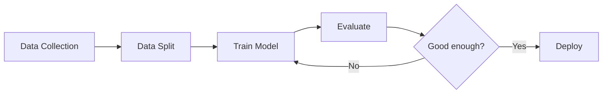

# Lecture 1: Machine Learning Fundamentals

What is ML? · Learning Paradigms · Workflow & Terminology

---

## Review: Lecture 0

| Subject            | Role in ML                                                |
| ------------------ | --------------------------------------------------------- |
| **Calculus**       | Optimization — gradient descent updates parameters        |
| **Linear Algebra** | Representation — data as vectors, computation as matrices |
| **Probability**    | Modeling — distributions, Bayes' theorem, uncertainty     |

**ML = Representation + Modeling + Optimization**

Now we know the **tools**. Let's ask: **what exactly is machine learning?**

---

## Part 1: What is ML?

### Traditional Programming vs Machine Learning

**Traditional Programming**

$$\text{Rules} + \text{Data} \xrightarrow{\text{program}} \text{Output}$$

Human writes explicit rules:

```python
if temperature > 30:
    return "hot"
elif temperature > 20:
    return "warm"
else:
    return "cold"
```

**Machine Learning**

$$\text{Data} + \text{Output} \xrightarrow{\text{learning}} \text{Rules (Model)}$$

Machine discovers rules from examples:

| Temperature | Label |
|---|---|
| 35°C | hot |
| 22°C | warm |
| 10°C | cold |

\(\rightarrow\) learns the mapping automatically

---

### Formal Definition

Machine learning is about learning a **function** \(f\) from data:

$$f: \mathbf{x} \rightarrow y$$

where:

- \(\mathbf{x}\): input (features / observations)
- \(y\): output (prediction / label / structure)
- \(f\): the **model** — a hypothesis function from a hypothesis space \(\mathcal{H}\)
The learning process:
1. Choose a hypothesis space \(\mathcal{H}\) (e.g., linear functions, neural networks)
2. Define a **loss function** to measure how wrong \(f\) is
3. Use an **optimization algorithm** to find the best \(f \in \mathcal{H}\)
This directly connects Lecture 0: \(f\) is **represented** with linear algebra, **modeled** with probability, and **optimized** with calculus.

---

## Part 2: Three Learning Paradigms

### The Unifying Perspective

All machine learning paradigms share one goal: **learn the underlying data distribution**.

| Paradigm | What to learn | Data available |
|------|------|------|
| **Supervised** | \(P(y \mid \mathbf{x})\) — label given input | \((\mathbf{x}, y)\) pairs |
| **Unsupervised** | \(P(\mathbf{x})\) — structure of input | \(\mathbf{x}\) only, no labels |
| **Reinforcement** | \(\pi(a \mid s)\) — action given state | reward signal from environment |

In all three cases, we are estimating or leveraging a **probability distribution** — the central theme from Lecture 0.

---

### Supervised Learning

---

### Supervised Learning

Given labeled data \(\{(\mathbf{x}_i, y_i)\}_{i=1}^{N}\), learn a mapping \(f: \mathbf{x} \to y\).

**Regression**: \(y \in \mathbb{R}\) (continuous)

Predict house price from features:

| Size (m²) | Rooms | Price (\(\times 10^4\)) |
|---|---|---|
| 80 | 2 | 150 |
| 120 | 3 | 230 |
| ? | ? | **?** |

$$\hat{y} = f(\mathbf{x}) = \mathbf{w}^T\mathbf{x} + b$$

**Classification**: \(y \in \{1, 2, \ldots, C\}\) (discrete)

Classify email as spam or not:

| Features                     | Label    |
| ---------------------------- | -------- |
| contains "free", "winner"    | spam     |
| contains "meeting", "report" | not spam |

$$P(y = c \mid \mathbf{x}) = \text{softmax}(\mathbf{w}_c^T\mathbf{x} + b_c)$$

---

### Supervised Learning: Algorithm Examples

| Algorithm | Type | Idea |
|------|------|------|
| **Linear Regression** | Regression | Fit a line/plane to data: \(\hat{y} = \mathbf{w}^T\mathbf{x} + b\) |
| **Logistic Regression** | Classification | Sigmoid maps linear output to probability: \(P(y{=}1) = \sigma(\mathbf{w}^T\mathbf{x})\) |
| **Decision Tree** | Both | Split feature space into regions with if-else rules |
| **Neural Network** | Both | Stack layers of linear + nonlinear transformations |

**Common thread**: every supervised algorithm defines a function class \(\mathcal{H}\), a loss function, and an optimization method.

This is exactly what Lecture 2 will formalize: **Metric, Loss, Optimization**.

---

### Unsupervised Learning

---

### Unsupervised Learning

Given unlabeled data \(\{\mathbf{x}_i\}_{i=1}^{N}\), discover hidden structure.

No labels \(y\) — the model must find patterns on its own.

**Clustering**: group similar samples

Customer segmentation:

- Group A: young, low income, frequent buyer
- Group B: middle-age, high income, occasional buyer
- Group C: …
**Dimensionality Reduction**: compress features
1000-dimensional gene expression \(\to\) 2D visualization
Preserve the most informative structure.

---

### Unsupervised Learning: Algorithm Examples

| Algorithm | Task | Idea |
|------|------|------|
| **K-Means** | Clustering | Iterate: assign points to nearest centroid, update centroids |
| **PCA** | Dim. Reduction | Find directions of maximum variance via eigendecomposition |
| **Autoencoder** | Dim. Reduction | Neural network: compress \(\mathbf{x} \to \mathbf{z} \to \hat{\mathbf{x}}\) |
| **GMM** | Clustering | Model data as mixture of Gaussians, fit with EM algorithm |

**Key insight**: unsupervised learning estimates \(P(\mathbf{x})\) or its structure. K-Means implicitly assumes \(P(\mathbf{x})\) is a mixture of spherical clusters; GMM explicitly models it as \(\sum_k \pi_k \mathcal{N}(\boldsymbol{\mu}_k, \boldsymbol{\Sigma}_k)\).

---

### Reinforcement Learning

---

### Reinforcement Learning

An **agent** interacts with an **environment**, takes **actions**, receives **rewards**.

**Agent-Environment Loop**:

1. Agent observes state \(s_t\)
2. Agent chooses action \(a_t\) via policy \(\pi(a \mid s)\)
3. Environment returns reward \(r_t\) and new state \(s_{t+1}\)
4. Repeat — goal: maximize cumulative reward
**Key concepts**:

| Concept | Meaning |
|------|------|
| **State** \(s\) | Current situation |
| **Action** \(a\) | What the agent does |
| **Reward** \(r\) | Feedback signal |
| **Policy** \(\pi(a \mid s)\) | Strategy: state \(\to\) action |
| **Value** \(V(s)\) | Expected future reward from state \(s\) |

The agent learns a **policy** \(\pi\) that maximizes \(E\left[\sum_{t=0}^{\infty} \gamma^t r_t\right]\), where \(\gamma \in (0,1)\) discounts future rewards.

---

### Reinforcement Learning: Algorithm Examples

| Algorithm | Type | Idea |
|------|------|------|
| **Q-Learning** | Value-based | Learn \(Q(s, a)\) = expected reward; act greedily: \(a = \arg\max_a Q(s, a)\) |
| **DQN** | Value-based | Q-Learning with neural network as function approximator |
| **Policy Gradient** | Policy-based | Directly optimize \(\pi(a \mid s)\) by gradient ascent on expected reward |
| **PPO** | Policy-based | Stable policy gradient with clipped objective |

**Famous applications**:

- AlphaGo (Go) — RL + MCTS defeated world champion
- Robotics — robot learns to walk, grasp objects
- ChatGPT fine-tuning — RLHF aligns language model with human preferences

---

## Part 3: ML Workflow

---

### ML Workflow: Train, Validate, Test

A standard machine learning project follows this pipeline:



**Data split** — three sets with distinct roles:

| Set | Purpose | Analogy |
|------|------|------|
| **Training set** (~70%) | Learn model parameters \(\mathbf{w}\) | Study material |
| **Validation set** (~15%) | Tune hyperparameters, select model | Practice exam |
| **Test set** (~15%) | Final unbiased evaluation | Final exam |

**Critical rule**: the test set must be **untouched** until the final evaluation. Peeking at it leads to overfitting to the test set.

---

### Training vs Inference

**Training** (learning phase)

- Input: training data + loss function + optimizer
- Process: iteratively update \(\mathbf{w}\) to minimize loss
- Output: learned parameters \(\mathbf{w}^*\)

$$\mathbf{w}^* = \arg\min_{\mathbf{w}} \frac{1}{N}\sum_{i=1}^{N} L(f(\mathbf{x}_i; \mathbf{w}), y_i)$$

**Inference** (prediction phase)

- Input: new unseen data \(\mathbf{x}_{\text{new}}\)
- Process: forward pass through trained model
- Output: prediction \(\hat{y} = f(\mathbf{x}_{\text{new}}; \mathbf{w}^*)\)
No gradient computation, no weight updates.
This equation — \(\arg\min_{\mathbf{w}} \sum L(\cdot)\) — is exactly what Lecture 2 will dissect: **Loss** defines what to minimize, **Optimization** defines how to minimize it.

---

## Part 4: Key Terminology

---

### Features, Labels, and Models

| Term | Symbol | Meaning |
|------|------|------|
| **Feature** | \(\mathbf{x} = [x_1, \ldots, x_d]^T\) | Input variables describing a sample |
| **Label** | \(y\) | Target output (supervised learning only) |
| **Sample** | \((\mathbf{x}_i, y_i)\) | One data point |
| **Dataset** | \(\mathcal{D} = \{(\mathbf{x}_i, y_i)\}_{i=1}^N\) | Collection of \(N\) samples |
| **Model** | \(f(\mathbf{x}; \mathbf{w})\) | Function parameterized by \(\mathbf{w}\) |
| **Parameters** | \(\mathbf{w}\) | Learned from data (weights, biases) |
| **Hyperparameters** | — | Set before training (learning rate, layers, etc.) |

**Example**: image classification

- \(\mathbf{x}\): pixel values of an image (e.g., $224 \times 224 \times 3$)
- \(y\): class label (e.g., "cat" = 0, "dog" = 1)
- \(\mathbf{w}\): millions of weights in a CNN
- hyperparameters: learning rate \(\eta\), number of layers, batch size

---

### Overfitting and Underfitting

**Underfitting**

Model is too **simple** to capture the pattern.

- High bias, low variance
- Poor on training AND test data
Example: fitting a line to curved data.
**Good Fit**
Model captures the true pattern.
- Balanced bias and variance
- Good on training AND test data
This is the goal.
**Overfitting**
Model is too **complex** — memorizes noise.
- Low bias, high variance
- Great on training, poor on test data
Example: high-degree polynomial fitting every point.
**Model complexity** \(\longrightarrow\)

| Underfitting | Sweet spot | Overfitting |
|---|---|---|
| \(\leftarrow\) too simple | **just right** | too complex \(\rightarrow\) |

---

### Generalization

**Generalization**: the ability to perform well on **unseen** data.

This is the ultimate goal of machine learning — not to memorize training data, but to learn patterns that transfer to new inputs.

**Why does overfitting happen?**

- Model has too many parameters relative to training samples
- Training data has noise that the model memorizes
- Training and test distributions differ
**How to improve generalization?**

| Strategy | How it helps |
|------|------|
| More training data | Harder to memorize, forces learning real patterns |
| Regularization (L1, L2) | Penalize complex models, prefer simpler \(f\) |
| Cross-validation | Better estimate of test performance |
| Early stopping | Stop training before overfitting kicks in |

---

### Bias-Variance Tradeoff (from Lecture 0)

Recall:

$$E[(y - \hat{f}(\mathbf{x}))^2] = \text{Bias}^2 + \text{Variance} + \text{Irreducible Noise}$$

| | Bias | Variance |
|------|------|------|
| **Definition** | Error from wrong assumptions | Error from sensitivity to training data |
| **Underfitting** | High | Low |
| **Overfitting** | Low | High |
| **Goal** | Minimize | Minimize |

The tradeoff: reducing bias (more complex model) tends to increase variance, and vice versa.

The optimal model sits at the minimum of the total error curve.

This tradeoff is why we need a principled way to measure error — which brings us to **Loss functions** and **Metrics**.

---

## Summary & Transition

---

### Summary

### What is ML?

- Learn a function \(f\) from data
- Data + Output \(\to\) Model
- Replace hand-crafted rules

### Learning Paradigms

- **Supervised**: learn from \((\mathbf{x}, y)\) pairs
- **Unsupervised**: discover structure in \(\mathbf{x}\)
- **Reinforcement**: learn from reward signals

### Key Concepts

- Train / Validation / Test split
- Overfitting vs Underfitting
- Bias-Variance tradeoff
- Generalization

---

### What's Next: Lecture 2

We now know **what** ML does — learn \(f\) from data.

But two questions remain:

1. **How to measure how good \(f\) is?** \(\to\) **Loss function** \(L(\hat{y}, y)\)
2. **How to find the best \(f\)?** \(\to\) **Optimization** (gradient descent and beyond)
**Lecture 2: Metric, Loss, and Optimization**
- How to define what "good" means (metrics)
- How to turn "good" into a differentiable objective (loss)
- How to minimize the loss efficiently (optimization)
Lecture 0 gave us the **tools**.
Lecture 1 gave us the **big picture**.
Lecture 2 will give us the **engine**.
