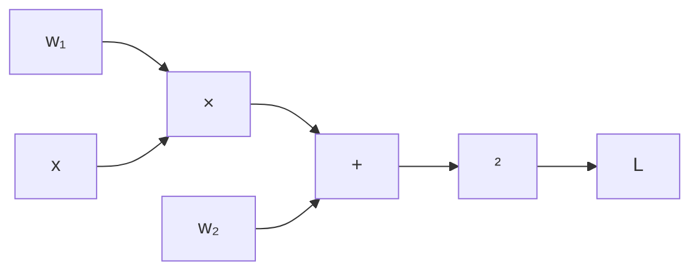

# Lecture 2: Metric, Loss, and Optimization

Evaluation · Distance & Similarity · Information Theory · Loss Functions · Gradient & Optimizers

---

## Review

**Lecture 0**: Mathematical tools — Calculus, Linear Algebra, Probability

**Lecture 1**: ML fundamentals — what ML is, three paradigms, workflow, terminology

Two open questions from Lecture 1:

1. **How to measure how good a model is?** \(\to\) **Metrics** and **Loss functions**
2. **How to find the best model?** \(\to\) **Optimization**
This lecture answers both.

---

## Part 1: Evaluation Metrics

---

### Confusion Matrix

For a binary classifier, all predictions fall into four categories:

| | **Predicted Positive** | **Predicted Negative** |
|------|:------:|:------:|
| **Actual Positive** | TP (True Positive) | FN (False Negative) |
| **Actual Negative** | FP (False Positive) | TN (True Negative) |

- **TP**: correctly identified positive (sick person correctly diagnosed)
- **TN**: correctly identified negative (healthy person correctly cleared)
- **FP**: falsely flagged (healthy person misdiagnosed as sick) — "false alarm"
- **FN**: missed (sick person missed) — "missed detection"
The confusion matrix is the foundation of **all** classification metrics.

---

### Accuracy, Precision, Recall

**Accuracy**

$$\text{Acc} = \frac{TP + TN}{TP + TN + FP + FN}$$

"Of all samples, how many did we get right?"

Problem: misleading with imbalanced data (99% negative \(\to\) always predict negative = 99% accuracy)

**Precision**

$$\text{Prec} = \frac{TP}{TP + FP}$$

"Of those we predicted positive, how many are actually positive?"

High precision = few false alarms.

**Recall (Sensitivity)**

$$\text{Rec} = \frac{TP}{TP + FN}$$

"Of all actual positives, how many did we find?"

High recall = few missed detections.

**F1 Score** (harmonic mean of precision and recall):

$$F_1 = 2 \cdot \frac{\text{Prec} \cdot \text{Rec}}{\text{Prec} + \text{Rec}}$$

---

### TPR, FPR, and ROC Curve

**True Positive Rate** = Recall:

$$\text{TPR} = \frac{TP}{TP + FN}$$

**False Positive Rate**:

$$\text{FPR} = \frac{FP}{FP + TN}$$

By varying the classification threshold, we get different (FPR, TPR) pairs \(\to\) **ROC curve**.

**AUC** (Area Under ROC Curve): a single number summarizing performance.

- AUC = 1.0: perfect classifier
- AUC = 0.5: random guessing
**When to use what?**

| Scenario | Prioritize |
|------|------|
| Spam filter | Precision (avoid losing important email) |
| Cancer screening | Recall (don't miss any patient) |
| Balanced dataset | Accuracy is fine |
| Imbalanced dataset | F1 or AUC |

---

## Part 2: Distance and Similarity

---

### Vector Norms

A **norm** measures the "size" of a vector. For \(\mathbf{x} = [x_1, x_2, \ldots, x_n]^T\):

| Norm | Definition | Formula |
|------|------|------|
| **L1 norm** (Manhattan) | Sum of absolute values | \(\|\mathbf{x}\|_1 = \sum_{i=1}^n \|x_i\|\) |
| **L2 norm** (Euclidean) | Square root of sum of squares | \(\|\mathbf{x}\|_2 = \sqrt{\sum_{i=1}^n x_i^2}\) |
| **Lp norm** | Generalization | \(\|\mathbf{x}\|_p = \left(\sum_{i=1}^n \|x_i\|^p\right)^{1/p}\) |

**Example**: \(\mathbf{x} = [3, 4]^T\)

- \(\|\mathbf{x}\|_1 = 3 + 4 = 7\)
- \(\|\mathbf{x}\|_2 = \sqrt{9 + 16} = 5\)
L2 norm is the most common in ML (Euclidean distance, weight decay, regularization).

---

### Distance Metrics

Given two vectors \(\mathbf{x}, \mathbf{y} \in \mathbb{R}^n\):

**Manhattan Distance** (L1)

$$d_{\text{Manhattan}}(\mathbf{x}, \mathbf{y}) = \|\mathbf{x} - \mathbf{y}\|_1 = \sum_{i=1}^n |x_i - y_i|$$

"City block distance" — how far you walk in a grid.

**Euclidean Distance** (L2)

$$d_{\text{Euclid}}(\mathbf{x}, \mathbf{y}) = \|\mathbf{x} - \mathbf{y}\|_2 = \sqrt{\sum_{i=1}^n (x_i - y_i)^2}$$

Straight-line distance — the most intuitive.

**Example**: \(\mathbf{x} = [1, 0]^T\), \(\mathbf{y} = [4, 4]^T\)

- Manhattan: \(|1{-}4| + |0{-}4| = 3 + 4 = 7\)
- Euclidean: \(\sqrt{9 + 16} = 5\)
**In ML**: KNN, K-Means clustering, and many algorithms rely on distance metrics. The choice of distance affects the result.

---

### Cosine Similarity

Instead of measuring distance, measure the **angle** between two vectors:

$$\cos\theta = \frac{\mathbf{x} \cdot \mathbf{y}}{\|\mathbf{x}\|_2 \cdot \|\mathbf{y}\|_2} = \frac{\sum_{i=1}^n x_i y_i}{\sqrt{\sum x_i^2} \cdot \sqrt{\sum y_i^2}}$$

| \(\cos\theta\) | Meaning                              |
| ------------ | ------------------------------------ |
| $1$          | Same direction (most similar)        |
| $0$          | Orthogonal (unrelated)               |
| \(-1\)         | Opposite direction (most dissimilar) |

**Key insight**: cosine similarity measures **direction**, not magnitude.

\(\mathbf{x} = [1, 1]^T\) and \(\mathbf{y} = [100, 100]^T\) have \(\cos\theta = 1\) (identical direction) but large Euclidean distance.

---

## Part 3: Information Theory

---

### Information Entropy

How much "information" does an event carry?

> **Intuition**
> surprising events carry more information.
- "The sun rose today" \(\to\) expected, low information
- "It snowed in summer" \(\to\) unexpected, high information
**Information** of an event with probability \(p\):

$$I(x) = -\log_2 p(x)$$

Low probability \(\to\) high information.

**Entropy** — the expected information of a distribution (average "surprise"):

$$H(X) = -\sum_{x} P(x) \log_2 P(x) = E_P[-\log P(x)]$$

**Example**: fair coin, \(P(H) = P(T) = 0.5\)

$$H = -0.5\log_2 0.5 - 0.5\log_2 0.5 = 1 \text{ bit}$$

A biased coin (\(P(H)=0.99\)): \(H \approx 0.08\) bits — much less uncertainty.

---

### Cross Entropy

Measures the average number of bits needed to encode data from distribution \(P\) using a code optimized for distribution \(Q\):

$$H(P, Q) = -\sum_{x} P(x) \log Q(x)$$

**Relationship to entropy**:

$$H(P, Q) = H(P) + D_{\text{KL}}(P \| Q)$$

where \(D_{\text{KL}}(P \| Q)\) is the KL divergence (next slide).

When \(Q = P\) (perfect model): \(H(P, Q) = H(P)\) — minimum possible.

When \(Q \neq P\): \(H(P, Q) > H(P)\) — extra bits wasted due to mismatch.

**In ML**: cross entropy is the most widely used classification loss. \(P\) is the true label distribution, \(Q\) is the model's prediction. Minimizing cross entropy \(\approx\) making \(Q\) close to \(P\).

---

### KL Divergence

**Kullback-Leibler divergence** measures how different distribution \(Q\) is from distribution \(P\):

$$D_{\text{KL}}(P \| Q) = \sum_{x} P(x) \log \frac{P(x)}{Q(x)} = E_P\left[\log \frac{P(x)}{Q(x)}\right]$$

Properties:

- \(D_{\text{KL}}(P \| Q) \geq 0\) always (Gibbs' inequality)
- \(D_{\text{KL}}(P \| Q) = 0\) iff \(P = Q\)
- **Not symmetric**: \(D_{\text{KL}}(P \| Q) \neq D_{\text{KL}}(Q \| P)\)
> **Intuition**
> KL divergence measures the "extra bits" wasted when encoding \(P\) with a code optimized for \(Q\).
**In ML**: KL divergence appears in VAEs (variational autoencoders), knowledge distillation, and as a regularizer. Since \(H(P, Q) = H(P) + D_{\text{KL}}(P \| Q)\), minimizing cross entropy is equivalent to minimizing KL divergence (since \(H(P)\) is constant w.r.t. the model).

---

## Part 4: Loss Functions

---

### What is a Loss Function?

A **loss function** \(L(\hat{y}, y)\) quantifies the penalty for a wrong prediction:

$$\text{Goal: } \min_{\mathbf{w}} \frac{1}{N} \sum_{i=1}^{N} L(f(\mathbf{x}_i; \mathbf{w}), y_i)$$

The loss function must be:

- **Non-negative**: \(L \geq 0\)
- **Differentiable**: so we can compute gradients (for gradient-based optimization)
- **Small when correct**: \(L \to 0\) as \(\hat{y} \to y\)

| Task           | Common Loss   | Why                                      |
| -------------- | ------------- | ---------------------------------------- |
| Regression     | MSE           | Penalizes large errors quadratically     |
| Classification | Cross-entropy | Aligns with probabilistic interpretation |
| Ranking        | Hinge loss    | Margin-based, used in SVMs               |

---

### Mean Squared Error (MSE)

For regression, the most common loss:

$$L_{\text{MSE}} = \frac{1}{N} \sum_{i=1}^{N} (\hat{y}_i - y_i)^2$$

**Properties**:

- Always \(\geq 0\), equals 0 iff perfect prediction
- Differentiable everywhere
- Penalizes **large errors** more than small ones (quadratic)
- Gradient: \(\frac{\partial L}{\partial \hat{y}_i} = \frac{2}{N}(\hat{y}_i - y_i)\)
**Connection to probability**: MSE assumes Gaussian noise \(\epsilon \sim \mathcal{N}(0, \sigma^2)\).
Maximizing the log-likelihood \(\log P(y \mid \mathbf{x})\) under Gaussian noise is equivalent to minimizing MSE.
**Variants**:
- **MAE** (Mean Absolute Error): \(\frac{1}{N}\sum|y_i - \hat{y}_i|\) — less sensitive to outliers
- **Huber loss**: combines MSE (small errors) and MAE (large errors)

---

### Cross-Entropy Loss

For **binary classification** (\(y \in \{0, 1\}\)), with model output \(\hat{p} = P(y{=}1 \mid \mathbf{x})\):

$$L_{\text{BCE}} = -\frac{1}{N}\sum_{i=1}^{N} \left[y_i \log \hat{p}_i + (1-y_i)\log(1-\hat{p}_i)\right]$$

For **multi-class classification** (\(y \in \{1, \ldots, C\}\)), with \(\hat{p}_c = P(y{=}c \mid \mathbf{x})\):

$$L_{\text{CE}} = -\frac{1}{N}\sum_{i=1}^{N} \sum_{c=1}^{C} \mathbb{1}[y_i = c] \log \hat{p}_{i,c}$$

> **Intuition**
> - If true label is class 1, loss = \(-\log \hat{p}_1\)
- When \(\hat{p}_1 \to 1\): loss \(\to 0\) (confident and correct)
- When \(\hat{p}_1 \to 0\): loss \(\to \infty\) (confident and wrong)
Cross-entropy loss is the standard for classification. Combined with softmax output, it is equivalent to maximum likelihood estimation.

---

### Loss and Information Theory

The connections between the concepts we've covered:

$$L_{\text{CE}} = H(P, Q) = H(P) + D_{\text{KL}}(P \| Q)$$

| Symbol | Meaning | Role |
|------|------|------|
| \(P\) | True distribution (one-hot labels) | Fixed |
| \(Q\) | Model prediction (softmax output) | Learned |
| \(H(P)\) | Entropy of true labels | Constant w.r.t. model |
| \(D_{\text{KL}}(P \| Q)\) | How far \(Q\) is from \(P\) | What we actually minimize |
| \(H(P, Q)\) | Cross entropy | The loss function |

Since \(H(P)\) is constant, **minimizing cross entropy = minimizing KL divergence**.

This is why cross entropy works so well for classification — it directly measures how close the model's distribution is to the truth.

**Summary of the "distance" family**:

- **Metrics**: Euclidean, Manhattan, Cosine — measure distance between data points
- **Loss**: MSE, Cross-entropy — measure distance between prediction and truth
- **KL divergence**: measures distance between distributions
All are different ways of quantifying "how different are two things?"

---

## Part 5: Optimization

---

### Gradient Descent

Given a loss function \(L(\mathbf{w})\), find \(\mathbf{w}^*\) that minimizes it:

$$\mathbf{w}^* = \arg\min_{\mathbf{w}} L(\mathbf{w})$$

**Gradient descent** iteratively moves in the direction of steepest descent:

$$\mathbf{w}_{t+1} = \mathbf{w}_t - \eta \nabla_{\mathbf{w}} L(\mathbf{w}_t)$$

- \(\nabla_{\mathbf{w}} L\): gradient — points uphill, so we go **opposite**
- \(\eta\): learning rate — controls step size
**Convergence conditions**:
- Too large \(\eta\): overshoot, oscillate, may diverge
- Too small \(\eta\): slow convergence, may get stuck
- Just right: smooth convergence to a (local) minimum
This was illustrated in Lecture 0's gradient descent visualization.

---

### How Computers Compute Derivatives

We need \(\nabla_{\mathbf{w}} L\) for gradient descent. How does a computer compute it?

Three approaches:

| Method | How | Pros | Cons |
|------|------|------|------|
| **Symbolic** | Apply rules algebraically | Exact | Expression explosion |
| **Numerical** | \(\frac{f(x+h)-f(x)}{h}\) | Simple | Slow, approximate |
| **Automatic** | Chain rule on computation graph | Exact, efficient | Implementation complexity |

In modern deep learning, **automatic differentiation** (autodiff) is used exclusively.

---

### Symbolic Differentiation

Apply differentiation rules directly to the expression:

$$f(x) = x^2 + \sin x \quad \xrightarrow{\text{symbolic}} \quad f'(x) = 2x + \cos x$$

**How it works**: a table of rules (sum, product, chain, etc.) applied recursively to the expression tree.

**Problem**: expression swell.

$$f(x) = x^{100} \quad \to \quad f'(x) = 100x^{99}$$

For complex expressions, the derivative can be exponentially larger than the original.

In practice: used in math software (Mathematica, SymPy), not suitable for high-dimensional ML models.

---

### Dual Numbers

A surprisingly elegant approach. Define \(\epsilon\) such that \(\epsilon^2 = 0\) (but \(\epsilon \neq 0\)).

A **dual number**: \(a + b\epsilon\), where \(a\) is the value and \(b\) is the derivative.

**Key property**: evaluate \(f(a + \epsilon) = f(a) + f'(a)\epsilon\)

The derivative appears automatically as the \(\epsilon\)-coefficient!

**Example**: \(f(x) = x^2\)

$$f(a + \epsilon) = (a + \epsilon)^2 = a^2 + 2a\epsilon + \epsilon^2 = a^2 + 2a\epsilon$$

So \(f(a) = a^2\) and \(f'(a) = 2a\) — exactly correct.

**Example**: \(f(x) = x^3\), evaluate at \(x = 2\):

$$(2 + \epsilon)^3 = 8 + 12\epsilon + 6\epsilon^2 + \epsilon^3 = 8 + 12\epsilon$$

\(f(2) = 8\), \(f'(2) = 12\) ✓

Dual numbers give **exact** derivatives (no approximation) for forward-mode autodiff. But for high-dimensional inputs (\(\mathbf{w} \in \mathbb{R}^d\)), we'd need \(d\) passes — too expensive. Hence: **backward-mode** autodiff (backpropagation).

---

### Automatic Differentiation: Computation Graph

Any computation can be represented as a **directed acyclic graph** (DAG):

Example: \(L = (w_1 x + w_2)^2\)

Each node is a simple operation (+, ×, sin, exp, …), whose local derivative is known.

By applying the **chain rule** along paths, we get \(\frac{\partial L}{\partial w_1}\) and \(\frac{\partial L}{\partial w_2}\).

Two modes:

- **Forward mode**: propagate derivatives from inputs to output (good for few inputs)
- **Backward mode**: propagate derivatives from output to inputs (good for few outputs) — this is **backpropagation**

---

### Backward-Mode Autodiff (Backpropagation)

For ML, we have many parameters (\(d\) large) but one loss (scalar output). **Backward mode** is ideal.

**Forward pass**: compute all intermediate values

$$z_1 = w_1 x, \quad z_2 = z_1 + w_2, \quad L = z_2^2$$

**Backward pass**: apply chain rule from output to inputs

$$\frac{\partial L}{\partial z_2} = 2z_2, \quad \frac{\partial L}{\partial z_1} = \frac{\partial L}{\partial z_2} \cdot 1, \quad \frac{\partial L}{\partial w_1} = \frac{\partial L}{\partial z_1} \cdot x$$

One forward pass + one backward pass \(\to\) **all** gradients, regardless of parameter count.

Cost: roughly $2\times$ the forward pass. This is why backpropagation is the backbone of deep learning.

Frameworks like PyTorch and TensorFlow build the computation graph automatically and handle backpropagation for you. The user only defines the forward pass; gradients come for free.

---

### From Gradient Descent to Practical Optimizers

Vanilla gradient descent has problems:

| Problem | Description |
|------|------|
| **Slow on large datasets** | Must compute gradient over ALL \(N\) samples per step |
| **Gets stuck in local minima** | Non-convex losses have many local minima |
| **Sensitive to learning rate** | Too big \(\to\) diverge, too small \(\to\) slow |

These problems motivate **practical optimizers**.

---

### SGD (Stochastic Gradient Descent)

Instead of computing the full gradient, use a **mini-batch** of \(B\) samples:

$$\mathbf{w}_{t+1} = \mathbf{w}_t - \eta \cdot \frac{1}{B}\sum_{i \in \mathcal{B}} \nabla_{\mathbf{w}} L(\mathbf{x}_i, y_i; \mathbf{w}_t)$$

**Advantages**:

- Much faster per step (B << N)
- Noise from random batches helps escape local minima
- Enables online / streaming learning
**SGD with Momentum**: add a "velocity" term to smooth updates:

$$\mathbf{v}_t = \beta \mathbf{v}_{t-1} + \nabla L(\mathbf{w}_t), \quad \mathbf{w}_{t+1} = \mathbf{w}_t - \eta \mathbf{v}_t$$

Accelerates in consistent gradient directions, dampens oscillations.

---

### Adam (Adaptive Moment Estimation)

Adam combines **momentum** and **adaptive learning rates**:

Maintain two running averages:

$$m_t = \beta_1 m_{t-1} + (1-\beta_1) g_t \quad \text{(1st moment — mean)}$$

$$v_t = \beta_2 v_{t-1} + (1-\beta_2) g_t^2 \quad \text{(2nd moment — variance)}$$

Bias correction (since \(m_0 = v_0 = 0\)):

$$\hat{m}_t = \frac{m_t}{1 - \beta_1^t}, \quad \hat{v}_t = \frac{v_t}{1 - \beta_2^t}$$

Update rule:

$$\mathbf{w}_{t+1} = \mathbf{w}_t - \eta \cdot \frac{\hat{m}_t}{\sqrt{\hat{v}_t} + \epsilon}$$

**Why Adam works well**:

- Momentum: accelerates convergence
- Adaptive LR: each parameter gets its own effective learning rate (larger gradients \(\to\) smaller steps)
- Default hyperparameters (\(\beta_1=0.9, \beta_2=0.999, \epsilon=10^{-8}\)) work well in most cases

---

### Optimizer Comparison

| Optimizer | Key Idea | When to Use |
|------|------|------|
| **SGD** | Use mini-batch gradient | Simple, well-understood problems |
| **SGD + Momentum** | Add velocity to SGD | Faster convergence, CNNs |
| **RMSProp** | Adaptive LR via running avg of \(g^2\) | RNNs, non-stationary objectives |
| **Adam** | Momentum + adaptive LR | Default choice for most deep learning |

**Practical advice**: start with Adam (fast convergence, good defaults). If you need the best final performance, switch to SGD + Momentum with careful LR scheduling.

---

## Summary

---

### Summary

### Metrics & Distance

- **Confusion matrix**: TP, FP, TN, FN
- **Accuracy, Precision, Recall, F1**
- **TPR, FPR, ROC, AUC**
- **Norms**: L1, L2
- **Cosine similarity**: direction over magnitude

### Information & Loss

- **Entropy**: average surprise
- **Cross entropy**: encoding cost
- **KL divergence**: distribution distance
- **MSE**: regression loss
- **Cross-entropy loss**: classification loss
- CE = entropy + KL divergence

### Optimization

- **Gradient descent**: \(\mathbf{w} \leftarrow \mathbf{w} - \eta\nabla L\)
- **Autodiff**: exact gradients via computation graph
- **SGD**: mini-batch + momentum
- **Adam**: adaptive + momentum (default choice)
**The ML Pipeline**: Represent data \(\to\) Define model \(\to\) Choose loss \(\to\) Optimize \(\to\) Evaluate with metrics

---

### What's Next

We now have the complete foundation:

- **Lecture 0**: Math tools (calculus, linear algebra, probability)
- **Lecture 1**: ML fundamentals (paradigms, workflow, terminology)
- **Lecture 2**: Metric, Loss, Optimization (how to measure and improve)
Next: hands-on practice — implement these concepts in code.
