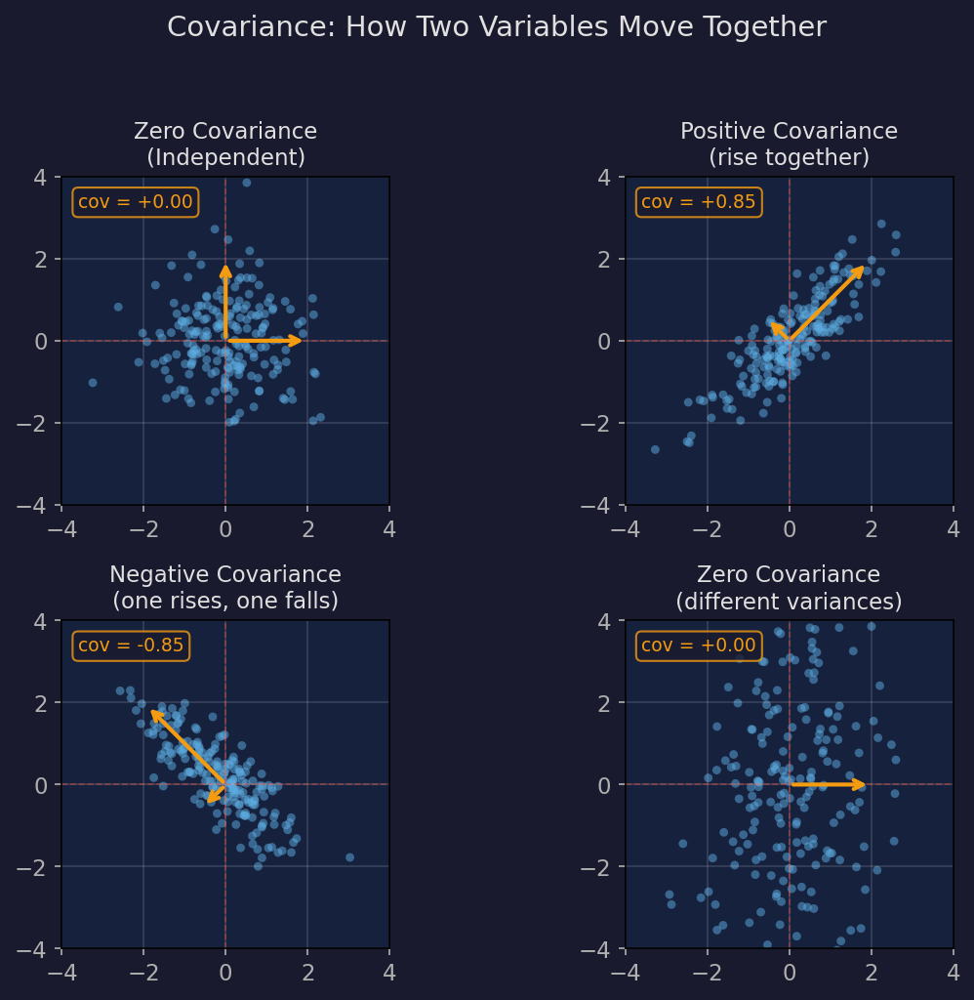
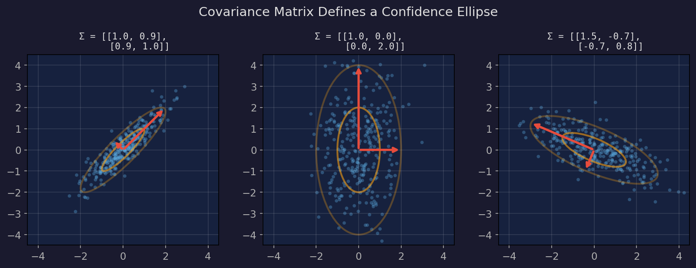
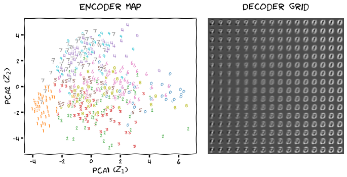
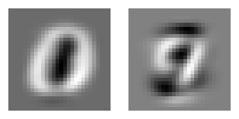
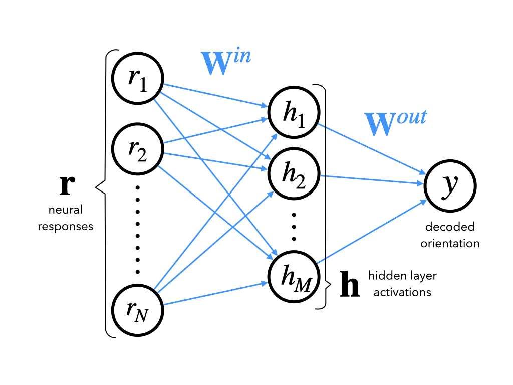
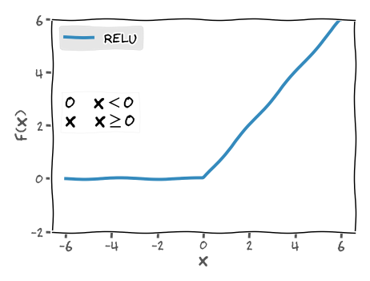
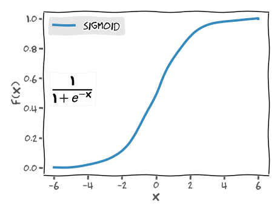
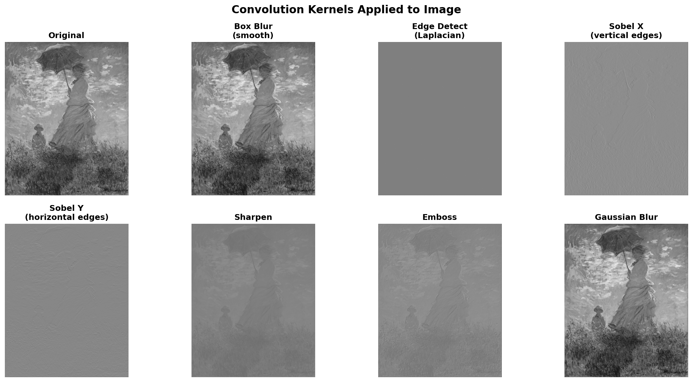
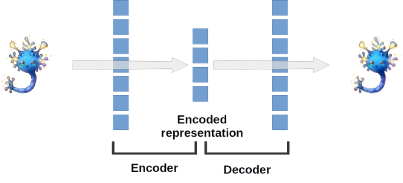

# Neuromatch Notebooks — Week 1

Model Fitting · Linear Regression · GLMs · Logistic Regression · Bootstrapping

---

## Overview

Week 1 focuses on **model fitting** — how to find parameters that explain data, and how confident we should be in those parameters:

| Day      | Topic                      | Core Skill                               |
| -------- | -------------------------- | ---------------------------------------- |
| **W1D1** | Model Types                | Descriptive, Mechanistic, Why models     |
| **W1D2** | Model Fitting              | MSE, MLE, Bootstrapping, Polynomial      |
| **W1D3** | GLMs                       | Linear-Gaussian, Poisson GLM, Logistic   |

**The unifying theme**: given data, find the best model parameters, and quantify how sure we are.

---

## W1D1: Model Types

---

### Three Types of Models

W1D1 introduces a framework for thinking about models in neuroscience:

### "What" Models

Descriptive — characterize the data

Example: ISI histogram shape

### "How" Models

Mechanistic — simulate the process

Example: LIF neuron simulation

### "Why" Models

Teleological — explain the purpose

Example: entropy maximization

---

### "What" Models: Exploring Neural Data

The Steinmetz dataset: 734 neurons recorded with Neuropixels in mice.

**Key quantities to compute**:

```python
spike_counts = np.array([len(spikes[i]) for i in range(n_neurons)])
mean_count = np.mean(spike_counts)
median_count = np.median(spike_counts)
```

**ISI (Inter-Spike Interval)**: time between consecutive spikes

```python
isis = np.diff(spike_times)  # differences between consecutive spike times
```

ISI distributions are typically right-skewed — many short intervals, few long ones.

**Fitting by hand**: use sliders to tune parameters of exponential, inverse, and linear functions to match the ISI histogram. This builds intuition for what "fitting a model" means.

---

### "How" Models: LIF Neuron Simulation

Build a simple neuron model and compare its output to real data:

**Linear IF**: $dV = \alpha \cdot I$, threshold at 1, reset to 0

**Leaky IF**: $dV = -\beta V + \alpha \cdot I$ (adds leakage)

**Input**: Poisson spikes — `exc = scipy.stats.poisson.rvs(lambda_exc, size=T)`

```python
for i in range(1, T):
    dv = -beta * v[i-1] + alpha * (exc[i] - inh[i])
    v[i] = v[i-1] + dv
    if v[i] >= 1:
        v[i] = 0
        spike_times.append(i)
```

**Key finding**: balanced excitation/inhibition + leakage → ISI distribution closer to exponential (matching real data).

---

### "Why" Models: Entropy and Information

**Shannon entropy**: measures uncertainty in a distribution:

$H(X) = -\sum_x p(x) \log_2 p(x) \quad \text{(bits)}$

| Distribution | Entropy |
| ------------ | ------- |
| Deterministic (always same value) | 0 bits |
| Uniform over $N$ values | $\log_2 N$ bits |
| Exponential | Maximum for fixed mean |

**Key insight**: exponential ISI distributions maximize entropy for a fixed mean firing rate — they encode the most information per spike for a given energy budget.

**Code**:

```python
def entropy(pmf):
    pmf = pmf[pmf > 0]           # remove zeros (log(0) is undefined)
    # or pmf = pmf + 0.000001 : laplace smoothing
    return -np.sum(pmf * np.log2(pmf))
```

---

## W1D2: Model Fitting

---

### Linear Regression with MSE

The simplest model fitting problem: find the slope $\theta$ that best fits $y = \theta x + \epsilon$.

**Mean Squared Error** (objective function):

$$
\text{MSE}(\theta) = \frac{1}{N}\sum_{i=1}^N (y_i - \theta x_i)^2
$$

**Analytic solution** (set derivative to zero):

$$
\hat{\theta} = \frac{\mathbf{x}^T \mathbf{y}}{\mathbf{x}^T \mathbf{x}} = \frac{\sum x_i y_i}{\sum x_i^2}
$$

**Code**:

```python
def solve_normal_eqn(x, y):
    return (x @ y) / (x @ x)
def mse(x, y, theta):
    y_hat = theta * x
    return np.mean((y - y_hat)**2)
```

---

### Visual: Fitting a Line to Data

Red line = $\hat{\theta}$ from the normal equation. It minimizes the sum of squared vertical distances from each blue dot to the line.

---

### Data as Vectors

Each scatter point is one $(x_i, y_i)$ pair. Collect all points into vectors:

$$
\mathbf{x} = \begin{bmatrix} x_1 \\ x_2 \\ \vdots \\ x_N \end{bmatrix}, \quad \mathbf{y} = \begin{bmatrix} y_1 \\ y_2 \\ \vdots \\ y_N \end{bmatrix}
$$

**Example** (5 data points):

```python
x = np.array([1.2, 2.5, 3.1, 0.8, 4.3])   # input features
y = np.array([2.1, 4.0, 5.2, 1.5, 6.8])   # targets
```

**Compute the fit**:

```python
theta_hat = (x @ y) / (x @ x)             # = sum(x_i * y_i) / sum(x_i^2)
# theta_hat ≈ 1.56
y_hat = theta_hat * x                       # predictions on the line
residuals = y - y_hat                       # errors (vertical distances)
mse = np.mean(residuals**2)                 # mean squared error
```

---

| Symbol | Shape | Meaning |
| ------ | ----- | ------- |
| $\mathbf{x}$ | $(N,)$ | input features |
| $\mathbf{y}$ | $(N,)$ | observed targets |
| $\hat{\theta}$ | scalar | fitted slope |
| $\hat{\mathbf{y}} = \hat{\theta}\mathbf{x}$ | $(N,)$ | predictions (on the line) |
| $\mathbf{y} - \hat{\mathbf{y}}$ | $(N,)$ | residuals (errors) |

---

### Linear Regression with MLE

Same problem, probabilistic perspective: assume $y_i \sim \mathcal{N}(\theta x_i, \sigma^2)$.

**Likelihood**:

$$
L(\theta) = \prod_{i=1}^N \frac{1}{\sqrt{2\pi\sigma^2}} \exp\!\left(-\frac{(y_i - \theta x_i)^2}{2\sigma^2}\right)
$$

**Log-likelihood**:

$$
\log L(\theta) = -\frac{N}{2}\log(2\pi\sigma^2) - \frac{1}{2\sigma^2}\sum_{i=1}^N (y_i - \theta x_i)^2
$$

**Key result**: maximizing log-likelihood $\Leftrightarrow$ minimizing MSE. They give the same $\hat{\theta}$!

The probabilistic view adds the ability to compute confidence intervals and do Bayesian inference.

```python
from scipy.stats import norm
def likelihood(theta, x, y):
    return np.prod(norm.pdf(y, loc=theta*x, scale=1))
```

---

### From Deterministic to Probabilistic

**MSE view**: $y = \theta x + \epsilon$, noise is just a nuisance.

**Probabilistic view**: noise is part of the model. Treat $y$ as a **random variable**:

$$
y \sim \mathcal{N}(\theta x,\; \sigma^2)
$$

This means: for a given $x$ and $\theta$, the response $y$ is not deterministic — it follows a Gaussian distribution centered at $\theta x$.

$$
p(y \mid x, \theta) = \frac{1}{\sqrt{2\pi\sigma^2}} \exp\!\left(-\frac{(y - \theta x)^2}{2\sigma^2}\right)
$$

**Why this matters**: instead of just finding one "best" $\hat{\theta}$, we can now:

- Compute **how likely** each $\hat{\theta}$ is given the data
- Build **confidence intervals**
- Do **Bayesian inference**

---

### Probabilistic Model: Geometric Interpretation

For each $x$ value, $y$ is drawn from a Gaussian centered at $\theta x$:

**At $x = 3$**: $y \sim \mathcal{N}(3\theta, \sigma^2)$. The peak of the Gaussian is at $3\theta$.

**At $x = 7$**: $y \sim \mathcal{N}(7\theta, \sigma^2)$. The peak shifts to $7\theta$.

The Gaussian "tube" around the line $y = \theta x$ represents the probability density of $y$ at each $x$. Points closer to the line are more likely; points far from the line are unlikely.

**Code to generate data**:

```python
np.random.seed(121)
theta_true = 1.2
n_samples = 30
x = 10 * np.random.rand(n_samples)    # uniform in [0, 10)
noise = np.random.randn(n_samples)     # N(0, 1)
y = theta_true * x + noise             # y ~ N(1.2x, 1)
```

---

### Single-Point Likelihood

Given one data point $(x, y)$, the **likelihood** of parameter $\hat{\theta}$ is:

$$
\mathcal{L}(\hat{\theta} \mid x, y) = p(y \mid x, \hat{\theta}) = \frac{1}{\sqrt{2\pi}} \exp\!\left(-\frac{(y - \hat{\theta} x)^2}{2}\right)
$$

**Example**: $x = 2.1$, $y = 3.7$, test $\hat{\theta} = 1.0$:

$$
\mathcal{L}(1.0 \mid 2.1, 3.7) = \frac{1}{\sqrt{2\pi}} \exp\!\left(-\frac{(3.7 - 1.0 \times 2.1)^2}{2}\right) = \frac{1}{\sqrt{2\pi}} e^{-1.28} \approx 0.11
$$

**Code**:

```python
def likelihood(theta_hat, x, y, sigma=1):
    return (1 / np.sqrt(2 * np.pi * sigma**2)) * np.exp(-(y - theta_hat * x)**2 / (2 * sigma**2))
likelihood(1.0, 2.1, 3.7)  # ≈ 0.113
```

**Interpretation**: if $\hat{\theta} = 1.0$, the probability of observing $y = 3.7$ at $x = 2.1$ is about 11.3%. Not very high — maybe $\hat{\theta} = 1.0$ isn't the best fit?

---

### Joint Likelihood: From One Point to All Data

We have $N$ data points. Assuming noise is **independent** across observations:

$$
\mathcal{L}(\hat{\theta} \mid \mathbf{x}, \mathbf{y}) = \prod_{i=1}^N p(y_i \mid x_i, \hat{\theta}) = \prod_{i=1}^N \frac{1}{\sqrt{2\pi}} \exp\!\left(-\frac{(y_i - \hat{\theta} x_i)^2}{2}\right)
$$

**Problem**: multiplying $N$ small probabilities → **numerical underflow**.

Example: $N = 30$, each likelihood $\approx 0.3$ → product $\approx 0.3^{30} \approx 10^{-16}$, which rounds to zero.

**Solution**: take the log

$$
\log \mathcal{L}(\hat{\theta}) = \sum_{i=1}^N \log p(y_i \mid x_i, \hat{\theta}) = -\frac{N}{2}\log(2\pi) - \frac{1}{2}\sum_{i=1}^N (y_i - \hat{\theta} x_i)^2
$$

**Key property**: $\log$ is monotonically increasing, so $\arg\max \mathcal{L} = \arg\max \log \mathcal{L}$. The $\hat{\theta}$ that maximizes the likelihood also maximizes the log-likelihood.

---

### Comparing Different $\hat{\theta}$ via Log-Likelihood

| $\hat{\theta}$ | $\log \mathcal{L}$ | Quality |
| --------------- | ------------------- | ------- |
| 0.5             | $-198.3$            | Poor — line too flat |
| 1.0             | $-42.1$             | Better — closer to truth |
| 1.2 (true)      | $-38.7$             | Best — matches data generation |

**Code**:

```python
theta_hats = [0.5, 1.0, 2.2]
for th in theta_hats:
    ll = np.sum(np.log(likelihood(th, x, y)))
    print(f"theta={th}, log-likelihood={ll:.2f}")
```

**Visual intuition**: for $\hat{\theta} = 0.5$, the Gaussian "tube" is too flat — most data points are far from the center, giving low likelihood. For $\hat{\theta} = 1.2$, the tube aligns with the data — high likelihood.

---

### MLE Derivation: From Log-Likelihood to Formula

Maximize the log-likelihood by taking the derivative and setting to zero:

$$
\log \mathcal{L}(\theta) = -\frac{N}{2}\log(2\pi) - \frac{1}{2}\sum_{i=1}^N (y_i - \theta x_i)^2
$$

$$
\frac{\partial \log \mathcal{L}}{\partial \theta} = \sum_{i=1}^N (y_i - \theta x_i) x_i = 0
$$

Expand: $\sum x_i y_i - \theta \sum x_i^2 = 0$

$$
\boxed{\;\hat{\theta}_{\text{MLE}} = \frac{\sum x_i y_i}{\sum x_i^2} = \frac{\mathbf{x}^T \mathbf{y}}{\mathbf{x}^T \mathbf{x}}\;}
$$

**This is the same formula as MSE!** Minimizing MSE and maximizing likelihood give identical $\hat{\theta}$ when the noise is Gaussian with constant variance.

The probabilistic view doesn't change the answer — it changes what we can **do** with the answer (confidence intervals, Bayesian updates, model comparison).

---

### Notation Reference

| Symbol | Meaning |
| ------ | ------- |
| $x$ | input (independent variable) |
| $y$ | response (dependent variable) |
| $\epsilon \sim \mathcal{N}(0, \sigma^2)$ | Gaussian noise |
| $\theta$ | true parameter |
| $\hat{\theta}$ | estimated parameter |
| $p(y \mid x, \theta)$ | probability of $y$ given $x$ and $\theta$ |
| $\mathcal{L}(\theta \mid x, y)$ | likelihood of $\theta$ given data $(x, y)$ |
| $\hat{\theta}_{\text{MLE}}$ | maximum likelihood estimate |

**Key distinction**: $p(y \mid x, \theta)$ and $\mathcal{L}(\theta \mid x, y)$ use the **same formula** but ask different questions:

- $p(y \mid x, \theta)$: "how likely is $y$?" (data varies, $\theta$ fixed)
- $\mathcal{L}(\theta \mid x, y)$: "how good is $\hat{\theta}$?" ($\theta$ varies, data fixed)

---

### Bootstrapping: Quantifying Uncertainty

How confident are we in $\hat{\theta}$? **Bootstrapping** estimates uncertainty without distributional assumptions.

**Algorithm**:

1. Resample $N$ data points **with replacement** from the original dataset
2. Compute $\hat{\theta}$ on the resampled data
3. Repeat $B$ times (e.g., $B = 2000$)
4. The distribution of $\hat{\theta}^*$ values estimates the sampling distribution
**95% confidence interval**: the 2.5th and 97.5th percentiles of the bootstrap distribution.

```python
def bootstrap_estimates(x, y, n=2000):
    estimates = []
    for _ in range(n):
        idx = np.random.choice(len(x), size=len(x), replace=True)
        estimates.append(solve_normal_eqn(x[idx], y[idx]))
    return np.array(estimates)
theta_boots = bootstrap_estimates(x, y)
ci_95 = np.percentile(theta_boots, [2.5, 97.5])
```

---

### Multiple Linear Regression

Generalize to multiple features: $\mathbf{y} = X\boldsymbol{\theta} + \boldsymbol{\epsilon}$

**Design matrix** $X$: each row is one observation, each column is one feature.

**OLS estimator**:

$$
\hat{\boldsymbol{\theta}} = (X^T X)^{-1} X^T \mathbf{y}
$$

**Polynomial regression**: features are powers of $x$

$$
X = \begin{bmatrix} 1 & x_1 & x_1^2 \\ 1 & x_2 & x_2^2 \\ \vdots & \vdots & \vdots \end{bmatrix}
$$

```python
def make_design_matrix(x, order):
    X = np.ones((len(x), 1))         # bias column
    for p in range(1, order + 1):
        X = np.hstack([X, x.reshape(-1, 1)**p])
    return X
def ordinary_least_squares(X, y):
    return np.linalg.inv(X.T @ X) @ X.T @ y
```

**Model selection**: compare MSE for different polynomial orders. Higher order = lower training MSE but risk of overfitting.

---

## W1D3: Generalized Linear Models

---

### From Linear to GLM

Linear regression: $\hat{y} = X\boldsymbol{\theta}$ — output is unbounded.

**Problem**: neural spike counts are non-negative integers. Firing rates are positive. Binary choices are 0/1.

**Solution**: apply a **link function** $g$ to transform the linear output:

$$
g(\hat{y}) = X\boldsymbol{\theta} \quad \Leftrightarrow \quad \hat{y} = g^{-1}(X\boldsymbol{\theta})
$$

| Model           | Link function $g$   | Inverse $g^{-1}$ | Output type         |
| --------------- | ------------------- | ---------------- | ------------------- |
| Linear-Gaussian | identity            | identity         | continuous          |
| Poisson GLM     | $\log$              | $\exp$           | positive counts     |
| Logistic        | $\log\frac{p}{1-p}$ | sigmoid          | probability $[0,1]$ |

---

### Key Concept: Design Matrix

The design matrix organizes raw data into a format that the model can use.

**Definition**: The design matrix $\mathbf{X}$ is a $T \times d$ matrix where each row is a **feature vector** for one time point, and each column is a feature.

**In neuroscience**: We want to know "how do the stimuli over the past $d$ time steps influence the current spike?" The design matrix arranges the past $d$ stimulus values into a row:

$$
\mathbf{X} = \begin{bmatrix} \text{stim}[t_0 - d+1] & \cdots & \text{stim}[t_0 - 1] & \text{stim}[t_0] \\ \text{stim}[t_T - d+1] & \cdots & \text{stim}[t_T - 1] & \text{stim}[t_T] \end{bmatrix}
$$

**Zero-padding**: For the earliest time points, we don't have a full $d$ history — pad with zeros:

```python
padded_stim = np.concatenate([np.zeros(d - 1), stim])
# padded_stim = [0, 0, ..., 0, stim[0], stim[1], ..., stim[T-1]]
```

**Sliding window extraction**: For each time point $t$, take a window of length $d$ and reverse it:

```python
for t in range(T):
    X[t] = padded_stim[t:t + d][::-1]  # [::-1] reverses so earliest time comes first
```

---

### Key Concept: Observations

Observations are the target variable $\mathbf{y}$ we want to predict.

**In this experiment**:

| Variable | Meaning | Shape |
|----------|---------|-------|
| $\text{stim}[t]$ | Screen luminance (stimulus) at time $t$ | $(T,)$ |
| $\text{spikes}[t]$ | Spike count (response) at time $t$ | $(T,)$ |
| $\mathbf{X}[t]$ | Design matrix row (features) at time $t$ | $(d,)$ |

**Key insight**:

- Each row of $\mathbf{X}$ = "what happened over the past $d$ time steps" (input features)
- Each value of $\mathbf{y}$ = "what happened now" (observation to predict)
- The model learns: **what input feature patterns lead to what outputs**
**Analogy**:

| Prediction Task | Input $\mathbf{X}$ | Output $\mathbf{y}$ |
|-----------------|---------------------|----------------------|
| House price | Area, location, age… | Price |
| Weather | Past 7 days of temp, humidity… | Tomorrow's temperature |
| **Neural spike prediction** | **Past 25 time bins of stimulus** | **Current spike count** |

---

### Key Concept: Poisson Distribution

The Poisson distribution is the core tool for modeling **count data**.

**Probability Mass Function (PMF)**:

$$
P(Y = k) = \frac{\lambda^k \cdot e^{-\lambda}}{k!}, \quad k = 0, 1, 2, \ldots
$$

where $\lambda > 0$ is the **rate parameter** — the average number of events per unit time/space.

**Key properties**:

| Property | Formula | Meaning |
|----------|---------|---------|
| Mean | $\mathbb{E}[Y] = \lambda$ | Average count |
| Variance | $\text{Var}(Y) = \lambda$ | Variance equals mean |
| Support | $k \in \{0, 1, 2, \ldots\}$ | Non-negative integers |

---

### Poisson Distribution: Intuition and Applications

The Poisson distribution is typically used to model the following types of problems:

**1. Rare event counts**

- Number of phone calls received per day
- Number of typos on a page
- Number of customers arriving at a bank per hour
- **Number of spikes a neuron fires per time bin**
**2. Conditions for Poisson modeling**
The Poisson distribution applies when these conditions hold:

| Condition | Meaning | Neuroscience analogue |
|-----------|---------|----------------------|
| Independence | Events are independent of each other | Spikes are approximately independent |
| Uniformity | Event rate is constant | Rate is approximately constant in short windows |
| Sparsity | At most one event per instant | At most 1–2 spikes per bin |

---

**3. Why are neural spikes well-modeled by Poisson?**

- Spikes are non-negative integers (0, 1, 2, …)
- Spikes are sparse (mostly 0)
- Spike variance ≈ mean ($\text{Var} \approx \text{mean}$)
- Spikes are approximately independent (over short timescales)
**4. Shape of the Poisson distribution**

```python
import numpy as np
from scipy.stats import poisson
k = np.arange(0, 15)
for lam in [1, 3, 5, 10]:
    pmf = poisson.pmf(k, lam)
    # Small λ → right-skewed, concentrated near 0
    # Large λ → approximately symmetric (CLT)
```

---

### LNP Model: Full Derivation from Linear to Poisson

The Linear-Nonlinear-Poisson (LNP) model is one of the most commonly used GLMs in neuroscience.

**Goal**: Given the past $d$ time bins of stimulus $\mathbf{x}_t = [\text{stim}[t-d+1], \ldots, \text{stim}[t]]$, predict the spike count $y_t$ at time $t$.

**Step 1: Linear component**

Compute the weighted sum of stimulus and weights:

$$
z_t = \mathbf{x}_t^\top \boldsymbol{\theta} + b = \sum_{j=1}^{d} \theta_j \cdot \text{stim}[t-d+j] + b
$$

where $\boldsymbol{\theta}$ is the temporal filter and $b$ is the bias.

**Meaning**: $z_t$ represents "the combined drive from the past $d$ time bins of stimulus."

---

**Step 2: Nonlinear component**

Map the linear output to a positive firing rate via the exponential function:

$$
\lambda_t = \exp(z_t) = \exp(\mathbf{x}_t^\top \boldsymbol{\theta} + b)
$$

**Why exp?**

| Problem | Solution |
|---------|----------|
| Linear output $z_t$ can be negative | $\exp(z_t) > 0$, guarantees positive rate |
| Firing rate should increase with drive | $\exp$ is monotonically increasing |
| Small changes in drive produce multiplicative effects | $\exp$ converts addition to multiplication |

---

### LNP Model: Likelihood and Parameter Estimation

**Step 3: Poisson observation model**

Assume spike counts follow a Poisson distribution:

$$
y_t \mid \mathbf{x}_t, \boldsymbol{\theta} \sim \text{Poisson}(\lambda_t)
$$

Probability mass function:

$$
P(y_t \mid \mathbf{x}_t, \boldsymbol{\theta}) = \frac{\lambda_t^{y_t} \cdot e^{-\lambda_t}}{y_t!}
$$

**Step 4: Construct the likelihood function**

Assuming spikes are independent across time, the joint likelihood is:

$$
\mathcal{L}(\boldsymbol{\theta}) = \prod_{t=1}^{T} P(y_t \mid \mathbf{x}_t, \boldsymbol{\theta}) = \prod_{t=1}^{T} \frac{\lambda_t^{y_t} \cdot e^{-\lambda_t}}{y_t!}
$$

---

**Step 5: Take the log to simplify**

$$
\log \mathcal{L}(\boldsymbol{\theta}) = \sum_{t=1}^{T} \left[ y_t \log \lambda_t - \lambda_t - \log(y_t!) \right]
$$

Drop the constant term $\log(y_t!)$ that does not depend on $\boldsymbol{\theta}$:

$$
\log \mathcal{L}(\boldsymbol{\theta}) = \sum_{t=1}^{T} \left[ y_t \log \lambda_t - \lambda_t \right]
$$

---

### LNP Model: Matrix Form and Optimization

**Step 6: Matrix form**

Substituting $\lambda_t = \exp(\mathbf{x}_t^\top \boldsymbol{\theta})$, express in matrix notation:

$$
\log \mathcal{L}(\boldsymbol{\theta}) = \mathbf{y}^\top \log(\boldsymbol{\lambda}) - \mathbf{1}^\top \boldsymbol{\lambda}
$$

where $\boldsymbol{\lambda} = \exp(\mathbf{X}\boldsymbol{\theta})$.

**Step 7: Negative log-likelihood (objective function)**

Minimize the negative log-likelihood:

$$
-\log \mathcal{L}(\boldsymbol{\theta}) = -\left( \mathbf{y}^\top \log(\boldsymbol{\lambda}) - \mathbf{1}^\top \boldsymbol{\lambda} \right) = \mathbf{1}^\top \boldsymbol{\lambda} - \mathbf{y}^\top \log(\boldsymbol{\lambda})
$$

---

**Step 8: Numerical optimization**

No closed-form solution — use `scipy.optimize.minimize`:

```python
def fit_lnp(stim, spikes, d=25):
    y = spikes
    constant = np.ones_like(y)
    X = np.column_stack([constant, make_design_matrix(stim)])
    x0 = np.random.normal(0, .2, d + 1)  # random initialization
    res = minimize(neg_log_lik_lnp, x0, args=(X, y))
    return res.x
```

---

### LNP Model: End-to-End Pipeline

```
Raw Data
    │
    ▼
┌─────────────────────────────────────────────────────────┐
│  Design matrix X[t] = [stim[t-24], ..., stim[t]]        │  ← past 25 bins of stimulus
│  Observation   y[t] = spikes[t]                         │  ← current spike count
└─────────────────────────────────────────────────────────┘
    │
    ▼
┌─────────────────────────────────────────────────────────┐
│  Linear:      z_t = X[t] · θ + b                        │  ← weighted sum
│  Nonlinear:   λ_t = exp(z_t)                            │  ← map to positive
│  Poisson:     y_t ~ Poisson(λ_t)                        │  ← probabilistic model
└─────────────────────────────────────────────────────────┘
    │
    ▼
┌─────────────────────────────────────────────────────────┐
│  Minimize  −[y^T log(λ) − 1^T λ]                       │  ← objective
│  Solve θ via scipy.optimize.minimize                     │  ← numerical optimization
└─────────────────────────────────────────────────────────┘
    │
    ▼
  θ → temporal receptive field (TRF)
```

---

### LG GLM vs LNP GLM: Comparison

| | LG (Linear-Gaussian) | LNP (Poisson) |
|---|---|---|
| **Prediction** | $\hat{y} = X\theta$ | $\hat{y} = \exp(X\theta)$ |
| **Output range** | $(-\infty, +\infty)$ | $(0, +\infty)$ |
| **Noise assumption** | Gaussian $\epsilon \sim \mathcal{N}(0, \sigma^2)$ | Poisson $y \sim \text{Poisson}(\lambda)$ |
| **Fitting** | Closed-form $\hat{\theta} = (X^TX)^{-1}X^Ty$ | Numerical optimization (no closed form) |
| **Use case** | Continuous prediction | Non-negative integer counts |
| **Neuroscience** | Stimulus filter estimation | Firing rate modeling |

**Key differences**:

- LG can predict **negative spikes** (unreasonable) ❌
- LNP guarantees predictions are **always positive** via $\exp$ ✅
- LNP better matches the **statistical properties** of spike data (counts, sparse, variance ≈ mean)

---

### Linear-Gaussian GLM: Spike Filtering

Model: spike count $y_t$ depends on the stimulus over the past $d$ time steps.

**Design matrix**: each row contains the $d$ preceding stimulus values

```python
def make_design_matrix(stim, d=25):
    nt = len(stim)
    X = np.zeros((nt, d))
    for t in range(nt):
        for j in range(d):
            if t - j >= 0:
                X[t, j] = stim[t - j]
    return X
```

**Fitting**: same OLS formula $\hat{\boldsymbol{\theta}} = (X^T X)^{-1} X^T \mathbf{y}$

**Interpretation**: $\hat{\boldsymbol{\theta}}$ is the **stimulus filter** — how the neuron integrates stimulus over time. Similar to the Spike-Triggered Average (STA).

---

### Poisson GLM: Spike Rate Modeling

Spike counts are non-negative integers → use Poisson distribution.

**Model**: $y_t \sim \text{Poisson}(\lambda_t)$ where $\lambda_t = \exp(\mathbf{x}_t^T \boldsymbol{\theta})$

The $\exp$ ensures $\lambda_t > 0$.

**Log-likelihood**:

$$
\log L(\boldsymbol{\theta}) = \sum_t \left[ y_t \log \lambda_t - \lambda_t \right] = \sum_t \left[ y_t (\mathbf{x}_t^T \boldsymbol{\theta}) - \exp(\mathbf{x}_t^T \boldsymbol{\theta}) \right]
$$

**No closed-form solution** — use numerical optimization:

```python
from scipy.optimize import minimize
def neg_log_lik_lnp(theta, X, y):
    lam = np.exp(X @ theta)
    return -np.sum(y * np.log(lam) - lam)
def fit_lnp(stim, spikes, d=25):
    X = make_design_matrix(stim, d)
    X = np.column_stack([X, np.ones(len(spikes))])  # add bias
    result = minimize(neg_log_lik_lnp, x0=np.zeros(d+1), args=(X, spikes))
    return result.x
```

---

### Why Logistic Regression?

The previous models (LG, LNP) predict **continuous** or **count** outputs. But many neuroscience questions are **binary**:

| Question | Output type | Model |
|----------|-------------|-------|
| Stimulus filtering | Spike count (0, 1, 2, …) | Poisson GLM |
| Firing rate | Positive real number | LNP GLM |
| **Decision decoding** | **Binary (0 or 1)** | **Logistic regression** |

**The problem**: Linear regression can predict probabilities outside $[0, 1]$. Poisson regression predicts counts, not probabilities.

**The solution**: Logistic regression — a GLM with a **sigmoid link function** and **Bernoulli noise model**.

---

### Logistic Regression: The Sigmoid Link Function

The core idea: map a linear output to a probability using the **sigmoid** (logistic) function.

**The sigmoid function**:

$$
\sigma(z) = \frac{1}{1 + e^{-z}}
$$

| $z$             | $\sigma(z)$ | Interpretation              |
| --------------- | ----------- | --------------------------- |
| $z \to -\infty$ | $\to 0$     | Strong evidence for class 0 |
| $z = 0$         | $= 0.5$     | No evidence either way      |
| $z \to +\infty$ | $\to 1$     | Strong evidence for class 1 |

---

**Key properties**:

- Output is always in $(0, 1)$ — interpretable as probability
- Monotonically increasing — larger $z$ → higher probability of class 1
- Symmetric: $\sigma(-z) = 1 - \sigma(z)$
- Derivative has a nice form: $\sigma'(z) = \sigma(z)(1 - \sigma(z))$
**In GLM terms**: the sigmoid is the **inverse link function** $g^{-1}$:

$$
\underbrace{\sigma^{-1}(\hat{y})}_{\text{log-odds}} = \mathbf{x}^\top \boldsymbol{\theta} \quad \Leftrightarrow \quad \hat{y} = \sigma(\mathbf{x}^\top \boldsymbol{\theta})
$$

The link function $g = \sigma^{-1}$ is the **logit** (log-odds): $g(p) = \log \frac{p}{1-p}$.

---

### Logistic Regression: Bernoulli Likelihood

The output $y$ is binary (0 or 1), so we use the **Bernoulli distribution**.

**Model**:

$$
P(y = 1 \mid \mathbf{x}, \boldsymbol{\theta}) = \hat{y} = \sigma(\mathbf{x}^\top \boldsymbol{\theta})
$$

**Bernoulli likelihood for one observation**:

$$
P(y_i \mid \hat{y}_i) = \hat{y}_i^{\,y_i} (1 - \hat{y}_i)^{1 - y_i}
$$

This is a compact way to write:

- If $y_i = 1$: probability = $\hat{y}_i$
- If $y_i = 0$: probability = $1 - \hat{y}_i$
**Log-likelihood for all data** (assuming independence):

$$
\log \mathcal{L}(\boldsymbol{\theta}) = \sum_{i=1}^N \left[ y_i \log \hat{y}_i + (1 - y_i) \log(1 - \hat{y}_i) \right]
$$

This is the **cross-entropy loss** (negated). It penalizes confident wrong predictions heavily.

**Negative log-likelihood** (what we minimize):

$$
-\log \mathcal{L} = -\sum_{i=1}^N \left[ y_i \log \sigma(\mathbf{x}_i^\top \boldsymbol{\theta}) + (1 - y_i) \log(1 - \sigma(\mathbf{x}_i^\top \boldsymbol{\theta})) \right]
$$

No closed-form solution — use numerical optimization (e.g., gradient descent, Newton's method).

---

### What is Overfitting?

A model that performs perfectly on training data but poorly on new data has **overfit**.

**Definition**: Overfitting occurs when a model learns the **noise** in the training data instead of the underlying pattern.

**Symptoms**:

- Training accuracy ≈ 100%
- Test accuracy << 100%
- Model weights are very large (to fit noise)
**When does it happen?**
When the model has too much **capacity** relative to the amount of data. In neuroscience, this is extremely common:

| Data type | Features ($d$) | Samples ($N$) | Ratio $d/N$ |
|-----------|---------------|---------------|-------------|
| Electrophysiology | ~100 neurons | ~50 trials | ~2 |
| fMRI | ~10,000 voxels | ~200 trials | ~50 |
| Calcium imaging | ~500 cells | ~100 time points | ~5 |

When $d > N$, overfitting is almost guaranteed.

**Geometric intuition**: In 2D, a single data point can be fit by infinitely many lines. With more features than samples, there are infinitely many weight vectors that achieve zero training error — most of them are meaningless.

---

### Overfitting: Visual Illustration

```
Training data:  ●  ●      ●  ●
                |  |      |  |
                ▼  ▼      ▼  ▼
Underfitting:   ─────────────────     (too simple, high bias)
                A straight line through noisy data
Good fit:       ──╱╲──╱╲──             (captures the pattern)
                Smooth curve through data
Overfitting:    ╱╲╱╲╱╲╱╲╱╲╱╲          (memorizes noise)
                Wiggly curve passing through every point
```

**The bias-variance tradeoff**:

| | Underfitting | Good fit | Overfitting |
|---|---|---|---|
| **Bias** | High | Low | Low |
| **Variance** | Low | Low | High |
| **Training error** | High | Low | ≈ 0 |
| **Test error** | High | Low | High |

**How to detect overfitting**: Cross-validation.

If training accuracy >> cross-validated accuracy, the model is overfitting.

```python
from sklearn.model_selection import cross_val_score
cv_scores = cross_val_score(model, X, y, cv=8)
# Compare: model.score(X_train, y_train) vs cv_scores.mean()
```

---

### Regularization: The Core Idea

Regularization reduces overfitting by **constraining the model's freedom**.

> **Intuition**
> Instead of asking "find the best $\boldsymbol{\theta}$", we ask "find the best $\boldsymbol{\theta}$ **that is small**".
This adds a **penalty** for large weights to the objective function:

$$
\text{Objective} = \underbrace{-\log \mathcal{L}(\boldsymbol{\theta})}_{\text{fit the data}} + \underbrace{\Omega(\boldsymbol{\theta})}_{\text{penalty for complexity}}
$$

**Why does this help?**

Large weights allow the model to fit noise. By penalizing large weights:

- The model is **smoother** — small changes in input → small changes in output
- The model is **simpler** — fewer effective parameters
- The model **generalizes** better to unseen data

---

**Frequency perspective**:

Think of the model as fitting a sum of sine waves. High-frequency components capture noise; low-frequency components capture the true signal.

- **No regularization**: fits all frequencies (including noise)
- **Regularization**: suppresses high-frequency components (smooths the model)
This is analogous to low-pass filtering in signal processing.
**Bias-variance tradeoff**:
Regularization **increases bias** (the model can't fit the true function perfectly) but **decreases variance** (the model is more stable across different training sets). The sweet spot is found via cross-validation.

---

### $L_2$ Regularization (Ridge)

Penalizes the **sum of squared** weights.

**Objective**:

$$
-\log \mathcal{L}'(\boldsymbol{\theta}) = -\log \mathcal{L}(\boldsymbol{\theta}) + \frac{\beta}{2} \sum_j \theta_j^2 = -\log \mathcal{L}(\boldsymbol{\theta}) + \frac{\beta}{2} \|\boldsymbol{\theta}\|_2^2
$$

where $\beta > 0$ is the **regularization strength**.

**Effect**: All weights are **shrunk toward zero**, but none are exactly zero.

```
No regularization:    θ = [18.3, -15.7, 12.1, -8.4, ...]   (large values)
L2 regularization:    θ = [ 0.3,  -0.2,  0.1, -0.1, ...]   (small values)
```

**Geometric intuition**: The $L_2$ constraint region is a **circle** (in 2D) or **hypersphere** (in higher dimensions). The solution is where the likelihood contour first touches the circle — typically at a point where all coordinates are nonzero but small.

---

### $L_1$ Regularization (Lasso)

Penalizes the **sum of absolute** weights.

**Objective**:

$$
-\log \mathcal{L}'(\boldsymbol{\theta}) = -\log \mathcal{L}(\boldsymbol{\theta}) + \frac{\beta}{2} \sum_j |\theta_j| = -\log \mathcal{L}(\boldsymbol{\theta}) + \frac{\beta}{2} \|\boldsymbol{\theta}\|_1
$$

---

## W1D4: Dimensionality Reduction

---

### Covariance: What Does It Mean?

Given two variables $x$ and $y$, **covariance** measures whether they tend to move together:

$$
\text{Cov}(x, y) = \frac{1}{N} \sum_{i=1}^N (x_i - \bar{x})(y_i - \bar{y})
$$

> **Intuition**
> each term $(x_i - \bar{x})(y_i - \bar{y})$ asks:
- Both above mean? → **positive** contribution (they rise together)
- Both below mean? → also **positive** (they fall together)
- One above, one below? → **negative** (they move opposite)

| Covariance       | Meaning                       | Example             |
| ---------------- | ----------------------------- | ------------------- |
| $\text{Cov} > 0$ | positive — rise/fall together | height & weight     |
| $\text{Cov} = 0$ | no linear relationship        | shoe size & IQ      |
| $\text{Cov} < 0$ | negative — move opposite      | speed & travel time |

---

### Covariance: Visual Intuition



Each scatter shows 200 samples from a 2D Gaussian with different covariance.

**Orange arrows** = eigenvectors (directions of maximum spread).

- Positive covariance → cloud tilts **/** (↗)
- Negative covariance → cloud tilts **\\** (↘)
- Zero covariance → axes-aligned cloud

---

### From Covariance to Covariance Matrix

For $d$ features, the **covariance matrix** captures all pairwise covariances:

$$
\Sigma = \begin{bmatrix} \text{Var}(x_1) & \text{Cov}(x_1, x_2) & \cdots & \text{Cov}(x_1, x_d) \\ \text{Cov}(x_2, x_1) & \text{Var}(x_2) & \cdots & \text{Cov}(x_2, x_d) \\ \vdots & \vdots & \ddots & \vdots \\ \text{Cov}(x_d, x_1) & \text{Cov}(x_d, x_2) & \cdots & \text{Var}(x_d) \end{bmatrix}
$$

**Matrix form** (after mean-centering $\mathbf{X}$):

$$
\hat{\Sigma} = \frac{1}{N}\mathbf{X}^\top\mathbf{X}
$$

Each entry $\hat{\Sigma}_{ij}$ tells you how feature $i$ and feature $j$ co-vary across all samples.

**Properties**:

- **Symmetric**: $\Sigma_{ij} = \Sigma_{ji}$ (covariance is commutative)
- **Diagonal** = variances: $\Sigma_{ii} = \text{Var}(x_i) \geq 0$
- **Positive semi-definite**: all eigenvalues $\lambda_i \geq 0$

---

### Covariance Matrix as Heatmap


Visualizing the covariance matrix reveals the correlation structure at a glance:

**Reading the heatmap**:

- **Red cells** = positive covariance (variables move together)
- **Blue cells** = negative covariance (variables move opposite)
- **White cells** = zero covariance (independent)
- **Diagonal** is always 1.0 (variance of each variable, after normalization)

---

### Geometric Meaning: The Covariance Ellipse

The covariance matrix defines a **confidence ellipse** that shows the spread of the data:



**Key insight**: The eigenvectors of $\Sigma$ are the **axes** of the ellipse; the eigenvalues are the **squared lengths** of those axes.

- **Long axis** = direction of maximum variance (1st eigenvector)
- **Short axis** = direction of minimum variance (2nd eigenvector)
- **Tilt** of the ellipse = sign and magnitude of the off-diagonal covariance

---

### Geometric Meaning (continued)

The covariance matrix is a **linear transformation** that maps a unit circle into the data's spread:

$$
\text{Unit circle} \xrightarrow{\;\Sigma\;} \text{Data ellipse}
$$

**Eigendecomposition** makes this explicit:

$$
\Sigma = V \Lambda V^\top
$$

where $V = [\mathbf{v}_1 \mid \mathbf{v}_2]$ (eigenvectors) and $\Lambda = \text{diag}(\lambda_1, \lambda_2)$ (eigenvalues).

**Physical analogy**: think of $\Sigma$ as a **stress tensor** in mechanics:

- Eigenvalues = principal stresses (how much pressure along each axis)
- Eigenvectors = principal directions (which way the material stretches)
- The ellipse is the "strain ellipsoid" — how a unit sphere deforms under that stress

---

### Covariance vs Correlation

Covariance has units ($\text{units}_x \times \text{units}_y$), making it hard to compare across variables. **Correlation** normalizes it:

$r_{xy} = \frac{\text{Cov}(x, y)}{\sigma_x \cdot \sigma_y} \in [-1, 1]$


**Left**: same correlation ($r = 0.8$), but scaling $x$ by 3× changes the covariance from ~0.7 to ~2.0. Correlation is **scale-invariant**; covariance is not.

**Right**: correlation $r$ is always in $[-1, 1]$, making it easy to interpret regardless of the original units.

---

### Covariance Matrix — Summary

### Formula

$$
\Sigma_{ij} = \frac{1}{N}\sum_n (x_i^{(n)} - \bar{x}_i)(x_j^{(n)} - \bar{x}_j)
$$

$$
\hat{\Sigma} = \frac{1}{N}\mathbf{X}^\top\mathbf{X}
$$

### Key Properties

- Symmetric ($\Sigma = \Sigma^\top$)
- Diagonal = variances
- Off-diagonal = covariances
- Positive semi-definite ($\lambda_i \geq 0$)
- Eigenvectors → principal directions
- Eigenvalues → amount of variance
**Why it matters**: The covariance matrix is the foundation of PCA. Its eigenvectors give the directions of maximum variance — the "natural axes" of the data.

---

### Eigenvalues and Eigenvectors

The **eigenvectors** of the covariance matrix define the directions of maximum variance. The **eigenvalues** tell us how much variance each direction captures.

**Definition**: For matrix $\Sigma$:

$$
\Sigma \mathbf{w} = \lambda \mathbf{w}
$$

where $\mathbf{w}$ is an eigenvector and $\lambda$ is the corresponding eigenvalue.

**Geometric meaning**:

- Eigenvectors point in the directions where the data spreads most
- Eigenvalues measure the amount of spread along each direction
- Eigenvectors are orthogonal (perpendicular) to each other

---

### Principal Component Analysis (PCA)

PCA finds a new coordinate system aligned with the directions of maximum variance.

**Algorithm**:

1. Mean-center the data: $\mathbf{X} \leftarrow \mathbf{X} - \bar{\mathbf{X}}$
2. Compute covariance matrix: $\hat{\Sigma} = \frac{1}{N}\mathbf{X}^\top\mathbf{X}$
3. Find eigenvectors and eigenvalues of $\hat{\Sigma}$
4. Sort by eigenvalue (descending)
5. Project data onto top $K$ eigenvectors
**Projection** (scores):

$$
\mathbf{S} = \mathbf{X} \mathbf{W}_{1:K}
$$

where $\mathbf{W}_{1:K}$ contains the top $K$ eigenvectors as columns.

---

**Key insight**: PCA is equivalent to finding the **best rank-$K$ approximation** to the data in the least-squares sense (Eckart-Young theorem).





---

### Variance Explained: How Many Components?

Each eigenvalue $\lambda_i$ represents the variance captured by the $i$-th principal component.

**Cumulative variance explained**:

$$
\text{Variance explained}(K) = \frac{\sum_{i=1}^K \lambda_i}{\sum_{i=1}^N \lambda_i}
$$

**Intrinsic vs Extrinsic dimensionality**:

| | Extrinsic | Intrinsic |
|---|---|---|
| **Definition** | Number of measured features ($N$) | Number of components needed ($K$) |
| **Example (MNIST)** | 784 pixels | ~50–100 components for 90% variance |

**Scree plot**: Plot eigenvalues in descending order. The "elbow" indicates where additional components contribute little variance — this suggests the intrinsic dimensionality.

---

### PCA Reconstruction: Compressing Data

PCA enables **lossy compression**: store only the top $K$ components instead of all $N$ dimensions.

**Forward (projection)**: $\mathbf{S} = \mathbf{X} \mathbf{W}$

**Inverse (reconstruction)**: $\hat{\mathbf{X}} = \mathbf{S}_{1:K} \mathbf{W}_{1:K}^\top + \bar{\mathbf{X}}$

**Reconstruction quality** depends on $K$:

| $K$ | Variance captured | Quality |
|-----|-------------------|---------|
| 1 | Very low | Blob of average intensity |
| ~20 | Moderate | Blurry digits recognizable |
| ~100 | High | Nearly indistinguishable from original |
| 784 | 100% | Perfect reconstruction |

---

### PCA for Denoising

PCA can remove noise by projecting onto the low-dimensional subspace that captures the signal.

**Idea**: Noise is spread across all dimensions equally, while signal is concentrated in the top components. By keeping only the top $K$ components, we discard most of the noise.

**Algorithm**:

1. Find PCA basis from clean data (or noisy data)
2. Project noisy data onto the PCA basis
3. Keep only the top $K$ components
4. Reconstruct: $\hat{\mathbf{X}}_{\text{clean}} = \mathbf{S}_{1:K} \mathbf{W}_{1:K}^\top + \bar{\mathbf{X}}$
**Key insight**: The optimal $K$ depends on the noise level:
- More noise → fewer components (more aggressive denoising)
- Less noise → more components (preserve detail)
**Limitation**: PCA denoising assumes signal lies in a linear subspace. Nonlinear methods (e.g., autoencoders) can be more effective for complex signals.

---

### PCA vs t-SNE: Linear vs Nonlinear Visualization

Both methods reduce high-dimensional data to 2D for visualization, but they have fundamentally different goals.

**PCA (linear)**:

- Preserves **global** structure (large distances)
- Maximizes variance along orthogonal axes
- Deterministic, fast, interpretable
- Result: overlapping clusters for complex data
**t-SNE (nonlinear)**:
- Preserves **local** structure (neighborhood relationships)
- Maps similar points to nearby positions
- Stochastic, slower, not easily interpretable
- Result: well-separated clusters

---

### t-SNE: The Perplexity Parameter

t-SNE has one key hyperparameter: **perplexity**, which roughly controls the effective number of neighbors.

**What perplexity does**:

- **Low perplexity** (e.g., 2–5): focuses on very local structure, creates many small clusters
- **Medium perplexity** (e.g., 30): balances local and global structure
- **High perplexity** (e.g., 50+): emphasizes global structure, may merge distinct clusters
**Guidelines**:
- There is no "correct" perplexity — explore multiple values
- Typical range: 5–50
- Results can change significantly with different perplexity
- Always report perplexity when presenting t-SNE results

---

### t-SNE: How Does It Work?

The algorithm has three key steps:

**Step 1 — High-dimensional similarities**: For each pair of points $(x_i, x_j)$, compute a Gaussian-based probability:

$$
p_{j|i} = \frac{\exp(-\|x_i - x_j\|^2 / 2\sigma_i^2)}{\sum_{k \neq i} \exp(-\|x_i - x_k\|^2 / 2\sigma_i^2)}
$$

"Given point $i$, what's the probability of picking $j$ as its neighbor?"

**Step 2 — Low-dimensional similarities**: In the 2D map, use a **t-distribution** (heavy-tailed) instead of Gaussian:

$$
q_{ij} = \frac{(1 + \|y_i - y_j\|^2)^{-1}}{\sum_{k \neq l} (1 + \|y_k - y_l\|^2)^{-1}}
$$

**Step 3 — Optimize**: Minimize the KL divergence between $P$ and $Q$:

$$
\text{KL}(P \| Q) = \sum_{i \neq j} p_{ij} \log \frac{p_{ij}}{q_{ij}}
$$

KL divergence penalizes **false negatives** heavily (high-D neighbors that got separated in low-D), so nearby points stay together.

---

### t-SNE: Algorithm Visualization


**Why t-distribution instead of Gaussian?**

The t-distribution has **heavier tails** — it assigns more probability to medium-distance points.

This solves the **crowding problem**: in high-D, there are many "medium-distance" neighbors. A Gaussian would squeeze them all to the center. The t-distribution lets them **spread out** into distinct clusters.

---

## W1D5: Deep Learning

🎬 **Video**: [3Blue1Brown Convolution](https://www.bilibili.com/video/BV1Vd4y1e7pj/?spm_id_from=333.337.search-card.all.click&vd_source=4a0efd9e69f1eda05dec65b957c7e492)

---

### Feedforward Neural Networks

A feedforward network transforms input $\mathbf{r}$ through a series of **layers** to produce output $y$.



**Single hidden layer**:

$$
\mathbf{h} = \phi(\mathbf{W}^{in} \mathbf{r} + \mathbf{b}^{in}), \quad y = \mathbf{W}^{out} \mathbf{h} + \mathbf{b}^{out}
$$

where $\phi$ is a **nonlinear activation function**.

---

**Why nonlinearity matters**: Without it, stacking linear layers is equivalent to a single linear transformation:

$$
y = \mathbf{W}^{out}(\mathbf{W}^{in} \mathbf{r} + \mathbf{b}^{in}) + \mathbf{b}^{out} = (\mathbf{W}^{out}\mathbf{W}^{in})\mathbf{r} + \text{bias}
$$

Nonlinear activations allow the network to compute **arbitrary functions** (universal approximation theorem).

**Key concepts**:

- **Width**: number of units per layer ($M$)
- **Depth**: number of hidden layers
- **Parameters**: all weights $\mathbf{W}$ and biases $\mathbf{b}$

---

### Activation Functions

Activation functions introduce nonlinearity into neural networks.

  




| Function | Formula | Range | Use case |
|----------|---------|-------|----------|
| **ReLU** | $\max(0, x)$ | $[0, \infty)$ | Hidden layers (default) |
| **Sigmoid** | $\frac{1}{1+e^{-x}}$ | $(0, 1)$ | Output for binary probability |
| **Softmax** | $\frac{e^{x_i}}{\sum_j e^{x_j}}$ | $(0, 1)$, sums to 1 | Output for classification |
| **PReLU** | $\max(0, x) + \alpha \min(0, x)$ | $(-\infty, \infty)$ | When ReLU "dies" |

---

**Why ReLU works well**:

- Gradient is 1 for positive inputs → no vanishing gradient
- Computationally efficient
- Sparse activations (many zeros)
**"Dying ReLU" problem**: If a neuron's input is always negative, its gradient is always 0 — it never learns. Solutions: PReLU, Leaky ReLU, better initialization.

---

### Loss Functions

The loss function measures how bad the network's predictions are.

| Loss | Formula | Use case |
|------|---------|----------|
| **MSE** | $\frac{1}{N}\sum(y - \tilde{y})^2$ | Regression (continuous output) |
| **BCE** | $-\sum[\tilde{y}\log y + (1-\tilde{y})\log(1-y)]$ | Binary classification |
| **NLL** | $-\sum \log p_{\tilde{y}}$ | Multi-class classification |

**Choosing the right loss**:

- Predicting a continuous value → MSE
- Predicting a probability (0–1) → BCE
- Predicting a class label → NLL (with softmax)
**BCE vs MSE for pixel reconstruction**: BCE penalizes confident wrong predictions more heavily (gradient $\sim 1/\hat{y}$), making it better for binary-ish data like images.

---

  

---

### Gradient Descent and Backpropagation

Training a network = finding parameters that minimize the loss.

**Gradient descent** iterates three steps:

1. **Forward pass**: compute output and loss
2. **Backward pass**: compute gradients $\frac{\partial L}{\partial \theta}$ via **backpropagation**
3. **Update**: $\theta \leftarrow \theta - \alpha \frac{\partial L}{\partial \theta}$
**Backpropagation** applies the chain rule layer by layer:

$$
\frac{\partial L}{\partial \mathbf{W}^{in}} = \frac{\partial L}{\partial \mathbf{h}} \cdot \frac{\partial \mathbf{h}}{\partial \mathbf{W}^{in}}
$$

PyTorch computes this automatically with `loss.backward()`.

**SGD vs GD**:

- **GD**: compute gradient over ALL training data (accurate but slow)
- **SGD**: compute gradient over a mini-batch (noisy but fast)
- **Adam**: SGD with adaptive learning rate and momentum (default choice)

---

### Stochastic Gradient Descent (SGD)

SGD approximates the true gradient using a **random mini-batch** of data.

**Algorithm**:

1. Sample a mini-batch of $B$ examples from training data
2. Compute gradient on this mini-batch: $\mathbf{g} = \frac{1}{B}\sum_{i=1}^B \nabla_\theta L(y_i, f(x_i; \theta))$
3. Update: $\theta \leftarrow \theta - \alpha \mathbf{g}$
4. Repeat until convergence
**Why SGD works**:
- Mini-batch gradient is an **unbiased estimate** of the full gradient
- Much faster per iteration (e.g., $B=32$ vs $N=60000$)
- Noise helps escape shallow local minima
**Momentum**: accumulates past gradients to smooth updates:

$$
\mathbf{v} \leftarrow \beta \mathbf{v} + \mathbf{g}, \quad \theta \leftarrow \theta - \alpha \mathbf{v}
$$

- $\beta$ (typically 0.9): how much past gradients influence current update
- Helps accelerate in consistent gradient directions
- Dampens oscillations in noisy dimensions

---

### Adam: Adaptive Moment Estimation

Adam combines momentum with **adaptive learning rates** per parameter.

**Key idea**: Parameters that receive large gradients get smaller updates (and vice versa). This is achieved by tracking:

- First moment (mean): $\mathbf{m} \leftarrow \beta_1 \mathbf{m} + (1-\beta_1)\mathbf{g}$
- Second moment (variance): $\mathbf{v} \leftarrow \beta_2 \mathbf{v} + (1-\beta_2)\mathbf{g}^2$
**Update rule** (with bias correction):

$$
\theta \leftarrow \theta - \alpha \frac{\hat{\mathbf{m}}}{\sqrt{\hat{\mathbf{v}}} + \epsilon}
$$

where $\hat{\mathbf{m}} = \frac{\mathbf{m}}{1-\beta_1^t}$, $\hat{\mathbf{v}} = \frac{\mathbf{v}}{1-\beta_2^t}$ (bias correction for early steps).

**Default hyperparameters** (rarely need tuning):

- $\alpha = 0.001$ (learning rate)
- $\beta_1 = 0.9$ (first moment decay)
- $\beta_2 = 0.999$ (second moment decay)
- $\epsilon = 10^{-8}$ (numerical stability)
**When to use what**:

| Optimizer | Pros | Cons | Use case |
|-----------|------|------|----------|
| **SGD** | Simple, good generalization | Slow, sensitive to LR | When you can tune LR carefully |
| **SGD+Momentum** | Faster convergence | Still needs LR tuning | Computer vision, large models |
| **Adam** | Fast, robust, default choice | May generalize worse | Most tasks, quick prototyping |

---

### Convolution: From Moving Average to Neural Networks

Convolution is a fundamental operation that slides a small **kernel** across data, computing a weighted sum at each position.

**Start simple: 1D moving average**

Given a noisy signal $[3, 5, 2, 8, 1, 4]$, a moving average with window size 3 smooths it:

$$
\text{output}[i] = \frac{1}{3}(x[i-1] + x[i] + x[i+1])
$$

This is a convolution with kernel $f = [\frac{1}{3}, \frac{1}{3}, \frac{1}{3}]$.

**General 1D convolution**:

$$
\text{output}[i] = \sum_{k=-K/2}^{K/2} f[k] \cdot x[i+k]
$$

The kernel $f$ is a small array of **learnable weights** that slides across the input.

---

### Different Kernels, Different Effects

The **kernel** determines what feature the convolution detects. Same input, different kernels → completely different outputs.

| Kernel | Name | Effect |
|--------|------|--------|
| $[1/3, 1/3, 1/3]$ | Moving average | Smooths / low-pass filter |
| $[-1, 0, 1]$ | Central difference | Detects **edges** (changes) |
| $[1, -2, 1]$ | Second derivative | Detects **curvature** |
| $[0, 1, 0]$ | Identity | Returns original signal |

**Example: edge detection**

```
Input:     [0, 0, 0, 5, 5, 5, 0, 0, 0]    (step function)
Kernel:    [-1, 0, 1]
Output:    [0, 0, 5, 5, 0, -5, -5, 0, 0]   (edges at transitions!)
```

---

### From 1D to 2D: Image Convolutions

The same idea extends to 2D images — the kernel becomes a small matrix.

**2D convolution**:

$$
\text{output}(x, y) = \sum_{k_x, k_y} f(k_x, k_y) \cdot I(x+k_x, y+k_y)
$$

where $f$ is a $K \times K$ kernel and $I$ is the input image.

---

**Common 2D kernels**:

| Kernel | Size | Effect |
|--------|------|--------|
| $\frac{1}{9}\begin{bmatrix}1&1&1\\1&1&1\\1&1&1\end{bmatrix}$ | 3×3 | Box blur (smooth) |
| $\begin{bmatrix}0&-1&0\\-1&4&-1\\0&-1&0\end{bmatrix}$ | 3×3 | Edge detection (Laplacian) |
| $\begin{bmatrix}-1&0&1\\-2&0&2\\-1&0&1\end{bmatrix}$ | 3×3 | Sobel (vertical edges) |
| $\begin{bmatrix}-1&-2&-1\\0&0&0\\1&2&1\end{bmatrix}$ | 3×3 | Sobel (horizontal edges) |
| $\begin{bmatrix}0&0&0\\0&1&0\\0&0&0\end{bmatrix}$ | 3×3 | Identity |

---

### Convolution Kernels: Visual Demo

Different kernels produce dramatically different outputs on the same image:



---

### Convolutional Neural Networks (CNNs)

CNNs extend convolution to **multiple learned kernels** across **multiple layers**.

**Key ideas**:

- **Local receptive fields**: each unit looks at a small $K \times K$ patch
- **Multiple channels**: each channel applies a different kernel → detects different features
**Parameters**:

| Parameter | Meaning | Effect |
|-----------|---------|--------|
| $K$ (kernel size) | Size of the sliding window | Larger → bigger receptive field |
| $C_{out}$ (channels) | Number of different kernels | More → richer features |
| Stride | Step size when sliding | Larger → smaller output |
| Padding | Zeros around input | Same padding → output = input size |

---

### CNN Architecture

A typical CNN alternates convolution and pooling layers, then ends with fully connected layers.


```
Input image
    │
    ▼
Conv + ReLU → Pool → Conv + ReLU → Pool → ... → Flatten → FC → Output
```

**Parameter count comparison** (for 48×64 image, 6 channels, K=7):

| Layer type | Parameters |
|------------|------------|
| Fully connected | $48 \times 64 \times 48 \times 64 \approx 9.4M$ |
| Convolutional | $6 \times 1 \times 7 \times 7 = 294$ |

Weight sharing dramatically reduces parameters!

 

**CNNs in neuroscience**: The visual cortex has a similar hierarchical structure:

- V1: edge detectors (like conv filters)
- V4: texture/shape detectors
- IT: object detectors

---

### Encoding vs Decoding Models

Two directions of modeling neural data:

| | Encoding | Decoding |
|---|---|---|
| **Direction** | Stimulus → Neural response | Neural response → Stimulus |
| **Question** | How does the brain represent stimuli? | How much information does the brain contain? |
| **Input** | External stimulus | Neural activity |
| **Output** | Predicted neural response | Predicted stimulus/behavior |
| **Example** | CNN predicting V1 responses | Logistic regression decoding choice |

**Normative encoding model**: Train a deep network on a **behavioral task** (not neural data), then compare its internal representations to neural recordings. If they match, the brain may be solving the same task.

---

### RSA: What is the Response Matrix?

Before computing anything, we need to organize neural data into a **response matrix** $\mathbf{R}$.

**Setup**: Record $N$ neurons while presenting $S$ different stimuli (e.g., images). Each stimulus is repeated multiple trials, then average across trials.

$$
\mathbf{R} = \begin{bmatrix} r_{1,1} & r_{1,2} & \cdots & r_{1,S} \\ r_{2,1} & r_{2,2} & \cdots & r_{2,S} \\ \vdots & \vdots & \ddots & \vdots \\ r_{N,1} & r_{N,2} & \cdots & r_{N,S} \end{bmatrix}
$$

- **Rows** = neurons (what each neuron responds to)
- **Columns** = stimuli (how each stimulus is represented)
- $r_{n,s}$ = average spike count of neuron $n$ to stimulus $s$

---

### RSA: Why Z-score?

Different neurons have wildly different **baseline firing rates**. A high-rate neuron (50 spikes/s) dominates the distance calculation over a low-rate neuron (2 spikes/s), even if the low-rate neuron carries more stimulus information.

**Z-scoring** removes this problem by centering and scaling each neuron independently:

$$
Z_{n,s} = \frac{R_{n,s} - \bar{r}_n}{\sigma_n}
$$

where $\bar{r}_n$ = mean response of neuron $n$ across all stimuli, $\sigma_n$ = standard deviation.

**What z-score does**:

- **Centers** each neuron to mean 0 (removes baseline rate differences)
- **Scales** each neuron to std 1 (all neurons contribute equally)
- **Preserves** the pattern of which stimuli a neuron responds to more/less

---

### RSA: Z-score Visualization

**Key observation**: Neuron 1 (high-rate) and Neuron 2 (low-rate) look very different in raw counts, but after z-scoring, their **response patterns** (which stimuli drive them more) become comparable.

Neuron 4 (constant, $\sigma = 0$) carries no stimulus information — z-scoring makes this obvious (flat line at 0).

---

### RSA: From Z-score to RDM

The **Representational Dissimilarity Matrix (RDM)** summarizes how similar stimuli look to the brain:

$$
\mathbf{M} = 1 - \frac{1}{N}\mathbf{Z}\mathbf{Z}^\top
$$

**What this formula does**:

- $\mathbf{Z}\mathbf{Z}^\top$ = cosine-like similarity between stimuli (each entry = how similarly the $N$ neurons respond to stimuli $s$ and $s'$)
- $1 - \text{similarity}$ = dissimilarity
- $M_{ss'}$ = how **different** stimuli $s$ and $s'$ appear to the brain
**Interpreting the RDM**:
- Small $M_{ss'}$ → stimuli $s$ and $s'$ evoke similar neural patterns (brain thinks they're similar)
- Large $M_{ss'}$ → stimuli evoke very different patterns (brain thinks they're different)

---

### RSA: Full Pipeline Visualization

**RSA workflow**:

1. Collect neural responses → **raw matrix** $R$ (neurons × stimuli)
2. Z-score each neuron → **standardized matrix** $Z$
3. Compute $M = 1 - \frac{1}{N}ZZ^\top$ → **RDM** (stimuli × stimuli)
4. Repeat steps 1–3 for each layer of a deep network
5. Correlate the brain's RDM with each layer's RDM → which layer matches best?
**Step 2: Correlate RDMs**
Compare the RDM from brain data with the RDM from each model layer. Higher correlation → more similar representation.
**Why RSA?**
- Works across different dimensionalities (brain: ~20,000 neurons; model: 10 units)
- Doesn't require one-to-one mapping between neurons and units
- Captures the **structure** of representations, not just single-neuron tuning

---

### Autoencoders

Autoencoders learn **compressed representations** by reconstructing their own input.



**Architecture**:

```
Input (784) → Encoder → Bottleneck (K) → Decoder → Output (784)
```

- **Encoder**: compresses high-dimensional input to low-dimensional latent space
- **Decoder**: reconstructs input from latent representation
- **Loss**: MSE or BCE between input and reconstruction

---

**Bottleneck effect**: Forcing information through a small bottleneck ($K \ll N$) makes the network learn the most important features — a form of **nonlinear PCA**.

**Latent space visualization**: When $K=2$, we can plot each input as a point $(z_1, z_2)$ colored by its class. Well-separated clusters indicate good representations.

**Improving autoencoders**:

- Add more hidden layers (deeper network)
- Use spherical latent space (NormalizeLayer)
- Better weight initialization (Kaiming)
- Choose appropriate activation functions (PReLU for small bottlenecks)

---

### Summary

### W1D1–W1D2: Foundations

- **Model types**: descriptive, mechanistic, teleological
- **Model fitting**: MSE, MLE, bootstrapping
- **Polynomial regression**: design matrix + OLS

### W1D3: Generalized Linear Models

- **LG GLM**: stimulus filtering
- **Poisson GLM**: spike rate modeling
- **Logistic**: binary classification
- **L1/L2**: regularization

### W1D4: Dimensionality Reduction

- **PCA**: eigenvectors of covariance matrix
- **Variance explained**: intrinsic dimensionality
- **Reconstruction**: low-rank approximation
- **Denoising**: signal subspace projection
- **t-SNE**: nonlinear visualization

### W1D5: Deep Learning

- **Feedforward networks**: layers, activations, loss
- **CNNs**: convolution, pooling, weight sharing
- **Encoding/Decoding**: stimulus↔response
- **RSA**: comparing representations
- **Autoencoders**: compression, latent space

---

### Key Formulas

$$
\hat{\boldsymbol{\theta}} = (X^T X)^{-1} X^T \mathbf{y} \quad \text{(OLS)}
$$

$$
\mathbf{S} = \mathbf{X}\mathbf{W}, \quad \hat{\mathbf{X}} = \mathbf{S}_{1:K}\mathbf{W}_{1:K}^\top \quad \text{(PCA)}
$$

$$
\mathbf{h} = \phi(\mathbf{W}^{in}\mathbf{r} + \mathbf{b}^{in}), \quad y = \mathbf{W}^{out}\mathbf{h} + \mathbf{b}^{out} \quad \text{(Neural net)}
$$

$$
\mathbf{M} = 1 - \frac{1}{N}\mathbf{Z}\mathbf{Z}^\top \quad \text{(RSA)}
$$
