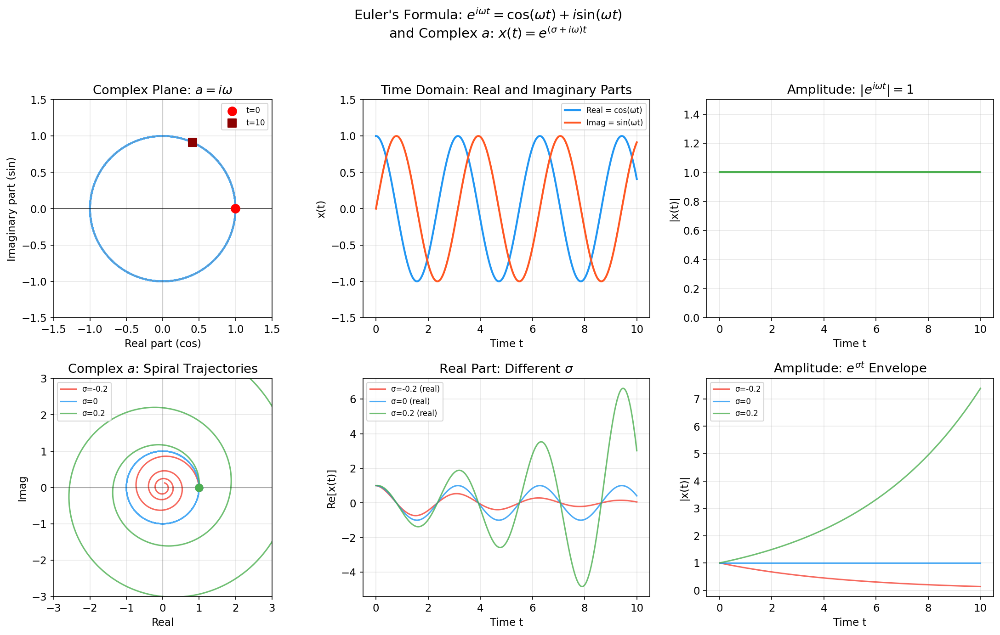

# Neuromatch Notebooks — Week 2

Linear Systems · Biological Neuron Models · Dynamical Systems

---

## Overview

Week 2 focuses on **dynamical systems and neural models** — from linear systems to biological neuron models to network dynamics:

| Day      | Topic                      | Core Skills                               |
| -------- | -------------------------- | ---------------------------------------- |
| **W2D3** | Linear Systems             | Euler integration, Oscillations, Random walks, OU process, Autoregressive models |
| **W2D4** | Biological Neuron Models   | LIF neuron, Conductance synapses, Short-term plasticity (STP), Spike-timing dependent plasticity (STDP)               |
| **W2D5** | Dynamical Systems          | Firing rate models, Wilson-Cowan model, Phase plane analysis, Jacobian matrix, Limit cycles |

**Unifying theme**: How do neurons and networks evolve over time, and how can we model their dynamics mathematically?

---

## W2D3: Linear Systems

---

### Tutorial 1: One-Dimensional Differential Equations

The simplest dynamical system: $\dot{x} = ax$

**Analytical solution**: $x(t) = x_0 e^{at}$

| $a$                  | Behavior                        |
| -------------------- | ------------------------------- |
| $a < 0$              | Exponential decay → 0           |
| $a > 0$              | Exponential growth → ∞          |
| $a = \text{complex}$ | Oscillation with growth/decay |

**Forward Euler integration** (numerical solution):

$$
x(t_i) = x(t_{i-1}) + \dot{x}(t_{i-1}) \cdot dt
$$

For $\dot{x} = ax$ specifically: $x[k] = x[k-1] + a \cdot x[k-1] \cdot dt$

**Implementation detail**: Use `dtype=complex` to handle complex-valued $a$ (needed for oscillatory dynamics)

---

### Tutorial 1: Complex $a$ and Oscillatory Dynamics

When $a$ is complex ($a = \text{real} + i \cdot \text{imag}$), the system oscillates:

$$
x(t) = x_0 e^{(\text{real} + i \cdot \text{imag})t} = x_0 e^{\text{real} \cdot t} \cdot [\cos(\text{imag} \cdot t) + i \sin(\text{imag} \cdot t)]
$$

#### Why Does Complex $a$ Lead to Oscillations? — The Geometric Intuition of Euler's Formula

The core lies in **Euler's formula**:

$$
e^{i\theta} = \cos\theta + i\sin\theta
$$

**Geometric meaning**: Multiplying by $e^{i\theta}$ is equivalent to **rotating** by $\theta$ radians on the complex plane.

When the differential equation $\dot{x} = ax$ has $a$ as a pure imaginary number (i.e., $a = i\omega$):

$$
x(t) = x_0 e^{i\omega t} = x_0 [\cos(\omega t) + i\sin(\omega t)]
$$

On the complex plane, this is **uniform circular motion** with angular velocity $\omega$ — its projection on the real axis is $\cos(\omega t)$, and its projection on the imaginary axis is $\sin(\omega t)$, both of which oscillate.

**Why the exponential form $e$?**

The solution of $\dot{x} = ax$ comes from the fundamental property of differential equations — the derivative equals itself times a constant. The only function satisfying this property is the exponential function $e^{at}$:

$$
\frac{d}{dt}\big(e^{at}\big) = a \cdot e^{at}
$$

When $a$ is real, $e^{at}$ is **monotonic growth or decay**; when $a$ is imaginary, $e^{i\omega t}$ is **pure oscillation** (constant amplitude); when $a$ is complex, $e^{(\sigma + i\omega)t} = e^{\sigma t} \cdot e^{i\omega t}$ is **oscillation + envelope growth/decay**.

**Visualization**:



The figure shows:

- **Left (complex plane trajectory)**: The red dot is the initial point at $t=0$, the blue trajectory rotates counterclockwise along the unit circle over time ($a = i\omega$), with projections on the real and imaginary axes being cosine and sine respectively
- **Right (real/imaginary part time-domain plot)**: Real part is cosine oscillation (blue), imaginary part is sine oscillation (orange)
- **General case of complex $a$**: When $a = \sigma + i\omega$, the trajectory becomes a spiral ($e^{\sigma t}$ controls the contraction or expansion of the spiral radius)

**Key insight**:

- **Real part** → growth/decay rate (amplitude envelope)
- **Imaginary part** → oscillation frequency

**Stable oscillation condition**: Set real part = 0, imaginary part = $2\pi f$

Example: Producing a 0.5 Hz stable oscillation → imaginary part = $2\pi \times 0.5 = \pi \approx 3.14$

**Growing oscillation condition**: real part > 0 AND imaginary part ≠ 0

---

### Tutorial 1: Two-Dimensional Linear Systems

Extension to 2D: $\dot{\mathbf{x}} = \mathbf{A}\mathbf{x}$

$$
\begin{bmatrix} \dot{x}_1 \\ \dot{x}_2 \end{bmatrix} = \begin{bmatrix} a_{11} & a_{12} \\ a_{21} & a_{22} \end{bmatrix} \begin{bmatrix} x_1 \\ x_2 \end{bmatrix}
$$

**Numerical solution**: Uses `scipy.integrate.solve_ivp` (not manual Euler in 2D)

**Stream plots**: Compute $\mathbf{A}\mathbf{x}$ at each grid point; arrows show direction of state change

**Eigenvectors**: Directions where $\mathbf{A}\mathbf{x}$ is parallel to $\mathbf{x}$ (invariant directions)

**Eigenvalues**: Factor by which $\mathbf{A}\mathbf{x}$ is stretched/shrunk along eigenvector directions

**Stability classification**:

| Eigenvalue Type | Behavior |
|----------------|----------|
| Both negative real | Stable node (converge to origin) |
| Both positive real | Unstable node (diverge) |
| Opposite signs | Saddle point |
| Complex | Oscillation / Spiral |

---

### Tutorial 2: Markov Processes

**Markov property**: Present state entirely determines the transition to the next state (memoryless)

**Telegraph process**: Two-state ion channel model

- States: Closed (0) and Open (1)
- Transition probabilities: $P(0 \to 1 | x=0) = \mu_{c2o}$, $P(1 \to 0 | x=1) = \mu_{o2c}$

**Poisson process**: A sequence of events occurring at a constant rate $\lambda$, the most fundamental model for describing the counting of random events.

#### Definition and Three Conditions

A counting process $\{N(t), t \geq 0\}$ is called a Poisson process with rate $\lambda$ if and only if:

1. **Independent increments**: The numbers of events occurring in disjoint time intervals are independent of each other
2. **Stationary increments**: For any interval of length $s$, the distribution of the number of events depends only on the length $s$, not on the starting point
3. **Ordinariness**: In an infinitesimally small time $\Delta t$, the probability of more than one event occurring is of higher order infinitesimal in $\Delta t$:
   $$P(N(\Delta t) \geq 2) = o(\Delta t)$$

#### Poisson Distribution

The probability of exactly $k$ events occurring in an interval of length $t$ follows the Poisson distribution:

$$P(N(t) = k) = \frac{(\lambda t)^k}{k!} e^{-\lambda t}, \quad k = 0, 1, 2, \ldots$$

- Mean: $\mathbb{E}[N(t)] = \lambda t$
- Variance: $\text{Var}[N(t)] = \lambda t$
- The equality of mean and variance is an important characteristic of the Poisson distribution

#### Waiting Time and Exponential Distribution

The interval $T_i$ between adjacent events (waiting time) follows the **exponential distribution**:

$$f_T(t) = \lambda e^{-\lambda t}, \quad t \geq 0$$

Derivation intuition:
$$P(T_1 > t) = P(N(t) = 0) = e^{-\lambda t}$$

This implies the memoryless property:
$$P(T > s + t \mid T > s) = P(T > t)$$

**Connection to Markov processes**: The memoryless property of the exponential distribution is the root of why the Poisson process has the Markov property.

#### Simulation of Poisson Process

```python
import numpy as np

# Method 1: Sample waiting times (using exponential distribution)
def poisson_process_exponential(rate, T, seed=42):
    """Simulate a Poisson process up to time T using exponential waiting times"""
    rng = np.random.default_rng(seed)
    events = []
    t = 0
    while t < T:
        # Sample next waiting time Exp(rate)
        t += rng.exponential(1 / rate)
        if t < T:
            events.append(t)
    return np.array(events)

# Method 2: Sample counts (using Poisson distribution)
def poisson_process_counting(rate, T, delta=0.01, seed=42):
    """Simulate using Poisson counts in fixed time bins"""
    rng = np.random.default_rng(seed)
    n_bins = int(T / delta)
    # Number of events per bin ~ Poisson(rate * delta)
    counts = rng.poisson(rate * delta, n_bins)
    return counts

rate = 2.0  # Average 2 events per second
events = poisson_process_exponential(rate, T=10)
print(f"{len(events)} events occurred in 10 seconds (expected: {rate * 10})")
```

#### Relationship Between Poisson and Binomial Distributions

The Poisson distribution can be viewed as the limiting case of the binomial distribution: partition $[0, t]$ into $n$ small intervals, each with event probability $p = \lambda t / n$, as $n \to \infty$:

$$\lim_{n \to \infty} \binom{n}{k} p^k (1-p)^{n-k} = \frac{(\lambda t)^k}{k!} e^{-\lambda t}$$

#### Connection to Neuron Firing

In neuroscience, if the refractory period is ignored, the firing times of a neuron can be approximately modeled as a Poisson process:
- The probability of firing in each time bin is $\lambda \Delta t$ ($\lambda$ is the firing rate)
- The firing rate $\lambda$ is modulated by stimulus intensity → **Inhomogeneous Poisson process**
- The histogram of ISIs (inter-spike intervals) decays exponentially (contrast with gamma distributions in real neurons)

**State transition matrix**:

$$
\begin{bmatrix} C \\ O \end{bmatrix}_{k+1} = \begin{bmatrix} 1-\mu_{c2o} & \mu_{o2c} \\ \mu_{c2o} & 1-\mu_{o2c} \end{bmatrix} \begin{bmatrix} C \\ O \end{bmatrix}_k
$$

- Each column sums to 1 (conservation of probability)
- Matrix entries:
  - $1 - \mu_{c2o}$: probability closed stays closed
  - $\mu_{c2o}$: probability closed transitions to open
  - $\mu_{o2c}$: probability open transitions to closed
  - $1 - \mu_{o2c}$: probability open stays open

**Probability propagation algorithm**: $\mathbf{x}_{k+1} = \mathbf{A} \cdot \mathbf{x}_k$ (matrix-vector multiply)

**Equilibrium analysis**:

- Eigenvalue = 1 corresponds to the **stable equilibrium** eigenvector
- Other eigenvalues correspond to transient decay
- Equilibrium eigenvector must be normalized (elements sum to 1)
- Equilibrium probability of being Open: $\frac{\mu_{c2o}}{\mu_{c2o} + \mu_{o2c}}$

---

### Tutorial 3: Random Walks and Diffusion

**Random walk**: At each step, move $\Delta x = \pm 1$ with equal probability

**Position update**: $x_{k+1} = x_k + \Delta x$

**Gaussian step random walk**: Steps drawn from $\mathcal{N}(\mu, \sigma)$

**Efficient vectorized implementation**:

```python
def random_walk_simulator(N, T, mu=0, sigma=1):
    steps = np.random.normal(mu, sigma, size=(N, T))
    sim = np.cumsum(steps, axis=1)
    return sim
```

**Diffusive process properties**:

- Mean stays near 0 (independent of time)
- **Variance grows linearly with time**: $\text{Var} \propto t$ (specifically $\text{Var} = \sigma^2 t$)
- Distribution widens over time but center remains unchanged

---

### Tutorial 3: Deterministic Decay and OU Process

**Basic decay**: $x_{k+1} = \lambda x_k$, solution: $x_k = x_0 \lambda^k$ (decays when $|\lambda| < 1$)

**Decay with target**: $x_{k+1} = x_\infty + \lambda(x_k - x_\infty)$

**Analytical solution**: $x_k = x_\infty(1 - \lambda^k) + x_0 \lambda^k$

As $k \to \infty$: $x_k \to x_\infty$

**Ornstein-Uhlenbeck (OU) process / Drift-Diffusion Model**:

$$
x_{k+1} = x_\infty + \lambda(x_k - x_\infty) + \sigma \eta
$$

where $\eta \sim \mathcal{N}(0,1)$ (standard normal)

**Two components**:

- **Drift**: $x_\infty + \lambda(x_k - x_\infty)$, pulls $x$ toward $x_\infty$
- **Diffusion**: $\sigma \eta$, adds random noise

**Equilibrium variance** (key result):

$$
\text{Var}_{eq} = \frac{\sigma^2}{1 - \lambda^2}
$$

**Properties**:

- Depends only on $\lambda$ and $\sigma$, **not** on $x_0$ or $x_\infty$
- As $\lambda \to 1$: variance diverges (approaches pure random walk)
- As $\lambda \to 0$: variance approaches $\sigma^2$ (each step independent)

**Empirical variance computation**: Run long simulation of duration $T$, take variance of the **second half** (assuming system has settled)

```python
x[-round(T/2):].var()
```

**Key observations**:

- Mean of OU process follows the deterministic solution exactly
- Variance reaches equilibrium (unlike random walk where it grows without bound)
- Restoring drift force prevents unbounded variance growth

---

### Tutorial 4: Autoregressive Models

**Perspective shift**: Given data, learn its dynamics (inverse problem)

**First-order autoregression AR(1)**: $x_{k+1} = \lambda x_k + \eta$

**Regression formulation**: $\mathbf{x}_2 = \lambda \mathbf{x}_1$

- $\mathbf{x}_1 = x[0:T-1]$ (past values)
- $\mathbf{x}_2 = x[1:T]$ (future values, shifted by 1)

**Least squares solution**:

```python
p, res, rnk, s = np.linalg.lstsq(x1, x2, rcond=None)
```

**Adding intercept term**: Prepend a column of 1s to x1

```python
x1 = x1[:, np.newaxis]**[0, 1]  # Add columns: constant and linear terms
```

Regression coefficient $p[1]$ is the estimated $\hat{\lambda}$

**Residual analysis**:

- Residuals = data - prediction: $\text{res} = x_2 - (p[0] + \hat{\lambda} \cdot x_1[:, 1])$
- Residual standard deviation should approximately equal $\sigma$ (noise parameter)
- Residual histogram should be approximately normal

---

### Tutorial 4: Higher-Order Autoregressive Models

**Order-$r$ AR model**: $x_{k+1} = \alpha_0 + \alpha_1 x_k + \alpha_2 x_{k-1} + \dots + \alpha_r x_{k-r}$

$r+1$ coefficients to fit (including intercept $\alpha_0$)

**Time-delay matrix construction (build_time_delay_matrices)**:

- $\mathbf{x}_1$: matrix of size $[(r+1) \times (n-r)]$
  - Row 0: all ones (intercept)
  - Row 1: $x[0:T-r]$ (lag 1)
  - Row 2: $x[1:T-r+1]$ (lag 2, achieved via `np.roll`)
  - … up to lag $r$
- $\mathbf{x}_2$: vector $x[r:]$ (values to predict)

**np.roll trick**: `xprime = np.roll(xprime, -1)` shifts array left by 1 each iteration

**Prediction and classification**:

- For binary (+1/-1) data: prediction = $\text{sign}(\mathbf{x}_1^T \cdot \mathbf{p})$
- Error rate = $\text{count}(x_2 \neq \text{prediction}) / \text{len}(x_2)$
- Random chance baseline: error rate = 0.5

**Overfitting observation**:

- Sweeping AR orders from r=1 to r=20
- There is a **sweet spot** (around r=6 for human-generated data)
- Too low r: underfitting (misses patterns)
- Too high r: overfitting (fits training noise, poor on test)
- Demonstrates bias-variance tradeoff

**Human randomness vs machine randomness**:

- Humans are poor at generating random sequences (detectable patterns)
- AR models can exploit these patterns for better-than-chance predictions
- Machine-generated random integers are truly unpredictable (error ≈ 0.5)
- Binary encoding: '0' → -1, '1' → +1 (via `x*2 - 1`)

**Connections between tutorials**:

- Tutorial 1: Deterministic continuous-time dynamics ($\dot{x} = Ax$)
- Tutorial 2: Discrete-time probabilistic transitions (state transition matrix)
- Tutorial 3: Combining deterministic drift with stochastic diffusion (OU process)
- Tutorial 4: Fitting models to data (inverting the generative process via regression)
- The OU process $x_{k+1} = \lambda x_k + \sigma \eta$ is both the generative model (Tutorial 3) and the model being fit (Tutorial 4), closing the loop

---

## W2D4: Biological Neuron Models

---

### Tutorial 1: Leaky Integrate-and-Fire Model (LIF)

**Core membrane potential equation (subthreshold dynamics)**:

$$
\tau_m \frac{dV}{dt} = -(V - E_L) + \frac{I}{g_L}
$$

where $\tau_m = C_m / g_L$ is the membrane time constant, $g_L$ is leak conductance, $E_L$ is resting potential

**Spike-and-reset rule**:

$$
\text{if } V(t_{sp}) \geq V_{th}: \quad V(t) = V_{reset} \text{ for } t \in (t_{sp}, t_{sp} + \tau_{ref}]
$$

**Default parameters**:

| Parameter | Value | Meaning |
|-----------|-------|---------|
| $V_{th}$ | -55 mV | Spike threshold |
| $V_{reset}$ | -75 mV | Reset potential |
| $E_L$ | -75 mV | Resting potential |
| $\tau_m$ | 10 ms | Membrane time constant |
| $g_L$ | 10 nS | Leak conductance |
| $t_{ref}$ | 2 ms | Refractory time |
| $dt$ | 0.1 ms | Time step |

**Euler integration implementation (run_LIF)**:

```python
for it in range(Lt - 1):
    if tr > 0:                          # Refractory period
        v[it] = V_reset
        tr = tr - 1
    elif v[it] >= V_th:                 # Spike!
        rec_spikes.append(it)
        v[it] = V_reset
        tr = tref / dt
    # Calculate the increment of the membrane potential
    dv = (dt / tau_m) * (-(v[it] - E_L) + Iinj[it] / g_L)
    # Update the membrane potential
    v[it + 1] = v[it] + dv
```

---

### Tutorial 1: Different Types of Input Currents

**Direct Current (DC)**: Constant current, produces regular spikes (CV_ISI ≈ 0)

**Gaussian White Noise (GWN)**:

$$
I_{gwn} = \mu + \sigma \cdot \frac{\xi(t)}{\sqrt{dt/1000}}
$$

where $\xi(t) \sim \mathcal{N}(0,1)$, dividing by $\sqrt{dt/1000}$ converts discrete-time noise to proper continuous-time scaling (units to seconds)

**Ornstein-Uhlenbeck (OU) process (colored noise)**:

$$
\tau_\eta \frac{d\eta}{dt} = -\eta(t) + \sigma_\eta \sqrt{2\tau_\eta} \xi(t)
$$

**Properties**:

- $\mathbb{E}[\eta(t)] = \mu$
- Autocovariance: $\text{Cov}[\eta(t), \eta(t+\tau)] = \sigma_\eta^2 e^{-|t-\tau|/\tau_\eta}$

**Euler implementation**:

```python
I_ou[it+1] = I_ou[it] + (dt/tau_ou)*(mu - I_ou[it]) + sqrt(2*dt/tau_ou)*sig*noise[it+1]
```

---

### Tutorial 1: Firing Rate and Spike Irregularity

**Frequency-Current curve (F-I curve)**: Output firing frequency as a function of input current

**Coefficient of Variation of ISI (CV_ISI)**:

$$
\text{CV}_{\text{ISI}} = \frac{\text{std}(\text{ISI})}{\text{mean}(\text{ISI})}
$$

| CV Value | Meaning |
|----------|---------|
| 0 | Perfectly regular (clock-like) |
| 1 | Poisson process (maximum irregularity) |

**Key findings**:

- DC input produces regular spiking (CV ≈ 0)
- GWN input produces irregular spiking; higher $\sigma$ increases CV_ISI
- Increasing $\sigma$ smooths the F-I curve
- Increasing mean $\mu$ while keeping $\sigma$ fixed decreases CV_ISI (more regular at higher rates)

---

### Tutorial 2: Correlated Inputs and Correlation Transfer

**Correlated input model**:

$$
\frac{I_i}{g_L} = \mu_i + \sigma_i (\sqrt{1-c}\,\xi_i + \sqrt{c}\,\xi_c)
$$

**Term-by-term explanation**:

| Term | Meaning | Why this design |
|---|---|---|
| $I_i$ | **Total synaptic input current** of the $i$-th neuron | Driving term of the LIF model, determines membrane potential changes |
| $g_L$ | **Leak conductance** | Dividing by $g_L$ decouples mechanics from potential |
| $\mu_i$ | **Drift term (deterministic DC component)** | Controls mean input strength, analogous to applied stimulus intensity |
| $\sigma_i$ | **Noise amplitude** | Controls the magnitude of input fluctuations (variance size) |
| $\xi_i \sim \mathcal{N}(0,1)$ | **Independent noise** of the $i$-th neuron | Simulates non-shared synaptic input fluctuations |
| $\xi_c \sim \mathcal{N}(0,1)$ | **Common noise** shared by all neurons | Simulates global state changes or common input |
| $c \in [0,1]$ | **Correlation strength** | $c=0$: completely independent, $c=1$: completely correlated |
| $\sqrt{1-c}$ | Scaling factor for independent noise | Ensures $\text{Var}(\sqrt{1-c}\,\xi_i) = 1-c$ |
| $\sqrt{c}$ | Scaling factor for shared noise | Ensures $\text{Var}(\sqrt{c}\,\xi_c) = c$ |

**Variance conservation**: $\text{Var}(\sqrt{1-c}\,\xi_i + \sqrt{c}\,\xi_c) = (1-c) + c = 1$

That is, regardless of the value of $c$, the total noise variance for each neuron remains $\sigma_i^2$ — only the proportion between the independent and shared parts changes, not the total variance. This ensures we study correlation in isolation without introducing variance confounds.

**Sample correlation coefficient (Pearson)**:

$$
r_{ij} = \frac{\text{cov}(I_i, I_j)}{\sqrt{\text{var}(I_i)} \sqrt{\text{var}(I_j)}}
$$

- $\text{cov}(I_i, I_j)$: Covariance of $I_i$ and $I_j$, measuring how they co-vary
- $\text{var}(I_i)$: Variance of $I_i$ (its own fluctuation magnitude)
- After normalizing by the denominator, $r_{ij} \in [-1, 1]$:
  - $r_{ij} = 1$: Perfect positive correlation (change synchronously)
  - $r_{ij} = 0$: Uncorrelated
  - $r_{ij} = -1$: Perfect negative correlation (change oppositely)

For the correlated input model, the theoretical correlation coefficient is $r_{ij} = c$ (when $\sigma_i = \sigma_j$). Verification: $\text{cov}(I_i, I_j) = \sigma_i\sigma_j \cdot c$, $\text{var}(I_i) = \sigma_i^2$, so $r_{ij} = c$.

**Correlated Poisson generation method**:

```python
# Generate correlated Poisson spike trains for each neuron
def generate_corr_Poisson(rate, corr, T, dt, n_neurons):
    """Generate Poisson spikes for n neurons with correlation coefficient corr"""
    # 1. Generate a "mother" sequence: Poisson process at rate rate/corr
    #    The mother sequence has higher spike density, serving as a common "material pool"
    mother = np.random.rand(int(T/dt)) < (rate / corr) * dt

    # 2. Each child neuron independently samples a fraction corr of the mother's spikes
    #    Achieved by randomly drawing from the mother's spike times
    mother_times = np.where(mother)[0]
    n_shared = int(len(mother_times) * corr)
    spikes = np.zeros((n_neurons, int(T/dt)))
    for i in range(n_neurons):
        idx = np.random.choice(mother_times, n_shared, replace=False)
        spikes[i, idx] = 1.0
    return spikes
```

Why generate this way? Sampling from a mother sequence rather than directly generating correlated noise is because the correlation of a Poisson process cannot be linearly superimposed like a Gaussian. Through the "common parent process + subsampling" approach, the output correlation of each pair of neurons is guaranteed to be exactly $c$.

**Campbell's theorem (mean and variance of synaptic current from Poisson input)**:

$$
\mu_{\rm syn} = \lambda J \int P(t) dt
$$

$$
\sigma_{\rm syn}^2 = \lambda J^2 \int P(t)^2 dt
$$

| Term | Meaning | Intuition |
|---|---|---|
| $\lambda$ | **Poisson rate**: spikes per second | Denser spike arrival produces larger current |
| $J$ | **PSP amplitude**: synaptic conductance jump per single spike | The "weight" of each spike |
| $P(t)$ | **Postsynaptic current kernel**: waveform of current evolution over time following a spike | The "shape" of synaptic transmission |
| $\int P(t) dt$ | Integral of the kernel (time × amplitude) | Total charge injection from a single spike |
| $\int P(t)^2 dt$ | Integral of the squared kernel | Controls the squared amplitude of current fluctuations |

**Derivation intuition**:
- **Mean** $\mu_{\rm syn} \propto \lambda J$: Higher spike rate and larger amplitude produce larger average current
- **Variance** $\sigma_{\rm syn}^2 \propto \lambda J^2$: Variance is more sensitive to $J$ than to $\lambda$ ($J^2$ vs $\lambda$), indicating that increasing individual spike amplitude amplifies fluctuations more than increasing spike rate

**Key findings**:

- Output correlation is **always smaller** than input correlation (LIF acts as a "correlation filter")
- Correlation transfer function is approximately linear
- Higher mean $\mu$ and higher $\sigma$ both increase the slope of the transfer function (better correlation transmission)
- Higher firing rates lead to better correlation transfer

---

### Tutorial 3: Conductance-Based Synapses

**Synaptic conductance dynamics**:

$$
\frac{dg_{\rm syn}(t)}{dt} = \bar{g}_{\rm syn} \sum_k \delta(t-t_k) - \frac{g_{\rm syn}(t)}{\tau_{\rm syn}}
$$

- $\bar{g}_{\rm syn}$: maximum conductance change per spike (synaptic weight)
- $\tau_{\rm syn}$: synaptic time constant (controls decay speed)

**Ohm's law (conductance to current)**:

$$
I_{\rm syn}(t) = g_{\rm syn}(t)(V(t) - E_{\rm syn})
$$

- $E_E = 0$ mV (excitatory reversal potential, depolarizing)
- $E_I = -80$ mV (inhibitory reversal potential, hyperpolarizing)

**Total synaptic current**:

$$
I_{\rm syn} = -g_E(t)(V - E_E) - g_I(t)(V - E_I)
$$

**Conductance-based LIF membrane equation**:

$$
\tau_m \frac{dV}{dt} = -(V - E_L) - \frac{g_E(t)}{g_L}(V - E_E) - \frac{g_I(t)}{g_L}(V - E_I) + \frac{I_{\rm inj}}{g_L}
$$

**Euler update for conductance (run_LIF_cond)**:

```python
gE[it+1] = gE[it] - (dt/tau_syn_E)*gE[it] + gE_bar * spike_train_ex[it+1]
gI[it+1] = gI[it] - (dt/tau_syn_I)*gI[it] + gI_bar * spike_train_in[it+1]
```

**Default synaptic parameters**:

- Excitatory: $g_E = 2.4$ nS, $E_E = 0$ mV, $\tau_E = 2$ ms
- Inhibitory: $g_I = 2.4$ nS, $E_I = -80$ mV, $\tau_I = 5$ ms
- 80 excitatory, 20 inhibitory presynaptic neurons at 10 Hz

**Free Membrane Potential (FMP)**: Membrane potential computed with spike threshold removed (set $V_{th} = \infty$)

- Mean FMP > threshold: **Mean-driven regime** (regular firing, low CV_ISI)
- Mean FMP < threshold: **Fluctuation-driven regime** (irregular firing, high CV_ISI)
- Balance of excitation/inhibition determines firing pattern
- Synaptic input is **colored noise** (exponential kernel filtering), not white noise

---

### Tutorial 3: Short-Term Synaptic Plasticity (STP)

**Three-variable dynamic model**:

$$
\frac{du_E}{dt} = -\frac{u_E}{\tau_f} + U_0(1-u_E^-)\delta(t-t_{sp})
$$

$$
\frac{dR_E}{dt} = \frac{1-R_E}{\tau_d} - u_E^+ R_E^- \delta(t-t_{sp})
$$

$$
\frac{dg_E}{dt} = -\frac{g_E}{\tau_E} + \bar{g}_E u_E^+ R_E^- \delta(t-t_{sp})
$$

#### Detailed item-by-item explanation

**Equation 1: Release probability $u$ (Utilization)**

$$
\frac{du_E}{dt} = \underbrace{-\frac{u_E}{\tau_f}}_{\text{Decay term}} + \underbrace{U_0(1-u_E^-)\delta(t-t_{sp})}_{\text{Spike-triggered term}}
$$

| Term | Meaning | Why this design |
|---|---|---|
| $\frac{du_E}{dt}$ | Rate of change of release probability $u$ over time | Dynamic model of calcium concentration |
| $-\frac{u_E}{\tau_f}$ | **Exponential decay term**: $u$ decays back to 0 with time constant $\tau_f$ | Calcium is gradually pumped out between spikes, release probability falls |
| $U_0$ | **Baseline release probability**: initial increment after a single spike | Tunable parameter; large $U_0$ → high initial release rate |
| $(1-u_E^-)$ | **Available increment space**: $u_E^-$ is the value of $u$ just before spike arrival | $u$ cannot exceed 1; the larger the remaining space $(1-u)$, the larger the increment per spike |
| $\delta(t-t_{sp})$ | **Dirac delta function**: only takes effect at spike time $t_{sp}$ | Spikes are discrete events exerting influence instantaneously |
| $U_0(1-u_E^-)\delta(t-t_{sp})$ | **Spike-triggered term**: $u$ jumps up when a spike arrives | Simulates the fast process of calcium influx |

**Intuition**:
- Spike arrives → calcium influx → release probability $u$ jumps up instantly
- Between spikes → calcium decays → $u$ decays exponentially
- $U_0$ controls the jump amplitude per spike, $\tau_f$ controls the decay speed
- **When $\tau_f$ is large**, $u$ barely decays between spikes → cumulative effect across successive spikes → **Short-Term Facilitation (STF)**

**Equation 2: Available resource pool $R$ (Recovery)**

$$
\frac{dR_E}{dt} = \underbrace{\frac{1-R_E}{\tau_d}}_{\text{Recovery term}} - \underbrace{u_E^+ R_E^- \delta(t-t_{sp})}_{\text{Consumption term}}
$$

| Term | Meaning | Why this design |
|---|---|---|
| $\frac{1-R_E}{\tau_d}$ | **Recovery term**: resources recover toward 1 with time constant $\tau_d$ | Neurotransmitters are resynthesized and transported between spikes |
| $1-R_E$ | **Recoverable space** | The closer $R$ is to 0, the greater the recovery driving force |
| $u_E^+ R_E^- \delta(t-t_{sp})$ | **Consumption term**: resources are consumed when a spike arrives | The larger the release probability $u$, the more resources are consumed |
| $u_E^+$ | **Release probability after spike arrival** | Update $u$ first, then use new $u$ to compute consumption (order matters!) |
| $R_E^-$ | **Resource level before spike arrival** | What is consumed is the resource stock before the spike |

**Intuition**:
- Spike arrives → $u \cdot R$ resources are consumed → $R$ drops sharply
- Between spikes → resources gradually recover → $R$ exponentially returns to 1
- $\tau_d$ controls recovery speed; larger $\tau_d$ → slower recovery
- **When $\tau_d$ is large**, under high-frequency input, resources cannot recover in time → $R$ keeps decreasing → **Short-Term Depression (STD)**

**Equation 3: Synaptic conductance $g$ (Conductance)**

$$
\frac{dg_E}{dt} = \underbrace{-\frac{g_E}{\tau_E}}_{\text{Decay term}} + \underbrace{\bar{g}_E u_E^+ R_E^- \delta(t-t_{sp})}_{\text{Production term}}
$$

| Term | Meaning | Why this design |
|---|---|---|
| $-\frac{g_E}{\tau_E}$ | **Exponential decay term**: conductance decays with time constant $\tau_E$ | Postsynaptic receptors close, conductance naturally subsides |
| $\bar{g}_E$ | **Maximum conductance** | Upper limit of synaptic transmission magnitude |
| $u_E^+ R_E^- \delta(t-t_{sp})$ | **Spike-triggered conductance jump** | Actual release amount = release probability × available resources |
| $\bar{g}_E u_E^+ R_E^-$ | **Conductance increment** | Conductance jump is proportional to $u \times R$ |

**Intuition**:
- Actual synaptic strength = $\bar{g}_E \times u \times R$ (product of three factors)
- $u$ controls "how large the release probability is", $R$ controls "how much is available for release", $\bar{g}_E$ controls "how large it can be at most"
- Between spikes, $g$ decays exponentially to 0

**Why three variables?**

Synaptic transmission is not a simple on/off process, but the interaction of factors on multiple time scales:
- $u$ (fast/medium time scale): calcium dynamics → facilitation
- $R$ (slow time scale): neurotransmitter recycling → depression
- $g$ (medium time scale): postsynaptic response → output

**Interaction sequence of the three variables** (update order upon spike arrival is crucial):

```
① First compute jump in u:   u ← u + U₀(1-u)      // using u before the spike
② Then compute consumption of R: R ← R - u⁺·R     // using the newly updated u⁺
③ Finally compute increase in g: g ← g + ḡ · u⁺·R⁻ // using new u⁺ and old R⁻
```

Why this order? Because the actual biological process is: calcium influx ($u$) → triggers vesicle release (consumes $R$) → opens ion channels (increases $g$). If we consumed $R$ first and then used the new $R$ to compute $g$, we would erroneously use "already decreased resources" to calculate conductance, which does not match biological reality.

**STP numerical example** (two pulses):

```
Initial state: u=0.1, R=1.0, g=0

1st spike arrives:
  u = 0.1 + 0.5×(1-0.1) = 0.55
  R = 1.0 - 0.55×1.0 = 0.45
  g = 0 + 1.0×0.55×1.0 = 0.55
  → then u, R, g decay exponentially...

2nd spike arrives (before R has recovered):
  u = u' + 0.5×(1-u')    ← u' is the value decayed to
  R = R' - u⁺×R'          ← resources are less than the first time, output is weaker
  g = g' + ḡ·u⁺·R⁻
  → If R hasn't recovered, the second g increment is smaller → this is STD
```

**Short-Term Depression (STD) vs Short-Term Facilitation (STF) parameters**:

| Parameter | STD | STF |
|-----------|-----|-----|
| $U_0$ | 0.5 (high initial release rate) | 0.2 (low initial release rate) |
| $\tau_d$ | 100 ms | 100 ms |
| $\tau_f$ | 50 ms (fast recovery) | 750 ms (slow decay) |

**STD mechanism**:

- At high input rates, resources don't recover in time, conductance continuously decreases
- $g_{10}/g_1$ decreases monotonically with input rate

**STF mechanism**:

- When $\tau_f$ is large, $u$ decays slowly between spikes, cumulative effect is significant
- $g_{10}/g_1$ changes non-monotonically with input rate (initially increases, then decreases)

---

### Tutorial 4: Spike-Timing Dependent Plasticity (STDP)

#### Basic Principle of STDP: A Temporal Version of Hebbian Learning

> "Fire together, wire together" — but STDP says "precise order and timing" are what really matter.

STDP is a temporally precise version of the Hebbian learning rule: the change in synaptic weight depends on the **relative timing of presynaptic and postsynaptic spikes**.

#### STDP Weight Change Rule (Biphasic Exponential Decay)

$$
\Delta W = \begin{cases}
A_+ e^{\, (t_{pre}-t_{post})/\tau_+} & \text{if } t_{post} > t_{pre} \text{ (LTP)} \\
-A_- e^{\, -(t_{pre}-t_{post})/\tau_-} & \text{if } t_{post} < t_{pre} \text{ (LTD)}
\end{cases}
$$

**Term-by-term explanation**:

| Term | Meaning | Why this design |
|---|---|---|
| $\Delta W$ | **Change in synaptic weight** | Positive = strengthening (LTP), negative = weakening (LTD) |
| $t_{pre}$ | **Presynaptic spike arrival time** | When the upstream neuron fires |
| $t_{post}$ | **Postsynaptic spike firing time** | When the downstream neuron fires |
| $t_{pre} - t_{post}$ | **Spike timing difference**: $\Delta t$ | $>0$ means pre before post (causal), $<0$ means post before pre |
| $A_+$ | Maximum amplitude of LTP change | Controls the strength of weight potentiation |
| $A_-$ | Maximum amplitude of LTD change | Controls the strength of weight depression (typically $A_- > A_+$, i.e., LTD dominates) |
| $\tau_+$ | Time window constant for LTP | Determines how far apart pre-post can be and still trigger LTP |
| $\tau_-$ | Time window constant for LTD | Determines how far apart post-pre can be and still trigger LTD |
| $e^{\Delta t/\tau_+}$ | Exponential decay for LTP | When $\Delta t > 0$, larger intervals produce weaker potentiation |
| $e^{-\Delta t/\tau_-}$ | Exponential decay for LTD | When $\Delta t < 0$, larger intervals produce weaker depression |

**Why an asymmetric biphasic exponential?**

```
Weight change ΔW
    ↑ A₊                       ↱ LTP region (pre before post)
    |                    ／
    |               ／
    |          ／
    |     ／
    ────┼────────────────────────────→ Δt = t_pre - t_post
    |     ＼                           (pre leading is positive)
    |        ＼
    |           ＼              ↳ LTD region (post before pre)
    |              ＼
    |                 ＼
    ↓ -A₋
```

- **LTP side** ($\Delta t > 0$): pre before post → pre may have "predicted" or "caused" post → strengthen this synapse
- **LTD side** ($\Delta t < 0$): post before pre → post firing is unrelated to pre → weaken this synapse (don't waste resources)
- **Exponential decay**: The larger the timing difference, the lower the confidence in causality → the smaller the weight change
- **Asymmetry** ($A_- > A_+$): If LTP and LTD were balanced, uncorrelated inputs would produce net zero change, but $A_-$ being slightly larger makes the overall trend for uncorrelated inputs LTD — only **sustained** pre-post causality can maintain the weight

**Meaning of default parameters**:

| Parameter | Value | Meaning |
|---|---|---|
| $A_+ = 0.008$ | LTP magnitude | One pre-post pairing can increase weight by at most 0.008 (relative to max conductance $\bar{g}_{max}$) |
| $A_- = 1.10 \times A_+$ | LTD magnitude slightly larger | Uncorrelated pre-post timing leads to net LTD (competitive learning) |
| $\tau_{\rm stdp} = 20$ ms | Time window | When interval > 20 ms, weight change decays to $e^{-1} \approx 37\%$ |

#### Efficient STDP Implementation: Trace Variables $P(t)$ and $M(t)$

The standard STDP rule requires computing the time difference for every pre-post event pair — with many neurons and ongoing spiking, direct computation is extremely inefficient.

**Solution**: Introduce two trace variables $P$ (positive trace) and $M$ (negative trace), transforming STDP into **event-triggered variable updates**.

For each presynaptic neuron $i$:

$$
\tau_+ \frac{dP}{dt} = -P
$$

On presynaptic spike: $P(t) = P(t) + A_+$

For each postsynaptic neuron:

$$
\tau_- \frac{dM}{dt} = -M
$$

On postsynaptic spike: $M(t) = M(t) - A_-$

**Intuitive understanding of $P$ and $M$**:

```
P(t)  ↑  A₊                        Presynaptic spikes leave a "mark" on P:
     |    \                        - P jumps up by A₊ on a pre spike
     |     \__        jump A₊      - Then decays exponentially to 0
     |        \_                   - Positive P means "there was a recent pre spike"
     └────────────────────────→  Time

M(t)  ◄────────────────────────  Time
      _/
     _/    -A₋
     |    /                        Postsynaptic spikes leave a "mark" on M:
     |   /                         - M jumps down by -A₋ on a post spike
     |  /                          - Then decays exponentially to 0
     ↓ -A₋                         - Negative M means "there was a recent post spike"
```

**Why is this transformation equivalent?**

- When the postsynaptic neuron fires, the value of $P(t)$ exactly equals $\sum_{\text{recent pre}} A_+ e^{-(t_{post}-t_{pre})/\tau_+}$ — this is precisely the sum of LTP contributions from all recent pre spikes to the weight change!
- When the presynaptic neuron fires, the value of $M(t)$ exactly equals $\sum_{\text{recent post}} -A_- e^{-(t_{pre}-t_{post})/\tau_-}$ — this is the sum of LTD contributions from all recent post spikes to the weight change.

**Weight update rules using trace variables**:

When presynaptic neuron $i$ fires (executes LTD):

$$
\bar{g}_i \leftarrow \bar{g}_i + M(t) \cdot \bar{g}_{max}
$$

- $M(t) < 0$ (jumps negative then gradually recovers): so weight **decreases**
- $\bar{g}_{max}$ converts the relative change to absolute conductance change
- If $\bar{g}_i < 0$, clamp to 0 (conductance cannot be negative)
- **Meaning**: If there was a recent post spike ($M$ is very negative), and now a pre spike arrives, this pre contribution seems "redundant" and should be weakened

When postsynaptic neuron fires (executes LTP):

$$
\bar{g}_i \leftarrow \bar{g}_i + P_i(t) \cdot \bar{g}_{max} \quad \forall i
$$

- $P_i(t) > 0$ (jumps positive then gradually recovers): so weight **increases**
- Updates weights for all presynaptic $i$ simultaneously
- **Meaning**: For each pre connection, if it had a recent spike ($P_i$ is still large), it likely helped trigger the post spike and should be strengthened

```
Event flow diagram:

Presynaptic spike @ t_pre:
  ├─ Immediately: g ← g + M(t) × ḡ_max    (LTD: if post has fired recently, weaken)
  └─ Update: P ← P + A₊                    (mark for possible future LTP)

Postsynaptic spike @ t_post:
  ├─ Immediately: for all i: ḡ_i ← ḡ_i + P_i(t) × ḡ_max  (LTP: strengthen all "meritorious" synapses)
  └─ Update: M ← M - A₋                    (mark for possible future LTD)
```

**Biological correspondence of parameters**:

| STDP Parameter | Biological Correspondence |
|---|---|
| $\tau_{\rm stdp} = 20$ ms | Calcium signal time constant of NMDA receptors |
| $A_+ > 0$ | CaMKII activation (increases number of AMPA receptors) |
| $A_- > 0$ | Phosphatase activation (decreases number of AMPA receptors) |
| $A_- > A_+$ | LTD is more easily triggered (maintains competitive balance) |

**LIF membrane equation with STDP synapses**:

$$
\tau_m \frac{dV}{dt} = -(V - E_L) - g_E(t)(V - E_E)
$$

where $g_E(t) = \sum_i g_i(t)$, each $g_i(t)$ uses the dynamically updated $\bar{g}_i$

**Default synapse parameters (STDP simulations)**:

- $\bar{g}_E = 0.024$ nS (max conductance per synapse)
- $g_{E,init} = 0.014 - 0.024$ nS (initial conductance)
- $E_E = 0$ mV, $\tau_E = 5$ ms
- $N = 300$ presynaptic neurons at 10-15 Hz, $dt = 1$ ms

**Key findings**:

- With uncorrelated Poisson inputs, many synapses weaken over time (LTD dominates due to $A_- > A_+$)
- Weight distribution evolves over time; bimodal distribution emerges (many weights near 0, some near $g_{max}$)
- With correlated inputs: correlated presynaptic neurons maintain their weights (higher chance of pre-before-post pairing), while uncorrelated synapses depress
- STDP enables **unsupervised learning**: synapses carrying correlated/relevant information are selectively strengthened

---


## W2D5: Dynamical Systems

---

### Tutorial 1: Single Population Firing Rate Model

**Feedforward firing rate dynamics (Eq. 1)**:

$$
\tau \frac{dr}{dt} = -r + F(I_{\rm ext})
$$

**Term-by-term explanation**:

| Term | Meaning | Why this design |
|---|---|---|
| $r$ | Population **mean firing rate** | Use a continuous variable to describe collective activity of a group of neurons |
| $\frac{dr}{dt}$ | Rate of change of firing rate over time | Standard form of dynamical systems |
| $\tau$ | **Time constant** | Controls how quickly neurons respond to input |
| $-r$ | **Decay term** (leak term that regresses to 0) | Without input, firing rate should decay exponentially to 0 |
| $F(x)$ | **Sigmoidal transfer function** (F-I curve) | Nonlinear mapping that converts input current to firing rate |
| $I_{\rm ext}$ | **External input current** | Drive from other brain regions or stimuli |

**Intuition**:
- The equation is formally equivalent to $\tau \frac{dr}{dt} = -r + \text{input}$, a **first-order low-pass filter**
- Input $I_{\rm ext}$ is nonlinearly transformed by $F$, driving $r$ toward the target value
- The time constant $\tau$ controls the speed of convergence

---

**Sigmoidal transfer function / F-I curve (Eq. 2)**:

$$
F(x; a, \theta) = \frac{1}{1 + e^{-a(x-\theta)}} - \frac{1}{1 + e^{a\theta}}
$$

**Term-by-term explanation**:

| Term | Meaning | Why this design |
|---|---|---|
| $x$ | **Net input** (current strength) | Independent variable passed to the function |
| $a$ | **Gain** | Controls the slope of the F-I curve; larger values make the transition from "off" to "saturation" steeper |
| $\theta$ | **Threshold** | Position of the curve's inflection point; determines how much input is needed for neurons to fire significantly |
| $\frac{1}{1 + e^{-a(x-\theta)}}$ | **Standard sigmoid** | Classic S-shaped curve, output range $(0,1)$ |
| $-\frac{1}{1 + e^{a\theta}}$ | **Subtractive correction term** | **Ensures $F(0; a, \theta) = 0$** — output must be zero when input is zero |

**Why is the subtractive correction needed?**

The standard sigmoid $1/(1+e^{-a(x-\theta)})$ at $x=0$ outputs $1/(1+e^{a\theta})$:
- If $\theta=2.8$, $a=1.2$, then $1/(1+e^{3.36}) \approx 0.033$
- This means even without input, the neuron has a small "spontaneous activity"
- After subtracting $1/(1+e^{a\theta})$, $F(0; a, \theta) = 0$, which is physically reasonable

**Shape of the F-I curve**:

```
r = F(x)
   ↑
1  |        _______________
   |       /
   |      /
   |     /
   |    /
0  |___/______________________→ x
      θ (threshold)
```

- $x < \theta$: Output near 0 (neuron does not fire)
- $x \approx \theta$: Output rises rapidly (near threshold)
- $x > \theta$: Output near 1 (saturation)

---

**Recurrent network dynamics (Eq. 3)**:

$$
\tau \frac{dr}{dt} = -r + F(w \cdot r + I_{\rm ext})
$$

| Term | Meaning | Why this design |
|---|---|---|
| $w \cdot r$ | **Recurrent input**: feedback from the population's own firing | Synaptic weight $w$ times the current firing rate $r$ |
| $w$ | **Recurrent synaptic weight** | $w > 0$ for excitatory feedback, $w < 0$ for inhibitory feedback |
| $w \cdot r + I_{\rm ext}$ | **Total driving input** | Sum of external drive and self-feedback |

**Effect of self-feedback**:
- $w > 0$ (self-excitation): positive feedback → activity is amplified by input drive
- $w = 0$: no feedback → purely feedforward response
- $w < 0$ (self-inhibition): negative feedback → activity is suppressed

---

**Analytical solution for $w = 0$**:

$$
r(t) = r(0) + [F(I_{\rm ext}; a, \theta) - r(0)](1 - e^{-t/\tau})
$$

| Term | Meaning |
|---|---|
| $r(0)$ | Initial firing rate |
| $F(I_{\rm ext})$ | Steady-state target value ($r$ as $t \to \infty$) |
| $r(0) - F(I_{\rm ext})$ | Deviation between initial state and steady state |
| $1 - e^{-t/\tau}$ | Exponential approach from initial to steady state |

When $w=0$, this is a standard first-order linear differential equation, with an exponential approach solution.

---

### Tutorial 1: Fixed Points and Stability

**Fixed point condition (Eq. 4)**:

$$
-r^* + F(w \cdot r^* + I_{\rm ext}; a, \theta) = 0
$$

**Term-by-term explanation**:

| Term | Meaning | Why this design |
|---|---|---|
| $r^*$ | **Fixed point** | Firing rate when the system reaches equilibrium |
| $-r^*$ | Decay term evaluated at the fixed point | Must balance the drive term |
| $F(w r^* + I_{\rm ext})$ | Drive term evaluated at the fixed point | Driving force produced by input |
| Whole equation = 0 | **Fixed point = zero condition** | Equivalent expression for $\frac{dr}{dt}=0$ |

**Geometric meaning**: A fixed point is a solution to $r = F(w r + I_{\rm ext})$ — output exactly equals input.

---

**Derivative of sigmoid transfer function (Eq. 5)**:

$$
\frac{dF}{dx} = a \cdot e^{-a(x-\theta)} \cdot (1 + e^{-a(x-\theta)})^{-2}
$$

**Why is this derivative needed?**

$F'(x)$ measures the **gain** of the transfer function — a small input change $\delta x$ causes an output change of $F'(x) \cdot \delta x$. Where the F-I curve is steeper, $F'$ is larger.

**Derivation**:

$$
F(x) = \frac{1}{1 + e^{-ax + a\theta}} - C \quad (\text{where $C$ is the constant correction term})
$$

Let $u = -a(x-\theta)$, then $1 + e^{u} = (1+e^{u})$:

$$
\frac{dF}{dx} = \frac{a e^{-a(x-\theta)}}{(1 + e^{-a(x-\theta)})^2}
$$

This form is equivalent to $F'(x) = a \cdot F(x) \cdot (1 - F(x))$ (standard sigmoid derivative).

---

**Eigenvalue for stability analysis (Eq. 4 in Bonus)**:

$$
\lambda = \frac{-1 + w \cdot F'(w \cdot r^* + I_{\rm ext}; a, \theta)}{\tau}
$$

**Term-by-term explanation of the eigenvalue**:

| Term | Meaning | Biological significance |
|---|---|---|
| $\lambda$ | **Eigenvalue** | Determines local dynamics near the fixed point |
| $-1$ | Derivative of the **leak term** | Intrinsic decay tendency |
| $w \cdot F'$ | "Loop gain" of the feedback loop | Net feedback from recurrent connections through the derivative of the transfer function |
| $w$ | Connection strength | Amplitude of feedback |
| $F'(x)$ | Derivative of transfer function at the drive point | Efficiency of converting current changes to frequency changes |
| $\tau$ | Time constant | Normalization factor |

**Why does the eigenvalue determine stability?**

Linear expansion near the fixed point: let $r(t) = r^* + \delta r(t)$:

$$
\tau \frac{d}{dt}\delta r = (-1 + w F') \cdot \delta r
$$

Solution: $\delta r(t) = \delta r(0) e^{(-1 + w F')t/\tau} = \delta r(0) e^{\lambda t}$

- $\lambda < 0$: perturbation $\delta r$ decays exponentially → **stable**
- $\lambda > 0$: perturbation $\delta r$ grows exponentially → **unstable**

**When is $\lambda$ largest?** When $F'$ is largest (steepest part of F-I curve), i.e., when $x \approx \theta$. This means near threshold, the feedback loop has the highest gain.

| $\lambda$ | Stability | Dynamical behavior |
| ------------- | -------------- | ---------- |
| $\lambda < 0$ | Stable (attracting) | Perturbations are pulled back to fixed point |
| $\lambda > 0$ | Unstable (repelling) | Perturbations are amplified, moving away from fixed point |

---

### Tutorial 1: OU Noise Input

**OU process**:

$$
\tau_\eta \frac{d\eta}{dt} = -\eta(t) + \sigma_\eta \sqrt{2\tau_\eta} \, \xi(t)
$$

**Term-by-term explanation**:

| Term | Meaning | Why this design |
|---|---|---|
| $\eta$ | **Colored noise** | Simulates noise input with finite temporal correlation (more realistic than white noise) |
| $\tau_\eta$ | **Noise time constant** | Controls the correlation time scale of the noise |
| $-\eta(t)$ | **Drift recovery term** | Pulls $\eta$ toward 0, preventing random walk divergence |
| $\sigma_\eta$ | **Noise amplitude** | Controls the scale of fluctuations |
| $\sqrt{2\tau_\eta}$ | **Variance conservation factor** | Ensures that the **equilibrium variance** of $\eta$ is exactly $\sigma_\eta^2$, independent of $\tau_\eta$ |
| $\xi(t)$ | **White noise** | $\mathbb{E}[\xi(t)\xi(t')] = \delta(t-t')$, memoryless Gaussian noise |

**Derivation: why is $\sqrt{2\tau_\eta}$ needed?**

If we set $dx = -\frac{x}{\tau} dt + g \, dW$ ($dW$ is a Wiener process), the equilibrium variance is:

$$
\text{Var}(x) = \frac{g^2 \tau}{2}
$$

To make $\text{Var}(x) = \sigma^2$, we need $g = \sigma \cdot \sqrt{2/\tau} = \sigma \sqrt{2\tau} / \tau$

Substituting back gives $\tau_\eta \frac{d\eta}{dt} = -\eta + \sigma_\eta \sqrt{2\tau_\eta} \, \xi(t)$

---

### Tutorial 2: Wilson-Cowan Model

**Two coupled populations (excitatory + inhibitory) (Eq. 1)**:

$$
\tau_E \frac{dr_E}{dt} = -r_E + F_E(w_{EE}r_E - w_{EI}r_I + I_E^{\rm ext}; a_E, \theta_E)
$$

$$
\tau_I \frac{dr_I}{dt} = -r_I + F_I(w_{IE}r_E - w_{II}r_I + I_I^{\rm ext}; a_I, \theta_I)
$$

**Term-by-term explanation — each equation has the structure $\tau \frac{dr}{dt} = -r + F(\text{net input})$**

**Excitatory population $r_E$ equation**:

| Term | Meaning | Why this design |
|---|---|---|
| $-r_E$ | Intrinsic decay | Firing rate returns to zero without input |
| $w_{EE}r_E$ | **Excitatory self-feedback** ($E \to E$) | $w_{EE} > 0$, E population self-excitation |
| $-w_{EI}r_I$ | **Inhibitory input** ($I \to E$) | $w_{EI} > 0$, but preceded by a minus sign → I inhibits E |
| $I_E^{\rm ext}$ | External input to E population | Stimulation from other regions |

**Inhibitory population $r_I$ equation**:

| Term | Meaning | Why this design |
|---|---|---|
| $-r_I$ | Intrinsic decay | Same as above |
| $w_{IE}r_E$ | **Excitatory drive** ($E \to I$) | E population excites I population ($w_{IE} > 0$) |
| $-w_{II}r_I$ | **Inhibitory self-feedback** ($I \to I$) | I population self-inhibition ($w_{II} > 0$) |
| $I_I^{\rm ext}$ | External input to I population | |

**Overall structure**:

```
E pop: τ_E dr_E/dt = -r_E + F_E( +w_EE·r_E - w_EI·r_I + I_E )
                      ↑decay     ↑self-exc    ↑I inh. E    ↑external input

I pop: τ_I dr_I/dt = -r_I + F_I( +w_IE·r_E - w_II·r_I + I_I )
                      ↑decay     ↑E exc. I    ↑self-inh    ↑external input
```

**Why two coupled equations instead of one?**

Excitation-inhibition (E/I) balance is a core feature of cortical networks. A single equation can only describe one population type, while the mutual coupling between E and I produces rich dynamics: oscillations, multistability, bifurcations, etc.

---

**Euler updates**:

```python
r_E[k+1] = r_E[k] + (dt/τ_E)*(-r_E[k] + F(w_EE*r_E[k] - w_EI*r_I[k] + I_ext_E, a_E, θ_E))
r_I[k+1] = r_I[k] + (dt/τ_I)*(-r_I[k] + F(w_IE*r_E[k] - w_II*r_I[k] + I_ext_I, a_I, θ_I))
```

**Default parameters**:

| Parameter | Value | Meaning |
| ---------- | ------ | ------------ |
| $\tau_E$ | 1.0 ms | E population time constant |
| $\tau_I$ | 2.0 ms | I population time constant |
| $a_E$ | 1.2 | E population gain |
| $a_I$ | 1.0 | I population gain |
| $\theta_E$ | 2.8 | E population threshold |
| $\theta_I$ | 4.0 | I population threshold |
| $w_{EE}$ | 9.0 | E→E connection strength |
| $w_{EI}$ | 4.0 | I→E connection strength |
| $w_{IE}$ | 13.0 | E→I connection strength |
| $w_{II}$ | 11.0 | I→I connection strength |

---

### Tutorial 2: Nullclines

**Nullcline definition**: Curves in the system where a variable's rate of change is 0. Nullclines divide the phase plane into regions with different flow directions.

**E nullcline ($\frac{dr_E}{dt} = 0$, Eq. 2)**:

$$
-r_E + F_E(w_{EE}r_E - w_{EI}r_I + I_E^{\rm ext}; a_E, \theta_E) = 0
$$

**Term-by-term explanation**:

The E nullcline is the set of all points $(r_E, r_I)$ in phase space where the rate of change of $r_E$ is zero. The equation has the form $\text{decay} + \text{drive} = 0$, i.e.:

$$
r_E = F_E(w_{EE}r_E - w_{EI}r_I + I_E^{\rm ext})
$$

- Left side: decay term. Requires that at the fixed point, $r_E$ equals the target value produced by the drive
- Right side: drive term. The result of mapping $r_E$ through $F_E$

**I nullcline ($\frac{dr_I}{dt} = 0$, Eq. 3)**:

$$
-r_I + F_I(w_{IE}r_E - w_{II}r_I + I_I^{\rm ext}; a_I, \theta_I) = 0
$$

Similarly, the I nullcline is the curve where the rate of change of $r_I$ is zero.

---

**Explicit nullcline expressions (Eqs. 4-5)**:

$$
\text{E nullcline:} \quad r_I = \frac{1}{w_{EI}}[w_{EE}r_E - F_E^{-1}(r_E; a_E, \theta_E) + I_E^{\rm ext}]
$$

$$
\text{I nullcline:} \quad r_E = \frac{1}{w_{IE}}[w_{II}r_I + F_I^{-1}(r_I; a_I, \theta_I) - I_I^{\rm ext}]
$$

**Derivation process**:

Starting from the E nullcline condition $-r_E + F_E(\cdots) = 0$:

1. $F_E(w_{EE}r_E - w_{EI}r_I + I_E) = r_E$
2. $w_{EE}r_E - w_{EI}r_I + I_E = F_E^{-1}(r_E)$ (apply $F^{-1}$ to both sides)
3. $-w_{EI}r_I = F_E^{-1}(r_E) - w_{EE}r_E - I_E$
4. $r_I = (w_{EE}r_E - F_E^{-1}(r_E) + I_E) / w_{EI}$

---

**Inverse transfer function (Eq. 6)**:

$$
F^{-1}(x; a, \theta) = -\frac{1}{a} \ln\left[\frac{1}{x + \frac{1}{1+e^{a\theta}}} - 1\right] + \theta
$$

**Term-by-term explanation**:

| Term | Meaning | Why this design |
|---|---|---|
| $F^{-1}(x)$ | **Inverse function** of the transfer function | Given output $x$, asks "how much input is needed to produce this output?" |
| $-\frac{1}{a} \ln[\cdots]$ | Algebraic operation to invert the sigmoid | Solve for $x$ from $y = 1/(1+e^{-a(x-\theta)})$ |
| $x + \frac{1}{1+e^{a\theta}}$ | **Correction term** compensating for the subtraction in $F$ | Must cancel out the $-\frac{1}{1+e^{a\theta}}$ term in $F$ |
| $\cdots - 1$ | Inverting $\frac{1}{1+e^{-z}}$ | Internal operation of the standard sigmoid inverse |

**Why is the inverse function needed?**

In phase plane analysis, the explicit form of nullclines allows us to plot them directly: for each $r_E$, compute the corresponding $r_I$ value.

---

**Nullcline properties**:

- The E nullcline divides the phase plane into regions where $\frac{dr_E}{dt} > 0$ (above/below the nullcline) and $\frac{dr_E}{dt} < 0$
- The I nullcline divides the phase plane into regions where $\frac{dr_I}{dt} > 0$ and $\frac{dr_I}{dt} < 0$
- The intersection of the two nullclines is the system's **fixed point**
- The shape (slope) of the nullclines determines the stability of fixed points

---

### Tutorial 2: Vector Field

**Vector field definition**: Arrows showing $(\frac{dr_E}{dt}, \frac{dr_I}{dt})$ at each point in the phase plane

```python
def EIderivs(rE, rI, tau_E, a_E, theta_E, wEE, wEI, I_ext_E,
             tau_I, a_I, theta_I, wIE, wII, I_ext_I, **other_pars):
    drEdt = (-rE + F(wEE*rE - wEI*rI + I_ext_E, a_E, theta_E)) / tau_E
    drIdt = (-rI + F(wIE*rE - wII*rI + I_ext_I, a_I, theta_I)) / tau_I
    return drEdt, drIdt
```

**Key observations**:

- Trajectories follow the vector field direction
- Different trajectories eventually reach one of two fixed points (depending on initial conditions)
- Points where trajectories converge are intersections of the nullcline curves

---

### Tutorial 3: Jacobian Matrix and Stability

For a two-dimensional system, the stability of fixed points is determined by the eigenvalues of the Jacobian matrix. The Jacobian matrix is the first-order Taylor expansion (linear approximation) of the system near the fixed point.

**System rewrite**:

$$
\frac{dr_E}{dt} = G_E(r_E, r_I) = \frac{1}{\tau_E}[-r_E + F_E(w_{EE}r_E - w_{EI}r_I + I_E^{\rm ext}; a, \theta)]
$$

$$
\frac{dr_I}{dt} = G_I(r_E, r_I) = \frac{1}{\tau_I}[-r_I + F_I(w_{IE}r_E - w_{II}r_I + I_I^{\rm ext}; a, \theta)]
$$

---

**Jacobian matrix (Eq. 7)**:

$$
J = \begin{bmatrix} \frac{\partial G_E}{\partial r_E} & \frac{\partial G_E}{\partial r_I} \\ \frac{\partial G_I}{\partial r_E} & \frac{\partial G_I}{\partial r_I} \end{bmatrix}
$$

**Geometric meaning of the Jacobian matrix**:

$J$ describes the "force" in each direction near the fixed point. If all eigenvalues of $J$ have negative real parts, perturbations in all directions are pulled back to the fixed point → stable. If any eigenvalue has a positive real part, perturbations in that direction are amplified → unstable.

---

**Jacobian matrix elements (Eqs. 8-11)**:

$$
J[0,0] = \frac{\partial G_E}{\partial r_E} = \frac{1}{\tau_E}[-1 + w_{EE} F_E'(w_{EE}r_E^* - w_{EI}r_I^* + I_E^{\rm ext})]
$$

**Term-by-term explanation — $J[0,0]$ (effect of E population on itself)**:

| Term | Meaning | Why this design |
|---|---|---|
| $-1$ | Derivative of the leak term | $r_E$ increases → $(-r_E)$ term causes $\frac{dr_E}{dt}$ to decrease |
| $w_{EE} F_E'$ | Gain of self-excitatory feedback | $r_E$ increases → $w_{EE}r_E$ increases → $F_E$ increases → positive feedback |
| $\frac{1}{\tau_E}$ | Time constant normalization | Larger time constant → smaller derivative (slower response) |

- If $J[0,0] > 0$: E population self-excitation is too strong → locally unstable
- If $J[0,0] < 0$: Leak dominates → locally stable

---

$$
J[0,1] = \frac{\partial G_E}{\partial r_I} = \frac{1}{\tau_E}[-w_{EI} F_E'(w_{EE}r_E^* - w_{EI}r_I^* + I_E^{\rm ext})]
$$

**$J[0,1]$ (effect of inhibitory population on excitatory population)**:
- $w_{EI} > 0$, preceded by a minus sign → overall negative
- $r_I$ increases → $(-w_{EI}r_I)$ becomes more negative → $F_E$ decreases → $\frac{dr_E}{dt}$ decreases
- This is the mathematical expression of "inhibition"

---

$$
J[1,0] = \frac{\partial G_I}{\partial r_E} = \frac{1}{\tau_I}[w_{IE} F_I'(w_{IE}r_E^* - w_{II}r_I^* + I_I^{\rm ext})]
$$

**$J[1,0]$ (effect of excitatory population on inhibitory population)**:
- $w_{IE} > 0$ → overall positive
- $r_E$ increases → $w_{IE}r_E$ increases → $F_I$ increases → $\frac{dr_I}{dt}$ increases
- This is the mathematical expression of "excitation driving inhibition"

---

$$
J[1,1] = \frac{\partial G_I}{\partial r_I} = \frac{1}{\tau_I}[-1 - w_{II} F_I'(w_{IE}r_E^* - w_{II}r_I^* + I_I^{\rm ext})]
$$

**$J[1,1]$ (effect of inhibitory population on itself)**:
- Leak term $(-1)$ + self-inhibition $(-w_{II}F')$ → both terms are negative
- Unlike $J[0,0]$ (which can be positive), $J[1,1]$ is **always negative**
- This means the inhibitory population is inherently stable (self-inhibition prevents it from firing uncontrollably)

---

**Matrix notation**:

$$
J = T^{-1}(F W - I)
$$

where:

- $T = \begin{bmatrix} \tau_E & 0 \\ 0 & \tau_I \end{bmatrix}$: **Time constant matrix** (diagonal, representing the time constant of each population)
- $F = \begin{bmatrix} F_E' & 0 \\ 0 & F_I' \end{bmatrix}$: **Gain derivative matrix** (diagonal, representing the slope of the F-I curve for each population)
- $W = \begin{bmatrix} w_{EE} & -w_{EI} \\ w_{IE} & -w_{II} \end{bmatrix}$: **Connectivity matrix** (containing all synaptic weights)

**Why use matrix form?**

$J = T^{-1}(FW - I)$ captures all stability information of the system in one expression:

```
J = [inverse timescale] x ( [gain] x [connectivity] - [identity] )
```

- $FW$ is the "effective connectivity matrix" — connection weights scaled by the slope of the transfer function at the fixed point
- Subtracting $I$ represents "intrinsic leak decay"
- Multiplying by $T^{-1}$ means "populations with larger time constants change more slowly"

**Stability criterion**:

- For a 2D system, the system is stable when $\det(J) > 0$ and $\text{tr}(J) < 0$
- $\det(J) > 0$ ensures eigenvalues have the same sign (both positive or both negative)
- $\text{tr}(J) < 0$ ensures the sum of eigenvalues is negative

$$
\det(FW - I) = (F_E' w_{EI})(F_I' w_{IE}) - (F_I' w_{II} + 1)(F_E' w_{EE} - 1) > 0
$$

| Term | Meaning |
|---|---|
| $(F_E' w_{EI})(F_I' w_{IE})$ | "Loop gain" of the E→I→E pathway |
| $(F_I' w_{II} + 1)$ | I intrinsic decay + I self-inhibition |
| $(F_E' w_{EE} - 1)$ | E self-excitation minus intrinsic decay |
| Whole expression > 0 | The inhibitory feedback from I onto E must be strong enough for stability |

**Implementation**:

```python
def get_eig_Jacobian(fp, tau_E, a_E, theta_E, wEE, wEI, I_ext_E,
                     tau_I, a_I, theta_I, wIE, wII, I_ext_I, **other_pars):
    rE, rI = fp
    J = np.zeros((2, 2))
    J[0, 0] = (-1 + wEE * dF(wEE*rE - wEI*rI + I_ext_E, a_E, theta_E)) / tau_E
    J[0, 1] = (-wEI * dF(wEE*rE - wEI*rI + I_ext_E, a_E, theta_E)) / tau_E
    J[1, 0] = (wIE * dF(wIE*rE - wII*rI + I_ext_I, a_I, theta_I)) / tau_I
    J[1, 1] = (-1 - wII * dF(wIE*rE - wII*rI + I_ext_I, a_I, theta_I)) / tau_I
    evals = np.linalg.eig(J)[0]
    return evals
```

---

### Tutorial 3: Nullcline Slope Analysis

**E nullcline slope (Eq. 12)**:

$$
\left(\frac{dr_I}{dr_E}\right)_{\text{E nullcline}} = \frac{F_E' w_{EE} - 1}{F_E' w_{EI}}
$$

**I nullcline slope (Eq. 13)**:

$$
\left(\frac{dr_I}{dr_E}\right)_{\text{I nullcline}} = \frac{F_I' w_{IE}}{F_I' w_{II} + 1}
$$

**Properties**:

- I nullcline slope is always positive
- E nullcline slope sign depends on $(F_E' w_{EE} - 1)$

**Conclusion 1**: At a stable fixed point, the I nullcline has a steeper slope than the E nullcline

**Conclusion 2**: When adding input to the inhibitory population

- E nullcline stays the same
- I nullcline shifts left by $\delta I_I^{\rm ext} / w_{IE}$

---

### Tutorial 3: Limit Cycles and Oscillations

**Condition for oscillations**: Eigenvalues become **complex**

**Oscillatory parameters**: $w_{EE}=6.4$, $w_{EI}=4.8$, $w_{IE}=6.0$, $w_{II}=1.2$, $I_E^{\rm ext}=0.8$

- Trajectories form a **limit cycle** in the phase plane
- Excitatory (E) and inhibitory (I) populations alternate in activity
- Frequency is determined by the imaginary part of eigenvalues
- Oscillation stability is determined by the real part (positive real part → growing oscillations, negative real part → decaying oscillations)

**Bifurcation**: As parameters change, the system's behavior undergoes a dramatic qualitative change

- Changing $\tau_I$ can switch between steady state and oscillations
- Nullclines stay the same, but the vector field changes
- Intuition: When $\tau_I$ is small, inhibitory activity changes faster than excitatory activity, leading to oscillations

---

### Tutorial 3: Inhibition-Stabilized Network (ISN)

**Two regimes based on $\frac{\partial G_E}{\partial r_E}$**:

$$
\frac{\partial G_E}{\partial r_E} = \frac{1}{\tau_E}[-1 + w_{EE} F_E'] = \frac{1}{\tau_E}(F_E' w_{EE} - 1)
$$

| Regime | Condition | E Nullcline Slope | Behavior |
| -------------------- | --------------------- | ---------- | ------------------------------ |
| **non-ISN** | $F_E' w_{EE} - 1 < 0$ | Negative | Increase inhibition on I → E decreases |
| **ISN** | $F_E' w_{EE} - 1 > 0$ | Positive | Increase inhibition on I → E paradoxically increases |

**ISN is common in cortex**: Strong recurrent excitation ($w_{EE}$ large) creates a regime that requires inhibition to be stable

**ISN paradoxical behavior**:

- Normal case: Inhibit I → E increases (reduced inhibition)
- ISN case: Inhibit I → E also decreases (because E's self-excitation is too strong, requiring I to stabilize)

---

### Tutorial 3: Working Memory — Persistent Activity

**Mechanism**: Multiple fixed points + noise

1. System starts at low-activity fixed point
2. Brief pulse pushes state past unstable fixed point
3. System settles at high-activity fixed point
4. This represents a "memory" of the stimulus

**Implementation**: OU noise + brief current pulse

```python
def my_inject(pars, t_start, t_lag=10.):
    I = np.zeros(Lt)
    N_start = int(t_start / dt)
    N_lag = int(t_lag / dt)
    I[N_start:N_start + N_lag] = 1.
    return I
```

**Key parameters**:

- Pulse amplitude $S_E$ determines whether transition is triggered
- Critical pulse amplitude: Just enough to push state past unstable fixed point
- Sufficiently large pulse: System switches to persistent activity
- After pulse ends: System maintains high-activity state (working memory)

---


## Summary

---

### Week 2: Key Concepts

### W2D3: Linear Systems

- Euler integration
- Eigenvalue analysis
- Markov processes and state transition matrices
- Random walks and diffusion processes
- OU process and equilibrium variance
- Autoregressive models and time-delay matrices

### W2D4: Neuron Models

- LIF neuron dynamics and Euler integration
- DC/GWN/OU input types
- Correlated inputs and correlation transfer
- Conductance-based synapses
- Free membrane potential and firing regimes
- Short-term plasticity: depression and facilitation
- STDP learning rule and weight updates
- P/M trace variables

### W2D5: Network Dynamics

- Firing rate model and sigmoid transfer function
- Fixed points and eigenvalue stability
- Wilson-Cowan model and E/I coupling
- Nullclines and vector fields
- Jacobian matrix and linearization
- Nullcline slope analysis
- Limit cycles and bifurcations
- Inhibition-stabilized network
- Working memory and persistent activity

---

### Key Formulas

$$
\tau_m \frac{dV}{dt} = -(V-E_L) + \frac{I}{g_L} \quad \text{(LIF neuron)}
$$

$$
\tau_m \frac{dV}{dt} = -(V-E_L) - \frac{g_E}{g_L}(V-E_E) - \frac{g_I}{g_L}(V-E_I) + \frac{I_{\rm inj}}{g_L} \quad \text{(Conductance-based LIF)}
$$

$$
x_{k+1} = x_\infty + \lambda(x_k - x_\infty) + \sigma\eta \quad \text{(OU process)}
$$

$$
\text{Var}_{eq} = \frac{\sigma^2}{1-\lambda^2} \quad \text{(OU equilibrium variance)}
$$

$$
\tau \frac{dr}{dt} = -r + F(w \cdot r + I_{\rm ext}) \quad \text{(Firing rate model)}
$$

$$
F(x; a, \theta) = \frac{1}{1+e^{-a(x-\theta)}} - \frac{1}{1+e^{a\theta}} \quad \text{(Sigmoid transfer function)}
$$

$$
\tau_E \frac{dr_E}{dt} = -r_E + F_E(w_{EE}r_E - w_{EI}r_I + I_E^{\rm ext}) \quad \text{(Wilson-Cowan E)}
$$

$$
\tau_I \frac{dr_I}{dt} = -r_I + F_I(w_{IE}r_E - w_{II}r_I + I_I^{\rm ext}) \quad \text{(Wilson-Cowan I)}
$$

$$
\lambda = \frac{-1 + w \cdot F'(w \cdot r^* + I_{\rm ext})}{\tau} \quad \text{(Eigenvalue/stability)}
$$

$$
J = T^{-1}(FW - I) \quad \text{(Jacobian matrix)}
$$

$$
\frac{dr_I}{dr_E}\bigg|_{\text{E-nullcline}} = \frac{F_E' w_{EE} - 1}{F_E' w_{EI}} \quad \text{(E nullcline slope)}
$$

$$
\frac{dr_I}{dr_E}\bigg|_{\text{I-nullcline}} = \frac{F_I' w_{IE}}{F_I' w_{II} + 1} \quad \text{(I nullcline slope)}
$$

$$
\Delta W = \begin{cases} A_+ e^{\Delta t/\tau_+} & \Delta t < 0 \text{ (LTP)} \\ -A_- e^{-\Delta t/\tau_-} & \Delta t > 0 \text{ (LTD)} \end{cases} \quad \text{(STDP rule)}
$$

---

### Logical Connections Between Tutorials

| Tutorial | Model | Dimension | Key Analysis |
|----------|-------|-----------|--------------|
| W2D3 T1 | $\dot{x} = ax$ | 1D | Euler integration, eigenvalues |
| W2D3 T2 | Markov process | 2D | State transition matrix, equilibrium |
| W2D3 T3 | OU process | 1D | Random walk, drift-diffusion, equilibrium variance |
| W2D3 T4 | Autoregressive model | 1D | Time-delay matrices, regression fitting |
| W2D4 T1 | LIF neuron | 1D | Membrane dynamics, F-I curve, CV_ISI |
| W2D4 T2 | Correlated LIF | 2×1D | Correlated inputs, correlation transfer |
| W2D4 T3 | Conductance LIF + STP | 1D | Synaptic conductance, u-R-g dynamics |
| W2D4 T4 | LIF + STDP | N×1D | Weight updates, unsupervised learning |
| W2D5 T1 | Single population rate | 1D | F-I curve, fixed points, eigenvalue stability |
| W2D5 T2 | Wilson-Cowan | 2D | Nullclines, vector field, phase plane |
| W2D5 T3 | WC + analysis | 2D | Jacobian eigenvalues, limit cycles, ISN, working memory |

**Progressive relationship**: From single population with one eigenvalue, to two-population system requiring a 2×2 Jacobian matrix (two eigenvalues that can be real or complex), enabling richer dynamics including oscillations and bistability.
