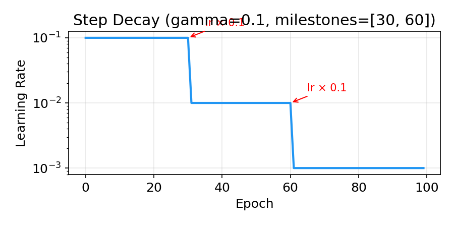
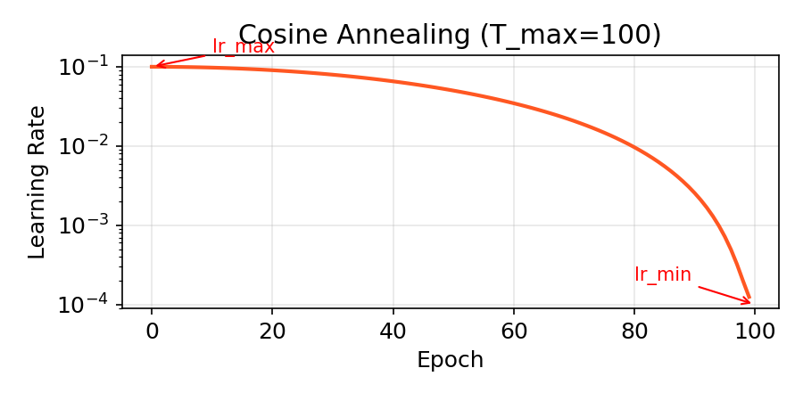

# Deep Learning Fundamentals — Week 1

PyTorch · Gradient Descent · Multilayer Perceptron · Optimization

---

## Overview

Week 1 is the **foundation** of deep learning — from tensor operations to gradient descent, from linear models to multilayer perceptrons, and finally to optimization algorithms:

| Day      | Topic              | Core Skills                                                                   |
| -------- | ------------------ | ----------------------------------------------------------------------------- |
| **W1D1** | PyTorch Basics     | Tensor creation and operations, GPU acceleration, data loading, building a first neural network |
| **W1D2** | Linear Deep Learning | Gradient descent, computation graphs, backpropagation, PyTorch Autograd, nn.Module training loop |
| **W1D3** | Multilayer Perceptron (MLP) | Universal approximation theorem, ReLU basis functions, MLP architecture, cross-entropy loss, spiral dataset classification |
| **W1D4** | Optimization       | SGD, momentum, RMSprop, ill-conditioning, non-convexity, over-parameterization, mini-batch training |

**Recurring theme**: Deep learning = parametric function family + loss function + gradient-based optimization.

---

## W1D1: PyTorch Basics

---

### 1. Tensors: The Fundamental Data Structure of Deep Learning

A **Tensor** is a GPU-accelerated version of NumPy `ndarray` that also supports automatic differentiation.

```python
import torch
import numpy as np

# Create from Python list
a = torch.tensor([1, 2, 3])
print(a)
# tensor([1, 2, 3])
print(a.shape)
# torch.Size([3])
print(a.dtype)
# torch.int64

# Create from NumPy array
b = torch.tensor(np.ones([2, 3]))
print(b)
# tensor([[1., 1., 1.],
#         [1., 1., 1.]], dtype=torch.float64)

# Specify dtype
c = torch.tensor([1, 2, 3], dtype=torch.float32)
print(c.dtype)
# torch.float32
```

#### Common Constructors

```python
torch.zeros(3, 4)
# tensor([[0., 0., 0., 0.],
#         [0., 0., 0., 0.],
#         [0., 0., 0., 0.]])
# shape: torch.Size([3, 4])

torch.ones(2, 3)
# tensor([[1., 1., 1.],
#         [1., 1., 1.]])
# shape: torch.Size([2, 3])

torch.arange(0, 10, 2)
# tensor([0, 2, 4, 6, 8])

torch.linspace(0, 1, 5)
# tensor([0.0000, 0.2500, 0.5000, 0.7500, 1.0000])
```

#### Random Tensors

```python
torch.rand(2, 3)    # Uniform distribution U(0,1)
# tensor([[0.4963, 0.7682, 0.0885],
#         [0.1320, 0.3074, 0.6341]])

torch.randn(2, 3)   # Standard normal N(0,1)
# tensor([[ 0.3452, -0.2197,  0.5612],
#         [-0.1345,  0.7892, -0.4567]])

torch.randint(0, 10, (2, 3))  # Integer uniform distribution
# tensor([[3, 7, 1],
#         [9, 4, 6]])
```

#### Reproducibility

```python
torch.manual_seed(42)
x = torch.rand(3)
print(x)
# tensor([0.8823, 0.9150, 0.3829])  — same on every run
```

---

### 2. Basic Tensor Operations

#### 2.1 Indexing and Slicing

```python
x = torch.arange(12).reshape(3, 4)
print(x)
# tensor([[ 0,  1,  2,  3],
#         [ 4,  5,  6,  7],
#         [ 8,  9, 10, 11]])
# shape: torch.Size([3, 4])

print(x[0, :])      # Row 0
# tensor([0, 1, 2, 3])
# shape: torch.Size([4])

print(x[:, 1])      # Column 1
# tensor([1, 5, 9])
# shape: torch.Size([3])

print(x[1:3, 0:2])  # Submatrix
# tensor([[4, 5],
#         [8, 9]])
# shape: torch.Size([2, 2])

print(x[-1])         # Last row
# tensor([ 8,  9, 10, 11])
# shape: torch.Size([4])
```

#### 2.2 Reshaping

```python
x = torch.arange(12)
print(x.shape)
# torch.Size([12])

# reshape: change shape
y = x.reshape(3, 4)
print(y.shape)
# torch.Size([3, 4])

# view: same as reshape, but requires contiguous memory
z = x.view(3, 4)
print(z.shape)
# torch.Size([3, 4])

# flatten: flatten to 1D
w = y.flatten()
print(w.shape)
# torch.Size([12])

# unsqueeze: add a dimension
print(x.unsqueeze(0).shape)   # Add at dimension 0
# torch.Size([1, 12])
print(x.unsqueeze(-1).shape)  # Add at the end
# torch.Size([12, 1])

# squeeze: remove dimensions of size 1
t = torch.randn(1, 3, 1, 5)
print(t.squeeze().shape)
# torch.Size([3, 5])
```

**`view` vs `reshape`**: `view` requires the tensor to be contiguous in memory, otherwise it raises an error; `reshape` will automatically copy data when needed. In practice, prefer `reshape` unless you explicitly need shared memory.

#### 2.3 Slicing with `:` — `a[0,:]` vs `a[0]`

In PyTorch (and NumPy), `a[0]` and `a[0,:]` produce the same **values**, but differ subtly in **dimension handling**:

```python
a = torch.arange(12).reshape(3, 4)
print(a)
# tensor([[ 0,  1,  2,  3],
#         [ 4,  5,  6,  7],
#         [ 8,  9, 10, 11]])
# shape: torch.Size([3, 4])

# a[0] — integer indexing, removes the dimension
print(a[0])
# tensor([0, 1, 2, 3])
print(a[0].shape)
# torch.Size([4])  — went from 2D to 1D

# a[0,:] — slice indexing, preserves the dimension
print(a[0, :])
# tensor([0, 1, 2, 3])
print(a[0, :].shape)
# torch.Size([4])  — also 1D
```

**Looks the same? Here's the key difference with higher dimensions:**

```python
# More obvious with 3D tensors
b = torch.arange(24).reshape(2, 3, 4)
print(b.shape)
# torch.Size([2, 3, 4])

# b[0] — integer indexing, dim 0 is "squeezed out"
print(b[0].shape)
# torch.Size([3, 4])  — dimension reduced!

# b[0, :, :] — slice indexing, preserves all dimensions
print(b[0, :, :].shape)
# torch.Size([3, 4])  — same values

# Key: b[0, None, :, :] inserts a new axis at dim 1
print(b[0, None, :, :].shape)
# torch.Size([1, 3, 4])
```

**Rules for integer vs slice indexing:**

```python
# Integer index → dimension is removed (reduced)
a = torch.arange(24).reshape(2, 3, 4)
print(a[0].shape)          # (3, 4)   — dim 0 gone
print(a[0, 1].shape)       # (4,)     — dim 0,1 gone
print(a[0, 1, 2].shape)    # ()       — scalar

# Slice index → dimension is preserved (not reduced)
print(a[0:1].shape)        # (1, 3, 4) — dim 0 preserved, size 1
print(a[0:1, :].shape)     # (1, 3, 4)
print(a[None].shape)       # (1, 2, 3, 4) — adds a new dimension
```

**Practical implications:**

```python
# Scenario: you want to process one sample from a batch
a = torch.randn(32, 3, 64, 64)  # (batch, channel, H, W)

# Using a[0] — dimension changes, may break downstream ops
sample = a[0]
print(sample.shape)  # (3, 64, 64) — no batch dim!

# Using a[0:1] — preserves batch dimension
sample = a[0:1]
print(sample.shape)  # (1, 3, 64, 64) — batch dim kept, can pass to model

# Or use unsqueeze
sample = a[0].unsqueeze(0)
print(sample.shape)  # (1, 3, 64, 64)
```

---

#### 2.4 Broadcasting

Broadcasting is PyTorch's (and NumPy's) mechanism for performing operations between tensors of different shapes — **without explicitly copying data**.

**Broadcasting rules** (aligned from the right):

1. If tensors have different numbers of dimensions, pad 1s on the **left**
2. For each dimension, sizes must be equal or one of them must be 1
3. Size-1 dimensions are "stretched" to match the other

```python
# Example 1: scalar with tensor
a = torch.tensor([1.0, 2.0, 3.0])
print(a.shape)
# torch.Size([3])

b = 2.0  # scalar
c = a + b
print(c)
# tensor([3., 4., 5.])
# scalar 2.0 broadcast to (3,)
```

```python
# Example 2: 2D + 1D
A = torch.randn(3, 4)       # (3, 4)
b = torch.randn(4)           # (4,)
print((A + b).shape)
# torch.Size([3, 4])
# b: (4,) → (1,4) → (3,4) broadcast

# Verify
A = torch.ones(3, 4)
b = torch.tensor([10, 20, 30, 40.0])
print(A + b)
# tensor([[11., 21., 31., 41.],
#         [11., 21., 31., 41.],
#         [11., 21., 31., 41.]])
```

```python
# Example 3: two different shapes
A = torch.randn(3, 1)       # (3, 1)
B = torch.randn(1, 4)       # (1, 4)
print((A + B).shape)
# torch.Size([3, 4])
# A: (3,1) → (3,4), B: (1,4) → (3,4)

# Verify
A = torch.tensor([[1], [2], [3.0]])
B = torch.tensor([[10, 20, 30, 40.0]])
print(A + B)
# tensor([[11., 21., 31., 41.],
#         [12., 22., 32., 42.],
#         [13., 23., 33., 43.]])
```

```python
# Example 4: broadcast failure
A = torch.randn(3, 4)
B = torch.randn(3, 5)
try:
    C = A + B
except RuntimeError as e:
    print(f"Error: {e}")
# Error: The size of tensor a (4) must match the size of tensor b (5)
# dim 1: 4 vs 5 — neither is 1, cannot broadcast
```

**Broadcast visualization:**

```python
# (3, 1) + (1, 4) → (3, 4)
#
# A:           B:
# [[1],       [[10, 20, 30, 40],
#  [2],        → broadcast to
#  [3]]        [[10, 20, 30, 40],
#               [10, 20, 30, 40],
#               [10, 20, 30, 40]]
#
# Result:
# [[11, 21, 31, 41],
#  [12, 22, 32, 42],
#  [13, 23, 33, 43]]
```

---

#### 2.5 Reduce Operations: `sum` as an Example

Reduce operations **reduce the number of dimensions** (unless `keepdim=True`).

```python
x = torch.arange(12).reshape(3, 4)
print(x)
# tensor([[ 0,  1,  2,  3],
#         [ 4,  5,  6,  7],
#         [ 8,  9, 10, 11]])
# shape: torch.Size([3, 4])
```

**Full reduce: all dimensions collapsed**

```python
s = x.sum()
print(s)
# tensor(66)
print(s.shape)
# torch.Size([])  — scalar
```

**Single-dimension reduce: specified dimension collapsed**

```python
# Along dim=0 (row direction) → compress dim 0
s0 = x.sum(dim=0)
print(s0)
# tensor([12, 15, 18, 21])
print(s0.shape)
# torch.Size([4])  — (3,4) → (4,)

# Along dim=1 (column direction) → compress dim 1
s1 = x.sum(dim=1)
print(s1)
# tensor([ 6, 22, 38])
print(s1.shape)
# torch.Size([3])  — (3,4) → (3,)
```

**`keepdim=True`: preserve the reduced dimension (size becomes 1)**

```python
s0_keep = x.sum(dim=0, keepdim=True)
print(s0_keep)
# tensor([[12, 15, 18, 21]])
print(s0_keep.shape)
# torch.Size([1, 4])  — dim 0 preserved, size 1

s1_keep = x.sum(dim=1, keepdim=True)
print(s1_keep)
# tensor([[ 6],
#         [22],
#         [38]])
print(s1_keep.shape)
# torch.Size([3, 1])  — dim 1 preserved, size 1
```

**Why `keepdim` matters — broadcast compatibility:**

```python
x = torch.arange(12).reshape(3, 4)

# Want to center each column (subtract column mean)
col_mean = x.float().mean(dim=0)
print(col_mean.shape)
# torch.Size([4])  — 1D

# x - col_mean broadcasts here: (3,4) - (4,) → (3,4)
# Works fine, but in higher dimensions it can cause issues

# Safer approach: use keepdim
col_mean = x.float().mean(dim=0, keepdim=True)
print(col_mean.shape)
# torch.Size([1, 4])  — 2D, broadcasts correctly

centered = x.float() - col_mean
print(centered)
# tensor([[-4., -4., -4., -4.],
#         [ 0.,  0.,  0.,  0.],
#         [ 4.,  4.,  4.,  4.]])
```

**Higher-dimensional reduce:**

```python
x = torch.randn(2, 3, 4, 5)
print(x.shape)
# torch.Size([2, 3, 4, 5])

# Along dim=2
print(x.sum(dim=2).shape)
# torch.Size([2, 3, 5])  — dim 2 collapsed

# Along multiple dimensions
print(x.sum(dim=(0, 2)).shape)
# torch.Size([3, 5])  — dim 0 and 2 collapsed

# keepdim
print(x.sum(dim=2, keepdim=True).shape)
# torch.Size([2, 3, 1, 5])  — dim 2 preserved, size 1
```

**Other reduce operations follow the same rules:**

```python
x = torch.randn(3, 4)

x.mean(dim=0).shape          # torch.Size([4])
x.max(dim=1).values.shape    # torch.Size([3])  — max returns namedtuple
x.min(dim=0).values.shape    # torch.Size([4])
x.prod(dim=1).shape          # torch.Size([3])
x.std(dim=0).shape           # torch.Size([4])
```

---

### 3. Tensor Memory Layout: Layout, Stride, and Shape

Understanding tensor memory layout is key to using PyTorch efficiently.

#### 3.1 Shape, Stride, and Storage

```python
x = torch.arange(12).reshape(3, 4)
print(x)
# tensor([[ 0,  1,  2,  3],
#         [ 4,  5,  6,  7],
#         [ 8,  9, 10, 11]])

print(x.shape)    # Logical shape
# torch.Size([3, 4])

print(x.stride())  # Stride: number of memory positions to skip when moving one element along each dimension
# (4, 1)
# Meaning: moving 1 step along dim 0 = skip 4 memory positions
#          moving 1 step along dim 1 = skip 1 memory position

print(x.storage())  # Underlying 1D storage
#  0, 1, 2, 3, 4, 5, 6, 7, 8, 9, 10, 11
# Logically 3x4, physically 12 contiguous elements
```

**Key formula**: position of element `(i, j)` in storage = `i * stride[0] + j * stride[1]`

```python
# Verification
x = torch.arange(12).reshape(3, 4)
for i in range(3):
    for j in range(4):
        offset = i * x.stride()[0] + j * x.stride()[1]
        print(f"x[{i},{j}] = {x[i,j].item()}, storage offset = {offset}")
# x[0,0] = 0, storage offset = 0
# x[0,1] = 1, storage offset = 1
# x[0,2] = 2, storage offset = 2
# x[0,3] = 3, storage offset = 3
# x[1,0] = 4, storage offset = 4
# ...
```

#### 3.2 Transpose Does Not Copy Data, It Only Changes Stride

```python
x = torch.arange(12).reshape(3, 4)
print(x.shape, x.stride())
# torch.Size([3, 4])  (4, 1)

y = x.T  # Transpose
print(y.shape, y.stride())
# torch.Size([4, 3])  (1, 4)

# Note: stride changed! (4,1) -> (1,4)
# Underlying storage is identical, no data copy
print(y.storage().data_ptr() == x.storage().data_ptr())
# True — sharing the same memory block
```

**Non-contiguous tensors**: a transposed tensor is not contiguous

```python
y = x.T
print(y.is_contiguous())
# False  — stride (1,4) does not match row-major contiguous layout

# view requires contiguous, will raise an error
# y.view(12)  -> RuntimeError!

# Solution
z = y.contiguous()  # Force copy to contiguous memory
print(z.is_contiguous())
# True
print(z.stride())
# (3, 1)  — new stride
```

#### 3.3 Stride Changes with permute

```python
x = torch.arange(24).reshape(2, 3, 4)
print(x.shape, x.stride())
# torch.Size([2, 3, 4])  (12, 4, 1)

y = x.permute(2, 0, 1)  # Reorder original dimensions 2,0,1 to new dimensions 0,1,2
print(y.shape, y.stride())
# torch.Size([4, 2, 3])  (1, 12, 4)
# stride is also reordered accordingly!

print(y.is_contiguous())
# False
```

#### 3.4 `permute` vs `transpose` In Depth

**`transpose` can only swap two dimensions; `permute` can arbitrarily reorder all dimensions.**

```python
x = torch.arange(24).reshape(2, 3, 4)
print(x.shape)
# torch.Size([2, 3, 4])
```

**transpose: swap two specified dimensions**

```python
# Swap dim 0 and dim 2
y = x.transpose(0, 2)
print(y.shape)
# torch.Size([4, 3, 2])

# Equivalent to permute(2, 1, 0)
y2 = x.permute(2, 1, 0)
print(y2.shape)
# torch.Size([4, 3, 2])

print(torch.equal(y, y2))
# True
```

**transpose limitation: can only swap two dimensions at a time**

```python
# Want (2,3,4) → (4,2,3)? transpose can't do it in one step
# Need two transpose calls:
y = x.transpose(0, 2).transpose(1, 2)  # (2,3,4) → (4,3,2) → (4,2,3)
print(y.shape)
# torch.Size([4, 2, 3])

# permute does it in one step
y2 = x.permute(2, 0, 1)
print(y2.shape)
# torch.Size([4, 2, 3])

print(torch.equal(y, y2))
# True
```

**`x.T` is just shorthand for `transpose(0, 1)` (2D) or full reversal (higher-D)**

```python
x = torch.arange(6).reshape(2, 3)
print(x.T.shape)
# torch.Size([3, 2])

print(torch.equal(x.T, x.transpose(0, 1)))
# True

# For higher-dimensional tensors, .T reverses all dimensions (like NumPy)
x = torch.arange(24).reshape(2, 3, 4)
print(x.T.shape)
# torch.Size([4, 3, 2])  — full reversal

print(torch.equal(x.T, x.permute(2, 1, 0)))
# True
```

**Deep dive into stride: why is a transposed tensor non-contiguous?**

```python
x = torch.arange(12).reshape(3, 4)
print(f"x: shape={x.shape}, stride={x.stride()}")
# x: shape=torch.Size([3, 4]), stride=(4, 1)
# Meaning: dim0 stride=4, dim1 stride=1
# Memory layout: [0, 1, 2, 3, 4, 5, 6, 7, 8, 9, 10, 11]

y = x.transpose(0, 1)
print(f"y: shape={y.shape}, stride={y.stride()}")
# y: shape=torch.Size([4, 3]), stride=(1, 4)
# Meaning: dim0 stride=1, dim1 stride=4

# Verify: where does y[i,j] live in memory?
# y[0,0] → offset = 0*1 + 0*4 = 0 → value 0 ✓
# y[0,1] → offset = 0*1 + 1*4 = 4 → value 4 ✓
# y[1,0] → offset = 1*1 + 0*4 = 1 → value 1 ✓
# y[1,1] → offset = 1*1 + 1*4 = 5 → value 5 ✓

# Problem: row-major traversal of y has non-contiguous memory
# y[0,:] = [y[0,0], y[0,1], y[0,2]] → memory [0, 4, 8] — not contiguous!
# That's why is_contiguous() returns False
```

**Contiguity in practice: when does it matter?**

```python
x = torch.arange(12).reshape(3, 4)
y = x.transpose(0, 1)

# view requires contiguous → error
try:
    y.view(12)
except RuntimeError as e:
    print(f"Error: {e}")
# Error: view size is not compatible with input tensor's size and stride...

# Solution 1: contiguous() — forces a copy
z = y.contiguous()
print(z.stride())
# (3, 1)  — now contiguous
z.view(12)  # OK

# Solution 2: reshape() — handles it automatically
w = y.reshape(12)  # calls contiguous() internally if needed
print(w)
# tensor([0, 4, 8, 1, 5, 9, 2, 6, 10, 3, 7, 11])
```

**Summary**:

| Operation    | Copies Data? | Changes Shape? | Changes Stride? | Contiguous? |
| ------------ | ------------ | -------------- | --------------- | ----------- |
| `reshape`    | As needed    | Yes            | Yes             | Yes         |
| `view`       | No copy      | Yes            | Yes             | Requires already Yes |
| `transpose`  | No copy      | Yes            | Yes             | Becomes No  |
| `permute`    | No copy      | Yes            | Yes             | Becomes No  |
| `contiguous` | Copies       | Unchanged      | Yes             | Yes         |

---

### 4. Einstein Summation Convention (Einsum) and einops

#### 4.1 `torch.einsum` — A Unified Language for Tensor Operations

The core rules of Einstein summation convention:
- **Repeated index = summation**
- **Free index = output dimension**

```python
a = torch.tensor([1., 2., 3.])       # shape: (3,)
b = torch.tensor([4., 5., 6.])       # shape: (3,)
A = torch.randn(3, 4)                # shape: (3, 4)
B = torch.randn(4, 5)                # shape: (4, 5)
```

**Vector dot product**: $c = \sum_i a_i b_i$

```python
c = torch.einsum('i,i->', a, b)
print(c)
# tensor(32.)
print(c.shape)
# torch.Size([])
```

**Matrix-vector multiplication**: $y_i = \sum_j A_{ij} x_j$

```python
x = torch.randn(4)
y = torch.einsum('ij,j->i', A, x)
print(y.shape)
# torch.Size([3])
```

**Matrix multiplication**: $C_{ij} = \sum_k A_{ik} B_{kj}$

```python
C = torch.einsum('ik,kj->ij', A, B)
print(C.shape)
# torch.Size([3, 5])
# Equivalent to A @ B
```

**Batched matrix multiplication**: $C_{bij} = \sum_k A_{bik} B_{bkj}$

```python
A_batch = torch.randn(8, 3, 4)  # batch=8
B_batch = torch.randn(8, 4, 5)
C_batch = torch.einsum('bik,bkj->bij', A_batch, B_batch)
print(C_batch.shape)
# torch.Size([8, 3, 5])
```

**Transpose**:

```python
torch.einsum('ij->ji', A).shape
# torch.Size([4, 3])
```

**Diagonal extraction**:

```python
M = torch.randn(4, 4)
d = torch.einsum('ii->i', M)
print(d.shape)
# torch.Size([4])
```

**Trace**:

```python
tr = torch.einsum('ii->', M)
print(tr.shape)
# torch.Size([])
```

**Outer product**:

```python
outer = torch.einsum('i,j->ij', a, b)
print(outer.shape)
# torch.Size([3, 3])
print(outer)
# tensor([[ 4.,  5.,  6.],
#         [ 8., 10., 12.],
#         [12., 15., 18.]])
```

**Scaled dot-product in multi-head attention**:

```python
Q = torch.randn(8, 6, 10, 64)  # (batch, heads, seq_len, d_k)
K = torch.randn(8, 6, 10, 64)
scores = torch.einsum('bhik,bhkj->bhij', Q, K.transpose(-2, -1))
# Equivalent to Q @ K.transpose(-2, -1)
print(scores.shape)
# torch.Size([8, 6, 10, 10])
```

#### 4.2 `einops` Library — More Readable Tensor Operations

```python
from einops import rearrange, reduce, repeat

x = torch.randn(2, 3, 4, 5)
print(x.shape)
# torch.Size([2, 3, 4, 5])
```

**rearrange: reorder dimensions**

```python
# Transpose the last two dimensions
y = rearrange(x, 'b c h w -> b c w h')
print(y.shape)
# torch.Size([2, 3, 5, 4])

# Merge dimensions
y = rearrange(x, 'b c h w -> (b c) h w')
print(y.shape)
# torch.Size([6, 4, 5])

# Split dimensions
y = rearrange(x, 'b (c1 c2) h w -> b c1 c2 h w', c1=3)
print(y.shape)
# torch.Size([2, 3, 1, 4, 5])  — c2 = 3/3 = 1... actually requires c1*c2=c

# Classic operation in multi-head attention
q = torch.randn(8, 10, 192)  # (batch, seq, heads*d_k)
q_heads = rearrange(q, 'b t (h k) -> b h t k', h=6)
print(q_heads.shape)
# torch.Size([8, 6, 10, 32])  — 192 = 6 * 32
```

**reduce: aggregation**

```python
x = torch.randn(2, 3, 4, 5)

reduce(x, 'b c h w -> b c', 'mean').shape
# torch.Size([2, 3])  — mean over h, w

reduce(x, 'b c h w -> b', 'max').shape
# torch.Size([2])  — max over c, h, w

reduce(x, 'b c h w -> ()', 'sum').shape
# torch.Size([])  — sum over all
```

**repeat: replication**

```python
x = torch.randn(1, 3, 4)

repeat(x, '1 c h -> b c h', b=4).shape
# torch.Size([4, 3, 4])  — replicate batch dim

repeat(x, '1 c h -> 1 c h w', w=5).shape
# torch.Size([1, 3, 4, 5])  — repeat along a new dimension
```

---

### 5. Dimension Matching Rules for Matrix Multiplication

#### 5.1 Basic Rules

`torch.matmul` (or `@`) dimension matching:

```
Last dimension of A == Second-to-last dimension of B

(3, 4) @ (4, 5) -> (3, 5)
```

```python
A = torch.randn(3, 4)
B = torch.randn(4, 5)
C = A @ B
print(C.shape)
# torch.Size([3, 5])
```

#### 5.2 Batched MatMul

When both tensors have additional leading dimensions, PyTorch will **automatically broadcast**:

```python
# Case 1: Two 3D tensors
A = torch.randn(8, 3, 4)   # batch=8, matrix 3×4
B = torch.randn(8, 4, 5)   # batch=8, matrix 4×5
C = A @ B
print(C.shape)
# torch.Size([8, 3, 5])  — per-batch matrix multiplication
```

**`A @ B` is equivalent to a per-batch loop**:

```python
A = torch.randn(8, 3, 4)
B = torch.randn(8, 4, 5)

# Method 1: Direct @ (vectorized, fast)
C_vec = A @ B

# Method 2: Loop (equivalent, but slow)
C_loop = torch.empty(8, 3, 5)
for i in range(8):
    C_loop[i] = A[i] @ B[i]  # each batch independently: 3×4 @ 4×5 → 3×5

print(torch.allclose(C_vec, C_loop))
# True  — results are identical

# Verify shapes
print(C_vec.shape)     # torch.Size([8, 3, 5])
print(C_loop.shape)    # torch.Size([8, 3, 5])
print(C_vec[0].shape)  # torch.Size([3, 5])  — single batch result
```

**Why vectorization is faster**: The loop version iterates 8 times at the Python level, calling matrix multiplication once per iteration; the vectorized version completes all 8 matrix multiplications in one go underneath (GPU parallelism).

```python
# Case 2: One 3D, one 2D — broadcast!
A = torch.randn(8, 3, 4)   # batch=8
B = torch.randn(4, 5)      # no batch
C = A @ B
print(C.shape)
# torch.Size([8, 3, 5])  — B is broadcast to each batch

# Equivalent to
C_loop = torch.empty(8, 3, 5)
for i in range(8):
    C_loop[i] = A[i] @ B   # B is the same in each batch
print(torch.allclose(C, C_loop))
# True
```

```python
# Case 3: Two 4D tensors
Q = torch.randn(8, 6, 10, 64)  # (batch, heads, seq, d_k)
K = torch.randn(8, 6, 10, 64)
scores = Q @ K.transpose(-2, -1)
print(scores.shape)
# torch.Size([8, 6, 10, 10])  — matrix multiplication on the last two dims

# Equivalent to a double loop
scores_loop = torch.empty(8, 6, 10, 10)
for b in range(8):
    for h in range(6):
        scores_loop[b, h] = Q[b, h] @ K[b, h].T
print(torch.allclose(scores, scores_loop))
# True
```

#### 5.3 `torch.bmm` — Strict Batched Matrix Multiplication

```python
# bmm requires strict 3D: (batch, n, m) @ (batch, m, p) -> (batch, n, p)
A = torch.randn(32, 10, 64)
B = torch.randn(32, 64, 20)
C = torch.bmm(A, B)
print(C.shape)
# torch.Size([32, 10, 20])
```

**Recommendation**: The `@` operator supports broadcasting and is more flexible; `bmm` is stricter and sometimes clearer.

---

### 6. GPU and Device Management

```python
device = 'cuda' if torch.cuda.is_available() else 'cpu'
print(device)
# 'cuda' or 'cpu'

# Specify device at creation
x = torch.randn(3, 4, device=device)
print(x.device)
# cuda:0  or  cpu

# Move to GPU
x = x.to('cuda')

# Move back to CPU
x = x.to('cpu')

# Tensors on different devices cannot be operated on
a = torch.randn(3, device='cuda')
b = torch.randn(3, device='cpu')
# a + b -> RuntimeError!
```

**Device-agnostic code pattern**:

```python
DEVICE = 'cuda' if torch.cuda.is_available() else 'cpu'
model = MyModel().to(DEVICE)
data = data.to(DEVICE)
```

---

### 7. Datasets and DataLoader

```python
from torchvision import datasets, transforms
from torch.utils.data import DataLoader

transform = transforms.Compose([
    transforms.ToTensor(),
    transforms.Normalize((0.5, 0.5, 0.5), (0.5, 0.5, 0.5))
])

train_set = datasets.CIFAR10(root='./data', train=True,
                             download=True, transform=transform)
print(len(train_set))
# 50000

train_loader = DataLoader(train_set, batch_size=64, shuffle=True)

for images, labels in train_loader:
    print(images.shape)  # torch.Size([64, 3, 32, 32])
    print(labels.shape)  # torch.Size([64])
    break
```

---

### 8. PyTorch API Design: From Tensors to Modules

#### 8.1 `torch.tensor` vs `torch.Tensor`

```python
# torch.tensor: infers dtype, recommended
a = torch.tensor([1, 2, 3])        # int64
b = torch.tensor([1.0, 2.0, 3.0])  # float32

# torch.Tensor: always float32
c = torch.Tensor([1, 2, 3])        # float32!
print(c.dtype)
# torch.float32
```

#### 8.2 `nn.Parameter`

`nn.Parameter` is a special Tensor that is automatically registered as a model parameter:

```python
import torch.nn as nn

# Regular tensor — not tracked by optimizer
w = torch.randn(3, 4)

# Parameter — automatically registered
w = nn.Parameter(torch.randn(3, 4))
print(w.requires_grad)  # True (default)
print(type(w))          # <class 'torch.nn.parameter.Parameter'>
```

**Usage in Modules**:

```python
class MyModule(nn.Module):
    def __init__(self):
        super().__init__()
        # Both are equivalent and registered as model parameters
        self.weight = nn.Parameter(torch.randn(3, 4))  # Manual
        self.linear = nn.Linear(4, 5)                   # Automatic (internally creates Parameters)

model = MyModule()
for name, param in model.named_parameters():
    print(name, param.shape)
# weight torch.Size([3, 4])
# linear.weight torch.Size([5, 4])
# linear.bias torch.Size([5])
```

#### 8.3 `nn.Linear`

```python
linear = nn.Linear(in_features=4, out_features=3, bias=True)
print(linear.weight.shape)  # torch.Size([3, 4])  — note the transposition!
print(linear.bias.shape)    # torch.Size([3])

x = torch.randn(2, 4)
y = linear(x)
print(y.shape)
# torch.Size([2, 3])

# Equivalent to: y = x @ linear.weight.T + linear.bias
```

#### 8.4 `nn.Module` — Base Class for All Neural Networks

```python
class MyNet(nn.Module):
    def __init__(self, input_dim, hidden_dim, output_dim):
        super().__init__()  # Must call parent constructor
        self.fc1 = nn.Linear(input_dim, hidden_dim)
        self.fc2 = nn.Linear(hidden_dim, output_dim)

    def forward(self, x):
        x = torch.relu(self.fc1(x))  # Forward pass
        x = self.fc2(x)
        return x

model = MyNet(784, 128, 10)
print(model)
# MyNet(
#   (fc1): Linear(in_features=784, out_features=128, bias=True)
#   (fc2): Linear(in_features=128, out_features=10, bias=True)
# )

# Automatically get all parameters
print(sum(p.numel() for p in model.parameters()))
# 100480 + 1290 = 101770
```

#### 8.5 `nn.Sequential` — Sequential Container

```python
model = nn.Sequential(
    nn.Linear(784, 128),
    nn.ReLU(),
    nn.Linear(128, 10)
)
print(model)
# Sequential(
#   (0): Linear(in_features=784, out_features=128, bias=True)
#   (1): ReLU()
#   (2): Linear(in_features=128, out_features=10, bias=True)
# )

x = torch.randn(32, 784)
y = model(x)
print(y.shape)
# torch.Size([32, 10])
```

#### 8.6 `nn.ReLU()` vs `F.relu()` — Two Different Approaches

```python
import torch.nn as nn
import torch.nn.functional as F

x = torch.randn(2, 3) - 0.5  # Contains both positive and negative values
print(x)
# tensor([[-0.2345,  0.5678, -0.1234],
#         [ 0.8765, -0.4567,  0.2345]])
```

**`nn.ReLU()`: A stateful module**

```python
relu_module = nn.ReLU()
y = relu_module(x)
print(y)
# tensor([[0.0000, 0.5678, 0.0000],
#         [0.8765, 0.0000, 0.2345]])

# Characteristics:
# 1. Is an instance of nn.Module, can be placed in nn.Sequential
# 2. Can have extra parameters (e.g., inplace)
# 3. Behavior is consistent under model.train() / model.eval() (no difference for ReLU, but there is for Dropout/BN)
```

**`F.relu()`: A stateless function**

```python
y = F.relu(x)
print(y)
# tensor([[0.0000, 0.5678, 0.0000],
#         [0.8765, 0.0000, 0.2345]])

# Characteristics:
# 1. Is a pure function, not a Module
# 2. Cannot be placed in nn.Sequential
# 3. Has no learnable parameters
```

**When to use which**:

```python
# Defined in __init__ (as part of network architecture) -> use nn.ReLU()
class MyNet(nn.Module):
    def __init__(self):
        super().__init__()
        self.relu = nn.ReLU()  # Stateful

    def forward(self, x):
        return self.relu(x)

# Used temporarily in forward -> use F.relu()
class MyNet(nn.Module):
    def __init__(self):
        super().__init__()
        self.fc = nn.Linear(10, 20)

    def forward(self, x):
        return F.relu(self.fc(x))  # More concise
```

**Layers where it matters**:

```python
# Dropout: nn.Dropout vs F.dropout — behavior differs!
# nn.Dropout does not apply dropout in eval mode
# F.dropout always applies dropout (need to pass training argument manually)

# BatchNorm: nn.BatchNorm2d vs F.batch_norm
# nn.BatchNorm2d maintains running_mean and running_var
# F.batch_norm requires manually passing these statistics
```

---

### 9. Building a First Neural Network

```python
import torch.nn as nn
import torch.nn.functional as F

class SimpleNet(nn.Module):
    def __init__(self):
        super().__init__()
        self.fc1 = nn.Linear(784, 128)
        self.fc2 = nn.Linear(128, 10)

    def forward(self, x):
        x = x.view(x.size(0), -1)  # Flatten: (B, 1, 28, 28) -> (B, 784)
        x = F.relu(self.fc1(x))    # (B, 128)
        x = self.fc2(x)            # (B, 10)
        return F.log_softmax(x, dim=1)

model = SimpleNet().to(DEVICE)
x = torch.randn(32, 1, 28, 28, device=DEVICE)
out = model(x)
print(out.shape)
# torch.Size([32, 10])
```

---

## W1D2: Gradient Descent and Autograd

---

### 1. The Direction of the Gradient

For a function $f(\mathbf{x}): \mathbb{R}^d \to \mathbb{R}$, the gradient

$$
\nabla f(\mathbf{x}) = \left[\frac{\partial f}{\partial x_1}, \ldots, \frac{\partial f}{\partial x_d}\right]^\top
$$

always points in the direction of **steepest ascent**. Therefore $-\nabla f$ points in the direction of steepest descent.

---

### 2. Gradient Descent Algorithm

$$
\mathbf{w}^{(t+1)} = \mathbf{w}^{(t)} - \eta \, \nabla_{\mathbf{w}} \mathcal{L}\left(\mathbf{w}^{(t)}\right)
$$

```python
# Manual gradient descent
w = torch.tensor([2.0], requires_grad=True)
lr = 0.1

for step in range(20):
    loss = (w - 3) ** 2      # Goal: minimize (w-3)^2
    loss.backward()           # Compute gradient
    with torch.no_grad():
        w -= lr * w.grad      # Update parameter
    w.grad.zero_()            # Zero out gradient

print(w.item())
# approximately 3.0
```

---

### 3. PyTorch Autograd

```python
w = torch.tensor([2.0], requires_grad=True)
b = torch.tensor([1.0], requires_grad=True)

x = torch.tensor([3.0])
y_true = torch.tensor([10.0])

# Forward pass
y_pred = w * x + b
loss = (y_true - y_pred) ** 2
print(f"y_pred = {y_pred.item()}, loss = {loss.item()}")
# y_pred = 7.0, loss = 9.0

# Backward pass
loss.backward()

print(f"dL/dw = {w.grad.item()}")  # -2 * x * (y_true - y_pred) = -2*3*3 = -18
print(f"dL/db = {b.grad.item()}")  # -2 * (y_true - y_pred) = -6
```

**Important rules**:

```python
# 1. Gradients accumulate!
w = torch.tensor([1.0], requires_grad=True)
(w ** 2).backward()
(w ** 2).backward()
print(w.grad)  # tensor([4.]) — not 2!
# Solution: call optimizer.zero_grad() or w.grad.zero_() before each backward

# 2. requires_grad is "contagious"
x = torch.randn(3, requires_grad=True)
y = x * 2
z = y.sum()
print(y.requires_grad)  # True
print(z.requires_grad)  # True

# 3. .detach() cuts off the gradient flow
y_detached = y.detach()
print(y_detached.requires_grad)  # False

# 4. torch.no_grad() context
with torch.no_grad():
    y = x * 2  # No gradient tracking
print(y.requires_grad)  # False
```

---

### 4. nn.Module Training Loop

```python
model = SimpleNet().to(DEVICE)
optimizer = torch.optim.SGD(model.parameters(), lr=0.01)
loss_fn = nn.CrossEntropyLoss()

for epoch in range(num_epochs):
    for batch_x, batch_y in train_loader:
        batch_x, batch_y = batch_x.to(DEVICE), batch_y.to(DEVICE)

        optimizer.zero_grad()          # 1. Zero gradients
        output = model(batch_x)        # 2. Forward pass
        loss = loss_fn(output, batch_y) # 3. Compute loss
        loss.backward()                # 4. Backward pass
        optimizer.step()               # 5. Update parameters
```

---

## W1D3: Multilayer Perceptron (MLP)

---

### 1. Universal Approximation Theorem

**Theorem** (Cybenko 1989, Hornik 1991): A feedforward network with a **single hidden layer** and a sufficient number of neurons can approximate any continuous function to arbitrary accuracy.

$$
f(x) \approx \sum_{i=1}^{N} \alpha_i \, \text{ReLU}(x - b_i)
$$

---

### 2. Activation Functions

```python
x = torch.linspace(-3, 3, 7)
print(x)
# tensor([-3., -2., -1.,  0.,  1.,  2.,  3.])

print(torch.relu(x))
# tensor([0., 0., 0., 0., 1., 2., 3.])

print(torch.sigmoid(x))
# tensor([0.0474, 0.1192, 0.2689, 0.5000, 0.7311, 0.8808, 0.9526])

print(torch.tanh(x))
# tensor([-0.9951, -0.9640, -0.7616,  0.0000,  0.7616,  0.9640,  0.9951])
```

---

### 3. Cross-Entropy Loss

```python
logits = torch.randn(3, 5)   # 3 samples, 5 classes
labels = torch.tensor([0, 2, 4])

loss_fn = nn.CrossEntropyLoss()
loss = loss_fn(logits, labels)
print(f"Cross entropy loss = {loss.item():.4f}")
```

**Note**: `nn.CrossEntropyLoss` internally includes softmax, so the input should be **logits**.

---

## W1D4: Optimization

---

### 1. SGD vs Momentum vs Adam

```python
# SGD
optimizer = torch.optim.SGD(model.parameters(), lr=0.01)

# SGD + Momentum
optimizer = torch.optim.SGD(model.parameters(), lr=0.01, momentum=0.9)

# Adam
optimizer = torch.optim.Adam(model.parameters(), lr=1e-3)

# AdamW (decoupled weight decay)
optimizer = torch.optim.AdamW(model.parameters(), lr=1e-3, weight_decay=0.01)
```

---

### 2. Learning Rate Scheduling

```python
# Step decay
scheduler = torch.optim.lr_scheduler.StepLR(optimizer, step_size=30, gamma=0.1)

# Cosine annealing
scheduler = torch.optim.lr_scheduler.CosineAnnealingLR(optimizer, T_max=100)

# Call at the end of each epoch
for epoch in range(num_epochs):
    train(...)
    scheduler.step()
```

**Step Decay**: Multiplies the learning rate by `gamma` at specified milestones



**Cosine Annealing**: Smoothly decays the learning rate from `lr_max` to `lr_min` following a cosine curve



---

## Comprehensive Exercise: Multi-Head Scaled Dot-Product Attention

This is a comprehensive exercise covering tensor operations, matrix multiplication, dimension transformations, and more.

### Mathematical Formulation

$$
\text{Attention}(Q, K, V) = \text{softmax}\left(\frac{QK^\top}{\sqrt{d_k}}\right) V
$$

$$
\text{MultiHead}(Q, K, V) = \text{Concat}(\text{head}_1, \ldots, \text{head}_h) W^O
$$

where $\text{head}_i = \text{Attention}(QW_i^Q, KW_i^K, VW_i^V)$

### Weight Matrix Shapes in Detail

Let $d_{\text{model}} = 512$, $h = 8$ heads, then $d_k = d_v = d_{\text{model}} / h = 64$.

**Per-head projection matrices:**

$$
W_i^Q \in \mathbb{R}^{d_{\text{model}} \times d_k} = \mathbb{R}^{512 \times 64}
$$

$$
W_i^K \in \mathbb{R}^{d_{\text{model}} \times d_k} = \mathbb{R}^{512 \times 64}
$$

$$
W_i^V \in \mathbb{R}^{d_{\text{model}} \times d_v} = \mathbb{R}^{512 \times 64}
$$

**Merged output projection matrix:**

$$
W^O \in \mathbb{R}^{h \cdot d_v \times d_{\text{model}}} = \mathbb{R}^{512 \times 512}
$$

**Actual PyTorch implementation** (all heads merged into one matrix):

```python
d_model = 512
num_heads = 8
d_k = d_model // num_heads  # 64

# All heads merged: d_model → h * d_k = d_model
W_Q = nn.Linear(d_model, num_heads * d_k, bias=False)  # (512, 512)
W_K = nn.Linear(d_model, num_heads * d_k, bias=False)  # (512, 512)
W_V = nn.Linear(d_model, num_heads * d_k, bias=False)  # (512, 512)
W_O = nn.Linear(num_heads * d_k, d_model, bias=False)  # (512, 512)

print(f"W_Q weight shape: {W_Q.weight.shape}")  # torch.Size([512, 512])
print(f"W_K weight shape: {W_K.weight.shape}")  # torch.Size([512, 512])
print(f"W_V weight shape: {W_V.weight.shape}")  # torch.Size([512, 512])
print(f"W_O weight shape: {W_O.weight.shape}")  # torch.Size([512, 512])
```

**Complete shape transformation flow** (single example, batch dim omitted):

```
Input X: (T, d_model) = (T, 512)

① Linear projection (all heads merged)
   Q_proj = X @ W_Q^T:  (T, 512) @ (512, 512) → (T, 512)
   K_proj = X @ W_K^T:  (T, 512) @ (512, 512) → (T, 512)
   V_proj = X @ W_V^T:  (T, 512) @ (512, 512) → (T, 512)

② Split into multiple heads
   Q_heads: (T, 512) → (T, 8, 64) → permute → (8, T, 64)
   K_heads: (T, 512) → (T, 8, 64) → permute → (8, T, 64)
   V_heads: (T, 512) → (T, 8, 64) → permute → (8, T, 64)

③ Attention computation (each head independently)
   scores = Q_heads @ K_heads^T:
     (8, T, 64) @ (8, 64, T) → (8, T, T)
   weights = softmax(scores / √64):  (8, T, T)
   out = weights @ V_heads:
     (8, T, T) @ (8, T, 64) → (8, T, 64)

④ Merge heads
   out: (8, T, 64) → permute → (T, 8, 64) → reshape → (T, 512)

⑤ Output projection
   output = out @ W_O^T:  (T, 512) @ (512, 512) → (T, 512)
```

### Step-by-Step Implementation Framework

**Step 1**: Linear projection + split heads

```python
# Input: Q, K, V all of shape (B, T, d_model)
Q_proj = W_Q(Q)  # (B, T, h*d_k)
K_proj = W_K(K)  # (B, T, h*d_k)
V_proj = W_V(V)  # (B, T, h*d_k)

Q_heads = rearrange(Q_proj, 'b t (h k) -> b h t k', h=num_heads)
# (B, T, h*d_k) -> (B, h, T, d_k)
K_heads = rearrange(K_proj, 'b t (h k) -> b h t k', h=num_heads)
V_heads = rearrange(V_proj, 'b t (h k) -> b h t k', h=num_heads)
```

**Step 2**: Compute attention scores

```python
scores = Q_heads @ K_heads.transpose(-2, -1)  # (B, h, T, T)
scores = scores / math.sqrt(d_k)
```

**Step 3**: Causal mask

```python
mask = torch.triu(torch.ones(T, T), diagonal=1).bool()
scores = scores.masked_fill(mask, float('-inf'))
```

**Step 4**: Softmax + weighted sum

```python
weights = F.softmax(scores, dim=-1)  # (B, h, T, T)
out = weights @ V_heads              # (B, h, T, d_k)
```

**Step 5**: Merge heads + output projection

```python
out = rearrange(out, 'b h t k -> b t (h k)')  # (B, T, h*d_k)
out = W_O(out)                                 # (B, T, d_model)
```

---

## References

- [PyTorch Official Tutorials](https://pytorch.org/tutorials/)
- [Deep Learning Book (Goodfellow et al.)](https://www.deeplearningbook.org/)
- [einops Documentation](https://einops.rocks/)
- [The Illustrated Transformer](https://jalammar.github.io/illustrated-transformer/)
