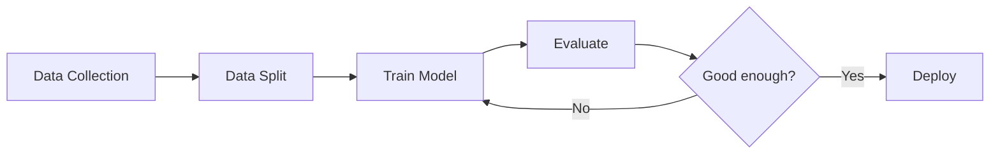

# 第 1 讲：机器学习基础（Machine Learning Fundamentals）

什么是机器学习？ · 学习范式 · 工作流程与术语

---

## 回顾：第 0 讲

| 学科         | 在机器学习中的作用                                  |
| ------------ | --------------------------------------------------- |
| **微积分**   | 优化 — 梯度下降（Gradient Descent）更新参数         |
| **线性代数** | 表示 — 数据作为向量，计算作为矩阵                   |
| **概率论**   | 建模 — 分布、贝叶斯定理（Bayes' Theorem）、不确定性 |

**机器学习 = 表示（Representation）+ 建模（Modeling）+ 优化（Optimization）**

现在我们了解了这些**工具**。让我们来思考：**机器学习到底是什么？**

---

## 第一部分：什么是机器学习？

### 传统编程 vs 机器学习（Traditional Programming vs Machine Learning）

**传统编程（Traditional Programming）**

$$\text{Rules} + \text{Data} \xrightarrow{\text{program}} \text{Output}$$

人类编写明确的规则：

```python
if temperature > 30:
    return "hot"
elif temperature > 20:
    return "warm"
else:
    return "cold"
```

**机器学习（Machine Learning）**

$$\text{Data} + \text{Output} \xrightarrow{\text{learning}} \text{Rules (Model)}$$

机器从示例中发现规则：

| 温度 | 标签 |
| ---- | ---- |
| 35°C | hot  |
| 22°C | warm |
| 10°C | cold |

$\rightarrow$ 自动学习映射关系

---

### 形式化定义（Formal Definition）

机器学习是从数据中学习一个**函数** $f$：

$$f: \mathbf{x} \rightarrow y$$

其中：

- $\mathbf{x}$：输入（特征 / 观测值）（features / observations）
- $y$：输出（预测 / 标签 / 结构）（prediction / label / structure）
- $f$：**模型（Model）** — 来自假设空间 $\mathcal{H}$ 的假设函数（hypothesis function）

学习过程：

1. 选择一个假设空间（Hypothesis Space）$\mathcal{H}$（例如，线性函数、神经网络）
2. 定义一个**损失函数（Loss Function）** 来衡量 $f$ 的错误程度
3. 使用**优化算法（Optimization Algorithm）** 找到最优的 $f \in \mathcal{H}$

这与第 0 讲直接相关：$f$ 通过线性代数进行**表示**，通过概率论进行**建模**，通过微积分进行**优化**。

---

## 第二部分：三种学习范式（Three Learning Paradigms）

### 统一视角（The Unifying Perspective）

所有机器学习范式都共享一个目标：**学习底层数据分布（Data Distribution）**。

| 范式                           | 学习目标                                | 可用数据                 |
| ------------------------------ | --------------------------------------- | ------------------------ |
| **监督学习（Supervised）**     | $P(y \mid \mathbf{x})$ — 给定输入的标签 | $(\mathbf{x}, y)$ 数据对 |
| **无监督学习（Unsupervised）** | $P(\mathbf{x})$ — 输入的结构            | 仅 $\mathbf{x}$，无标签  |
| **强化学习（Reinforcement）**  | $\pi(a \mid s)$ — 给定状态的动作        | 来自环境的奖励信号       |

在这三种情况下，我们都在估计或利用**概率分布（Probability Distribution）** — 这是第 0 讲的核心主题。

---

### 监督学习（Supervised Learning）

---

### 监督学习（Supervised Learning）

给定带标签的数据 $\{(\mathbf{x}_i, y_i)\}_{i=1}^{N}$，学习映射 $f: \mathbf{x} \to y$。

**回归（Regression）**：$y \in \mathbb{R}$（连续值）

从特征预测房价：

| 面积（m²） | 房间数 | 价格（$\times 10^4$） |
| ---------- | ------ | --------------------- |
| 80         | 2      | 150                   |
| 120        | 3      | 230                   |
| ?          | ?      | **?**                 |

$$\hat{y} = f(\mathbf{x}) = \mathbf{w}^T\mathbf{x} + b$$

**分类（Classification）**：$y \in \{1, 2, \ldots, C\}$（离散值）

将邮件分类为垃圾邮件或非垃圾邮件：

| 特征                     | 标签       |
| ------------------------ | ---------- |
| 包含 "free"、"winner"    | 垃圾邮件   |
| 包含 "meeting"、"report" | 非垃圾邮件 |

$$P(y = c \mid \mathbf{x}) = \text{softmax}(\mathbf{w}_c^T\mathbf{x} + b_c)$$

---

### 监督学习：算法示例（Supervised Learning: Algorithm Examples）

| 算法                                | 类型     | 核心思想                                                                  |
| ----------------------------------- | -------- | ------------------------------------------------------------------------- |
| **线性回归（Linear Regression）**   | 回归     | 用直线/平面拟合数据：$\hat{y} = \mathbf{w}^T\mathbf{x} + b$               |
| **逻辑回归（Logistic Regression）** | 分类     | Sigmoid 将线性输出映射为概率：$P(y{=}1) = \sigma(\mathbf{w}^T\mathbf{x})$ |
| **决策树（Decision Tree）**         | 两者均可 | 用 if-else 规则将特征空间划分为区域                                       |
| **神经网络（Neural Network）**      | 两者均可 | 堆叠线性 + 非线性变换的层                                                 |

**共同主线**：每个监督学习算法都定义了一个函数类 $\mathcal{H}$、一个损失函数和一种优化方法。

这正是第 2 讲将要形式化的内容：**度量、损失、优化（Metric, Loss, Optimization）**。

---

### 无监督学习（Unsupervised Learning）

---

### 无监督学习（Unsupervised Learning）

给定无标签数据 $\{\mathbf{x}_i\}_{i=1}^{N}$，发现隐藏的结构。

没有标签 $y$ — 模型必须自行发现模式。

**聚类（Clustering）**：将相似的样本分组

客户细分：

- A 组：年轻、低收入、频繁购买
- B 组：中年、高收入、偶尔购买
- C 组：……

**降维（Dimensionality Reduction）**：压缩特征

1000 维基因表达数据 $\to$ 2D 可视化

保留最有信息量的结构。

---

### 无监督学习：算法示例（Unsupervised Learning: Algorithm Examples）

| 算法                        | 任务 | 核心思想                                                        |
| --------------------------- | ---- | --------------------------------------------------------------- |
| **K- 均值（K-Means）**      | 聚类 | 迭代：将点分配到最近的质心，更新质心                            |
| **主成分分析（PCA）**       | 降维 | 通过特征分解找到最大方差的方向                                  |
| **自编码器（Autoencoder）** | 降维 | 神经网络：压缩 $\mathbf{x} \to \mathbf{z} \to \hat{\mathbf{x}}$ |
| **高斯混合模型（GMM）**     | 聚类 | 将数据建模为高斯混合，用 EM 算法拟合                            |

**关键洞察**：无监督学习估计 $P(\mathbf{x})$ 或其结构。K-Means 隐式假设 $P(\mathbf{x})$ 是球形聚类的混合；GMM 显式地将其建模为 $\sum_k \pi_k \mathcal{N}(\boldsymbol{\mu}_k, \boldsymbol{\Sigma}_k)$。

---

### 强化学习（Reinforcement Learning）

---

### 强化学习（Reinforcement Learning）

一个**智能体（Agent）** 与**环境（Environment）** 交互，执行**动作（Action）**，接收**奖励（Reward）**。

**智能体 - 环境循环（Agent-Environment Loop）**：

1. 智能体观察状态 $s_t$
2. 智能体通过策略 $\pi(a \mid s)$ 选择动作 $a_t$
3. 环境返回奖励 $r_t$ 和新状态 $s_{t+1}$
4. 重复 — 目标：最大化累积奖励

**关键概念**：

| 概念                               | 含义                          |
| ---------------------------------- | ----------------------------- |
| **状态（State）** $s$              | 当前情况                      |
| **动作（Action）** $a$             | 智能体的行为动作              |
| **奖励（Reward）** $r$             | 反馈信号                      |
| **策略（Policy）** $\pi(a \mid s)$ | 策略：状态 $\to$ 动作         |
| **价值（Value）** $V(s)$           | 从状态 $s$ 出发的期望未来奖励 |

智能体学习一个**策略** $\pi$，使得 $E\left[\sum_{t=0}^{\infty} \gamma^t r_t\right]$ 最大化，其中 $\gamma \in (0,1)$ 为折扣因子，用于折扣未来奖励。

---

### 强化学习：算法示例（Reinforcement Learning: Algorithm Examples）

| 算法                            | 类型     | 核心思想                                                      |
| ------------------------------- | -------- | ------------------------------------------------------------- |
| **Q- 学习（Q-Learning）**       | 基于价值 | 学习 $Q(s, a)$ = 期望奖励；贪心行动：$a = \arg\max_a Q(s, a)$ |
| **深度 Q 网络（DQN）**          | 基于价值 | 用神经网络作为函数逼近器的 Q-Learning                         |
| **策略梯度（Policy Gradient）** | 基于策略 | 通过对期望奖励进行梯度上升直接优化 $\pi(a \mid s)$            |
| **近端策略优化（PPO）**         | 基于策略 | 使用裁剪目标的稳定策略梯度                                    |

**著名应用**：

- AlphaGo（围棋）— 强化学习 + 蒙特卡洛树搜索（MCTS）击败世界冠军
- 机器人学 — 机器人学习行走、抓取物体
- ChatGPT 微调 — 基于人类反馈的强化学习（RLHF）使语言模型与人类偏好对齐

---

## 第三部分：机器学习工作流程（ML Workflow）

---

### 机器学习工作流程：训练、验证、测试（ML Workflow: Train, Validate, Test）

一个标准的机器学习项目遵循以下流程：



**数据划分（Data Split）** — 三个具有不同作用的数据集：

| 数据集                                 | 用途                      | 类比     |
| -------------------------------------- | ------------------------- | -------- |
| **训练集（Training Set）**（约 70%）   | 学习模型参数 $\mathbf{w}$ | 学习资料 |
| **验证集（Validation Set）**（约 15%） | 调整超参数，选择模型      | 模拟考试 |
| **测试集（Test Set）**（约 15%）       | 最终无偏评估              | 期末考试 |

**关键规则**：测试集必须在最终评估之前**保持未使用状态**。提前查看测试集会导致对测试集的过拟合（Overfitting）。

---

### 训练 vs 推理（Training vs Inference）

**训练（Training）**（学习阶段）

- 输入：训练数据 + 损失函数 + 优化器
- 过程：迭代更新 $\mathbf{w}$ 以最小化损失
- 输出：学习到的参数 $\mathbf{w}^*$

$$\mathbf{w}^* = \arg\min_{\mathbf{w}} \frac{1}{N}\sum_{i=1}^{N} L(f(\mathbf{x}_i; \mathbf{w}), y_i)$$

**推理（Inference）**（预测阶段）

- 输入：新的未见过的数据 $\mathbf{x}_{\text{new}}$
- 过程：通过训练好的模型进行前向传播
- 输出：预测结果 $\hat{y} = f(\mathbf{x}_{\text{new}}; \mathbf{w}^*)$

没有梯度计算，没有权重更新。

这个方程 — $\arg\min_{\mathbf{w}} \sum L(\cdot)$ — 正是第 2 讲将要深入分析的内容：**损失（Loss）** 定义了最小化什么，**优化（Optimization）** 定义了如何最小化它。

---

## 第四部分：关键术语（Key Terminology）

---

### 特征、标签与模型（Features, Labels, and Models）

| 术语                          | 符号                                            | 含义                         |
| ----------------------------- | ----------------------------------------------- | ---------------------------- |
| **特征（Feature）**           | $\mathbf{x} = [x_1, \ldots, x_d]^T$             | 描述样本的输入变量           |
| **标签（Label）**             | $y$                                             | 目标输出（仅用于监督学习）   |
| **样本（Sample）**            | $(\mathbf{x}_i, y_i)$                           | 一个数据点                   |
| **数据集（Dataset）**         | $\mathcal{D} = \{(\mathbf{x}_i, y_i)\}_{i=1}^N$ | $N$ 个样本的集合             |
| **模型（Model）**             | $f(\mathbf{x}; \mathbf{w})$                     | 由 $\mathbf{w}$ 参数化的函数 |
| **参数（Parameters）**        | $\mathbf{w}$                                    | 从数据中学习（权重、偏置）   |
| **超参数（Hyperparameters）** | —                                               | 训练前设定（学习率、层数等） |

**示例**：图像分类（Image Classification）

- $\mathbf{x}$：图像的像素值（例如，$224 \times 224 \times 3$）
- $y$：类别标签（例如，" 猫 " = 0，" 狗 " = 1）
- $\mathbf{w}$：CNN 中的数百万个权重
- 超参数：学习率（Learning Rate）$\eta$、层数、批次大小（Batch Size）

---

### 过拟合与欠拟合（Overfitting and Underfitting）

**欠拟合（Underfitting）**

模型过于**简单**，无法捕捉数据的模式。

- 高偏差（Bias），低方差（Variance）
- 在训练数据和测试数据上表现都差

示例：用直线拟合弯曲的数据。

**良好拟合（Good Fit）**

模型捕捉到了真实的模式。

- 偏差和方差平衡
- 在训练数据和测试数据上表现都好

这是我们的目标。

**过拟合（Overfitting）**

模型过于**复杂** — 记住了噪声。

- 低偏差，高方差
- 在训练数据上表现很好，在测试数据上表现差

示例：高阶多项式拟合每个数据点。

**模型复杂度（Model Complexity）** $\longrightarrow$

| 欠拟合                | 最佳点       | 过拟合                 |
| --------------------- | ------------ | ---------------------- |
| $\leftarrow$ 过于简单 | **刚好合适** | 过于复杂 $\rightarrow$ |

---

### 泛化（Generalization）

**泛化（Generalization）**：在**未见过的数据**上表现良好的能力。

这是机器学习的最终目标 — 不是记住训练数据，而是学习可以迁移到新输入的模式。

**为什么会发生过拟合？**

- 模型的参数相对于训练样本过多
- 训练数据中有模型记住的噪声
- 训练分布和测试分布不同

**如何提高泛化能力？**

| 策略                               | 作用机制                       |
| ---------------------------------- | ------------------------------ |
| 更多训练数据                       | 更难记忆，迫使学习真实模式     |
| 正则化（Regularization）（L1, L2） | 惩罚复杂模型，偏好更简单的 $f$ |
| 交叉验证（Cross-Validation）       | 更好地估计测试性能             |
| 早停（Early Stopping）             | 在过拟合发生之前停止训练       |

---

### 偏差 - 方差权衡（Bias-Variance Tradeoff）（来自第 0 讲）

回顾：

$$E[(y - \hat{f}(\mathbf{x}))^2] = \text{Bias}^2 + \text{Variance} + \text{Irreducible Noise}$$

|            | 偏差（Bias）         | 方差（Variance）               |
| ---------- | -------------------- | ------------------------------ |
| **定义**   | 由错误假设引起的误差 | 由对训练数据的敏感性引起的误差 |
| **欠拟合** | 高                   | 低                             |
| **过拟合** | 低                   | 高                             |
| **目标**   | 最小化               | 最小化                         |

权衡：减少偏差（更复杂的模型）往往会增加方差，反之亦然。

最优模型位于总误差曲线的最低点。

这种权衡说明了我们需要一种有原则的方法来衡量误差 — 这引出了**损失函数（Loss Functions）** 和**度量指标（Metrics）**。

---

## 总结与过渡（Summary & Transition）

---

### 总结（Summary）

### 什么是机器学习？

- 从数据中学习函数 $f$
- 数据 + 输出 $\to$ 模型
- 替代手工编写的规则

### 学习范式（Learning Paradigms）

- **监督学习（Supervised）**：从 $(\mathbf{x}, y)$ 数据对中学习
- **无监督学习（Unsupervised）**：发现 $\mathbf{x}$ 中的结构
- **强化学习（Reinforcement）**：从奖励信号中学习

### 关键概念（Key Concepts）

- 训练 / 验证 / 测试 划分
- 过拟合 vs 欠拟合
- 偏差 - 方差权衡（Bias-Variance Tradeoff）
- 泛化（Generalization）

---

### 下一讲预告：第 2 讲（What's Next: Lecture 2）

我们现在知道了机器学习**做什么** — 从数据中学习 $f$。

但还有两个问题：

1. **如何衡量 $f$ 的好坏？** $\to$ **损失函数（Loss Function）** $L(\hat{y}, y)$
2. **如何找到最优的 $f$？** $\to$ **优化（Optimization）**（梯度下降及更多）

**第 2 讲：度量、损失与优化（Metric, Loss, and Optimization）**

- 如何定义 " 好 " 的含义（度量指标）
- 如何将 " 好 " 转化为可微的目标（损失函数）
- 如何高效地最小化损失（优化）

第 0 讲给了我们**工具**。

第 1 讲给了我们**全局视角**。

第 2 讲将给我们**引擎**。
