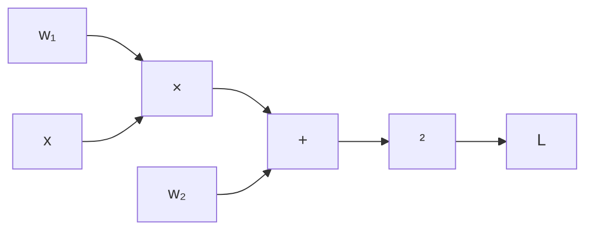

# 第二讲：度量、损失与优化

评估 · 距离与相似度 · 信息论 · 损失函数 · 梯度与优化器

---

## 回顾

**第 0 讲**：数学工具 —— 微积分、线性代数、概率论

**第 1 讲**：机器学习 (ML) 基础 —— 什么是机器学习、三种范式、工作流程、术语

第 1 讲的两个开放问题：

1. **如何衡量一个模型的好坏？** $\to$ **度量指标**和**损失函数**
2. **如何找到最优模型？** $\to$ **优化 (Optimization)**
   本讲将回答这两个问题。

---

## 第一部分：评估指标

---

### 混淆矩阵 (Confusion Matrix)

对于二分类器，所有预测结果分为四类：

|              |         **预测为正**         |         **预测为负**         |
| ------------ | :--------------------------: | :--------------------------: |
| **实际为正** | TP（真正例，True Positive）  | FN（假负例，False Negative） |
| **实际为负** | FP（假正例，False Positive） | TN（真负例，True Negative）  |

- **TP**：正确识别为正例（病人被正确诊断）
- **TN**：正确识别为负例（健康人被正确排除）
- **FP**：误报（健康人被误诊为患病）—— " 误报 "
- **FN**：漏报（病人被漏诊）—— " 漏检 "
  混淆矩阵是**所有**分类指标的基础。

---

### 准确率、精确率、召回率

**准确率 (Accuracy)**

$$
\text{Acc} = \frac{TP + TN}{TP + TN + FP + FN}
$$

" 在所有样本中，我们预测对了多少？"

问题：在数据不平衡时会产生误导（99% 为负例 $\to$ 始终预测负例 = 99% 准确率）

**精确率 (Precision)**

$$
\text{Prec} = \frac{TP}{TP + FP}
$$

" 在我们预测为正例的样本中，实际为正例的有多少？"

高精确率 = 误报少。

**召回率 (Recall)（灵敏度，Sensitivity）**

$$
\text{Rec} = \frac{TP}{TP + FN}
$$

" 在所有实际为正例的样本中，我们找到了多少？"

高召回率 = 漏检少。

**F1 分数 (F1 Score)**（精确率和召回率的调和平均值）：

$$
F_1 = 2 \cdot \frac{\text{Prec} \cdot \text{Rec}}{\text{Prec} + \text{Rec}}
$$

---

### TPR、FPR 与 ROC 曲线

**真正例率 (True Positive Rate, TPR)** = 召回率：

$$
\text{TPR} = \frac{TP}{TP + FN}
$$

**假正例率 (False Positive Rate, FPR)**：

$$
\text{FPR} = \frac{FP}{FP + TN}
$$

通过改变分类阈值，可以得到不同的 (FPR, TPR) 点对 $\to$ **ROC 曲线**。

**AUC**（ROC 曲线下面积，Area Under ROC Curve）：用单一数值概括模型性能。

- AUC = 1.0：完美分类器
- AUC = 0.5：随机猜测
  **何时使用什么指标？**

| 场景         | 优先考虑                   |
| ------------ | -------------------------- |
| 垃圾邮件过滤 | 精确率（避免丢失重要邮件） |
| 癌症筛查     | 召回率（不漏掉任何患者）   |
| 平衡数据集   | 准确率即可                 |
| 不平衡数据集 | F1 或 AUC                  |

---

## 第二部分：距离与相似度

---

### 向量范数 (Vector Norms)

**范数 (Norm)** 衡量向量的 " 大小 "。对于 $\mathbf{x} = [x_1, x_2, \ldots, x_n]^T$：

| 范数                                   | 定义           | 公式                                                           |
| -------------------------------------- | -------------- | -------------------------------------------------------------- |
| **L1 范数**（曼哈顿范数，Manhattan）   | 绝对值之和     | $\|\mathbf{x}\|_1 = \sum_{i=1}^n \|x_i\|$                      |
| **L2 范数**（欧几里得范数，Euclidean） | 平方和的平方根 | $\|\mathbf{x}\|_2 = \sqrt{\sum_{i=1}^n x_i^2}$                 |
| **Lp 范数**                            | 一般化形式     | $\|\mathbf{x}\|_p = \left(\sum_{i=1}^n \|x_i\|^p\right)^{1/p}$ |

**示例**：$\mathbf{x} = [3, 4]^T$

- $\|\mathbf{x}\|_1 = 3 + 4 = 7$
- $\|\mathbf{x}\|_2 = \sqrt{9 + 16} = 5$
  L2 范数在机器学习中最常用（欧几里得距离、权重衰减、正则化）。

---

### 距离度量 (Distance Metrics)

给定两个向量 $\mathbf{x}, \mathbf{y} \in \mathbb{R}^n$：

**曼哈顿距离 (Manhattan Distance)**（L1）

$$
d_{\text{Manhattan}}(\mathbf{x}, \mathbf{y}) = \|\mathbf{x} - \mathbf{y}\|_1 = \sum_{i=1}^n |x_i - y_i|
$$

" 城市街区距离 " —— 在网格中行走的距离。

**欧几里得距离 (Euclidean Distance)**（L2）

$$
d_{\text{Euclid}}(\mathbf{x}, \mathbf{y}) = \|\mathbf{x} - \mathbf{y}\|_2 = \sqrt{\sum_{i=1}^n (x_i - y_i)^2}
$$

直线距离 —— 最直观的距离。

**示例**：$\mathbf{x} = [1, 0]^T$, $\mathbf{y} = [4, 4]^T$

- 曼哈顿距离：$|1{-}4| + |0{-}4| = 3 + 4 = 7$
- 欧几里得距离：$\sqrt{9 + 16} = 5$
  **在机器学习中**：KNN、K-Means 聚类 (K-Means Clustering) 等许多算法依赖距离度量。距离的选择会影响结果。

---

### 余弦相似度 (Cosine Similarity)

与其衡量距离，不如衡量两个向量之间的**夹角**：

$$
\cos\theta = \frac{\mathbf{x} \cdot \mathbf{y}}{\|\mathbf{x}\|_2 \cdot \|\mathbf{y}\|_2} = \frac{\sum_{i=1}^n x_i y_i}{\sqrt{\sum x_i^2} \cdot \sqrt{\sum y_i^2}}
$$

| $\cos\theta$ | 含义                 |
| ------------ | -------------------- |
| $1$          | 方向相同（最相似）   |
| $0$          | 正交（无关）         |
| $-1$         | 方向相反（最不相似） |

**关键洞察**：余弦相似度衡量的是**方向**，而非大小。

$\mathbf{x} = [1, 1]^T$ 和 $\mathbf{y} = [100, 100]^T$ 的 $\cos\theta = 1$（方向相同），但欧几里得距离很大。

---

## 第三部分：信息论

---

### 信息熵 (Information Entropy)

一个事件携带多少 " 信息 "？

> **直觉**
> 令人惊讶的事件携带更多信息。

- " 今天太阳升起了 " $\to$ 预期之中，信息量低
- " 夏天下雪了 " $\to$ 出乎意料，信息量高
  概率为 $p$ 的事件的**信息量 (Information)**：

$$
I(x) = -\log_2 p(x)
$$

概率越低 $\to$ 信息量越高。

**熵 (Entropy)** —— 分布的期望信息量（平均 " 惊讶程度 "）：

$$
H(X) = -\sum_{x} P(x) \log_2 P(x) = E_P[-\log P(x)]
$$

**示例**：公平硬币，$P(H) = P(T) = 0.5$

$$
H = -0.5\log_2 0.5 - 0.5\log_2 0.5 = 1 \text{ 比特}
$$

有偏硬币（$P(H)=0.99$）：$H \approx 0.08$ 比特 —— 不确定性小得多。

---

### 交叉熵 (Cross Entropy)

衡量用为分布 $Q$ 优化的编码来编码来自分布 $P$ 的数据所需的平均比特数：

$$
H(P, Q) = -\sum_{x} P(x) \log Q(x)
$$

**与熵的关系**：

$$
H(P, Q) = H(P) + D_{\text{KL}}(P \| Q)
$$

其中 $D_{\text{KL}}(P \| Q)$ 是 KL 散度 (KL Divergence)（下一张幻灯片）。

当 $Q = P$（完美模型）时：$H(P, Q) = H(P)$ —— 最小可能值。

当 $Q \neq P$ 时：$H(P, Q) > H(P)$ —— 由于不匹配而浪费的额外比特。

**在机器学习中**：交叉熵是应用最广泛的分类损失函数。$P$ 是真实标签分布，$Q$ 是模型预测分布。最小化交叉熵 $\approx$ 使 $Q$ 接近 $P$。

---

### KL 散度 (KL Divergence)

**KL 散度 (Kullback-Leibler Divergence)** 衡量分布 $Q$ 与分布 $P$ 之间的差异程度：

$$
D_{\text{KL}}(P \| Q) = \sum_{x} P(x) \log \frac{P(x)}{Q(x)} = E_P\left[\log \frac{P(x)}{Q(x)}\right]
$$

性质：

- $D_{\text{KL}}(P \| Q) \geq 0$ 恒成立（吉布斯不等式，Gibbs' Inequality）
- $D_{\text{KL}}(P \| Q) = 0$ 当且仅当 $P = Q$
- **不对称性**：$D_{\text{KL}}(P \| Q) \neq D_{\text{KL}}(Q \| P)$
  > **直觉**
  > KL 散度衡量的是用为 $Q$ 优化的编码来编码 $P$ 时所浪费的 " 额外比特 "。
  > **在机器学习中**：KL 散度出现在变分自编码器 (VAE, Variational Autoencoder)、知识蒸馏 (Knowledge Distillation) 中，也用作正则化项。由于 $H(P, Q) = H(P) + D_{\text{KL}}(P \| Q)$，最小化交叉熵等价于最小化 KL 散度（因为 $H(P)$ 相对于模型是常数）。

---

## 第四部分：损失函数

---

### 什么是损失函数？

**损失函数 (Loss Function)** $L(\hat{y}, y)$ 量化了错误预测的惩罚：

$$
\text{目标： } \min_{\mathbf{w}} \frac{1}{N} \sum_{i=1}^{N} L(f(\mathbf{x}_i; \mathbf{w}), y_i)
$$

损失函数必须满足：

- **非负性**：$L \geq 0$
- **可微性**：以便计算梯度（用于基于梯度的优化）
- **正确时值小**：当 $\hat{y} \to y$ 时，$L \to 0$

| 任务                  | 常用损失函数           | 原因                           |
| --------------------- | ---------------------- | ------------------------------ |
| 回归 (Regression)     | MSE                    | 对大误差进行二次惩罚           |
| 分类 (Classification) | 交叉熵 (Cross-entropy) | 与概率解释一致                 |
| 排序 (Ranking)        | 合页损失 (Hinge loss)  | 基于间隔，用于支持向量机 (SVM) |

---

### 均方误差 (Mean Squared Error, MSE)

对于回归任务，最常用的损失函数：

$$
L_{\text{MSE}} = \frac{1}{N} \sum_{i=1}^{N} (\hat{y}_i - y_i)^2
$$

**性质**：

- 始终 $\geq 0$，当且仅当完美预测时等于 0
- 处处可微
- 对**大误差**的惩罚比小误差更重（二次方）
- 梯度：$\frac{\partial L}{\partial \hat{y}_i} = \frac{2}{N}(\hat{y}_i - y_i)$
  **与概率的联系**：MSE 假设高斯噪声 (Gaussian Noise) $\epsilon \sim \mathcal{N}(0, \sigma^2)$。
  在高斯噪声下最大化对数似然 (Log-likelihood) $\log P(y \mid \mathbf{x})$ 等价于最小化 MSE。
  **变体**：
- **MAE**（平均绝对误差，Mean Absolute Error）：$\frac{1}{N}\sum|y_i - \hat{y}_i|$ —— 对离群值不太敏感
- **Huber 损失 (Huber Loss)**：结合了 MSE（小误差）和 MAE（大误差）

---

### 交叉熵损失 (Cross-Entropy Loss)

对于**二分类**（$y \in \{0, 1\}$），模型输出为 $\hat{p} = P(y{=}1 \mid \mathbf{x})$：

$$
L_{\text{BCE}} = -\frac{1}{N}\sum_{i=1}^{N} \left[y_i \log \hat{p}_i + (1-y_i)\log(1-\hat{p}_i)\right]
$$

对于**多分类**（$y \in \{1, \ldots, C\}$），$\hat{p}_c = P(y{=}c \mid \mathbf{x})$：

$$
L_{\text{CE}} = -\frac{1}{N}\sum_{i=1}^{N} \sum_{c=1}^{C} \mathbb{1}[y_i = c] \log \hat{p}_{i,c}
$$

> **直觉**
>
> - 如果真实标签是类别 1，则损失 = $-\log \hat{p}_1$

- 当 $\hat{p}_1 \to 1$ 时：损失 $\to 0$（自信且正确）
- 当 $\hat{p}_1 \to 0$ 时：损失 $\to \infty$（自信但错误）
  交叉熵损失是分类任务的标准损失函数。结合 Softmax 输出，它等价于最大似然估计 (Maximum Likelihood Estimation, MLE)。

---

### 损失与信息论

我们所学概念之间的联系：

$$
L_{\text{CE}} = H(P, Q) = H(P) + D_{\text{KL}}(P \| Q)
$$

| 符号                    | 含义                                 | 角色               |
| ----------------------- | ------------------------------------ | ------------------ |
| $P$                     | 真实分布（独热标签，One-hot Labels） | 固定               |
| $Q$                     | 模型预测（Softmax 输出）             | 学习得到           |
| $H(P)$                  | 真实标签的熵                         | 相对于模型的常数   |
| $D_{\text{KL}}(P \| Q)$ | $Q$ 与 $P$ 的差距                    | 我们实际最小化的量 |
| $H(P, Q)$               | 交叉熵                               | 损失函数           |

由于 $H(P)$ 是常数，**最小化交叉熵 = 最小化 KL 散度**。

这就是为什么交叉熵在分类任务中效果如此好 —— 它直接衡量模型的分布与真实分布的接近程度。

**" 距离 " 家族总结**：

- **度量指标**：欧几里得距离、曼哈顿距离、余弦相似度 —— 衡量数据点之间的距离
- **损失函数**：MSE、交叉熵 —— 衡量预测与真实值之间的距离
- **KL 散度**：衡量分布之间的距离
  所有这些都是量化 " 两个事物有多不同 " 的不同方式。

---

## 第五部分：优化

---

### 梯度下降 (Gradient Descent)

给定损失函数 $L(\mathbf{w})$，找到使其最小化的 $\mathbf{w}^*$：

$$
\mathbf{w}^* = \arg\min_{\mathbf{w}} L(\mathbf{w})
$$

**梯度下降**沿最陡下降方向迭代移动：

$$
\mathbf{w}_{t+1} = \mathbf{w}_t - \eta \nabla_{\mathbf{w}} L(\mathbf{w}_t)
$$

- $\nabla_{\mathbf{w}} L$：梯度 —— 指向上升方向，因此我们沿**相反方向**前进
- $\eta$：学习率 (Learning Rate) —— 控制步长
  **收敛条件**：
- $\eta$ 过大：震荡、发散
- $\eta$ 过小：收敛缓慢、可能陷入局部最优
- 恰到好处：平滑收敛到（局部）最小值
  这在第 0 讲的梯度下降可视化中已有所展示。

---

### 计算机如何计算导数

梯度下降需要 $\nabla_{\mathbf{w}} L$。计算机如何计算它？

三种方法：

| 方法                     | 原理                    | 优点       | 缺点       |
| ------------------------ | ----------------------- | ---------- | ---------- |
| **符号微分 (Symbolic)**  | 代数规则应用            | 精确       | 表达式膨胀 |
| **数值微分 (Numerical)** | $\frac{f(x+h)-f(x)}{h}$ | 简单       | 慢，近似   |
| **自动微分 (Automatic)** | 计算图上的链式法则      | 精确，高效 | 实现复杂   |

在现代深度学习中，**自动微分 (Automatic Differentiation, Autodiff)** 是唯一使用的方法。

---

### 符号微分 (Symbolic Differentiation)

直接对表达式应用求导规则：

$$
f(x) = x^2 + \sin x \quad \xrightarrow{\text{符号}} \quad f'(x) = 2x + \cos x
$$

**工作原理**：规则表（和、积、链式法则等）递归应用于表达式树。

**问题**：表达式膨胀。

$$
f(x) = x^{100} \quad \to \quad f'(x) = 100x^{99}
$$

对于复杂表达式，导数可能比原始表达式大得多。

实际应用：用于数学软件（Mathematica、SymPy），不适合高维机器学习模型。

---

### 对偶数 (Dual Numbers)

一种令人惊讶的优雅方法。定义 $\epsilon$ 使得 $\epsilon^2 = 0$（但 $\epsilon \neq 0$）。

**对偶数 (Dual Number)**：$a + b\epsilon$，其中 $a$ 是值，$b$ 是导数。

**关键性质**：计算 $f(a + \epsilon) = f(a) + f'(a)\epsilon$

导数自动作为 $\epsilon$ 的系数出现！

**示例**：$f(x) = x^2$

$$
f(a + \epsilon) = (a + \epsilon)^2 = a^2 + 2a\epsilon + \epsilon^2 = a^2 + 2a\epsilon
$$

因此 $f(a) = a^2$，$f'(a) = 2a$ —— 完全正确。

**示例**：$f(x) = x^3$，在 $x = 2$ 处求值：

$$
(2 + \epsilon)^3 = 8 + 12\epsilon + 6\epsilon^2 + \epsilon^3 = 8 + 12\epsilon
$$

$f(2) = 8$，$f'(2) = 12$ ✓

对偶数为前向模式自动微分 (Forward-mode Autodiff) 提供**精确**导数（无近似）。但对于高维输入（$\mathbf{w} \in \mathbb{R}^d$），需要 $d$ 次计算 —— 代价太高。因此：**反向模式 (Backward-mode)** 自动微分（反向传播，Backpropagation）。

---

### 自动微分：计算图 (Computation Graph)

任何计算都可以表示为**有向无环图 (Directed Acyclic Graph, DAG)**：

示例：$L = (w_1 x + w_2)^2$

每个节点是一个简单运算（+、×、sin、exp 等），其局部导数是已知的。

通过沿路径应用**链式法则 (Chain Rule)**，可以得到 $\frac{\partial L}{\partial w_1}$ 和 $\frac{\partial L}{\partial w_2}$。

两种模式：

- **前向模式 (Forward Mode)**：从输入向输出传播导数（适用于少量输入）
- **反向模式 (Backward Mode)**：从输出向输入传播导数（适用于少量输出）—— 这就是**反向传播 (Backpropagation)**

---

### 反向模式自动微分（反向传播，Backpropagation）

在机器学习中，我们有大量参数（$d$ 很大）但只有一个损失值（标量输出）。**反向模式**是理想选择。

**前向传播 (Forward Pass)**：计算所有中间值

$$
z_1 = w_1 x, \quad z_2 = z_1 + w_2, \quad L = z_2^2
$$

**反向传播 (Backward Pass)**：从输出向输入应用链式法则

$$
\frac{\partial L}{\partial z_2} = 2z_2, \quad \frac{\partial L}{\partial z_1} = \frac{\partial L}{\partial z_2} \cdot 1, \quad \frac{\partial L}{\partial w_1} = \frac{\partial L}{\partial z_1} \cdot x
$$

一次前向传播 + 一次反向传播 $\to$ 得到**所有**梯度，与参数数量无关。

计算量：大约是前向传播的 $2\times$。这就是反向传播成为深度学习基石的原因。

PyTorch 和 TensorFlow 等框架自动构建计算图并处理反向传播。用户只需定义前向传播；梯度自动计算。

---

### 从梯度下降到实用优化器

原始梯度下降存在问题：

| 问题               | 描述                                 |
| ------------------ | ------------------------------------ |
| **大数据集上很慢** | 每步必须计算所有 $N$ 个样本的梯度    |
| **陷入局部极小值** | 非凸损失有多个局部极小值             |
| **对学习率敏感**   | 过大 $\to$ 发散，过小 $\to$ 收敛缓慢 |

这些问题催生了**实用优化器**。

---

### SGD（随机梯度下降，Stochastic Gradient Descent）

不再计算完整梯度，而是使用 $B$ 个样本的**小批量 (Mini-batch)**：

$$
\mathbf{w}_{t+1} = \mathbf{w}_t - \eta \cdot \frac{1}{B}\sum_{i \in \mathcal{B}} \nabla_{\mathbf{w}} L(\mathbf{x}_i, y_i; \mathbf{w}_t)
$$

**优势**：

- 每步速度快得多（B << N）
- 随机批次的噪声有助于逃离局部极小值
- 支持在线/流式学习
  **带动量的 SGD (SGD with Momentum)**：添加 " 速度 " 项以平滑更新：

$$
\mathbf{v}_t = \beta \mathbf{v}_{t-1} + \nabla L(\mathbf{w}_t), \quad \mathbf{w}_{t+1} = \mathbf{w}_t - \eta \mathbf{v}_t
$$

在一致的梯度方向上加速，抑制振荡。

---

### Adam（自适应矩估计，Adaptive Moment Estimation）

Adam 结合了**动量 (Momentum)** 和**自适应学习率 (Adaptive Learning Rate)**：

维护两个运行平均值：

$$
m_t = \beta_1 m_{t-1} + (1-\beta_1) g_t \quad \text{（一阶矩 —— 均值）}
$$

$$
v_t = \beta_2 v_{t-1} + (1-\beta_2) g_t^2 \quad \text{（二阶矩 —— 方差）}
$$

偏差修正（因为 $m_0 = v_0 = 0$）：

$$
\hat{m}_t = \frac{m_t}{1 - \beta_1^t}, \quad \hat{v}_t = \frac{v_t}{1 - \beta_2^t}
$$

更新规则：

$$
\mathbf{w}_{t+1} = \mathbf{w}_t - \eta \cdot \frac{\hat{m}_t}{\sqrt{\hat{v}_t} + \epsilon}
$$

**Adam 效果好的原因**：

- 动量：加速收敛
- 自适应学习率：每个参数有自己的有效学习率（梯度越大 $\to$ 步长越小）
- 默认超参数（$\beta_1=0.9, \beta_2=0.999, \epsilon=10^{-8}$）在大多数情况下表现良好

---

### 优化器对比

| 优化器             | 核心思想                            | 适用场景                       |
| ------------------ | ----------------------------------- | ------------------------------ |
| **SGD**            | 使用小批量梯度                      | 简单、理解清晰的问题           |
| **SGD + Momentum** | 在 SGD 上添加速度项                 | 更快收敛，卷积神经网络 (CNN)   |
| **RMSProp**        | 通过 $g^2$ 的运行平均值自适应学习率 | 循环神经网络 (RNN)、非平稳目标 |
| **Adam**           | 动量 + 自适应学习率                 | 大多数深度学习的默认选择       |

**实用建议**：从 Adam 开始（收敛快，默认参数好）。如果需要最佳最终性能，切换到 SGD + Momentum 并配合精细的学习率调度 (Learning Rate Scheduling)。

---

## 总结

---

### 总结

### 度量与距离

- **混淆矩阵 (Confusion Matrix)**：TP、FP、TN、FN
- **准确率、精确率、召回率、F1 分数 (Accuracy, Precision, Recall, F1)**
- **TPR、FPR、ROC 曲线、AUC**
- **范数 (Norms)**：L1、L2
- **余弦相似度 (Cosine Similarity)**：方向优于大小

### 信息与损失

- **熵 (Entropy)**：平均惊讶程度
- **交叉熵 (Cross Entropy)**：编码代价
- **KL 散度 (KL Divergence)**：分布距离
- **MSE**：回归损失
- **交叉熵损失 (Cross-entropy Loss)**：分类损失
- CE = 熵 + KL 散度

### 优化

- **梯度下降 (Gradient Descent)**：$\mathbf{w} \leftarrow \mathbf{w} - \eta\nabla L$
- **自动微分 (Autodiff)**：通过计算图获得精确梯度
- **SGD**：小批量 + 动量
- **Adam**：自适应 + 动量（默认选择）
  **机器学习流程**：表示数据 $\to$ 定义模型 $\to$ 选择损失 $\to$ 优化 $\to$ 用度量指标评估

---

### 下一讲预告

我们现在已经拥有了完整的基础：

- **第 0 讲**：数学工具（微积分、线性代数、概率论）
- **第 1 讲**：机器学习基础（范式、工作流程、术语）
- **第 2 讲**：度量、损失、优化（如何衡量和改进）
  接下来：动手实践 —— 用代码实现这些概念。
