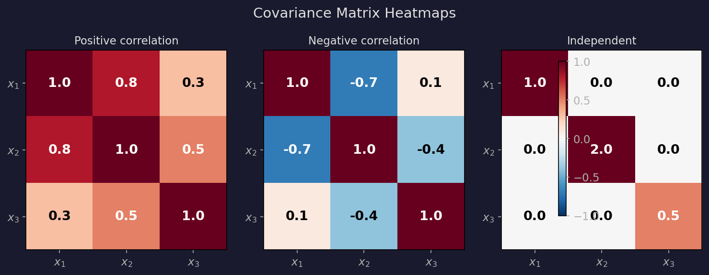
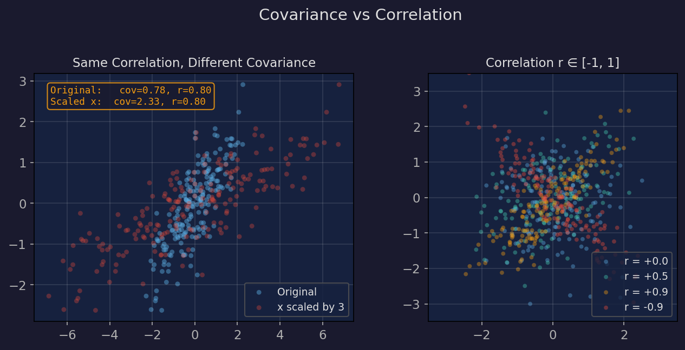
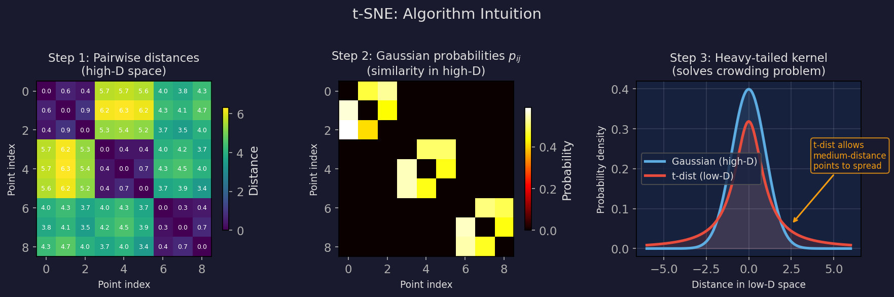
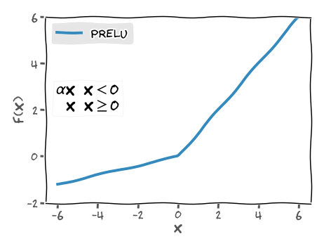
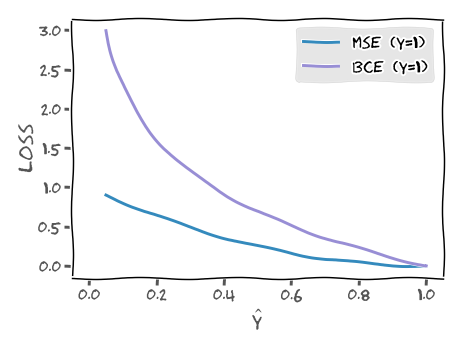
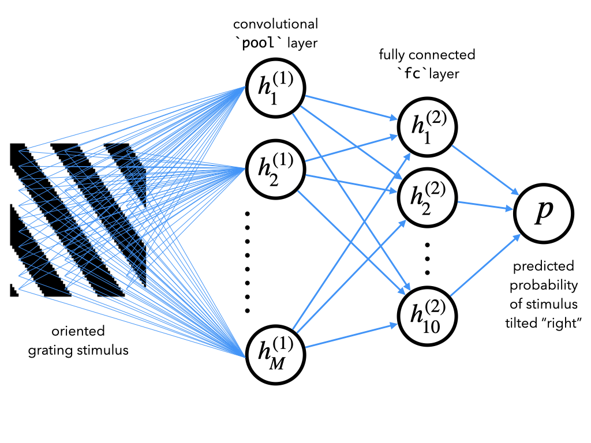
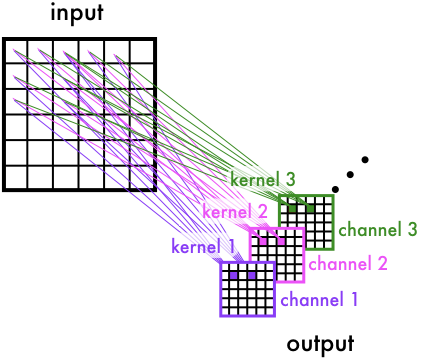
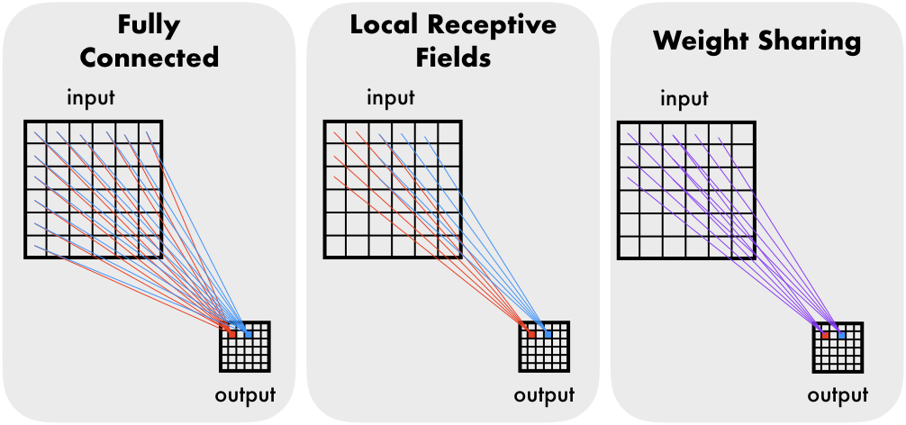

# Neuromatch 笔记本 — 第一周

模型拟合 · 线性回归 · 广义线性模型 · 逻辑回归 · 自助法

---

## 概述

第一周聚焦于**模型拟合**（Model Fitting）—— 如何找到能够解释数据的参数，以及我们对这些参数的置信程度：

| 天数     | 主题         | 核心技能                                   |
| -------- | ------------ | ------------------------------------------ |
| **W1D1** | 模型类型     | 描述性模型、机制性模型、模型的 " 为什么 "  |
| **W1D2** | 模型拟合     | 均方误差、最大似然估计、自助法、多项式回归 |
| **W1D3** | 广义线性模型 | 线性 - 高斯模型、泊松 GLM、逻辑回归        |

**统一主题**：给定数据，找到最佳模型参数，并量化我们的确定程度。

---

## W1D1：模型类型

---

### 三种模型类型

W1D1 介绍了一个思考神经科学中模型的框架：

### " 是什么 " 模型（"What" Models）

描述性模型 — 刻画数据特征

例如：ISI 直方图的形状

### " 怎样 " 模型（"How" Models）

机制性模型 — 模拟过程

例如：LIF 神经元模拟

### " 为什么 " 模型（"Why" Models）

目的论模型 — 解释目的

例如：熵最大化

---

### " 是什么 " 模型：探索神经数据

Steinmetz 数据集：在小鼠中使用 Neuropixels 记录的 734 个神经元。

**需要计算的关键量**：

```python
spike_counts = np.array([len(spikes[i]) for i in range(n_neurons)])
mean_count = np.mean(spike_counts)
median_count = np.median(spike_counts)
```

**ISI（脉冲间间隔，Inter-Spike Interval）**：连续脉冲之间的时间

```python
isis = np.diff(spike_times)  # differences between consecutive spike times
```

ISI 分布通常呈右偏态 — 大量短间隔，少量长间隔。

**手动拟合**：使用滑块调整指数函数、反函数和线性函数的参数以匹配 ISI 直方图。这有助于建立对 " 拟合模型 " 含义的直觉。

---

### " 怎样 " 模型：LIF 神经元模拟

构建一个简单的神经元模型，并将其输出与真实数据进行比较：

**线性 IF 模型**（Linear IF）：$dV = \alpha \cdot I$，阈值为 1，重置为 0

**漏积分 IF 模型**（Leaky IF）：$dV = -\beta V + \alpha \cdot I$（添加泄漏）

**输入**：泊松脉冲 — `exc = scipy.stats.poisson.rvs(lambda_exc, size=T)`

```python
for i in range(1, T):
    dv = -beta * v[i-1] + alpha * (exc[i] - inh[i])
    v[i] = v[i-1] + dv
    if v[i] >= 1:
        v[i] = 0
        spike_times.append(i)
```

**关键发现**：平衡的兴奋/抑制 + 泄漏 → ISI 分布更接近指数分布（与真实数据匹配）。

---

### " 为什么 " 模型：熵与信息

**香农熵**（Shannon entropy）：衡量分布中的不确定性：

$H(X) = -\sum_x p(x) \log_2 p(x) \quad \text{(bits)}$

| 分布                       | 熵               |
| -------------------------- | ---------------- |
| 确定性分布（总是相同的值） | 0 bits           |
| 均匀分布（$N$ 个值）       | $\log_2 N$ bits  |
| 指数分布                   | 固定均值下最大熵 |

**关键洞见**：指数 ISI 分布在固定平均放电率下最大化熵 — 它们在给定能量预算下每脉冲编码最多信息。

**代码**：

```python
def entropy(pmf):
    pmf = pmf[pmf > 0]           # remove zeros (log(0) is undefined)
    # or pmf = pmf + 0.000001 : laplace smoothing
    return -np.sum(pmf * np.log2(pmf))
```

---

## W1D2：模型拟合

---

### 使用均方误差的线性回归

最简单的模型拟合问题：找到最佳拟合 $y = \theta x + \epsilon$ 的斜率 $\theta$。

**均方误差**（Mean Squared Error，目标函数）：

$$\text{MSE}(\theta) = \frac{1}{N}\sum_{i=1}^N (y_i - \theta x_i)^2$$

**解析解**（令导数为零）：

$$\hat{\theta} = \frac{\mathbf{x}^T \mathbf{y}}{\mathbf{x}^T \mathbf{x}} = \frac{\sum x_i y_i}{\sum x_i^2}$$

**代码**：

```python
def solve_normal_eqn(x, y):
    return (x @ y) / (x @ x)
def mse(x, y, theta):
    y_hat = theta * x
    return np.mean((y - y_hat)**2)
```

---

### 可视化：将直线拟合到数据

红线 = 从正规方程得到的 $\hat{\theta}$。它最小化每个蓝点到直线的垂直距离平方和。

---

### 数据作为向量

每个散点是一个 $(x_i, y_i)$ 点。将所有点收集到向量中：

$$\mathbf{x} = \begin{bmatrix} x_1 \\ x_2 \\ \vdots \\ x_N \end{bmatrix}, \quad \mathbf{y} = \begin{bmatrix} y_1 \\ y_2 \\ \vdots \\ y_N \end{bmatrix}$$

**示例**（5 个数据点）：

```python
x = np.array([1.2, 2.5, 3.1, 0.8, 4.3])   # input features
y = np.array([2.1, 4.0, 5.2, 1.5, 6.8])   # targets
```

**计算拟合**：

```python
theta_hat = (x @ y) / (x @ x)             # = sum(x_i * y_i) / sum(x_i^2)
# theta_hat ≈ 1.56
y_hat = theta_hat * x                       # predictions on the line
residuals = y - y_hat                       # errors (vertical distances)
mse = np.mean(residuals**2)                 # mean squared error
```

---

| 符号                                        | 形状   | 含义               |
| ------------------------------------------- | ------ | ------------------ |
| $\mathbf{x}$                                | $(N,)$ | 输入特征           |
| $\mathbf{y}$                                | $(N,)$ | 观测目标值         |
| $\hat{\theta}$                              | 标量   | 拟合的斜率         |
| $\hat{\mathbf{y}} = \hat{\theta}\mathbf{x}$ | $(N,)$ | 预测值（在直线上） |
| $\mathbf{y} - \hat{\mathbf{y}}$             | $(N,)$ | 残差（误差）       |

---

### 使用最大似然估计的线性回归

相同的问题，概率视角：假设 $y_i \sim \mathcal{N}(\theta x_i, \sigma^2)$。

**似然函数**（Likelihood）：

$$L(\theta) = \prod_{i=1}^N \frac{1}{\sqrt{2\pi\sigma^2}} \exp\!\left(-\frac{(y_i - \theta x_i)^2}{2\sigma^2}\right)$$

**对数似然函数**（Log-likelihood）：

$$\log L(\theta) = -\frac{N}{2}\log(2\pi\sigma^2) - \frac{1}{2\sigma^2}\sum_{i=1}^N (y_i - \theta x_i)^2$$

**关键结果**：最大化对数似然 $\Leftrightarrow$ 最小化均方误差。它们给出相同的 $\hat{\theta}$！

概率视角增加了计算置信区间和进行贝叶斯推断的能力。

```python
from scipy.stats import norm
def likelihood(theta, x, y):
    return np.prod(norm.pdf(y, loc=theta*x, scale=1))
```

---

### 从确定性到概率性

**均方误差视角**：$y = \theta x + \epsilon$，噪声只是干扰因素。

**概率视角**：噪声是模型的一部分。将 $y$ 视为**随机变量**（Random Variable）：

$$y \sim \mathcal{N}(\theta x,\; \sigma^2)$$

这意味着：对于给定的 $x$ 和 $\theta$，响应 $y$ 不是确定性的 — 它遵循以 $\theta x$ 为中心的高斯分布。

$$p(y \mid x, \theta) = \frac{1}{\sqrt{2\pi\sigma^2}} \exp\!\left(-\frac{(y - \theta x)^2}{2\sigma^2}\right)$$

**为什么这很重要**：与仅仅找到一个 " 最佳 "$\hat{\theta}$ 不同，我们现在可以：

- 计算给定数据下每个 $\hat{\theta}$ 的**可能性**
- 建立**置信区间**（Confidence Intervals）
- 进行**贝叶斯推断**（Bayesian Inference）

---

### 概率模型：几何解释

对于每个 $x$ 值，$y$ 是从以 $\theta x$ 为中心的高斯分布中抽取的：

**在 $x = 3$ 处**：$y \sim \mathcal{N}(3\theta, \sigma^2)$。高斯分布的峰值在 $3\theta$。

**在 $x = 7$ 处**：$y \sim \mathcal{N}(7\theta, \sigma^2)$。峰值移至 $7\theta$。

围绕直线 $y = \theta x$ 的高斯 " 管道 " 表示在每个 $x$ 处 $y$ 的概率密度。靠近直线的点更可能出现；远离直线的点不太可能出现。

**生成数据的代码**：

```python
np.random.seed(121)
theta_true = 1.2
n_samples = 30
x = 10 * np.random.rand(n_samples)    # uniform in [0, 10)
noise = np.random.randn(n_samples)     # N(0, 1)
y = theta_true * x + noise             # y ~ N(1.2x, 1)
```

---

### 单点似然

给定一个数据点 $(x, y)$，参数 $\hat{\theta}$ 的**似然**为：

$$\mathcal{L}(\hat{\theta} \mid x, y) = p(y \mid x, \hat{\theta}) = \frac{1}{\sqrt{2\pi}} \exp\!\left(-\frac{(y - \hat{\theta} x)^2}{2}\right)$$

**示例**：$x = 2.1$，$y = 3.7$，测试 $\hat{\theta} = 1.0$：

$$\mathcal{L}(1.0 \mid 2.1, 3.7) = \frac{1}{\sqrt{2\pi}} \exp\!\left(-\frac{(3.7 - 1.0 \times 2.1)^2}{2}\right) = \frac{1}{\sqrt{2\pi}} e^{-1.28} \approx 0.11$$

**代码**：

```python
def likelihood(theta_hat, x, y, sigma=1):
    return (1 / np.sqrt(2 * np.pi * sigma**2)) * np.exp(-(y - theta_hat * x)**2 / (2 * sigma**2))
likelihood(1.0, 2.1, 3.7)  # ≈ 0.113
```

**解释**：如果 $\hat{\theta} = 1.0$，在 $x = 2.1$ 处观测到 $y = 3.7$ 的概率约为 11.3%。概率不是很高 — 也许 $\hat{\theta} = 1.0$ 不是最佳拟合？

---

### 联合似然：从一个点到所有数据

我们有 $N$ 个数据点。假设噪声在各次观测之间**独立**：

$$\mathcal{L}(\hat{\theta} \mid \mathbf{x}, \mathbf{y}) = \prod_{i=1}^N p(y_i \mid x_i, \hat{\theta}) = \prod_{i=1}^N \frac{1}{\sqrt{2\pi}} \exp\!\left(-\frac{(y_i - \hat{\theta} x_i)^2}{2}\right)$$

**问题**：将 $N$ 个小概率相乘 → **数值下溢**（Numerical Underflow）。

示例：$N = 30$，每个似然 $\approx 0.3$ → 乘积 $\approx 0.3^{30} \approx 10^{-16}$，四舍五入为零。

**解决方案**：取对数

$$\log \mathcal{L}(\hat{\theta}) = \sum_{i=1}^N \log p(y_i \mid x_i, \hat{\theta}) = -\frac{N}{2}\log(2\pi) - \frac{1}{2}\sum_{i=1}^N (y_i - \hat{\theta} x_i)^2$$

**关键性质**：$\log$ 是单调递增的，所以 $\arg\max \mathcal{L} = \arg\max \log \mathcal{L}$。最大化似然的 $\hat{\theta}$ 也最大化对数似然。

---

### 通过比较对数似然来比较不同的 $\hat{\theta}$

| $\hat{\theta}$ | $\log \mathcal{L}$ | 质量                    |
| -------------- | ------------------ | ----------------------- |
| 0.5            | $-198.3$           | 差 — 直线太平坦         |
| 1.0            | $-42.1$            | 较好 — 更接近真实值     |
| 1.2（真实值）  | $-38.7$            | 最佳 — 匹配数据生成过程 |

**代码**：

```python
theta_hats = [0.5, 1.0, 2.2]
for th in theta_hats:
    ll = np.sum(np.log(likelihood(th, x, y)))
    print(f"theta={th}, log-likelihood={ll:.2f}")
```

**视觉直觉**：对于 $\hat{\theta} = 0.5$，高斯 " 管道 " 太平坦 — 大多数数据点远离中心，给出较低的似然。对于 $\hat{\theta} = 1.2$，管道与数据对齐 — 似然较高。

---

### 最大似然估计推导：从对数似然到公式

通过求导并令其为零来最大化对数似然：

$$\log \mathcal{L}(\theta) = -\frac{N}{2}\log(2\pi) - \frac{1}{2}\sum_{i=1}^N (y_i - \theta x_i)^2$$

$$\frac{\partial \log \mathcal{L}}{\partial \theta} = \sum_{i=1}^N (y_i - \theta x_i) x_i = 0$$

展开：$\sum x_i y_i - \theta \sum x_i^2 = 0$

$$\boxed{\;\hat{\theta}_{\text{MLE}} = \frac{\sum x_i y_i}{\sum x_i^2} = \frac{\mathbf{x}^T \mathbf{y}}{\mathbf{x}^T \mathbf{x}}\;}$$

**这与均方误差的公式相同！** 当噪声是具有恒定方差的高斯噪声时，最小化均方误差和最大化似然给出相同的 $\hat{\theta}$。

概率视角不会改变答案 — 它改变的是我们**能用答案做什么**（置信区间、贝叶斯更新、模型比较）。

---

### 符号参考

| 符号                                     | 含义                                        |
| ---------------------------------------- | ------------------------------------------- |
| $x$                                      | 输入（自变量，Independent Variable）        |
| $y$                                      | 响应（因变量，Dependent Variable）          |
| $\epsilon \sim \mathcal{N}(0, \sigma^2)$ | 高斯噪声（Gaussian Noise）                  |
| $\theta$                                 | 真实参数                                    |
| $\hat{\theta}$                           | 估计参数                                    |
| $p(y \mid x, \theta)$                    | 给定 $x$ 和 $\theta$ 时 $y$ 的概率          |
| $\mathcal{L}(\theta \mid x, y)$          | 给定数据 $(x, y)$ 时 $\theta$ 的似然        |
| $\hat{\theta}_{\text{MLE}}$              | 最大似然估计（Maximum Likelihood Estimate） |

**关键区别**：$p(y \mid x, \theta)$ 和 $\mathcal{L}(\theta \mid x, y)$ 使用**相同的公式**，但提出不同的问题：

- $p(y \mid x, \theta)$："$y$ 有多可能？"（数据变化，$\theta$ 固定）
- $\mathcal{L}(\theta \mid x, y)$："$\hat{\theta}$ 有多好？"（$\theta$ 变化，数据固定）

---

### 自助法：量化不确定性

我们对 $\hat{\theta}$ 有多大的信心？**自助法**（Bootstrapping）在不需要分布假设的情况下估计不确定性。

**算法**：

1. 从原始数据集中**有放回地**重采样 $N$ 个数据点
2. 在重采样数据上计算 $\hat{\theta}$
3. 重复 $B$ 次（例如 $B = 2000$）
4. $\hat{\theta}^*$ 值的分布估计了抽样分布
   **95% 置信区间**（Confidence Interval）：自助分布的第 2.5 和第 97.5 百分位数。

```python
def bootstrap_estimates(x, y, n=2000):
    estimates = []
    for _ in range(n):
        idx = np.random.choice(len(x), size=len(x), replace=True)
        estimates.append(solve_normal_eqn(x[idx], y[idx]))
    return np.array(estimates)
theta_boots = bootstrap_estimates(x, y)
ci_95 = np.percentile(theta_boots, [2.5, 97.5])
```

---

### 多元线性回归

推广到多个特征：$\mathbf{y} = X\boldsymbol{\theta} + \boldsymbol{\epsilon}$

**设计矩阵**（Design Matrix）$X$：每行是一个观测值，每列是一个特征。

**普通最小二乘估计量**（OLS Estimator）：

$$\hat{\boldsymbol{\theta}} = (X^T X)^{-1} X^T \mathbf{y}$$

**多项式回归**（Polynomial Regression）：特征是 $x$ 的幂次

$$X = \begin{bmatrix} 1 & x_1 & x_1^2 \\ 1 & x_2 & x_2^2 \\ \vdots & \vdots & \vdots \end{bmatrix}$$

```python
def make_design_matrix(x, order):
    X = np.ones((len(x), 1))         # bias column
    for p in range(1, order + 1):
        X = np.hstack([X, x.reshape(-1, 1)**p])
    return X
def ordinary_least_squares(X, y):
    return np.linalg.inv(X.T @ X) @ X.T @ y
```

**模型选择**（Model Selection）：比较不同多项式阶数的均方误差。更高阶 = 更低的训练均方误差，但有过拟合风险。

---

## W1D3：广义线性模型

---

### 从线性模型到广义线性模型

线性回归：$\hat{y} = X\boldsymbol{\theta}$ — 输出是无界的。

**问题**：神经脉冲计数是非负整数。放电率是正的。二元选择是 0/1。

**解决方案**：应用**连接函数**（Link Function）$g$ 来变换线性输出：

$$g(\hat{y}) = X\boldsymbol{\theta} \quad \Leftrightarrow \quad \hat{y} = g^{-1}(X\boldsymbol{\theta})$$

| 模型            | 连接函数 $g$        | 逆函数 $g^{-1}$ | 输出类型     |
| --------------- | ------------------- | --------------- | ------------ |
| 线性 - 高斯模型 | 恒等函数            | 恒等函数        | 连续值       |
| 泊松 GLM        | $\log$              | $\exp$          | 正整数计数   |
| 逻辑回归        | $\log\frac{p}{1-p}$ | Sigmoid 函数    | 概率 $[0,1]$ |

---

### 核心概念：设计矩阵

设计矩阵将原始数据组织成模型可以使用的格式。

**定义**：设计矩阵 $\mathbf{X}$ 是一个 $T \times d$ 矩阵，其中每行是一个时间点的**特征向量**，每列是一个特征。

**在神经科学中**：我们想知道 " 过去 $d$ 个时间步的刺激如何影响当前的脉冲？" 设计矩阵将过去 $d$ 个刺激值排列成一行：

$$\mathbf{X} = \begin{bmatrix} \text{stim}[t_0 - d+1] & \cdots & \text{stim}[t_0 - 1] & \text{stim}[t_0] \\ \text{stim}[t_T - d+1] & \cdots & \text{stim}[t_T - 1] & \text{stim}[t_T] \end{bmatrix}$$

**零填充**（Zero-padding）：对于最早的时间点，我们没有完整的 $d$ 个历史数据 — 用零填充：

```python
padded_stim = np.concatenate([np.zeros(d - 1), stim])
# padded_stim = [0, 0, ..., 0, stim[0], stim[1], ..., stim[T-1]]
```

**滑动窗口提取**（Sliding Window Extraction）：对于每个时间点 $t$，取长度为 $d$ 的窗口并反转：

```python
for t in range(T):
    X[t] = padded_stim[t:t + d][::-1]  # [::-1] reverses so earliest time comes first
```

---

### 核心概念：观测值

观测值是我们想要预测的目标变量 $\mathbf{y}$。

**在本实验中**：

| 变量               | 含义                            | 形状   |
| ------------------ | ------------------------------- | ------ |
| $\text{stim}[t]$   | 时间 $t$ 处的屏幕亮度（刺激）   | $(T,)$ |
| $\text{spikes}[t]$ | 时间 $t$ 处的脉冲计数（响应）   | $(T,)$ |
| $\mathbf{X}[t]$    | 时间 $t$ 处的设计矩阵行（特征） | $(d,)$ |

**关键洞见**：

- $\mathbf{X}$ 的每一行 = " 过去 $d$ 个时间步发生了什么 "（输入特征）
- $\mathbf{y}$ 的每个值 = " 现在发生了什么 "（要预测的观测值）
- 模型学习：**什么样的输入特征模式导致什么样的输出**
  **类比**：

| 预测任务         | 输入 $\mathbf{X}$          | 输出 $\mathbf{y}$ |
| ---------------- | -------------------------- | ----------------- |
| 房价             | 面积、位置、房龄…          | 价格              |
| 天气             | 过去 7 天的温度、湿度…     | 明天的温度        |
| **神经脉冲预测** | **过去 25 个时间窗的刺激** | **当前脉冲计数**  |

---

### 核心概念：泊松分布

泊松分布（Poisson Distribution）是建模**计数数据**的核心工具。

**概率质量函数**（Probability Mass Function, PMF）：

$$P(Y = k) = \frac{\lambda^k \cdot e^{-\lambda}}{k!}, \quad k = 0, 1, 2, \ldots$$

其中 $\lambda > 0$ 是**速率参数**（Rate Parameter） — 每单位时间/空间的平均事件数。

**关键性质**：

| 性质   | 公式                        | 含义         |
| ------ | --------------------------- | ------------ |
| 均值   | $\mathbb{E}[Y] = \lambda$   | 平均计数     |
| 方差   | $\text{Var}(Y) = \lambda$   | 方差等于均值 |
| 支撑集 | $k \in \{0, 1, 2, \ldots\}$ | 非负整数     |

---

### 泊松分布：直觉与应用

泊松分布通常用于建模以下类型的问题：

**1. 稀有事件计数**

- 每天收到的电话数量
- 一页上的打字错误数量
- 每小时到达银行的客户数量
- **神经元在每个时间窗内发放的脉冲数量**
  **2. 泊松建模的条件**
  当以下条件成立时，泊松分布适用：

| 条件   | 含义                 | 神经科学类比              |
| ------ | -------------------- | ------------------------- |
| 独立性 | 事件之间相互独立     | 脉冲近似独立              |
| 均匀性 | 事件速率恒定         | 在短时间窗内速率近似恒定  |
| 稀疏性 | 每个时刻最多一个事件 | 每个时间窗最多 1-2 个脉冲 |

---

**3. 为什么神经脉冲适合用泊松建模？**

- 脉冲是非负整数（0, 1, 2, …）
- 脉冲是稀疏的（大部分为 0）
- 脉冲方差 $\approx$ 均值（$\text{Var} \approx \text{mean}$）
- 脉冲近似独立（在短时间尺度上）
  **4. 泊松分布的形状**

```python
import numpy as np
from scipy.stats import poisson
k = np.arange(0, 15)
for lam in [1, 3, 5, 10]:
    pmf = poisson.pmf(k, lam)
    # Small λ → right-skewed, concentrated near 0
    # Large λ → approximately symmetric (CLT)
```

---

### LNP 模型：从线性到泊松的完整推导

线性 - 非线性 - 泊松模型（Linear-Nonlinear-Poisson, LNP）是神经科学中最常用的广义线性模型之一。

**目标**：给定过去 $d$ 个时间窗的刺激 $\mathbf{x}_t = [\text{stim}[t-d+1], \ldots, \text{stim}[t]]$，预测时间 $t$ 处的脉冲计数 $y_t$。

**第一步：线性分量**

计算刺激和权重的加权和：

$$z_t = \mathbf{x}_t^\top \boldsymbol{\theta} + b = \sum_{j=1}^{d} \theta_j \cdot \text{stim}[t-d+j] + b$$

其中 $\boldsymbol{\theta}$ 是时间滤波器（Temporal Filter），$b$ 是偏置（Bias）。

**含义**：$z_t$ 表示 " 来自过去 $d$ 个时间窗刺激的综合驱动 "。

---

**第二步：非线性分量**

通过指数函数将线性输出映射为正的放电率：

$$\lambda_t = \exp(z_t) = \exp(\mathbf{x}_t^\top \boldsymbol{\theta} + b)$$

**为什么用 exp？**

| 问题                       | 解决方案                      |
| -------------------------- | ----------------------------- |
| 线性输出 $z_t$ 可能为负    | $\exp(z_t) > 0$，保证正的速率 |
| 放电率应随驱动增大而增加   | $\exp$ 是单调递增的           |
| 驱动的微小变化产生乘法效应 | $\exp$ 将加法转换为乘法       |

---

### LNP 模型：似然函数与参数估计

**第三步：泊松观测模型**

假设脉冲计数遵循泊松分布：

$$y_t \mid \mathbf{x}_t, \boldsymbol{\theta} \sim \text{Poisson}(\lambda_t)$$

概率质量函数：

$$P(y_t \mid \mathbf{x}_t, \boldsymbol{\theta}) = \frac{\lambda_t^{y_t} \cdot e^{-\lambda_t}}{y_t!}$$

**第四步：构造似然函数**

假设脉冲在时间上独立，联合似然为：

$$\mathcal{L}(\boldsymbol{\theta}) = \prod_{t=1}^{T} P(y_t \mid \mathbf{x}_t, \boldsymbol{\theta}) = \prod_{t=1}^{T} \frac{\lambda_t^{y_t} \cdot e^{-\lambda_t}}{y_t!}$$

---

**第五步：取对数简化**

$$\log \mathcal{L}(\boldsymbol{\theta}) = \sum_{t=1}^{T} \left[ y_t \log \lambda_t - \lambda_t - \log(y_t!) \right]$$

丢弃不依赖于 $\boldsymbol{\theta}$ 的常数项 $\log(y_t!)$：

$$\log \mathcal{L}(\boldsymbol{\theta}) = \sum_{t=1}^{T} \left[ y_t \log \lambda_t - \lambda_t \right]$$

---

### LNP 模型：矩阵形式与优化

**第六步：矩阵形式**

将 $\lambda_t = \exp(\mathbf{x}_t^\top \boldsymbol{\theta})$ 代入，用矩阵符号表示：

$$\log \mathcal{L}(\boldsymbol{\theta}) = \mathbf{y}^\top \log(\boldsymbol{\lambda}) - \mathbf{1}^\top \boldsymbol{\lambda}$$

其中 $\boldsymbol{\lambda} = \exp(\mathbf{X}\boldsymbol{\theta})$。

**第七步：负对数似然（目标函数）**

最小化负对数似然：

$$-\log \mathcal{L}(\boldsymbol{\theta}) = -\left( \mathbf{y}^\top \log(\boldsymbol{\lambda}) - \mathbf{1}^\top \boldsymbol{\lambda} \right) = \mathbf{1}^\top \boldsymbol{\lambda} - \mathbf{y}^\top \log(\boldsymbol{\lambda})$$

---

**第八步：数值优化**

没有闭式解 — 使用 `scipy.optimize.minimize`：

```python
def fit_lnp(stim, spikes, d=25):
    y = spikes
    constant = np.ones_like(y)
    X = np.column_stack([constant, make_design_matrix(stim)])
    x0 = np.random.normal(0, .2, d + 1)  # random initialization
    res = minimize(neg_log_lik_lnp, x0, args=(X, y))
    return res.x
```

---

### LNP 模型：端到端流程

```
Raw Data
    │
    ▼
┌─────────────────────────────────────────────────────────┐
│  Design matrix X[t] = [stim[t-24], ..., stim[t]]        │  ← past 25 bins of stimulus
│  Observation   y[t] = spikes[t]                         │  ← current spike count
└─────────────────────────────────────────────────────────┘
    │
    ▼
┌─────────────────────────────────────────────────────────┐
│  Linear:      z_t = X[t] · θ + b                        │  ← weighted sum
│  Nonlinear:   λ_t = exp(z_t)                            │  ← map to positive
│  Poisson:     y_t ~ Poisson(λ_t)                        │  ← probabilistic model
└─────────────────────────────────────────────────────────┘
    │
    ▼
┌─────────────────────────────────────────────────────────┐
│  Minimize  −[y^T log(λ) − 1^T λ]                       │  ← objective
│  Solve θ via scipy.optimize.minimize                     │  ← numerical optimization
└─────────────────────────────────────────────────────────┘
    │
    ▼
  θ → temporal receptive field (TRF)
```

---

### LG GLM 与 LNP GLM 的比较

|                  | LG（线性 - 高斯模型）                         | LNP（泊松模型）                       |
| ---------------- | --------------------------------------------- | ------------------------------------- |
| **预测**         | $\hat{y} = X\theta$                           | $\hat{y} = \exp(X\theta)$             |
| **输出范围**     | $(-\infty, +\infty)$                          | $(0, +\infty)$                        |
| **噪声假设**     | 高斯 $\epsilon \sim \mathcal{N}(0, \sigma^2)$ | 泊松 $y \sim \text{Poisson}(\lambda)$ |
| **拟合**         | 闭式解 $\hat{\theta} = (X^TX)^{-1}X^Ty$       | 数值优化（无闭式解）                  |
| **应用场景**     | 连续值预测                                    | 非负整数计数                          |
| **神经科学应用** | 刺激滤波器估计                                | 放电率建模                            |

**关键区别**：

- LG 可能预测**负脉冲数**（不合理） ❌
- LNP 通过 $\exp$ 保证预测**始终为正** ✅
- LNP 更好地匹配脉冲数据的**统计特性**（计数、稀疏、方差 $\approx$ 均值）

---

### 线性 - 高斯 GLM：脉冲滤波

模型：脉冲计数 $y_t$ 取决于过去 $d$ 个时间步的刺激。

**设计矩阵**：每行包含前 $d$ 个刺激值

```python
def make_design_matrix(stim, d=25):
    nt = len(stim)
    X = np.zeros((nt, d))
    for t in range(nt):
        for j in range(d):
            if t - j >= 0:
                X[t, j] = stim[t - j]
    return X
```

**拟合**：相同的 OLS 公式 $\hat{\boldsymbol{\theta}} = (X^T X)^{-1} X^T \mathbf{y}$

**解释**：$\hat{\boldsymbol{\theta}}$ 是**刺激滤波器**（Stimulus Filter）— 神经元如何随时间整合刺激。类似于脉冲触发平均（Spike-Triggered Average, STA）。

---

### 泊松 GLM：脉冲速率建模

脉冲计数是非负整数 → 使用泊松分布。

**模型**：$y_t \sim \text{Poisson}(\lambda_t)$，其中 $\lambda_t = \exp(\mathbf{x}_t^T \boldsymbol{\theta})$

$\exp$ 确保 $\lambda_t > 0$。

**对数似然**：

$$\log L(\boldsymbol{\theta}) = \sum_t \left[ y_t \log \lambda_t - \lambda_t \right] = \sum_t \left[ y_t (\mathbf{x}_t^T \boldsymbol{\theta}) - \exp(\mathbf{x}_t^T \boldsymbol{\theta}) \right]$$

**没有闭式解** — 使用数值优化：

```python
from scipy.optimize import minimize
def neg_log_lik_lnp(theta, X, y):
    lam = np.exp(X @ theta)
    return -np.sum(y * np.log(lam) - lam)
def fit_lnp(stim, spikes, d=25):
    X = make_design_matrix(stim, d)
    X = np.column_stack([X, np.ones(len(spikes))])  # add bias
    result = minimize(neg_log_lik_lnp, x0=np.zeros(d+1), args=(X, spikes))
    return result.x
```

---

### 为什么需要逻辑回归？

之前的模型（LG、LNP）预测**连续值**或**计数**输出。但许多神经科学问题是**二元的**：

| 问题         | 输出类型               | 模型         |
| ------------ | ---------------------- | ------------ |
| 刺激滤波     | 脉冲计数（0, 1, 2, …） | 泊松 GLM     |
| 放电率       | 正实数                 | LNP GLM      |
| **决策解码** | **二元（0 或 1）**     | **逻辑回归** |

**问题**：线性回归可能预测出 $[0, 1]$ 范围之外的概率。泊松回归预测的是计数，而非概率。

**解决方案**：逻辑回归（Logistic Regression）— 一种使用 **Sigmoid 连接函数**和**伯努利噪声模型**（Bernoulli Noise Model）的广义线性模型。

---

### 逻辑回归：Sigmoid 连接函数

核心思想：使用 **Sigmoid**（逻辑）函数将线性输出映射为概率。

**Sigmoid 函数**：

$$\sigma(z) = \frac{1}{1 + e^{-z}}$$

| $z$             | $\sigma(z)$ | 解释                   |
| --------------- | ----------- | ---------------------- |
| $z \to -\infty$ | $\to 0$     | 强烈支持类别 0 的证据  |
| $z = 0$         | $= 0.5$     | 没有支持任何一方的证据 |
| $z \to +\infty$ | $\to 1$     | 强烈支持类别 1 的证据  |

---

**关键性质**：

- 输出始终在 $(0, 1)$ 范围内 — 可解释为概率
- 单调递增 — $z$ 越大 → 类别 1 的概率越高
- 对称性：$\sigma(-z) = 1 - \sigma(z)$
- 导数形式简洁：$\sigma'(z) = \sigma(z)(1 - \sigma(z))$
  **用 GLM 术语表示**：Sigmoid 是**逆连接函数** $g^{-1}$：

$$\underbrace{\sigma^{-1}(\hat{y})}_{\text{log-odds}} = \mathbf{x}^\top \boldsymbol{\theta} \quad \Leftrightarrow \quad \hat{y} = \sigma(\mathbf{x}^\top \boldsymbol{\theta})$$

连接函数 $g = \sigma^{-1}$ 是 **Logit 函数**（对数几率）：$g(p) = \log \frac{p}{1-p}$。

---

### 逻辑回归：伯努利似然

输出 $y$ 是二元的（0 或 1），因此我们使用**伯努利分布**（Bernoulli Distribution）。

**模型**：

$$P(y = 1 \mid \mathbf{x}, \boldsymbol{\theta}) = \hat{y} = \sigma(\mathbf{x}^\top \boldsymbol{\theta})$$

**单次观测的伯努利似然**：

$$P(y_i \mid \hat{y}_i) = \hat{y}_i^{\,y_i} (1 - \hat{y}_i)^{1 - y_i}$$

这是一种紧凑的写法：

- 如果 $y_i = 1$：概率 = $\hat{y}_i$
- 如果 $y_i = 0$：概率 = $1 - \hat{y}_i$
  **所有数据的对数似然**（假设独立）：

$$\log \mathcal{L}(\boldsymbol{\theta}) = \sum_{i=1}^N \left[ y_i \log \hat{y}_i + (1 - y_i) \log(1 - \hat{y}_i) \right]$$

这是**交叉熵损失**（Cross-Entropy Loss）的取反。它对自信的错误预测给予重罚。

**负对数似然**（我们最小化的目标）：

$$-\log \mathcal{L} = -\sum_{i=1}^N \left[ y_i \log \sigma(\mathbf{x}_i^\top \boldsymbol{\theta}) + (1 - y_i) \log(1 - \sigma(\mathbf{x}_i^\top \boldsymbol{\theta})) \right]$$

没有闭式解 — 使用数值优化（例如梯度下降、牛顿法）。

---

### 什么是过拟合？

一个在训练数据上表现完美但在新数据上表现糟糕的模型**过拟合**（Overfitting）了。

**定义**：当模型学习了训练数据中的**噪声**而非底层模式时，就会发生过拟合。

**症状**：

- 训练准确率 $\approx$ 100%
- 测试准确率 << 100%
- 模型权重非常大（为了拟合噪声）
  **什么时候会发生？**
  当模型相对于数据量拥有过多**容量**（Capacity）时。在神经科学中，这极为常见：

| 数据类型 | 特征数（$d$）  | 样本数（$N$） | 比率 $d/N$ |
| -------- | -------------- | ------------- | ---------- |
| 电生理学 | ~100 个神经元  | ~50 个试次    | ~2         |
| fMRI     | ~10,000 个体素 | ~200 个试次   | ~50        |
| 钙成像   | ~500 个细胞    | ~100 个时间点 | ~5         |

当 $d > N$ 时，过拟合几乎是不可避免的。

**几何直觉**：在二维空间中，单个数据点可以被无穷多条直线拟合。当特征数多于样本数时，存在无穷多个权重向量可以实现零训练误差 — 其中大多数毫无意义。

---

### 过拟合：视觉图示

```
Training data:  ●  ●      ●  ●
                |  |      |  |
                ▼  ▼      ▼  ▼
Underfitting:   ─────────────────     (too simple, high bias)
                A straight line through noisy data
Good fit:       ──╱╲──╱╲──             (captures the pattern)
                Smooth curve through data
Overfitting:    ╱╲╱╲╱╲╱╲╱╲╱╲          (memorizes noise)
                Wiggly curve passing through every point
```

**偏差 - 方差权衡**（Bias-Variance Tradeoff）：

|              | 欠拟合 | 良好拟合 | 过拟合      |
| ------------ | ------ | -------- | ----------- |
| **偏差**     | 高     | 低       | 低          |
| **方差**     | 低     | 低       | 高          |
| **训练误差** | 高     | 低       | $\approx$ 0 |
| **测试误差** | 高     | 低       | 高          |

**如何检测过拟合**：交叉验证（Cross-Validation）。

如果训练准确率 >> 交叉验证准确率，则模型正在过拟合。

```python
from sklearn.model_selection import cross_val_score
cv_scores = cross_val_score(model, X, y, cv=8)
# Compare: model.score(X_train, y_train) vs cv_scores.mean()
```

---

### 正则化：核心思想

正则化（Regularization）通过**约束模型的自由度**来减少过拟合。

> **直觉**
> 我们不再问 " 找到最佳的 $\boldsymbol{\theta}$"，而是问 " 找到**最小的**最佳 $\boldsymbol{\theta}$"。
> 这在目标函数中为大权重添加了**惩罚**：

$$\text{Objective} = \underbrace{-\log \mathcal{L}(\boldsymbol{\theta})}_{\text{拟合数据}} + \underbrace{\Omega(\boldsymbol{\theta})}_{\text{复杂度惩罚}}$$

**为什么这有帮助？**

大权重允许模型拟合噪声。通过惩罚大权重：

- 模型更**平滑** — 输入的小变化 → 输出的小变化
- 模型更**简单** — 有效参数更少
- 模型对未见数据的**泛化**能力更好

---

**频率视角**：

将模型视为拟合一组正弦波的叠加。高频分量捕获噪声；低频分量捕获真实信号。

- **无正则化**：拟合所有频率（包括噪声）
- **正则化**：抑制高频分量（使模型平滑）
  这类似于信号处理中的低通滤波。
  **偏差 - 方差权衡**：
  正则化**增加偏差**（模型无法完美拟合真实函数）但**减少方差**（模型在不同训练集上更稳定）。最佳点通过交叉验证找到。

---

### $L_2$ 正则化（岭回归）

惩罚权重的**平方和**。

**目标函数**：

$$-\log \mathcal{L}'(\boldsymbol{\theta}) = -\log \mathcal{L}(\boldsymbol{\theta}) + \frac{\beta}{2} \sum_j \theta_j^2 = -\log \mathcal{L}(\boldsymbol{\theta}) + \frac{\beta}{2} \|\boldsymbol{\theta}\|_2^2$$

其中 $\beta > 0$ 是**正则化强度**（Regularization Strength）。

**效果**：所有权重都**向零收缩**，但没有一个恰好为零。

```
No regularization:    θ = [18.3, -15.7, 12.1, -8.4, ...]   (large values)
L2 regularization:    θ = [ 0.3,  -0.2,  0.1, -0.1, ...]   (small values)
```

**几何直觉**：$L_2$ 约束区域是一个**圆**（二维）或**超球体**（高维）。解在似然等高线首次接触圆的位置 — 通常在所有坐标都非零但很小的点上。

---

### $L_1$ 正则化（Lasso）

惩罚权重的**绝对值之和**。

**目标函数**：

$$-\log \mathcal{L}'(\boldsymbol{\theta}) = -\log \mathcal{L}(\boldsymbol{\theta}) + \frac{\beta}{2} \sum_j |\theta_j| = -\log \mathcal{L}(\boldsymbol{\theta}) + \frac{\beta}{2} \|\boldsymbol{\theta}\|_1$$

---

## W1D4：降维

---

### 协方差：它意味着什么？

给定两个变量 $x$ 和 $y$，**协方差**（Covariance）衡量它们是否倾向于一起变化：

$$\text{Cov}(x, y) = \frac{1}{N} \sum_{i=1}^N (x_i - \bar{x})(y_i - \bar{y})$$

> **直觉**
> 每一项 $(x_i - \bar{x})(y_i - \bar{y})$ 都在问：

- 都高于均值？ → **正**贡献（它们一起上升）
- 都低于均值？ → 也是**正**贡献（它们一起下降）
- 一个高于，一个低于？ → **负**贡献（它们反向变化）

| 协方差           | 含义                   | 示例           |
| ---------------- | ---------------------- | -------------- |
| $\text{Cov} > 0$ | 正相关 — 一起上升/下降 | 身高和体重     |
| $\text{Cov} = 0$ | 没有线性关系           | 鞋码和智商     |
| $\text{Cov} < 0$ | 负相关 — 反向变化      | 速度和行程时间 |

---

### 协方差：视觉直觉


每个散点图展示了具有不同协方差的二维高斯分布的 200 个样本。

**橙色箭头** = 特征向量（Eigenvectors）（最大展开方向）。

- 正协方差 → 点云倾斜 **/** (↗)
- 负协方差 → 点云倾斜 **\\** (↘)
- 零协方差 → 与坐标轴对齐的点云

---

### 从协方差到协方差矩阵

对于 $d$ 个特征，**协方差矩阵**（Covariance Matrix）捕获所有成对协方差：

$$\Sigma = \begin{bmatrix} \text{Var}(x_1) & \text{Cov}(x_1, x_2) & \cdots & \text{Cov}(x_1, x_d) \\ \text{Cov}(x_2, x_1) & \text{Var}(x_2) & \cdots & \text{Cov}(x_2, x_d) \\ \vdots & \vdots & \ddots & \vdots \\ \text{Cov}(x_d, x_1) & \text{Cov}(x_d, x_2) & \cdots & \text{Var}(x_d) \end{bmatrix}$$

**矩阵形式**（在对 $\mathbf{X}$ 进行均值中心化之后）：

$$\hat{\Sigma} = \frac{1}{N}\mathbf{X}^\top\mathbf{X}$$

每个元素 $\hat{\Sigma}_{ij}$ 告诉你特征 $i$ 和特征 $j$ 在所有样本中的协变关系。

**性质**：

- **对称性**：$\Sigma_{ij} = \Sigma_{ji}$（协方差是可交换的）
- **对角线** = 方差：$\Sigma_{ii} = \text{Var}(x_i) \geq 0$
- **半正定性**（Positive Semi-definite）：所有特征值 $\lambda_i \geq 0$

---

### 协方差矩阵热力图



将协方差矩阵可视化可以一眼看出相关性结构。

**如何阅读热力图**：

- **红色单元格** = 正协方差（变量一起变化）
- **蓝色单元格** = 负协方差（变量反向变化）
- **白色单元格** = 零协方差（独立）
- **对角线**始终为 1.0（归一化后每个变量的方差）

---

### 几何含义：协方差椭圆

协方差矩阵定义了一个**置信椭圆**（Confidence Ellipse），展示数据的展开范围：


**关键洞见**：$\Sigma$ 的特征向量是椭圆的**轴**；特征值是这些轴的**长度平方**。

- **长轴** = 最大方差方向（第一特征向量）
- **短轴** = 最小方差方向（第二特征向量）
- 椭圆的**倾斜** = 非对角协方差的符号和大小

---

### 几何含义（续）

协方差矩阵是一个**线性变换**，将单位圆映射为数据的展开形状：

$$\text{Unit circle} \xrightarrow{\;\Sigma\;} \text{Data ellipse}$$

**特征分解**（Eigendecomposition）使这一点变得明确：

$$\Sigma = V \Lambda V^\top$$

其中 $V = [\mathbf{v}_1 \mid \mathbf{v}_2]$（特征向量）和 $\Lambda = \text{diag}(\lambda_1, \lambda_2)$（特征值）。

**物理类比**：将 $\Sigma$ 视为力学中的**应力张量**（Stress Tensor）：

- 特征值 = 主应力（沿每个轴的压力大小）
- 特征向量 = 主方向（材料拉伸的方向）
- 椭圆是 " 应变椭球体 " — 单位球在该应力下如何变形

---

### 协方差 vs 相关系数

协方差有单位（$\text{units}_x \times \text{units}_y$），使得跨变量比较变得困难。**相关系数**（Correlation）对其进行了归一化：

$r_{xy} = \frac{\text{Cov}(x, y)}{\sigma_x \cdot \sigma_y} \in [-1, 1]$



**左图**：相同的相关系数（$r = 0.8$），但将 $x$ 缩放 3 倍会将协方差从约 0.7 改变为约 2.0。相关系数是**尺度不变的**（Scale-invariant）；协方差则不是。

**右图**：相关系数 $r$ 始终在 $[-1, 1]$ 范围内，无论原始单位如何，都易于解释。

---

### 协方差矩阵 — 总结

### 公式

$$\Sigma_{ij} = \frac{1}{N}\sum_n (x_i^{(n)} - \bar{x}_i)(x_j^{(n)} - \bar{x}_j)$$

$$\hat{\Sigma} = \frac{1}{N}\mathbf{X}^\top\mathbf{X}$$

### 关键性质

- 对称（$\Sigma = \Sigma^\top$）
- 对角线 = 方差
- 非对角线 = 协方差
- 半正定（$\lambda_i \geq 0$）
- 特征向量 → 主方向
- 特征值 → 方差量
  **为什么这很重要**：协方差矩阵是主成分分析（PCA）的基础。其特征向量给出最大方差的方向 — 数据的 " 自然轴 "。

---

### 特征值与特征向量

协方差矩阵的**特征向量**（Eigenvectors）定义了最大方差的方向。**特征值**（Eigenvalues）告诉我们每个方向捕获了多少方差。

**定义**：对于矩阵 $\Sigma$：

$$\Sigma \mathbf{w} = \lambda \mathbf{w}$$

其中 $\mathbf{w}$ 是特征向量，$\lambda$ 是对应的特征值。

**几何含义**：

- 特征向量指向数据展开最大的方向
- 特征值衡量每个方向上的展开量
- 特征向量之间相互正交（垂直）

---

### 主成分分析（PCA）

主成分分析（Principal Component Analysis, PCA）找到一个与最大方差方向对齐的新坐标系。

**算法**：

1. 对数据进行均值中心化：$\mathbf{X} \leftarrow \mathbf{X} - \bar{\mathbf{X}}$
2. 计算协方差矩阵：$\hat{\Sigma} = \frac{1}{N}\mathbf{X}^\top\mathbf{X}$
3. 求 $\hat{\Sigma}$ 的特征向量和特征值
4. 按特征值降序排列
5. 将数据投影到前 $K$ 个特征向量上
   **投影**（得分，Scores）：

$$\mathbf{S} = \mathbf{X} \mathbf{W}_{1:K}$$

其中 $\mathbf{W}_{1:K}$ 包含前 $K$ 个特征向量作为列。

---

**关键洞见**：PCA 等价于在最小二乘意义下找到数据的最佳秩 -$K$ 近似（Eckart-Young 定理）。


---

### 解释方差：需要多少个成分？

每个特征值 $\lambda_i$ 代表第 $i$ 个主成分捕获的方差。

**累积解释方差**（Cumulative Variance Explained）：

$$\text{Variance explained}(K) = \frac{\sum_{i=1}^K \lambda_i}{\sum_{i=1}^N \lambda_i}$$

**内在维数 vs 外在维数**（Intrinsic vs Extrinsic Dimensionality）：

|                   | 外在维数              | 内在维数                        |
| ----------------- | --------------------- | ------------------------------- |
| **定义**          | 测量特征的数量（$N$） | 所需成分的数量（$K$）           |
| **示例（MNIST）** | 784 个像素            | ~50-100 个成分即可达到 90% 方差 |

**碎石图**（Scree Plot）：按降序绘制特征值。" 肘部 " 表示额外成分贡献的方差很少 — 这暗示了内在维数。

---

### PCA 重构：压缩数据

PCA 实现**有损压缩**（Lossy Compression）：只存储前 $K$ 个成分，而非所有 $N$ 个维度。

**正向（投影）**：$\mathbf{S} = \mathbf{X} \mathbf{W}$

**逆向（重构）**：$\hat{\mathbf{X}} = \mathbf{S}_{1:K} \mathbf{W}_{1:K}^\top + \bar{\mathbf{X}}$

**重构质量**取决于 $K$：

| $K$  | 捕获的方差 | 质量                   |
| ---- | ---------- | ---------------------- |
| 1    | 非常低     | 平均强度的模糊团块     |
| ~20  | 中等       | 模糊但可辨认的数字     |
| ~100 | 高         | 几乎与原始图像无法区分 |
| 784  | 100%       | 完美重构               |

---

### PCA 用于去噪

PCA 可以通过投影到捕获信号的低维子空间来去除噪声。

**原理**：噪声均匀分布在所有维度上，而信号集中在前几个成分中。只保留前 $K$ 个成分，我们就能丢弃大部分噪声。

**算法**：

1. 从干净数据（或含噪数据）找到 PCA 基
2. 将含噪数据投影到 PCA 基上
3. 只保留前 $K$ 个成分
4. 重构：$\hat{\mathbf{X}}_{\text{clean}} = \mathbf{S}_{1:K} \mathbf{W}_{1:K}^\top + \bar{\mathbf{X}}$
   **关键洞见**：最佳 $K$ 取决于噪声水平：

- 噪声越大 → 成分越少（更激进的去噪）
- 噪声越小 → 成分越多（保留细节）
  **局限性**：PCA 去噪假设信号位于线性子空间中。非线性方法（例如自编码器）对复杂信号可能更有效。

---

### PCA vs t-SNE：线性 vs 非线性可视化

这两种方法都将高维数据降维到二维以进行可视化，但它们有根本不同的目标。

**PCA（线性）**：

- 保留**全局**结构（大距离）
- 在正交轴上最大化方差
- 确定性的、快速的、可解释的
- 结果：对于复杂数据，聚类会重叠
  **t-SNE（非线性）**：
- 保留**局部**结构（邻域关系）
- 将相似的点映射到相近的位置
- 随机的、较慢的、不容易解释
- 结果：聚类分离良好

---

### t-SNE：困惑度参数

t-SNE 有一个关键超参数：**困惑度**（Perplexity），它大致控制有效邻居的数量。

**困惑度的作用**：

- **低困惑度**（例如 2-5）：聚焦于非常局部的结构，产生许多小聚类
- **中等困惑度**（例如 30）：平衡局部和全局结构
- **高困惑度**（例如 50+）：强调全局结构，可能合并不同的聚类
  **指南**：
- 没有 " 正确 " 的困惑度 — 探索多个值
- 典型范围：5-50
- 结果可能随不同困惑度显著变化
- 展示 t-SNE 结果时始终报告困惑度

---

### t-SNE：它是如何工作的？

该算法有三个关键步骤：

**第一步 — 高维相似度**：对于每对点 $(x_i, x_j)$，计算基于高斯的概率：

$$p_{j|i} = \frac{\exp(-\|x_i - x_j\|^2 / 2\sigma_i^2)}{\sum_{k \neq i} \exp(-\|x_i - x_k\|^2 / 2\sigma_i^2)}$$

" 给定点 $i$，选择 $j$ 作为其邻居的概率是多少？"

**第二步 — 低维相似度**：在二维映射中，使用**t 分布**（重尾分布）代替高斯分布：

$$q_{ij} = \frac{(1 + \|y_i - y_j\|^2)^{-1}}{\sum_{k \neq l} (1 + \|y_k - y_l\|^2)^{-1}}$$

**第三步 — 优化**：最小化 $P$ 和 $Q$ 之间的 KL 散度（KL Divergence）：

$$\text{KL}(P \| Q) = \sum_{i \neq j} p_{ij} \log \frac{p_{ij}}{q_{ij}}$$

KL 散度对**假阴性**（在高维中是邻居但在低维中被分开的点对）给予重罚，因此相邻的点会保持在一起。

---

### t-SNE：算法可视化



**为什么用 t 分布代替高斯分布？**

t 分布有**更厚的尾部** — 它为中等距离的点分配更多概率。

这解决了**拥挤问题**（Crowding Problem）：在高维中，有许多 " 中等距离 " 的邻居。高斯分布会将它们全部挤压到中心。t 分布让它们**展开**成不同的聚类。

---

## W1D5：深度学习

🎬 **视频**：[3Blue1Brown 卷积](https://www.bilibili.com/video/BV1Vd4y1e7pj/?spm_id_from=333.337.search-card.all.click&vd_source=4a0efd9e69f1eda05dec65b957c7e492)

---

### 前馈神经网络

前馈网络（Feedforward Network）通过一系列**层**（Layers）将输入 $\mathbf{r}$ 转换为输出 $y$。


**单隐藏层**：

$$\mathbf{h} = \phi(\mathbf{W}^{in} \mathbf{r} + \mathbf{b}^{in}), \quad y = \mathbf{W}^{out} \mathbf{h} + \mathbf{b}^{out}$$

其中 $\phi$ 是**非线性激活函数**（Nonlinear Activation Function）。

---

**为什么非线性很重要**：没有它，堆叠线性层等价于单个线性变换：

$$y = \mathbf{W}^{out}(\mathbf{W}^{in} \mathbf{r} + \mathbf{b}^{in}) + \mathbf{b}^{out} = (\mathbf{W}^{out}\mathbf{W}^{in})\mathbf{r} + \text{bias}$$

非线性激活使网络能够计算**任意函数**（万能近似定理，Universal Approximation Theorem）。

**关键概念**：

- **宽度**（Width）：每层的单元数（$M$）
- **深度**（Depth）：隐藏层数
- **参数**（Parameters）：所有权重 $\mathbf{W}$ 和偏置 $\mathbf{b}$

---

### 激活函数

激活函数（Activation Functions）为神经网络引入非线性。




| 函数        | 公式                             | 范围                | 使用场景            |
| ----------- | -------------------------------- | ------------------- | ------------------- |
| **ReLU**    | $\max(0, x)$                     | $[0, \infty)$       | 隐藏层（默认选择）  |
| **Sigmoid** | $\frac{1}{1+e^{-x}}$             | $(0, 1)$            | 二元概率输出        |
| **Softmax** | $\frac{e^{x_i}}{\sum_j e^{x_j}}$ | $(0, 1)$，总和为 1  | 分类输出            |
| **PReLU**   | $\max(0, x) + \alpha \min(0, x)$ | $(-\infty, \infty)$ | 当 ReLU " 死亡 " 时 |

---

**为什么 ReLU 效果好**：

- 对于正输入，梯度为 1 → 没有梯度消失问题
- 计算效率高
- 稀疏激活（许多零值）
  **" 死亡 ReLU" 问题**：如果神经元的输入始终为负，其梯度始终为 0 — 它永远无法学习。解决方案：PReLU、Leaky ReLU、更好的初始化。

---

### 损失函数

损失函数（Loss Function）衡量网络预测有多糟糕。

| 损失函数 | 公式                                              | 使用场景         |
| -------- | ------------------------------------------------- | ---------------- |
| **MSE**  | $\frac{1}{N}\sum(y - \tilde{y})^2$                | 回归（连续输出） |
| **BCE**  | $-\sum[\tilde{y}\log y + (1-\tilde{y})\log(1-y)]$ | 二元分类         |
| **NLL**  | $-\sum \log p_{\tilde{y}}$                        | 多类别分类       |

**选择合适的损失函数**：

- 预测连续值 → MSE
- 预测概率（0-1）→ BCE
- 预测类别标签 → NLL（配合 Softmax）
  **BCE vs MSE 用于像素重构**：BCE 对自信的错误预测给予更重的惩罚（梯度 $\sim 1/\hat{y}$），使其更适合处理类似二值的图像数据。

---



---

### 梯度下降与反向传播

训练网络 = 找到最小化损失的参数。

**梯度下降**（Gradient Descent）迭代三步：

1. **前向传播**（Forward Pass）：计算输出和损失
2. **反向传播**（Backward Pass）：通过**反向传播**（Backpropagation）计算梯度 $\frac{\partial L}{\partial \theta}$
3. **更新**：$\theta \leftarrow \theta - \alpha \frac{\partial L}{\partial \theta}$
   **反向传播**逐层应用链式法则：

$$\frac{\partial L}{\partial \mathbf{W}^{in}} = \frac{\partial L}{\partial \mathbf{h}} \cdot \frac{\partial \mathbf{h}}{\partial \mathbf{W}^{in}}$$

PyTorch 通过 `loss.backward()` 自动计算。

**SGD vs GD**：

- **GD**（梯度下降）：在所有训练数据上计算梯度（准确但慢）
- **SGD**（随机梯度下降）：在小批量（Mini-batch）上计算梯度（有噪声但快）
- **Adam**：具有自适应学习率和动量的 SGD（默认选择）

---

### 随机梯度下降（SGD）

随机梯度下降（Stochastic Gradient Descent, SGD）使用**随机小批量**数据来近似真实梯度。

**算法**：

1. 从训练数据中采样 $B$ 个样本的小批量
2. 在这个小批量上计算梯度：$\mathbf{g} = \frac{1}{B}\sum_{i=1}^B \nabla_\theta L(y_i, f(x_i; \theta))$
3. 更新：$\theta \leftarrow \theta - \alpha \mathbf{g}$
4. 重复直到收敛
   **SGD 为什么有效**：

- 小批量梯度是全梯度的**无偏估计**
- 每次迭代快得多（例如 $B=32$ vs $N=60000$）
- 噪声有助于逃离浅层局部极小值
  **动量**（Momentum）：累积过去的梯度以平滑更新：

$$\mathbf{v} \leftarrow \beta \mathbf{v} + \mathbf{g}, \quad \theta \leftarrow \theta - \alpha \mathbf{v}$$

- $\beta$（通常为 0.9）：过去梯度对当前更新的影响程度
- 有助于在一致的梯度方向上加速
- 抑制噪声维度上的振荡

---

### Adam：自适应矩估计

Adam 结合了动量和每个参数的**自适应学习率**。

**核心思想**：接收大梯度的参数获得较小的更新（反之亦然）。这通过跟踪以下量来实现：

- 一阶矩（均值）：$\mathbf{m} \leftarrow \beta_1 \mathbf{m} + (1-\beta_1)\mathbf{g}$
- 二阶矩（方差）：$\mathbf{v} \leftarrow \beta_2 \mathbf{v} + (1-\beta_2)\mathbf{g}^2$
  **更新规则**（带偏差校正）：

$$\theta \leftarrow \theta - \alpha \frac{\hat{\mathbf{m}}}{\sqrt{\hat{\mathbf{v}}} + \epsilon}$$

其中 $\hat{\mathbf{m}} = \frac{\mathbf{m}}{1-\beta_1^t}$，$\hat{\mathbf{v}} = \frac{\mathbf{v}}{1-\beta_2^t}$（对早期步骤的偏差校正）。

**默认超参数**（很少需要调参）：

- $\alpha = 0.001$（学习率）
- $\beta_1 = 0.9$（一阶矩衰减）
- $\beta_2 = 0.999$（二阶矩衰减）
- $\epsilon = 10^{-8}$（数值稳定性）
  **何时使用哪种优化器**：

| 优化器        | 优点                 | 缺点             | 使用场景                 |
| ------------- | -------------------- | ---------------- | ------------------------ |
| **SGD**       | 简单，泛化好         | 慢，对学习率敏感 | 当你能仔细调参时         |
| **SGD+ 动量** | 更快收敛             | 仍需调学习率     | 计算机视觉，大型模型     |
| **Adam**      | 快速、鲁棒、默认选择 | 可能泛化较差     | 大多数任务，快速原型开发 |

---

### 卷积：从移动平均到神经网络

卷积（Convolution）是一个基本操作，它将一个小的**卷积核**（Kernel）在数据上滑动，在每个位置计算加权和。

**从简单开始：一维移动平均**

给定一个含噪信号 $[3, 5, 2, 8, 1, 4]$，窗口大小为 3 的移动平均对其进行平滑：

$$\text{output}[i] = \frac{1}{3}(x[i-1] + x[i] + x[i+1])$$

这是使用卷积核 $f = [\frac{1}{3}, \frac{1}{3}, \frac{1}{3}]$ 的卷积。

**通用一维卷积**：

$$\text{output}[i] = \sum_{k=-K/2}^{K/2} f[k] \cdot x[i+k]$$

卷积核 $f$ 是一个在输入上滑动的**可学习权重**小数组。

---

### 不同的卷积核，不同的效果

**卷积核**决定卷积检测什么特征。相同的输入，不同的卷积核 → 完全不同的输出。

| 卷积核            | 名称     | 效果                 |
| ----------------- | -------- | -------------------- |
| $[1/3, 1/3, 1/3]$ | 移动平均 | 平滑 / 低通滤波器    |
| $[-1, 0, 1]$      | 中心差分 | 检测**边缘**（变化） |
| $[1, -2, 1]$      | 二阶导数 | 检测**曲率**         |
| $[0, 1, 0]$       | 恒等变换 | 返回原始信号         |

**示例：边缘检测**

```
Input:     [0, 0, 0, 5, 5, 5, 0, 0, 0]    (step function)
Kernel:    [-1, 0, 1]
Output:    [0, 0, 5, 5, 0, -5, -5, 0, 0]   (edges at transitions!)
```

---

### 从一维到二维：图像卷积

同样的思想扩展到二维图像 — 卷积核变成一个小矩阵。

**二维卷积**：

$$\text{output}(x, y) = \sum_{k_x, k_y} f(k_x, k_y) \cdot I(x+k_x, y+k_y)$$

其中 $f$ 是 $K \times K$ 的卷积核，$I$ 是输入图像。

---

**常见的二维卷积核**：

| 卷积核                                                       | 大小 | 效果                 |
| ------------------------------------------------------------ | ---- | -------------------- |
| $\frac{1}{9}\begin{bmatrix}1&1&1\\1&1&1\\1&1&1\end{bmatrix}$ | 3×3  | 方框模糊（平滑）     |
| $\begin{bmatrix}0&-1&0\\-1&4&-1\\0&-1&0\end{bmatrix}$        | 3×3  | 边缘检测（拉普拉斯） |
| $\begin{bmatrix}-1&0&1\\-2&0&2\\-1&0&1\end{bmatrix}$         | 3×3  | Sobel（垂直边缘）    |
| $\begin{bmatrix}-1&-2&-1\\0&0&0\\1&2&1\end{bmatrix}$         | 3×3  | Sobel（水平边缘）    |
| $\begin{bmatrix}0&0&0\\0&1&0\\0&0&0\end{bmatrix}$            | 3×3  | 恒等变换             |

---

### 卷积核：视觉演示

不同的卷积核在同一图像上产生截然不同的输出：


---

### 卷积神经网络（CNN）

卷积神经网络（Convolutional Neural Networks, CNNs）将卷积扩展到**多个学习到的卷积核**和**多个层**。

**核心思想**：

- **局部感受野**（Local Receptive Fields）：每个单元只看一个小的 $K \times K$ 区域
- **多通道**（Multiple Channels）：每个通道应用不同的卷积核 → 检测不同的特征
  **参数**：

| 参数                | 含义             | 效果                         |
| ------------------- | ---------------- | ---------------------------- |
| $K$（卷积核大小）   | 滑动窗口的大小   | 更大 → 更大的感受野          |
| $C_{out}$（通道数） | 不同卷积核的数量 | 更多 → 更丰富的特征          |
| 步幅（Stride）      | 滑动时的步长     | 更大 → 更小的输出            |
| 填充（Padding）     | 输入周围的零     | 同填充 → 输出大小 = 输入大小 |

---

### CNN 架构

典型的 CNN 交替使用卷积层和池化层（Pooling），最后以全连接层（Fully Connected）结束。





```
Input image
    │
    ▼
Conv + ReLU → Pool → Conv + ReLU → Pool → ... → Flatten → FC → Output
```

**参数数量对比**（对于 48×64 图像，6 个通道，K=7）：

| 层类型   | 参数数量                                        |
| -------- | ----------------------------------------------- |
| 全连接层 | $48 \times 64 \times 48 \times 64 \approx 9.4M$ |
| 卷积层   | $6 \times 1 \times 7 \times 7 = 294$            |

权重共享（Weight Sharing）大幅减少了参数！



**CNN 在神经科学中的应用**：视觉皮层具有类似的层次结构：

- V1：边缘检测器（类似卷积滤波器）
- V4：纹理/形状检测器
- IT：物体检测器

---

### 编码模型 vs 解码模型

建模神经数据的两个方向：

|          | 编码（Encoding）   | 解码（Decoding）   |
| -------- | ------------------ | ------------------ |
| **方向** | 刺激 → 神经响应    | 神经响应 → 刺激    |
| **问题** | 大脑如何表征刺激？ | 大脑包含多少信息？ |
| **输入** | 外部刺激           | 神经活动           |
| **输出** | 预测的神经响应     | 预测的刺激/行为    |
| **示例** | 预测 V1 响应的 CNN | 解码选择的逻辑回归 |

**规范编码模型**（Normative Encoding Model）：在**行为任务**（而非神经数据）上训练深度网络，然后将其内部表征与神经记录进行比较。如果它们匹配，大脑可能正在解决相同的任务。

---

### RSA：什么是响应矩阵？

在计算任何东西之前，我们需要将神经数据组织成**响应矩阵**（Response Matrix）$\mathbf{R}$。

**设置**：在呈现 $S$ 种不同刺激（例如图像）时记录 $N$ 个神经元。每种刺激重复多次试次，然后在试次间取平均。

$$\mathbf{R} = \begin{bmatrix} r_{1,1} & r_{1,2} & \cdots & r_{1,S} \\ r_{2,1} & r_{2,2} & \cdots & r_{2,S} \\ \vdots & \vdots & \ddots & \vdots \\ r_{N,1} & r_{N,2} & \cdots & r_{N,S} \end{bmatrix}$$

- **行** = 神经元（每个神经元对什么有响应）
- **列** = 刺激（每种刺激如何被表征）
- $r_{n,s}$ = 神经元 $n$ 对刺激 $s$ 的平均脉冲计数

---

### RSA：为什么要 Z 分数化？

不同的神经元具有非常不同的**基线放电率**。一个高放电率神经元（50 脉冲/秒）在距离计算中会主导低放电率神经元（2 脉冲/秒），即使低放电率神经元携带更多刺激信息。

**Z 分数化**（Z-scoring）通过独立地对每个神经元进行中心化和缩放来消除这个问题：

$$Z_{n,s} = \frac{R_{n,s} - \bar{r}_n}{\sigma_n}$$

其中 $\bar{r}_n$ = 神经元 $n$ 在所有刺激上的平均响应，$\sigma_n$ = 标准差。

**Z 分数化的作用**：

- **中心化**每个神经元到均值 0（消除基线放电率差异）
- **缩放**每个神经元到标准差 1（所有神经元贡献相等）
- **保留**神经元对哪些刺激响应更多/更少的模式

---

### RSA：Z 分数化可视化

**关键观察**：神经元 1（高放电率）和神经元 2（低放电率）在原始计数中看起来非常不同，但 Z 分数化后，它们的**响应模式**（哪些刺激驱动更多）变得可比较。

神经元 4（恒定，$\sigma = 0$）不携带刺激信息 — Z 分数化使这一点变得明显（在 0 处的平坦线）。

---

### RSA：从 Z 分数化到 RDM

**表征不相似矩阵**（Representational Dissimilarity Matrix, RDM）总结了刺激在大脑中的相似程度：

$$\mathbf{M} = 1 - \frac{1}{N}\mathbf{Z}\mathbf{Z}^\top$$

**这个公式的含义**：

- $\mathbf{Z}\mathbf{Z}^\top$ = 刺激之间的余弦相似度（每个元素 = $N$ 个神经元对刺激 $s$ 和 $s'$ 的响应有多相似）
- $1 - \text{相似度}$ = 不相似度
- $M_{ss'}$ = 刺激 $s$ 和 $s'$ 在大脑中看起来有多**不同**
  **解释 RDM**：
- 小的 $M_{ss'}$ → 刺激 $s$ 和 $s'$ 引发相似的神经模式（大脑认为它们相似）
- 大的 $M_{ss'}$ → 刺激引发非常不同的模式（大脑认为它们不同）

---

### RSA：完整流程可视化

**RSA 工作流**：

1. 收集神经响应 → **原始矩阵** $R$（神经元 × 刺激）
2. 对每个神经元进行 Z 分数化 → **标准化矩阵** $Z$
3. 计算 $M = 1 - \frac{1}{N}ZZ^\top$ → **RDM**（刺激 × 刺激）
4. 对深度网络的每一层重复步骤 1-3
5. 将大脑的 RDM 与每一层的 RDM 进行相关 → 哪一层匹配最好？
   **第二步：相关 RDM**
   将大脑数据的 RDM 与每个模型层的 RDM 进行比较。更高的相关性 → 更相似的表征。
   **为什么使用 RSA？**

- 适用于不同维度（大脑：~20,000 个神经元；模型：10 个单元）
- 不需要神经元和单元之间的一对一映射
- 捕获表征的**结构**，而不仅仅是单个神经元的调谐

---

### 自编码器

自编码器（Autoencoders）通过重构自身输入来学习**压缩表征**。


**架构**：

```
Input (784) → Encoder → Bottleneck (K) → Decoder → Output (784)
```

- **编码器**（Encoder）：将高维输入压缩到低维潜在空间
- **解码器**（Decoder）：从潜在表征重构输入
- **损失**：输入和重构之间的 MSE 或 BCE

---

**瓶颈效应**（Bottleneck Effect）：强制信息通过一个小瓶颈（$K \ll N$）使网络学习最重要的特征 — 这是一种**非线性 PCA**。

**潜在空间可视化**：当 $K=2$ 时，我们可以将每个输入绘制为一个点 $(z_1, z_2)$，并用其类别着色。分离良好的聚类表明表征质量好。

**改进自编码器**：

- 添加更多隐藏层（更深的网络）
- 使用球形潜在空间（NormalizeLayer）
- 更好的权重初始化（Kaiming）
- 选择合适的激活函数（对于小瓶颈使用 PReLU）

---

### 总结

### W1D1-W1D2：基础

- **模型类型**：描述性、机制性、目的论
- **模型拟合**：均方误差、最大似然估计、自助法
- **多项式回归**：设计矩阵 + 普通最小二乘法

### W1D3：广义线性模型

- **LG GLM**：刺激滤波
- **泊松 GLM**：脉冲速率建模
- **逻辑回归**：二元分类
- **L1/L2**：正则化

### W1D4：降维

- **PCA**：协方差矩阵的特征向量
- **解释方差**：内在维数
- **重构**：低秩近似
- **去噪**：信号子空间投影
- **t-SNE**：非线性可视化

### W1D5：深度学习

- **前馈网络**：层、激活函数、损失函数
- **CNN**：卷积、池化、权重共享
- **编码/解码**：刺激与响应
- **RSA**：比较表征
- **自编码器**：压缩、潜在空间

---

### 关键公式

$$\hat{\boldsymbol{\theta}} = (X^T X)^{-1} X^T \mathbf{y} \quad \text{(OLS)}$$

$$\mathbf{S} = \mathbf{X}\mathbf{W}, \quad \hat{\mathbf{X}} = \mathbf{S}_{1:K}\mathbf{W}_{1:K}^\top \quad \text{(PCA)}$$

$$\mathbf{h} = \phi(\mathbf{W}^{in}\mathbf{r} + \mathbf{b}^{in}), \quad y = \mathbf{W}^{out}\mathbf{h} + \mathbf{b}^{out} \quad \text{(Neural net)}$$

$$\mathbf{M} = 1 - \frac{1}{N}\mathbf{Z}\mathbf{Z}^\top \quad \text{(RSA)}$$
