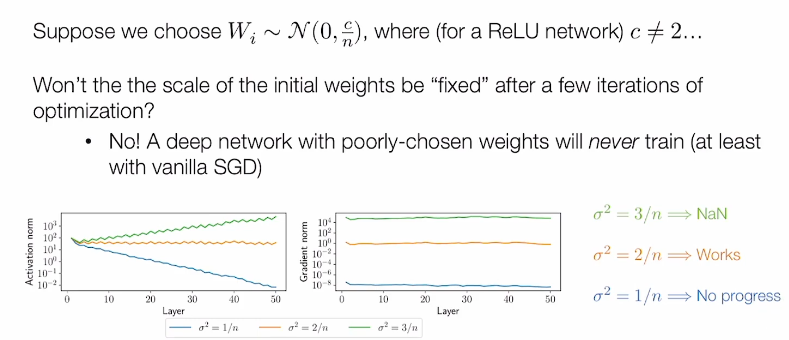
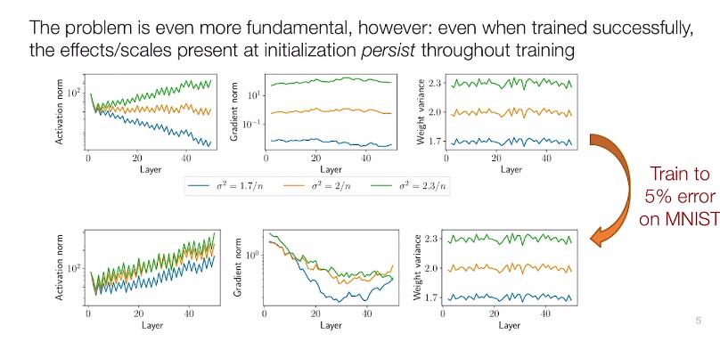
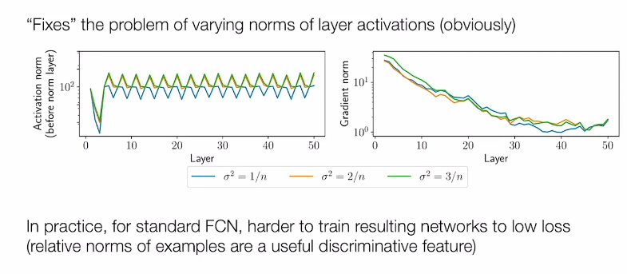
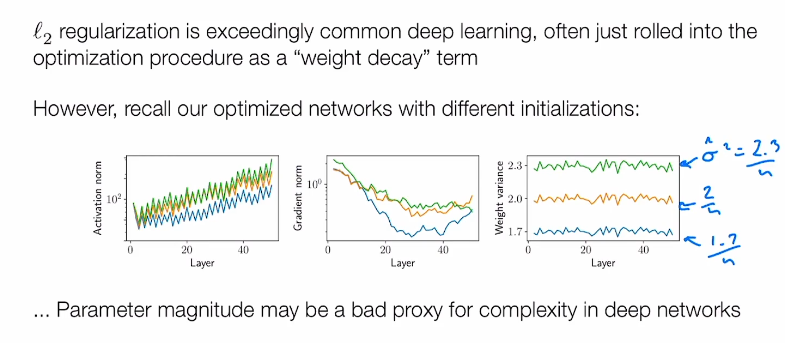
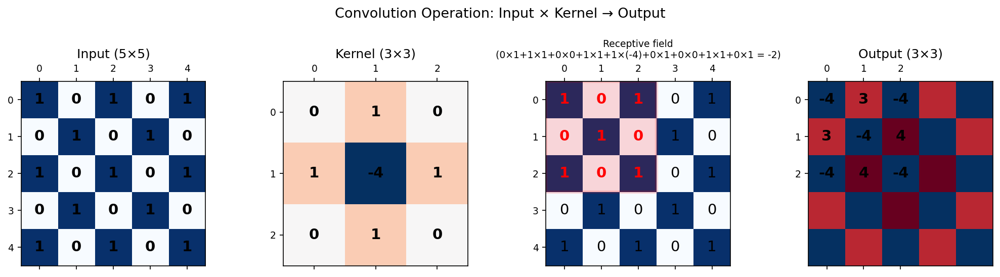
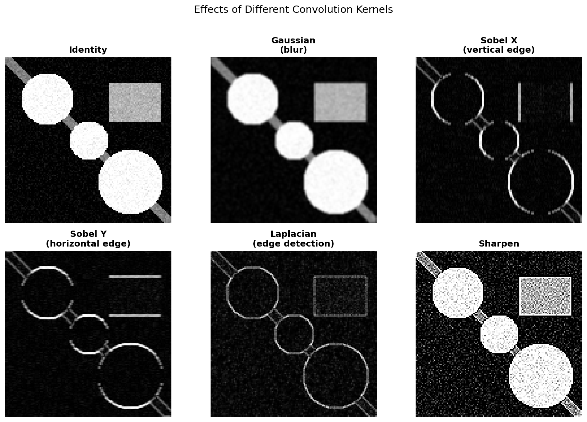
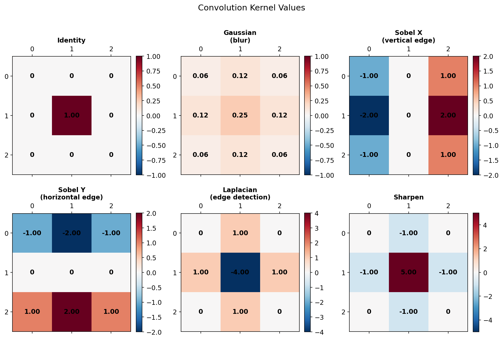
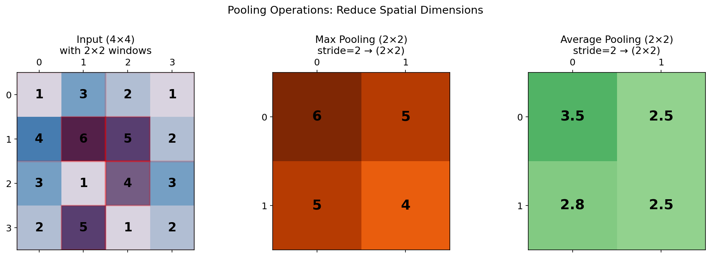
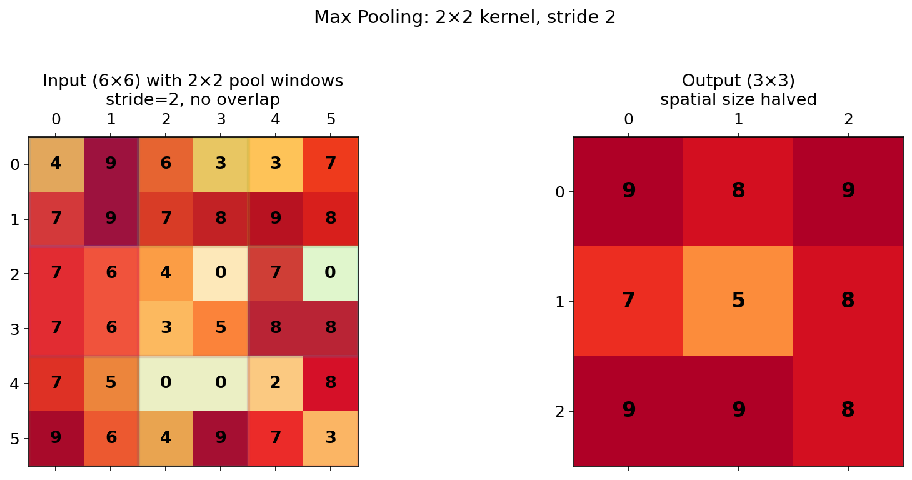

# 深度学习进阶 — 第二周

正则化 · 卷积神经网络 · 生成模型 · 扩散模型 · 序列与语言

---

## 总览

第二周将视野从全连接网络扩展到**更丰富的架构和任务**——卷积网络处理图像、生成模型创造新样本、序列模型处理语言：

| 日       | 主题                 | 核心技能                                                         |
| -------- | -------------------- | ---------------------------------------------------------------- |
| **W2D1** | 正则化               | 过拟合、Frobenius 范数、早停、数据增强、记忆化                   |
| **W2D2** | 卷积神经网络 (CNN)   | 卷积操作、池化、经典架构、特征可视化                             |
| **W2D3** | 生成模型             | 自编码器、PCA、变分自编码器 (VAE)、GAN 基础                      |
| **W2D4** | 扩散生成模型         | 前向扩散、Score 函数、反向 SDE、去噪分数匹配                     |
| **W2D5** | 序列与语言           | 词嵌入 (Word2Vec/FastText)、文本分类、RNN 基础                   |

**贯穿主题**：如何让模型**泛化**而非记忆？如何**生成**新数据？如何处理**序列**数据？

---

## W2D1：正则化

---

### 1. 过拟合问题

**过拟合**：模型在训练集上表现很好，但在测试集上表现差。

**根本原因**：模型容量（参数数量）相对于训练数据量过大，导致模型"记住"了训练数据中的噪声。

**经典表现**：训练 loss 持续下降，但验证 loss 先降后升。

---

### 2. Frobenius 范数与权重衰减

**Frobenius 范数**衡量权重矩阵的"大小"：

$$
\|A\|_F = \sqrt{\sum_{i,j} |a_{ij}|^2}
$$

**L2 正则化**（权重衰减）：在损失函数中添加权重的 Frobenius 范数惩罚：

$$
\mathcal{L}_{\text{total}} = \mathcal{L}_{\text{data}} + \lambda \sum_l \|\mathbf{W}^{(l)}\|_F^2
$$

**效果**：鼓励权重变小，降低模型复杂度，提高泛化能力。

```python
# PyTorch 中的 L2 正则化
optimizer = torch.optim.SGD(model.parameters(), lr=0.01, weight_decay=1e-4)
```

---

### 3. 早停 (Early Stopping)

**思想**：在验证集性能不再提升时停止训练。

```python
best_val_acc = 0
patience = 10
wait = 0

for epoch in range(max_epochs):
    train(...)
    val_acc = evaluate(...)

    if val_acc > best_val_acc:
        best_val_acc = val_acc
        best_model = copy.deepcopy(model)
        wait = 0
    else:
        wait += 1

    if wait > patience:
        print(f"Early stopping at epoch {epoch}")
        break
```

**超参数**：`patience`（容忍多少个 epoch 不提升）

---

### 4. 记忆化实验

**惊人的发现**：即使标签完全随机，足够大的网络也能达到 100% 训练准确率！

这说明训练准确率**不是**衡量模型好坏的指标——必须看验证/测试集。

---

### 5. 数据增强 (Data Augmentation)

通过对训练数据施加变换来"创造"更多样本：

| 变换         | 适用场景                 |
| ------------ | ------------------------ |
| 水平翻转     | 自然图像                 |
| 随机裁剪     | 图像分类                 |
| 颜色抖动     | 图像分类                 |
| 随机旋转     | 旋转不变的任务           |
| Mixup        | 两张图片线性插值         |
| CutMix       | 将一张图的区域贴到另一张 |

```python
transform = transforms.Compose([
    transforms.RandomHorizontalFlip(),
    transforms.RandomCrop(32, padding=4),
    transforms.ColorJitter(brightness=0.2, contrast=0.2),
    transforms.ToTensor(),
])
```

---

### 6. 归一化层 (Normalization Layers)

归一化层解决的核心问题：**Internal Covariate Shift**——随着训练进行，每层输入的分布不断变化，导致训练不稳定、收敛慢。

#### 6.1 Batch Normalization (BN)

**思想**：对每个 mini-batch 内的每个特征通道，沿 batch 维度归一化。

$$
\hat{x}_i = \frac{x_i - \mu_B}{\sqrt{\sigma_B^2 + \epsilon}}, \quad y_i = \gamma \hat{x}_i + \beta
$$

其中 $\mu_B = \frac{1}{m}\sum_{i=1}^m x_i$，$\sigma_B^2 = \frac{1}{m}\sum_{i=1}^m (x_i - \mu_B)^2$

**计算过程**（以线性层为例）：

```python
# 输入 x: (batch_size, features)
# 1. 沿 batch 维度计算均值和方差
mu = x.mean(dim=0)        # (features,)
var = x.var(dim=0)         # (features,)

# 2. 归一化
x_hat = (x - mu) / torch.sqrt(var + 1e-5)  # (batch_size, features)

# 3. 仿射变换（可学习参数）
gamma = nn.Parameter(torch.ones(features))   # 缩放
beta = nn.Parameter(torch.zeros(features))   # 偏移
y = gamma * x_hat + beta
```

**BN 的特点与问题**：

| 优点 | 缺点 |
|------|------|
| 加速收敛、允许更大学习率 | 依赖 batch size（太小则统计不稳定） |
| 有轻微正则化效果（batch 内引入噪声） | 训练和推理行为不同（用 running mean/var） |
| 缓解梯度消失/爆炸 | 不适用于序列长度可变的任务（RNN） |

```python
# PyTorch 中的 BatchNorm
bn = nn.BatchNorm1d(num_features=64)  # 对 64 维特征做 BN
x = torch.randn(32, 64)  # batch=32, features=64
y = bn(x)
print(y.shape)  # torch.Size([32, 64])
```

#### 6.2 Layer Normalization (LN)

**思想**：对每个样本内部的所有特征维度归一化（不依赖 batch）。

$$
\hat{x}_i = \frac{x_i - \mu_L}{\sqrt{\sigma_L^2 + \epsilon}}, \quad y_i = \gamma \hat{x}_i + \beta
$$

其中 $\mu_L = \frac{1}{d}\sum_{j=1}^d x_j$，$\sigma_L^2 = \frac{1}{d}\sum_{j=1}^d (x_j - \mu_L)^2$（在特征维度上计算）

**计算过程**：

```python
# 输入 x: (batch_size, features)
# 1. 沿特征维度计算均值和方差（每个样本独立）
mu = x.mean(dim=-1, keepdim=True)    # (batch_size, 1)
var = x.var(dim=-1, keepdim=True)     # (batch_size, 1)

# 2. 归一化
x_hat = (x - mu) / torch.sqrt(var + 1e-5)

# 3. 仿射变换
y = gamma * x_hat + beta
```

**LN vs BN 的关键区别**：

```python
x = torch.randn(32, 64)  # (batch, features)

# BN: 统计量在 batch 维度上计算 → (features,) 个统计量
bn = nn.BatchNorm1d(64)
print(bn(x).shape)  # (32, 64)

# LN: 统计量在特征维度上计算 → (batch_size,) 个统计量（每个样本一个）
ln = nn.LayerNorm(64)
print(ln(x).shape)  # (32, 64)
```

| | BatchNorm | LayerNorm |
|---|---|---|
| **归一化维度** | 沿 batch 维度 | 沿特征维度 |
| **依赖 batch size** | ✅ 是 | ❌ 否 |
| **训练/推理一致性** | ❌ 不同（用 running stats） | ✅ 相同 |
| **适用场景** | CNN、固定长度输入 | Transformer、RNN、变长序列 |

#### 6.3 RMS Normalization (RMSNorm)

**思想**：去掉均值中心化，只做缩放归一化（更简单、更快）。

$$
\text{RMS}(x) = \sqrt{\frac{1}{d}\sum_{i=1}^d x_i^2}, \quad \hat{x}_i = \frac{x_i}{\text{RMS}(x)} \cdot \gamma_i
$$

**与 LayerNorm 的区别**：去掉了减均值和偏置项 $\beta$，计算更简洁。

```python
class RMSNorm(nn.Module):
    def __init__(self, dim, eps=1e-6):
        super().__init__()
        self.eps = eps
        self.weight = nn.Parameter(torch.ones(dim))

    def forward(self, x):
        rms = torch.sqrt(torch.mean(x ** 2, dim=-1, keepdim=True) + self.eps)
        return x / rms * self.weight
```

**为什么 RMSNorm 更受欢迎**（在 LLM 中）：

| | LayerNorm | RMSNorm |
|---|---|---|
| **计算** | 减均值 + 除标准差 | 只除 RMS |
| **参数** | $\gamma$ + $\beta$ | 只有 $\gamma$ |
| **速度** | 较慢 | 更快（省去均值计算） |
| **效果** | 良好 | 几乎相同甚至更好 |

> LLaMA、Gemma 等现代大语言模型普遍使用 RMSNorm 替代 LayerNorm。

#### 6.4 实验：归一化与初始化的交互



**图 1：初始权重尺度对训练的决定性作用**

以 ReLU 网络为例，展示不同初始方差 $\sigma^2$ 的效果：
- 方差过大（$\sigma^2 = 3/n$）→ 激活值和梯度爆炸（NaN）
- 方差过小（$\sigma^2 = 1/n$）→ 梯度消失，模型"毫无进展"
- 合适方差（$\sigma^2 = 2/n$，即 Kaiming 初始化）→ 网络正常工作



**图 2：初始化的影响贯穿训练全程**

即使网络被训练到 MNIST 5% 错误率，不同初始化导致的激活范数、梯度范数、权重方差的差异**在训练结束后依然保留**。初始化不是"训练几轮就自动修复"的问题。



**图 3：归一化的修复作用及其副作用**

Layer Normalization 能消除不同初始化带来的尺度差异，强制各层激活范数相近。但在标准全连接网络中，这样做反而让网络**更难训练到低损失**——因为样本的相对范数本身也是有用的判别特征，抹平这些信息不利于学习。



**图 4：对 L2 正则化（权重衰减）有效性的反思**

由于初始化的历史影响在训练后依然保留，不同初始化导致模型最终的权重幅度截然不同。这表明**参数幅度可能并不是衡量模型复杂度的良好代理指标**——用权重衰减来控制复杂度，可能受初始化干扰太大。

> **核心结论**：
> 1. 初始化的方差选择是**生死攸关**的——选错了模型根本无法训练
> 2. 初始化的影响**不会被训练消除**，会贯穿整个训练过程
> 3. 归一化能修复尺度问题，但可能**牺牲部分表达能力**
> 4. L2 正则化的效果可能被初始化干扰，需要谨慎使用
---

### 7. 权重初始化 (Weight Initialization)

**为什么初始化很重要？**

- 初始化太大 → 激活值爆炸、梯度爆炸
- 初始化太小 → 激活值消失、梯度消失
- 好的初始化：让每层的输出方差保持稳定

#### 7.1 Xavier Initialization (Glorot Initialization)

**目标**：让前向传播和反向传播中，每层输出的方差保持不变。

**推导**：对于线性层 $y = Wx$，假设 $x$ 和 $W$ 独立且均值为 0：

$$
\text{Var}(y) = n_{\text{in}} \cdot \text{Var}(W) \cdot \text{Var}(x)
$$

要让 $\text{Var}(y) = \text{Var}(x)$，需要：

$$
\text{Var}(W) = \frac{1}{n_{\text{in}}}
$$

同时考虑反向传播（梯度从 $y$ 传回 $x$），需要 $\text{Var}(W) = \frac{1}{n_{\text{out}}}$。

**折中方案**：

$$
W \sim \mathcal{N}\left(0, \frac{2}{n_{\text{in}} + n_{\text{out}}}\right) \quad \text{或} \quad W \sim \mathcal{U}\left(-\sqrt{\frac{6}{n_{\text{in}} + n_{\text{out}}}}, \sqrt{\frac{6}{n_{\text{in}} + n_{\text{out}}}}\right)
$$

```python
# PyTorch 中的 Xavier 初始化
linear = nn.Linear(256, 128)
nn.init.xavier_uniform_(linear.weight)   # 均匀分布
nn.init.xavier_normal_(linear.weight)    # 正态分布

print(f"fan_in={linear.weight.shape[1]}, fan_out={linear.weight.shape[0]}")
# fan_in=256, fan_out=128
print(f"std={torch.sqrt(torch.tensor(2.0 / (256 + 128))):.4f}")
# std=0.0722
```

**适用场景**：Sigmoid、Tanh 激活函数（输出均值为 0 附近）。

#### 7.2 Kaiming Initialization (He Initialization)

**问题**：ReLU 会将一半的激活值置零，导致方差减半。Xavier 没有考虑这一点。

**推导**：对于 ReLU 激活，$\text{Var}(\text{ReLU}(x)) = \frac{1}{2}\text{Var}(x)$，所以：

$$
\text{Var}(y) = \frac{1}{2} n_{\text{in}} \cdot \text{Var}(W) \cdot \text{Var}(x)
$$

要让 $\text{Var}(y) = \text{Var}(x)$：

$$
\text{Var}(W) = \frac{2}{n_{\text{in}}}
$$

$$
W \sim \mathcal{N}\left(0, \frac{2}{n_{\text{in}}}\right) \quad \text{或} \quad W \sim \mathcal{U}\left(-\sqrt{\frac{6}{n_{\text{in}}}}, \sqrt{\frac{6}{n_{\text{in}}}}\right)
$$

```python
# PyTorch 中的 Kaiming 初始化
linear = nn.Linear(256, 128)
nn.init.kaiming_uniform_(linear.weight, mode='fan_in', nonlinearity='relu')
nn.init.kaiming_normal_(linear.weight, mode='fan_in', nonlinearity='relu')

print(f"fan_in={linear.weight.shape[1]}")
# fan_in=256
print(f"std={torch.sqrt(torch.tensor(2.0 / 256)):.4f}")
# std=0.0884
```

**`mode` 参数**：

```python
# fan_in: 保持前向传播方差稳定（常用）
nn.init.kaiming_normal_(w, mode='fan_in', nonlinearity='relu')

# fan_out: 保持反向传播方差稳定
nn.init.kaiming_normal_(w, mode='fan_out', nonlinearity='relu')
```

**适用场景**：ReLU 及其变体（Leaky ReLU、PReLU 等）。

#### 7.3 Xavier vs Kaiming 对比

| | Xavier | Kaiming |
|---|---|---|
| **方差** | $\frac{2}{n_{\text{in}} + n_{\text{out}}}$ | $\frac{2}{n_{\text{in}}}$ |
| **适用激活** | Sigmoid, Tanh | ReLU, Leaky ReLU |
| **核心思想** | 前向+反向方差折中 | 考虑 ReLU 的半区置零 |
| **PyTorch** | `xavier_uniform_`, `xavier_normal_` | `kaiming_uniform_`, `kaiming_normal_` |

```python
# 实际使用示例
def init_weights(m):
    if isinstance(m, nn.Linear):
        nn.init.kaiming_normal_(m.weight, nonlinearity='relu')
        if m.bias is not None:
            nn.init.zeros_(m.bias)

model = MyNet()
model.apply(init_weights)  # 递归应用到所有子模块
```

> **现代实践**：PyTorch 的 `nn.Linear` 默认使用 Kaiming 初始化（`fan_in` 模式），通常不需要手动设置。但对于自定义层或特殊架构，理解初始化原理仍然很重要。

---

### 1. 为什么需要 CNN？

全连接网络处理图像的问题：
- 参数太多：$28 \times 28 = 784$ 像素，隐藏层 1000 → $784 \times 1000 = 784,000$ 参数
- 不具备平移不变性

**CNN 的核心思想**：
- **局部连接**：每个神经元只看输入的一个小区域
- **参数共享**：同一个卷积核在整个输入上滑动
- **平移等变性**：物体在图像中平移，特征图也平移

---

### 2. 卷积操作

#### 2.1 1D 卷积

$$
y[i] = \sum_{k=0}^{K-1} w[k] \cdot x[i+k]
$$

#### 2.2 2D 卷积

$$
y[i,j] = \sum_{m=0}^{M-1}\sum_{n=0}^{N-1} w[m,n] \cdot x[i+m, j+n]
$$

**卷积运算过程示意**：



- **输入**：5×5 的矩阵
- **卷积核**：3×3 的 Laplacian 核（边缘检测）
- **过程**：卷积核在输入上滑动，每个位置做逐元素相乘再求和
- **输出**：3×3 的特征图（比输入小，因为没有 padding）

**不同卷积核的效果对比**：



**常用卷积核的数值**：



| 卷积核 | 作用 | 特点 |
|--------|------|------|
| **Identity** | 恒等变换 | 输出 = 输入 |
| **Gaussian** | 高斯模糊 | 权重为正，中心权重最大，用于降噪 |
| **Sobel X** | 检测垂直边缘 | 水平方向差分 |
| **Sobel Y** | 检测水平边缘 | 垂直方向差分 |
| **Laplacian** | 边缘检测 | 二阶导数，对噪声敏感 |
| **Sharpen** | 锐化 | 增强中心像素，抑制邻域 |

```python
# PyTorch 卷积层
conv = nn.Conv2d(
    in_channels=3,      # 输入通道数（RGB = 3）
    out_channels=16,    # 输出通道数（卷积核数量）
    kernel_size=3,      # 卷积核大小
    stride=1,           # 步长
    padding=1           # 填充（保持空间尺寸）
)

x = torch.randn(1, 3, 32, 32)  # (batch, channels, height, width)
y = conv(x)  # (1, 16, 32, 32)
```

#### 2.3 输出尺寸计算

$$
H_{\text{out}} = \left\lfloor\frac{H_{\text{in}} + 2 \cdot \text{padding} - \text{kernel\_size}}{\text{stride}}\right\rfloor + 1
$$

---

### 3. 池化 (Pooling)

**最大池化**：取局部区域的最大值

$$
y[i,j] = \max_{(m,n) \in \mathcal{R}_{i,j}} x[m,n]
$$

**平均池化**：取局部区域的均值

$$
y[i,j] = \frac{1}{|\mathcal{R}_{i,j}|} \sum_{(m,n) \in \mathcal{R}_{i,j}} x[m,n]
$$

**最大池化 vs 平均池化**：



- **最大池化**：保留每个窗口中的最大值（红色高亮），保留最强特征
- **平均池化**：计算每个窗口的均值，保留整体信息

**池化的步长效果**：



- 2×2 池化 + stride=2：空间尺寸减半（6×6 → 3×3）
- 窗口不重叠，每个元素只参与一次池化

```python
# 最大池化
max_pool = nn.MaxPool2d(kernel_size=2, stride=2)
x = torch.randn(1, 16, 32, 32)
y = max_pool(x)
print(y.shape)
# torch.Size([1, 16, 16, 16])  — 空间尺寸减半

# 平均池化
avg_pool = nn.AvgPool2d(kernel_size=2, stride=2)
y = avg_pool(x)
print(y.shape)
# torch.Size([1, 16, 16, 16])

# 全局平均池化（常用于分类网络的最后一层）
gap = nn.AdaptiveAvgPool2d(1)  # 输出大小固定为 1×1
y = gap(x)
print(y.shape)
# torch.Size([1, 16, 1, 1])  — 每个通道变成一个标量
```

**作用**：降低空间分辨率，增大感受野，提供一定的平移不变性。

---

### 4. 经典 CNN 架构

| 架构      | 年份  | 关键创新                           |
| --------- | ----- | ---------------------------------- |
| **LeNet** | 1998  | 卷积 + 池化 + 全连接的经典结构     |
| **AlexNet** | 2012 | ReLU、Dropout、GPU 训练          |
| **VGG**   | 2014  | 小卷积核 (3×3) 堆叠               |
| **GoogLeNet** | 2014 | Inception 模块（多尺度）       |
| **ResNet** | 2015 | 残差连接（跳跃连接）             |
| **DenseNet** | 2017 | 密集连接                       |

---

### 5. 残差连接 (Residual Connection)

ResNet 的核心创新：

$$
\mathbf{y} = F(\mathbf{x}) + \mathbf{x}
$$

**为什么有效**：
- 梯度可以通过跳跃连接直接流过，缓解梯度消失
- 网络只需要学习"残差" $F(\mathbf{x}) = \mathbf{y} - \mathbf{x}$
- 恒等映射很容易学习，所以额外层不会损害性能

```python
class ResBlock(nn.Module):
    def __init__(self, channels):
        super().__init__()
        self.conv1 = nn.Conv2d(channels, channels, 3, padding=1)
        self.conv2 = nn.Conv2d(channels, channels, 3, padding=1)

    def forward(self, x):
        residual = x
        x = F.relu(self.conv1(x))
        x = self.conv2(x)
        return F.relu(x + residual)  # 跳跃连接
```

---

## W2D3：生成模型

---

### 1. 生成模型 vs 判别模型

|            | 判别模型           | 生成模型           |
| ---------- | ------------------ | ------------------ |
| **目标**   | $p(y \mid x)$      | $p(x)$ 或 $p(x, y)$ |
| **含义**   | 给定输入 $x$，判断它属于类别 $y$ 的概率有多大 | 学会数据本身的分布，从而能采样生成新数据 |
| **任务**   | 分类、回归         | 生成新样本、密度估计 |
| **例子**   | MLP, CNN           | VAE, GAN, Diffusion |

**直觉**：
- **判别模型**：给一张猫的图片，问"这是猫还是狗？"→ 输出 $p(\text{猫} \mid \text{图片})$
- **生成模型**：学习"猫图片长什么样"→ 能自己画出一张新的猫图片

---

### 2. 自编码器 (Autoencoder)

#### 2.1 核心思想

自编码器是一种**无监督**的神经网络，目标是学习数据的**压缩表示**。

**结构**：编码器 + 瓶颈层 + 解码器

$$
\mathbf{x} \xrightarrow{\text{Encoder}} \mathbf{h} \xrightarrow{\text{Decoder}} \hat{\mathbf{x}}
$$

- **编码器** $f_\phi$：将高维输入 $\mathbf{x} \in \mathbb{R}^D$ 压缩为低维隐变量 $\mathbf{h} \in \mathbb{R}^d$（$d \ll D$）
- **解码器** $g_\theta$：从隐变量 $\mathbf{h}$ 重建原始输入 $\hat{\mathbf{x}}$
- **瓶颈层**：强制网络学习数据的**本质特征**（不能简单复制输入）

#### 2.2 最简单的自编码器

```python
import torch
import torch.nn as nn

class AutoEncoder(nn.Module):
    def __init__(self, input_dim=784, hidden_dim=32):
        super().__init__()
        # 编码器：784 → 128 → 32
        self.encoder = nn.Sequential(
            nn.Linear(input_dim, 128),
            nn.ReLU(),
            nn.Linear(128, hidden_dim),
            nn.ReLU()
        )
        # 解码器：32 → 128 → 784
        self.decoder = nn.Sequential(
            nn.Linear(hidden_dim, 128),
            nn.ReLU(),
            nn.Linear(128, input_dim),
            nn.Sigmoid()  # 输出在 [0,1] 范围（适合 MNIST）
        )

    def forward(self, x):
        h = self.encoder(x)           # 编码: (B, 784) → (B, 32)
        x_hat = self.decoder(h)       # 解码: (B, 32) → (B, 784)
        return x_hat

# 创建模型
model = AutoEncoder(input_dim=784, hidden_dim=32)

# 查看参数量
print(f"Encoder params: {sum(p.numel() for p in model.encoder.parameters())}")
# Encoder params: 101152 = 784*128 + 128 + 128*32 + 32

print(f"Decoder params: {sum(p.numel() for p in model.decoder.parameters())}")
# Decoder params: 101536 = 32*128 + 128 + 128*784 + 784

print(f"Total: {sum(p.numel() for p in model.parameters())}")
# Total: 202688
```

#### 2.3 训练自编码器

```python
# 训练循环
optimizer = torch.optim.Adam(model.parameters(), lr=1e-3)
loss_fn = nn.MSELoss()

for epoch in range(num_epochs):
    for batch_x, _ in train_loader:  # 注意：不需要标签！
        batch_x = batch_x.view(-1, 784)  # 展平

        x_hat = model(batch_x)            # 前向传播
        loss = loss_fn(x_hat, batch_x)    # 重建误差

        optimizer.zero_grad()
        loss.backward()
        optimizer.step()
```

**关键点**：
- 损失函数是**重建误差**（MSE 或交叉熵）
- **不需要标签**——这是无监督学习
- 瓶颈层维度 $d$ 越小，压缩越狠，重建越模糊

#### 2.4 线性自编码器 ≈ PCA

当编码器和解码器都是**线性映射**（无激活函数）时，自编码器学到的子空间与 PCA 相同。

$$
\hat{\mathbf{x}} = W_2 W_1 \mathbf{x}
$$

其中 $W_1 \in \mathbb{R}^{d \times D}$ 是编码矩阵，$W_2 \in \mathbb{R}^{D \times d}$ 是解码矩阵。最优解的列空间与 PCA 的前 $d$ 个主成分相同。

#### 2.5 自编码器的局限

自编码器学会了**压缩和重建**，但它的隐空间**没有结构**：
- 隐空间不连续——两个相邻的 $\mathbf{h}$ 解码后可能完全不同
- 无法从隐空间**采样**生成新数据——因为不知道哪些 $\mathbf{h}$ 是"合法的"

> 这正是 VAE 要解决的问题。

---

### 3. 变分自编码器 (VAE)

#### 3.1 核心思想

> **生成模型的目标**：学会数据分布 $p(x)$，从而能采样生成新数据。

**VAE 的策略**：假设数据由低维隐变量 $\mathbf{z}$ 生成（先采样 $\mathbf{z}$，再经 Decoder 映射成 $\mathbf{x}$）：

$$
p(\mathbf{x}) = \int p(\mathbf{x}|\mathbf{z})\,p(\mathbf{z})\,d\mathbf{z}
$$

> **流形假设**：高维数据的实际自由度远低于维度。例如 28×28 的手写数字（784 维），变化因素只有笔画粗细、倾斜角度等约 10-20 个因素。VAE 用一个低维向量 $\mathbf{z}$（如 20 维）表示这些潜在因素，并且认为 $\mathbf{z}$ 服从标准正态分布（先验假设）。

**两个核心困难**：

1. $p(\mathbf{x}) = \int p(\mathbf{x}|\mathbf{z})p(\mathbf{z})d\mathbf{z}$ 需要对所有可能的 $\mathbf{z}$ 求积分，高维空间不可行
2. 训练还需要后验 $p(\mathbf{z}|\mathbf{x}) = \frac{p(\mathbf{x}|\mathbf{z})p(\mathbf{z})}{p(\mathbf{x})}$，但分母 $p(\mathbf{x})$ 就是不可解的积分

> **VAE 的解法——变分推断**：既然真实后验 $p(\mathbf{z}|\mathbf{x})$ 算不出来，就训练一个 Encoder 网络 $q_\phi(\mathbf{z}|\mathbf{x})$（输出高斯分布的参数 $\mu, \sigma$）去近似它。然后优化一个可计算的下界 ELBO 来替代不可解的积分。
>
> "变分"来自变分法（Calculus of Variations）——在一族函数中找最优的那个。

#### 3.2 架构

```
x  →  [Encoder q_φ(z|x)]  →  μ, log σ²
                                ↓
                         z = μ + σ·ε    (ε ~ N(0,I), 重参数化)
                                ↓
z  →  [Decoder p_θ(x|z)]  →  x̂ (重建)
```

- **编码器** $q_\phi(\mathbf{z}|\mathbf{x})$：数据 → 隐变量分布的参数（均值 $\mu$、方差 $\sigma^2$）
- **解码器** $p_\theta(\mathbf{x}|\mathbf{z})$：隐变量 → 重建数据

#### 3.3 ELBO 推导

**出发点**：最大化对数似然 $\log p_\theta(\mathbf{x})$，但 $p_\theta(\mathbf{x}) = \int p_\theta(\mathbf{x}|\mathbf{z})p(\mathbf{z})d\mathbf{z}$ 不可计算。

> 为什么用 $\log$ 而非 $p(\mathbf{x})$？
> 1. 数值稳定——$p(\mathbf{x})$ 在高维空间极小（如 $10^{-300}$），取 log 后正常
> 2. 乘法变加法——联合似然 $\prod p(\mathbf{x}_i)$ 取 log 后变为 $\sum \log p(\mathbf{x}_i)$

**引入变分分布** $q_\phi(\mathbf{z}|\mathbf{x})$，用 Jensen 不等式：

$$
\log p_\theta(\mathbf{x}) = \log \mathbb{E}_{q_\phi(\mathbf{z}|\mathbf{x})}\left[\frac{p_\theta(\mathbf{x}, \mathbf{z})}{q_\phi(\mathbf{z}|\mathbf{x})}\right] \geq \mathbb{E}_{q_\phi(\mathbf{z}|\mathbf{x})}\left[\log \frac{p_\theta(\mathbf{x}, \mathbf{z})}{q_\phi(\mathbf{z}|\mathbf{x})}\right]
$$

这个下界就是 **ELBO**（Evidence Lower Bound，证据下界）。

**ELBO 的分解**：

$$
\text{ELBO} = \underbrace{\mathbb{E}_{q_\phi(\mathbf{z}|\mathbf{x})}[\log p_\theta(\mathbf{x}|\mathbf{z})]}_{\text{重建项}} - \underbrace{D_{\text{KL}}(q_\phi(\mathbf{z}|\mathbf{x}) \| p(\mathbf{z}))}_{\text{KL 正则项}}
$$

**ELBO 与真实似然的关系**：

$$
\log p_\theta(\mathbf{x}) = \text{ELBO} + D_{\text{KL}}(q_\phi(\mathbf{z}|\mathbf{x}) \| p_\theta(\mathbf{z}|\mathbf{x}))
$$

因为 $D_{\text{KL}} \geq 0$，所以 $\log p_\theta(\mathbf{x}) \geq \text{ELBO}$。最大化 ELBO 同时做到两件事：
1. 最大化数据似然（让生成模型变好）
2. 最小化近似间隙（让 Encoder 近似更准确）

#### 3.4 损失函数最终形式

$$
\mathcal{L}_{\text{VAE}} = -\mathbb{E}_{q_\phi(\mathbf{z}|\mathbf{x})}[\log p_\theta(\mathbf{x}|\mathbf{z})] + D_{\text{KL}}(q_\phi(\mathbf{z}|\mathbf{x}) \| p(\mathbf{z}))
$$

| 项 | 含义 | 直觉 |
|---|---|---|
| $-\mathbb{E}[\log p_\theta(\mathbf{x}\|\mathbf{z})]$ | Decoder 从 $\mathbf{z}$ 重建 $\mathbf{x}$ 的负对数似然 | 若 Decoder 输出高斯分布，就是 MSE |
| $D_{\text{KL}}(q \| p)$ | Encoder 输出的分布偏离先验 $\mathcal{N}(0,I)$ 的程度 | 让隐空间平滑可采样 |

> **为什么重建损失是 MSE？** 假设 $p_\theta(\mathbf{x}|\mathbf{z}) = \mathcal{N}(\mathbf{x}; \boldsymbol{\mu}_\theta(\mathbf{z}), \sigma^2 I)$，则 $-\log p_\theta(\mathbf{x}|\mathbf{z}) = \frac{\|\mathbf{x} - \boldsymbol{\mu}_\theta(\mathbf{z})\|^2}{2\sigma^2} + \text{const}$，忽略常数后就是 MSE。

#### 3.5 重参数化技巧

> **问题**：从 $q_\phi(\mathbf{z}|\mathbf{x}) = \mathcal{N}(\boldsymbol{\mu}_\phi(\mathbf{x}), \boldsymbol{\sigma}^2_\phi(\mathbf{x}))$ 中采样 $\mathbf{z}$ 的操作不可微，梯度无法从 Decoder 流回 Encoder。

> **解决方案**：把随机性"外包"给外部噪声
>
> $$\mathbf{z} = \boldsymbol{\mu} + \boldsymbol{\sigma} \odot \boldsymbol{\epsilon}, \quad \boldsymbol{\epsilon} \sim \mathcal{N}(0, I)$$
>
> - $\boldsymbol{\epsilon}$ 从固定分布采样（与参数 $\phi$ 无关）
> - $\mathbf{z}$ 对 $\boldsymbol{\mu}$ 和 $\boldsymbol{\sigma}$ 是可微的确定性函数：$\frac{\partial \mathbf{z}}{\partial \boldsymbol{\mu}} = 1, \frac{\partial \mathbf{z}}{\partial \boldsymbol{\sigma}} = \boldsymbol{\epsilon}$

```python
def reparameterize(mu, log_var):
    """重参数化：z = μ + σ * ε, ε ~ N(0,I)"""
    std = torch.exp(0.5 * log_var)  # σ = exp(0.5 * log σ²)
    eps = torch.randn_like(std)      # ε ~ N(0,I)
    return mu + eps * std            # z = μ + σ * ε
```

> **重参数化的通用性**：重参数化并非 VAE 独有，是随机计算图中的通用方法。**Diffusion 中的前向过程 $\mathbf{x}_t = \sqrt{\bar\alpha_t} \mathbf{x}_0 + \sqrt{1-\bar\alpha_t}\boldsymbol{\epsilon}$ 本质上也是重参数化。**

#### 3.6 KL 散度闭式解

当 $q(\mathbf{z}|\mathbf{x}) = \mathcal{N}(\boldsymbol{\mu}, \text{diag}(\boldsymbol{\sigma}^2))$，$p(\mathbf{z}) = \mathcal{N}(0, I)$ 时，KL 散度有闭式解：

$$
D_{\text{KL}} = -\frac{1}{2}\sum_{j=1}^{d}\left(1 + \log\sigma_j^2 - \mu_j^2 - \sigma_j^2\right)
$$

> 这避免了蒙特卡洛采样估计 KL 散度带来的方差。

#### 3.7 完整 VAE 实现

```python
class VAE(nn.Module):
    def __init__(self, input_dim=784, hidden_dim=256, latent_dim=20):
        super().__init__()
        # 编码器：输出 μ 和 log σ²
        self.encoder = nn.Sequential(
            nn.Linear(input_dim, hidden_dim),
            nn.ReLU(),
            nn.Linear(hidden_dim, hidden_dim),
            nn.ReLU()
        )
        self.fc_mu = nn.Linear(hidden_dim, latent_dim)      # μ
        self.fc_logvar = nn.Linear(hidden_dim, latent_dim)   # log σ²

        # 解码器
        self.decoder = nn.Sequential(
            nn.Linear(latent_dim, hidden_dim),
            nn.ReLU(),
            nn.Linear(hidden_dim, hidden_dim),
            nn.ReLU(),
            nn.Linear(hidden_dim, input_dim),
            nn.Sigmoid()
        )

    def encode(self, x):
        h = self.encoder(x)
        return self.fc_mu(h), self.fc_logvar(h)

    def reparameterize(self, mu, logvar):
        std = torch.exp(0.5 * logvar)
        eps = torch.randn_like(std)
        return mu + eps * std

    def decode(self, z):
        return self.decoder(z)

    def forward(self, x):
        mu, logvar = self.encode(x)
        z = self.reparameterize(mu, logvar)
        x_hat = self.decode(z)
        return x_hat, mu, logvar


def vae_loss(x_hat, x, mu, logvar):
    """VAE 损失 = 重建损失 + KL 散度"""
    # 重建损失（MSE 或 BCE）
    recon_loss = nn.functional.mse_loss(x_hat, x, reduction='sum')

    # KL 散度闭式解
    kl_loss = -0.5 * torch.sum(1 + logvar - mu.pow(2) - logvar.exp())

    return recon_loss + kl_loss
```

#### 3.8 VAE 的本质困境

**重建 vs 正则化的张力**：

- **重建项**想让 Encoder 把尽可能多的信息塞进 $\mathbf{z}$ → $\sigma$ 越小越好
- **KL 项**想让 $q(\mathbf{z}|\mathbf{x})$ 接近 $\mathcal{N}(0,I)$ → $\mu \to 0$，$\sigma \to 1$

这种张力导致 VAE 生成的图像往往偏模糊——它是所有可能重建的"平均"。

**后验坍缩（Posterior Collapse）**：当 Decoder 太强大时（如自回归 Decoder），它可以忽略 $\mathbf{z}$ 直接从上下文生成 $\mathbf{x}$。此时 $q(\mathbf{z}|\mathbf{x}) \approx p(\mathbf{z})$，$\mathbf{z}$ 不再携带任何信息。

缓解方法：KL 退火、$\beta$-VAE（调节 KL 权重）、Free bits（给每维 KL 设最小值）。

#### 3.9 VAE vs 自编码器

| | 自编码器 | VAE |
|---|---|---|
| **编码器输出** | 一个确定的点 $\mathbf{h}$ | 一个分布 $q(\mathbf{z}\|\mathbf{x})$ |
| **隐空间** | 无结构，不可采样 | 有结构（接近 $\mathcal{N}(0,I)$），可采样 |
| **能否生成** | ❌ 不能 | ✅ 可以从 $p(\mathbf{z})$ 采样生成 |
| **损失函数** | 重建误差 | 重建损失 + KL 散度 |
| **训练方式** | 确定性 | 随机（重参数化） |

#### 3.10 VAE 的应用

- **Stable Diffusion 的图像编解码器**（KL-VAE）：把 512×512 图压缩到 64×64 隐空间
- 异常检测、数据增强、半监督学习
- 隐空间插值、属性编辑

---

### 4. GAN 基础

**生成对抗网络**：两个网络对抗训练

- **生成器** $G$：从噪声 $\mathbf{z}$ 生成假样本
- **判别器** $D$：区分真假样本

$$
\min_G \max_D \; \mathbb{E}_{\mathbf{x} \sim p_{\text{data}}}[\log D(\mathbf{x})] + \mathbb{E}_{\mathbf{z} \sim p(\mathbf{z})}[\log(1 - D(G(\mathbf{z})))]
$$

---

## W2D4：扩散生成模型

---

### 1. 核心思想

> 如果知道如何把一张图片逐渐"腐蚀"成噪声，那么学会"逆转腐蚀"的过程就等于学会了生成。

**两步走**：

1. **前向过程（固定，不需要学习）**：对数据逐步加高斯噪声，$T$ 步后变成纯噪声
2. **反向过程（需要学习）**：训练神经网络逐步去噪，把纯噪声变回数据

```
前向: x_0 → x_1 → x_2 → ... → x_T    (逐步加噪，信号衰减)
反向: x_T → x_{T-1} → ... → x_0      (逐步去噪，网络预测噪声)
```

**信噪比**：$\mathrm{SNR}(t) = \frac{\bar\alpha_t}{1-\bar\alpha_t}$，随 $t$ 增大单调递减。

---

### 2. 前向过程（加噪）

#### 2.1 单步加噪

定义噪声调度 $\beta_1, \beta_2, \ldots, \beta_T$（通常 $\beta_t \in [0.0001, 0.02]$，$T=1000$）：

$$q(x_t | x_{t-1}) = \mathcal{N}(x_t; \sqrt{1-\beta_t}\, x_{t-1}, \beta_t I)$$

重参数化形式：

$$x_t = \sqrt{1-\beta_t}\, x_{t-1} + \sqrt{\beta_t}\, \epsilon_t, \quad \epsilon_t \sim \mathcal{N}(0, I)$$

定义 $\alpha_t = 1 - \beta_t$，等价形式：

$$x_t = \sqrt{\alpha_t}\, x_{t-1} + \sqrt{1-\alpha_t}\, \epsilon_t$$

> **方差守恒**：系数设计保证了 $(\sqrt{\alpha_t})^2 + (\sqrt{1-\alpha_t})^2 = 1$，每步加噪后方差不发散也不坍缩。

#### 2.2 闭式解（核心推导）

定义 $\bar{\alpha}_t = \prod_{s=1}^{t}\alpha_s$。利用独立高斯的可加性（$a\epsilon_1 + b\epsilon_2 \sim \mathcal{N}(0, (a^2+b^2)I)$），可以一步直接算出任意时刻的 $x_t$：

$$x_t = \sqrt{\bar{\alpha}_t}\, x_0 + \sqrt{1-\bar{\alpha}_t}\, \epsilon, \quad \epsilon \sim \mathcal{N}(0, I)$$

或写为分布形式：

$$q(x_t | x_0) = \mathcal{N}(x_t; \sqrt{\bar{\alpha}_t}\, x_0, (1-\bar{\alpha}_t)\, I)$$

当 $t = T$ 时，$\bar{\alpha}_T \approx 0$，所以 $x_T \approx \mathcal{N}(0, I)$。

> **这是 Diffusion 中最重要的数学推导之一**：闭式解让训练时可以随机采样任意 $t$，一步构造 $x_t$，无需逐步加噪。

---

### 3. 反向过程（核心难点）

#### 3.1 问题：$q(x_{t-1}|x_t)$ 为什么不可算？

用贝叶斯定理展开：

$$q(x_{t-1}|x_t) = \frac{q(x_t|x_{t-1}) \cdot q(x_{t-1})}{q(x_t)}$$

- $q(x_t|x_{t-1})$ 是已知的高斯 ✓
- $q(x_{t-1})$ 和 $q(x_t)$ 是**边际分布**，需要对整个数据分布积分：

$$q(x_{t-1}) = \int q(x_{t-1}|x_0) \cdot q_{\text{data}}(x_0) \, dx_0$$

这是 $N$ 个高斯的**混合**（不是线性组合），是一个极其复杂的多峰分布，没有闭式表达。

> **关键区分——高斯的"线性组合" vs "混合"**：
> - **线性组合** $Z = aX + bY$：对随机变量的采样值做算术运算，结果仍是高斯（如前向过程中的噪声合并）
> - **混合** $p(x) = \sum_i w_i \cdot \mathcal{N}(x; \mu_i, \sigma_i^2)$：对概率密度函数做加权平均，结果一般不是高斯（多峰）

#### 3.2 突破：给定 $x_0$ 后，一切变成已知高斯

$$q(x_{t-1}|x_t, x_0) = \frac{q(x_t|x_{t-1}) \cdot q(x_{t-1}|x_0)}{q(x_t|x_0)}$$

右边三项全都是已知的高斯分布！三个已知高斯做贝叶斯运算，结果仍是高斯。

> **本质**：给定 $x_0$ 后，"$N$ 个高斯的混合"坍缩成了"一个确定的高斯"。

#### 3.3 配方推导

通过配方（completing the square）求出后验的均值和方差：

$$\tilde\beta_t = \frac{\beta_t(1-\bar\alpha_{t-1})}{1-\bar\alpha_t}$$

$$\tilde\mu_t = \frac{\sqrt{\alpha_t}(1-\bar\alpha_{t-1})}{1-\bar\alpha_t}\,x_t + \frac{\sqrt{\bar\alpha_{t-1}}\,\beta_t}{1-\bar\alpha_t}\,x_0$$

$$q(x_{t-1}|x_t, x_0) = \mathcal{N}(x_{t-1}; \tilde{\mu}_t(x_t, x_0), \tilde{\beta}_t I)$$

> **$\tilde\mu_t$ 的直觉**：$\tilde\mu_t$ 是 $x_t$（当前噪声图）和 $x_0$（原始数据）之间的"折中"——噪声大时（$t$ 大）更依赖 $x_0$，噪声小时更依赖 $x_t$。

#### 3.4 用噪声 $\epsilon$ 替换 $x_0$（连接神经网络）

推理时没有 $x_0$。利用前向闭式解反解 $x_0 = \frac{x_t - \sqrt{1-\bar\alpha_t}\,\epsilon}{\sqrt{\bar\alpha_t}}$，代入 $\tilde\mu_t$：

$$\tilde\mu_t = \frac{1}{\sqrt{\alpha_t}}\left(x_t - \frac{\beta_t}{\sqrt{1-\bar\alpha_t}}\,\epsilon\right)$$

> **核心结论**：$\tilde\mu_t$ 只依赖于 $x_t$（已知）和 $\epsilon$（唯一未知量）。训练神经网络 $\epsilon_\theta(x_t, t)$ 预测 $\epsilon$ 即可完成反向去噪。

#### 3.5 完整逻辑链

1. 想要 $q(x_{t-1}|x_t)$ → **不可算**（需要整个数据分布）
2. 退而求其次 $q(x_{t-1}|x_t, x_0)$ → **可算**（三个已知高斯配方）
3. 后验均值 $\tilde\mu_t(x_t, x_0)$ → 依赖 $x_0$，推理时没有
4. 用 $\epsilon$ 替换 $x_0$ → $\tilde\mu_t(x_t, \epsilon)$
5. 训练网络预测 $\epsilon$ → $\epsilon_\theta(x_t, t) \approx \epsilon$

---

### 4. 损失函数推导

#### 4.1 变分下界（VLB）

目标：最大化 $\log p_\theta(x_0)$。与 VAE 完全一致的思路——引入前向过程 $q(x_{1:T}|x_0)$ 作为"桥梁"，Jensen 不等式推出下界：

$$\log p_\theta(x_0) \geq \mathbb{E}_{q}\left[\log \frac{p_\theta(x_{0:T})}{q(x_{1:T}|x_0)}\right]$$

**对比：VAE vs Diffusion**

| | VAE | Diffusion |
|---|---|---|
| 隐变量 | $\mathbf{z}$（单个向量） | $x_1, x_2, \ldots, x_T$（整条马尔可夫链） |
| 近似后验 | $q_\phi(\mathbf{z}\|x_0)$（需学习的 Encoder） | $q(x_{1:T}\|x_0)$（固定前向加噪，无需学习） |
| 生成模型 | $p_\theta(x_0, \mathbf{z}) = p_\theta(x_0\|\mathbf{z}) \cdot p(\mathbf{z})$ | $p_\theta(x_{0:T}) = p(x_T) \cdot \prod p_\theta(x_{t-1}\|x_t)$ |

#### 4.2 分解为逐步 KL

通过贝叶斯翻转和伸缩消去（Telescoping），VLB 分解为：

$$-\text{ELBO} = \underbrace{D_{\text{KL}}(q(x_T|x_0) \| p(x_T))}_{L_T} + \sum_{t=2}^{T} \underbrace{D_{\text{KL}}(q(x_{t-1}|x_t, x_0) \| p_\theta(x_{t-1}|x_t))}_{L_{t-1}} - \underbrace{\mathbb{E}_{q}[\log p_\theta(x_0|x_1)]}_{L_0}$$

- $L_T$：前向终点与先验的匹配，常数（$\approx 0$）
- $L_{t-1}$：**核心项**，模型的去噪一步与真实反向后验的匹配
- $L_0$：最终一步的重建损失

#### 4.3 核心项 $L_{t-1}$ 的计算

$$L_{t-1} = D_{\text{KL}}(q(x_{t-1}|x_t, x_0) \| p_\theta(x_{t-1}|x_t))$$

- 真实后验：高斯，均值 $\tilde\mu_t(x_t, x_0)$，方差 $\tilde\beta_t$
- 模型分布：也设为高斯，方差固定为 $\tilde\beta_t$，只学均值 $\mu_\theta(x_t, t)$

两个方差相同的高斯之间的 KL 散度 = 均值差的平方：

$$L_{t-1} = \frac{1}{2\tilde\beta_t}\|\tilde\mu_t(x_t, x_0) - \mu_\theta(x_t, t)\|^2$$

#### 4.4 参数化为噪声预测

将真实后验均值的 $\epsilon$ 替换为网络预测 $\epsilon_\theta$：

$$\mu_\theta(x_t, t) = \frac{1}{\sqrt{\alpha_t}}\left(x_t - \frac{\beta_t}{\sqrt{1-\bar\alpha_t}}\,\epsilon_\theta(x_t, t)\right)$$

代入后 $x_t$ 项抵消：

$$L_{t-1} = \frac{\beta_t^2}{2\tilde\beta_t \alpha_t (1-\bar\alpha_t)}\|\epsilon - \epsilon_\theta(x_t, t)\|^2$$

#### 4.5 简化损失（DDPM）

> **Ho et al. 2020 的简化损失**：去掉时间步权重系数直接用简化损失训练效果更好：
>
> $$\mathcal{L}_{\text{simple}} = \mathbb{E}_{x_0, \epsilon \sim \mathcal{N}(0,I), t \sim U\{1,T\}}\left[\|\epsilon - \epsilon_\theta(x_t, t)\|^2\right]$$
>
> 其中 $x_t = \sqrt{\bar\alpha_t}x_0 + \sqrt{1-\bar\alpha_t}\epsilon$。

> **为什么去掉权重反而更好？** 简化损失对所有时间步均匀权重，给高噪声级别（负责全局结构）更多关注，实践中产生更好的生成质量。

---

### 5. 三种等价的预测目标

一切都源于前向闭式解：$x_t = \sqrt{\bar\alpha_t}\,x_0 + \sqrt{1-\bar\alpha_t}\,\epsilon$

给定 $x_t$（已知），$\epsilon$、$x_0$、$v$ 三者可以互相转化：

$$\epsilon = \frac{x_t - \sqrt{\bar\alpha_t}\,x_0}{\sqrt{1-\bar\alpha_t}}, \quad x_0 = \frac{x_t - \sqrt{1-\bar\alpha_t}\,\epsilon}{\sqrt{\bar\alpha_t}}$$

速度 $v$ 是 $\epsilon$ 和 $x_0$ 的线性组合：

$$v = \sqrt{\bar\alpha_t}\,\epsilon - \sqrt{1-\bar\alpha_t}\,x_0$$

**三种预测目标对比**：

| | $\epsilon$ 预测 | $x_0$ 预测 | $v$ 预测 |
|---|---|---|---|
| 网络输出 | 预测噪声 | 预测去噪后的原图 | 信号与噪声的"旋转" |
| $t$ 小（噪声少） | 噪声信号微弱 | 接近 $x_t$，容易 | 稳定 |
| $t$ 大（噪声多） | 接近 $x_t$，容易 | 与 $x_t$ 差异大，困难 | 稳定 |
| 数值稳定性 | $t \to 0$ 时不稳定 | $t \to T$ 时不稳定 | **两端都稳定** |
| 代表工作 | DDPM (Ho 2020) | DALL·E (Ramesh et al.) | Stable Diffusion v2+ |

---

### 6. 采样：DDPM 与 DDIM

#### 6.1 DDPM 采样（随机，T 步）

$$x_{t-1} = \frac{1}{\sqrt{\alpha_t}}\left(x_t - \frac{\beta_t}{\sqrt{1-\bar{\alpha}_t}}\,\epsilon_\theta(x_t, t)\right) + \sigma_t\, z, \quad z \sim \mathcal{N}(0, I)$$

这是一个 SDE 的离散化，每步加入新的随机噪声。必须走完所有 $T$ 步。

```python
# DDPM 采样
x_T = torch.randn(...)  # 从纯噪声开始
for t in reversed(range(1, T+1)):
    z = torch.randn_like(x_T) if t > 1 else 0
    eps_pred = model(x_T, t)
    x_T = (1/sqrt(alpha_t)) * (x_T - (beta_t/sqrt(1-alpha_bar_t)) * eps_pred) + sigma_t * z
```

#### 6.2 DDIM 采样（确定性，可加速）

> **DDIM 核心洞察**：反向过程不一定要是随机的马尔可夫链。唯一约束只有前向边际分布不变。

**两步走策略**：

1. 用网络估计 $\hat{x}_0 = \frac{x_t - \sqrt{1-\bar{\alpha}_t}\,\epsilon_\theta(x_t, t)}{\sqrt{\bar\alpha_t}}$
2. "重新加噪"到目标时刻：$x_{t-1} = \sqrt{\bar{\alpha}_{t-1}}\,\hat{x}_0 + \sqrt{1-\bar{\alpha}_{t-1}}\,\epsilon_\theta(x_t, t)$

> **为什么可以跳步？** 公式中只出现累积系数 $\bar\alpha$，不依赖单步衰减系数 $\alpha_t$。定义子序列 $\tau = [T, T-k, T-2k, \ldots, 0]$，每步直接跳 $k$ 个时间步。

```python
# DDIM 采样（确定性，σ=0）
x_T = torch.randn(...)
tau = list(range(0, T, T // S))  # 子序列，如 S=50 步
for t in reversed(tau):
    eps_pred = model(x_T, t)
    x0_pred = (x_T - sqrt(1 - alpha_bar_t) * eps_pred) / sqrt(alpha_bar_t)
    x_T = sqrt(alpha_bar_prev) * x0_pred + sqrt(1 - alpha_bar_prev) * eps_pred
```

**DDPM vs DDIM 对比**：

| | DDPM | DDIM |
|---|---|---|
| 随机性 | 有（每步加新噪声） | 无（确定性，可复现） |
| 步数 | 必须 T 步 | 可跳步（如 50 步） |
| 隐空间插值 | 不支持 | 支持（$x_T \leftrightarrow x_0$ 确定性双射） |

> **本质**：DDIM 去掉了随机噪声，把 SDE 转化成了 ODE。

---

### 7. Score Matching 视角

#### 7.1 Score Function

$$s(x) = \nabla_x \log p(x)$$

> **直觉**：想象数据分布 $p(x)$ 是一个地形图，"海拔"代表概率密度。score function 是每一点的上坡方向——指向概率密度增大最快的方向。
> - 在峰值处，score $\approx 0$（已经在山顶）
> - 在低谷处，score 指向最近的峰值

> **为什么学 score 而不直接学 $p(x)$？** 直接学 $p(x)$ 需要保证积分为 1（归一化常数 $Z$ 在高维空间极难计算），而 $\nabla_x \log p(x) = \nabla_x \log \frac{p^*(x)}{Z} = \nabla_x \log p^*(x)$，对 $x$ 求梯度时 $Z$ 直接消失。

#### 7.2 预测噪声 = 学 Score

> **核心结论**：
> $$\epsilon_\theta(x_t, t) \approx -\sqrt{1-\bar\alpha_t}\,\nabla_{x_t}\log q(x_t)$$

直觉：噪声把你推离数据，score 把你拉回数据，两者差一个负号和一个缩放因子。

#### 7.3 Probability Flow ODE

Song et al. 2021 证明：对于任意 SDE，都存在一个确定性的 ODE，使得两者在每个时刻的概率分布完全相同：

$$\frac{dx}{dt} = f(x,t) - \frac{1}{2}g(t)^2 \nabla_x \log p_t(x)$$

> **DDIM 与 PF-ODE 的联系**：DDIM 的确定性采样本质上就是在求解 Probability Flow ODE。

---

### 8. 训练与采样完整代码

**训练**：

```python
for x0 in dataloader:
    # 随机采样时间步
    t = torch.randint(1, T+1, (batch_size,))
    # 采样噪声
    eps = torch.randn_like(x0)
    # 构造 x_t（闭式解，一步到位）
    x_t = sqrt(alpha_bar_t) * x0 + sqrt(1 - alpha_bar_t) * eps
    # 预测噪声
    eps_pred = model(x_t, t)
    # 简化损失
    loss = F.mse_loss(eps_pred, eps)
    loss.backward()
    optimizer.step()
```

**DDPM 采样**：

```python
x = torch.randn(batch_size, C, H, W)
for t in reversed(range(1, T+1)):
    eps_pred = model(x, t)
    mu = (1/sqrt(alpha_t)) * (x - (beta_t/sqrt(1-alpha_bar_t)) * eps_pred)
    if t > 1:
        x = mu + sqrt(beta_t) * torch.randn_like(x)
    else:
        x = mu
```

**DDIM 采样**：

```python
x = torch.randn(batch_size, C, H, W)
tau = list(range(0, T, T // 50))  # 50 步
for i, t in enumerate(reversed(tau)):
    eps_pred = model(x, t)
    x0_pred = (x - sqrt(1-alpha_bar_t) * eps_pred) / sqrt(alpha_bar_t)
    t_prev = tau[len(tau)-2-i] if i < len(tau)-1 else 0
    alpha_bar_prev = alpha_bars[t_prev] if t_prev > 0 else 1.0
    x = sqrt(alpha_bar_prev) * x0_pred + sqrt(1-alpha_bar_prev) * eps_pred
```

---

## W2D5：序列与语言

---

### 1. 词嵌入 (Word Embeddings)

将离散的词映射到连续的向量空间。

#### 1.1 Word2Vec

**核心思想**：出现在相似上下文中的词，含义相似。

**Skip-gram 模型**：给定中心词，预测上下文词

$$
P(w_{\text{context}} | w_{\text{center}}) = \frac{\exp(\mathbf{v}_{\text{context}} \cdot \mathbf{v}_{\text{center}})}{\sum_{w} \exp(\mathbf{v}_w \cdot \mathbf{v}_{\text{center}})}
$$

#### 1.2 词嵌入的有趣性质

**类比关系**：

$$
\mathbf{v}_{\text{king}} - \mathbf{v}_{\text{man}} + \mathbf{v}_{\text{woman}} \approx \mathbf{v}_{\text{queen}}
$$

**余弦相似度**：

$$
\text{sim}(\mathbf{u}, \mathbf{v}) = \frac{\mathbf{u} \cdot \mathbf{v}}{\|\mathbf{u}\| \|\mathbf{v}\|}
$$

---

### 2. 文本分类 pipeline

```
文本 → 分词 (Tokenization) → 词嵌入 (Embedding) → 聚合 (Pooling/Attention) → 分类器
```

```python
class TextClassifier(nn.Module):
    def __init__(self, vocab_size, embed_dim, num_classes, pretrained_embeddings):
        super().__init__()
        self.embedding = nn.EmbeddingBag.from_pretrained(pretrained_embeddings)
        self.fc1 = nn.Linear(embed_dim, 128)
        self.fc2 = nn.Linear(128, num_classes)

    def forward(self, text, offsets):
        embedded = self.embedding(text, offsets)  # 平均词嵌入
        x = F.relu(self.fc1(embedded))
        return self.fc2(x)
```

---

### 3. RNN 基础

处理序列数据的天然选择：

$$
\mathbf{h}_t = \sigma(\mathbf{W}_{hh} \mathbf{h}_{t-1} + \mathbf{W}_{xh} \mathbf{x}_t + \mathbf{b})
$$

**问题**：
- 梯度消失/爆炸：长序列中梯度会指数级衰减或增长
- 串行计算：无法并行化

**LSTM 解决方案**：引入门控机制（遗忘门、输入门、输出门）和细胞状态

**GRU 简化版**：只有两个门（重置门、更新门），参数更少

---

### 4. 上下文无关 vs 上下文相关嵌入

| 类型           | 代表          | 特点                                    |
| -------------- | ------------- | --------------------------------------- |
| **上下文无关** | Word2Vec, FastText | 每个词有固定的向量                   |
| **上下文相关** | ELMo, BERT    | 同一个词在不同上下文中有不同的向量      |

**上下文相关嵌入的优势**：能区分多义词（如 "bank" 在 "river bank" 和 "bank account" 中的不同含义）。

---

## 参考资料

- [Deep Learning Book, Chapter 7 (Regularization)](https://www.deeplearningbook.org/contents/regularization.html)
- [Deep Learning Book, Chapter 9 (CNNs)](https://www.deeplearningbook.org/contents/convnets.html)
- [Deep Learning Book, Chapter 20 (Generative Models)](https://www.deeplearningbook.org/contents/generative.html)
- [What are Diffusion Models? (Lil'Log)](https://lilianweng.github.io/posts/2021-07-11-diffusion-models/)
- [The Illustrated Word2Vec](https://jalammar.github.io/illustrated-word2vec/)
